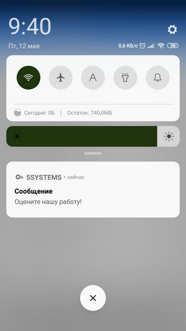
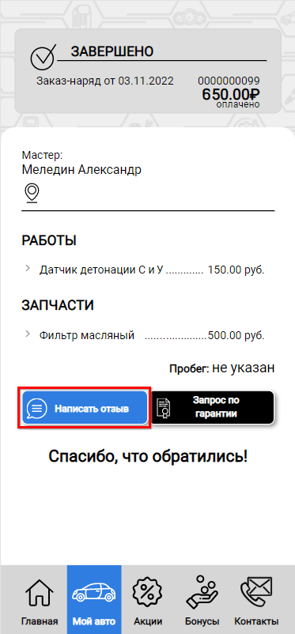
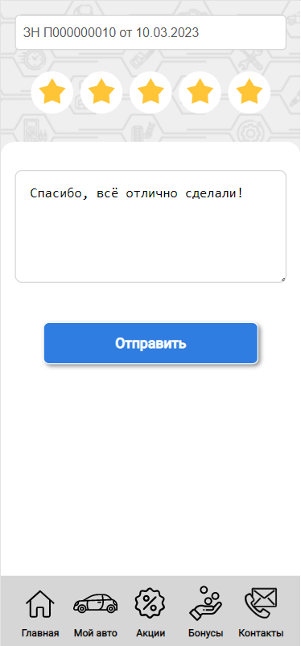
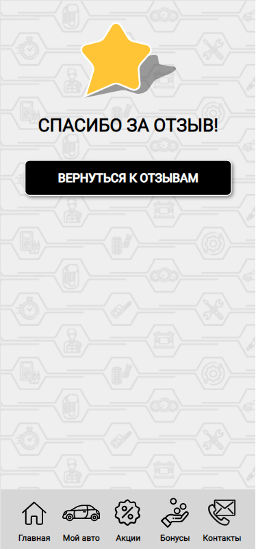
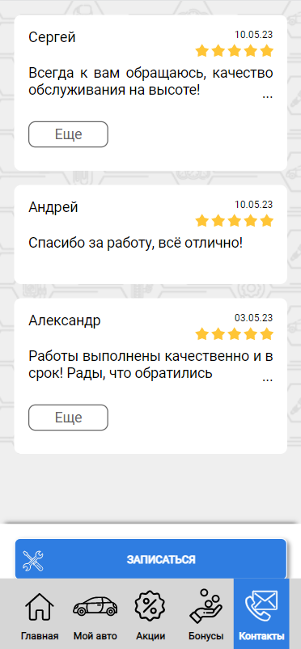
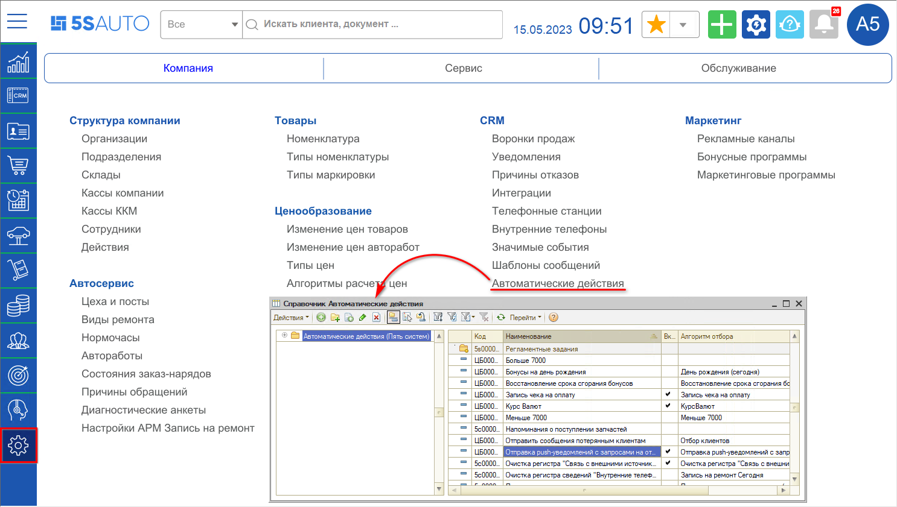
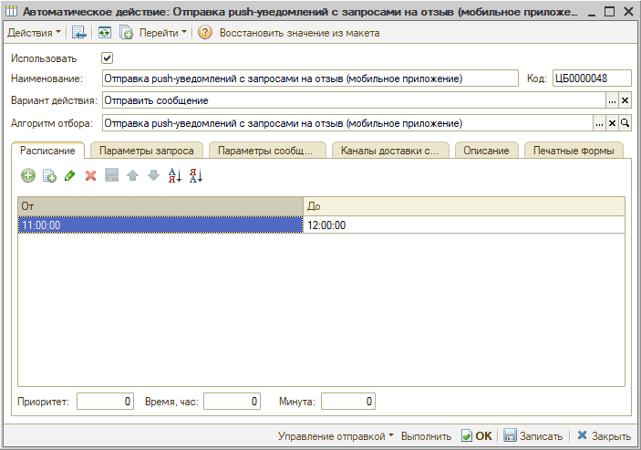
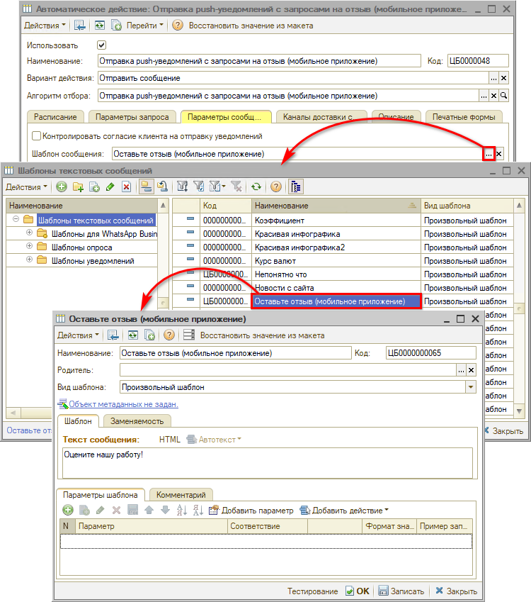

# Отзывы в 5S LINK

<table><tr><td><b>Время чтения:</b> 10 мин.</td><td><b>Обновлено:</b> 10.05.2023</td></tr></table>

Источник: https://www.5systems.ru/help/otzyvy-v-5s-link

## Содержание

1. [Отправка отзыва](#отправка-отзыва)
2. [Управление отзывами](#управление-отзывами)
3. [Настройка](#настройка)

*Актуально для 5S LINK версии **v1***

## Отправка отзыва

После завершения обслуживания клиенту приходит [push-сообщение](../Push-сообщения/push-soobscheniya.md) с запросом отзыва:

По умолчанию запрос отправляется через 3 дня, это значение можно изменить в [настройках](#настройка). 
Нажатием на push-сообщение открывается окно отправки отзыва (см. ниже).

Также клиент может самостоятельно оставить отзыв по завершенному заказ-наряду, нажав на кнопку “Написать отзыв”:

Произойдет переход на следующую страницу. Чтобы оставить отзыв, необходимо поставить оценку – количество “звездочек”, написать комментарий и нажать кнопку “Отправить”:

После этого пользователь увидит следующее сообщение:

Отзывы об автосервисе, оставленные клиентами, пользователи могут увидеть в разделе “Отзывы” в приложении:

## Управление отзывами

Управление отзывами осуществляется в [Личном кабинете](../Настройки%205S%20LINK%20в%20Личном%20кабинете/nastroyki-5s-link-v-lichnom-kabinete.md#7-отзывы): есть возможность написать ответ на отзыв, а также скрыть негативный отзыв.

Подробнее см. в статье [*Настройки 5S LINK в Личном кабинете → Отзывы*](../Настройки%205S%20LINK%20в%20Личном%20кабинете/nastroyki-5s-link-v-lichnom-kabinete.md#7-отзывы).

## Настройка

Настройка отправки запроса на отзыв производится в справочнике “Автоматические действия” – меню программы *Администрирование → Компания → CRM → Автоматические действия → Регламентные задания:*

В карточке автоматического действия “Запрос на отзыв в Мобильном приложении” настраивается отправка push-сообщения клиенту с запросом отзыва:

Клиенту отправляется push, который виден только в меню уведомлений телефона (см. [выше](#отправка-отзыва)) и не появляется в [уведомлениях](../Интерфейс%205S%20LINK/interfeys-5s-link.md#uved) внутри Мобильного приложения. 
Период отправки задается в настройках регламентного задания – по умолчанию 3 дня, т.е. на 3-й день клиенту отправляется сообщение. 
Время отправки настраивается примерно на 11:00, в расписании должна быть указана одна строка с часом, чтобы регламентное задание выполнялось один раз в день. 
Шаблон изменяется на вкладке “Параметры сообщения”:

Если клиент ставит оценку 3 звездочки и ниже, то в программе автоматически создаются документы “[Опрос](https://5systems.ru/help/zadacha-po-oprosu-klienta-o-kachestve-obsluzhivaniya)” и “[Жалоба](../../../Управление%20качеством%20обслуживания/Обработка%20жалоб%20от%20клиентов/obrabotka-zhalob-ot-klientov.md)”. Настройка жалоб производится в справочнике “[Значимые события](../../../Сообщения/Преднастроенные%20значимые%20события/prednastroennye-znachimye-sobytiya.md)”.

---

**Теги:** 5s link, отзывы, управление отзывами, качество обслуживания

