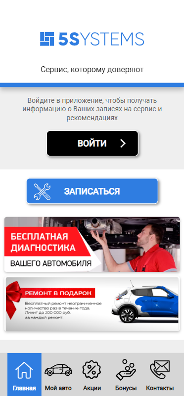
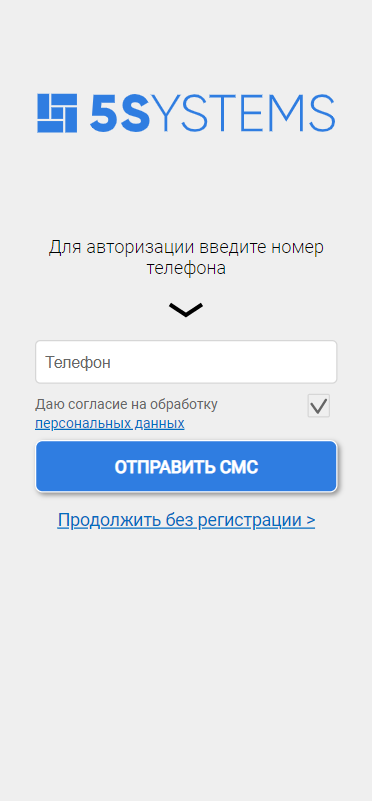
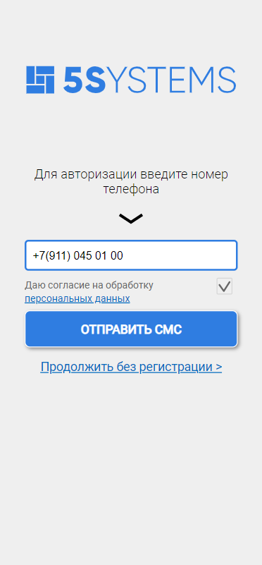
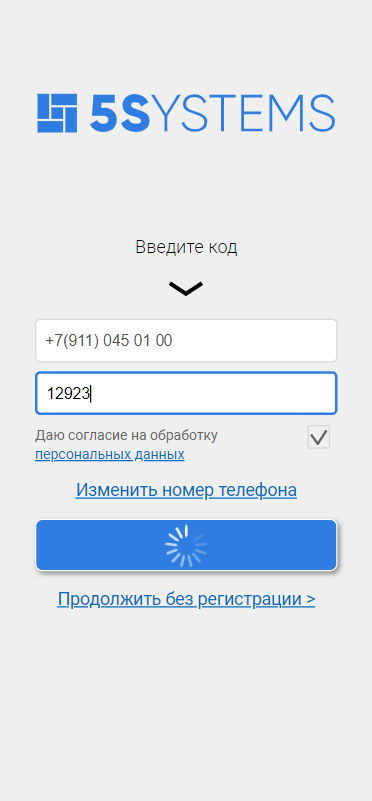
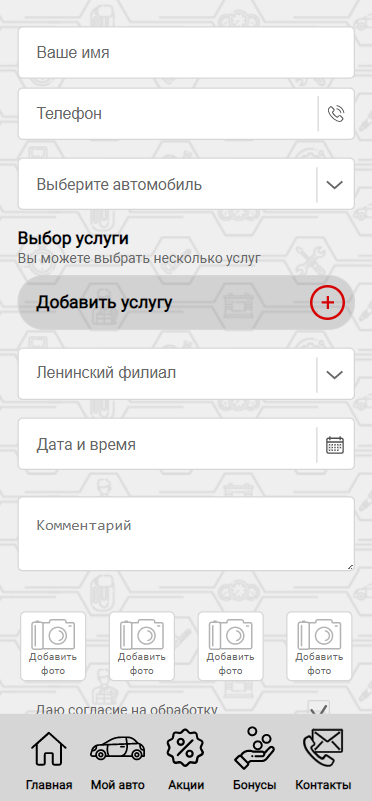
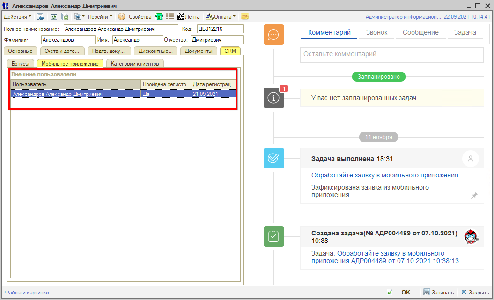

# Регистрация и авторизация в 5S LINK

<table><tr><td><b>Время чтения:</b> 5 мин.</td><td><b>Обновлено:</b> 10.05.2023</td></tr></table>

Источник: https://www.5systems.ru/help/registraciya-i-avtorizaciya-v-5s-link

> *Актуально для 5S LINK версии* ***v1***.

## Содержание

1. [Введение](#введение)
2. [Регистрация существующего клиента](#регистрация-существующего-клиента)
   - [Связь с карточкой контрагента](#связь-с-карточкой-контрагента)
3. [Регистрация нового клиента](#регистрация-нового-клиента)

## Введение

***5S LINK*** ***v1***- это мобильное приложение для клиентов автосервисов, которые доступно для пользователей системы 5S AUTO. Приложения размещаются на платформах Play Market для Android и AppStore для iOS, откуда клиенты автосервиса могут загрузить их на свой смартфон.

В рамках проекта внедрения компания 5SYSTEMS совместно с клиентом утверждает внешний вид приложения – логотип компании и определенный набор стилей и картинок, в соответствии с которым осуществляется сборка макета. После утверждения макета клиентом дизайнер готовит обзор, и приложения публикуются на платформах Play Market и AppStore.

В данной статье рассматривается процесс регистрации пользователей в приложении и принцип связи профиля с карточкой контрагента в программе.

Также см. статьи: [Интерфейс 5S LINK](../Интерфейс%205S%20LINK/interfeys-5s-link.md) и [Запись на ремонт через 5S LINK](../Запись%20на%20ремонт%20через%205S%20LINK/zapis-na-remont-cherez-5s-link.md). О настройках интеграции см. статьи: [Настройки интеграции программы с 5S LINK](../Настройки%20интеграции%20программы%20с%205S%20LINK/nastroyki-integracii-programmy-s-5s-link.md) и [Настройки 5S LINK в Личном кабинете](../Настройки%205S%20LINK%20в%20Личном%20кабинете/nastroyki-5s-link-v-lichnom-kabinete.md).

## Регистрация существующего клиента

При первом входе в Мобильное приложение пользователь попадает на стартовый экран:

Необходимо войти в приложение. После нажатия кнопки “Войти” открывается экран авторизации:

Система предлагает ввести номер мобильного телефона для авторизации в приложении:

Затем необходимо подтвердить номер вводом присланного кода. Также есть возможность настроить подтверждение звонком.

После ввода номера телефона следует нажать кнопку “Отправить СМС”/”Получить код”: появляется окно ввода кода, и на указанный номер приходит СМС с кодом, который необходимо ввести.

После авторизации производится переход на главный экран приложения.

Записаться на ремонт можно без авторизации:

После авторизации клиента в Мобильном приложении в программе создается карточка пользователя, в которую подтягиваются значения, введенные пользователем при регистрации: см. описание в статье "[Настройки интеграции программы с 5S LINK](../Настройки%20интеграции%20программы%20с%205S%20LINK/nastroyki-integracii-programmy-s-5s-link.md) → [Внешние пользователи](../Настройки%20интеграции%20программы%20с%205S%20LINK/nastroyki-integracii-programmy-s-5s-link.md#внешние-пользователи)”.

А также устанавливается связь с контрагентом пользователя в базе.

### Связь с карточкой контрагента

После авторизации постоянного клиента в Мобильном приложении в карточке контрагента в программе на вкладке “CRM → Мобильное приложение” подтягивается значение в таблице “Пользователь программы лояльности”:

## Регистрация нового клиента

При регистрации в приложении клиента, который прежде ни разу не обращался в данный автосервис, карточка контрагента для него будет создана только при его заезде на ремонт, а при его обращении создастся лид или сделка, как при обращении первичного клиента (см. [статью](../../../../../lessons/Краткий%20курс%20для%20Автосалона/Регистрация%20обращения/registraciya-obrascheniya.md)).

Для установки связи контрагента с мобильным приложением нужно будет в карточке *Внешнего пользователя* добавить данного контрагента: см. [статью](../Настройки%20интеграции%20программы%20с%205S%20LINK/nastroyki-integracii-programmy-s-5s-link.md#внешние-пользователи).

---

**Теги:** 5s link, регистрация, авторизация, контрагент, мобильное приложение

