

# Настройка каталога услуг

<table><tr><td><b>Время чтения:</b> 9 мин.</td><td><b>Обновлено:</b> 22.01.2025</td></tr></table>

Источник: https://www.5systems.ru/help/nastroyka-kataloga-uslug

> *Актуально для 5S LINK версии* ***v2***.  *Доступно начиная с версии релиза 2.8.1.*

## Содержание

1. [Введение](#введение)
2. [Настройка каталога услуг](#настройка-каталога-услуг)
   - [1. Установка соответствия](#1-установка-соответствия)
   - [2. Добавление новых услуг](#2-добавление-новых-услуг)
   - [3. Настройка категорий](#3-настройка-категорий)
   - [4. Добавление изображений](#4-добавление-изображений)
   - [5. Закрепление в слайдере](#5-закрепление-в-слайдере)

## Введение

*См. основную статью "[Настройка приложения 5S LINK v2](../Настройка%20приложения%205S%20LINK%20v2/nastroyka-prilozheniya-5s-link-v2.md)".*

В приложении 5S LINK есть возможность использовать настраиваемый *каталог услуг,* заполненный по умолчанию услугами из общего каталога. Услуги в данном каталоге можно отключать, добавлять свои – как в группы общего каталога, так и создавать собственную группировку.

## Настройка каталога услуг

Переход к настройке производится в карточке [интеграции с 5S LINK](../Настройка%20приложения%205S%20LINK%20v2/nastroyka-prilozheniya-5s-link-v2.md#2-настройка-интеграции) на вкладке “Тест подключения” → *Методы интеграции → Настройка каталога услуг:*

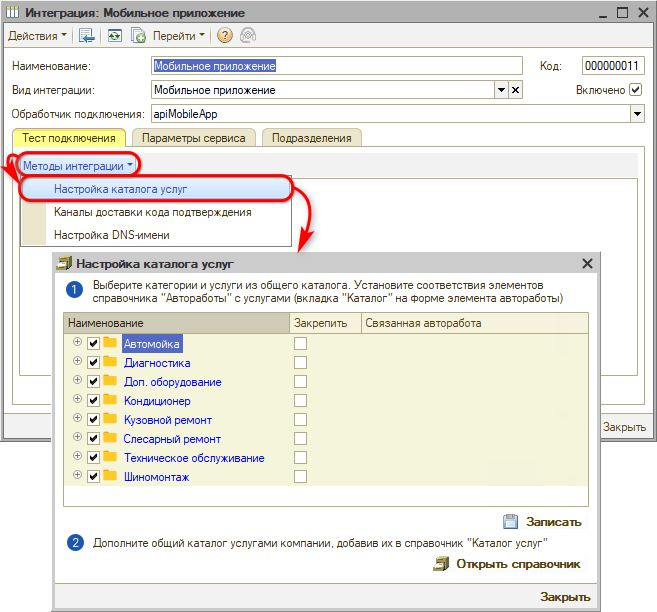

Форма настройки содержит список всех элементов общего справочника услуг, сгруппированных по категориям.

Можно подключать и отключать группы и отдельные услуги установкой галочек рядом с наименованиями.

*Примечание:* В случае если у компании ранее был настроен свой каталог услуг для внешних сервисов, необходимо либо отключить свои услуги – снять галочки в каждой карточке, либо отключить услуги из общего каталога, чтобы категории и отдельные работы не дублировались в приложении.

После внесения изменений необходимо нажать кнопку ***“Записать”***.

### 1. Установка соответствия

Любую работу из своего справочника в базе можно привязать к общему каталогу. Это необходимо сделать для того, чтобы в приложение из программы подтягивались данные по работам.

Связать работы можно на форме настройки каталога услуг:

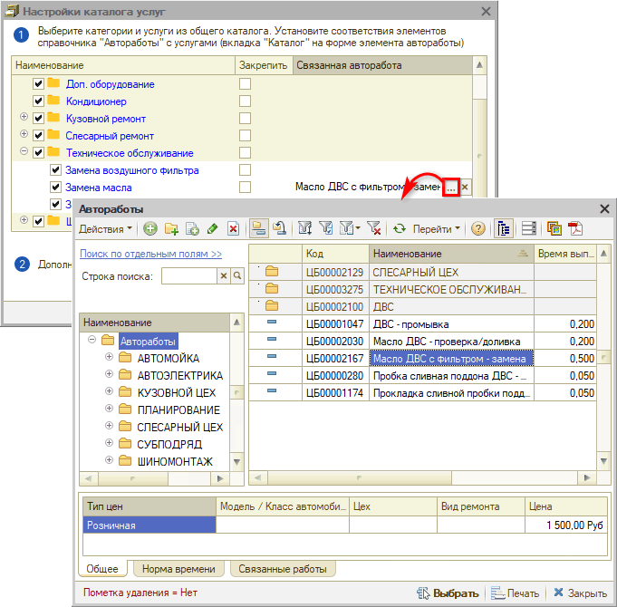

Также можно установить данную связь в карточке работы во внутреннем справочнике *“[Автоработы](../../Автосервис/Автоработы/avtoraboty.md)”:*

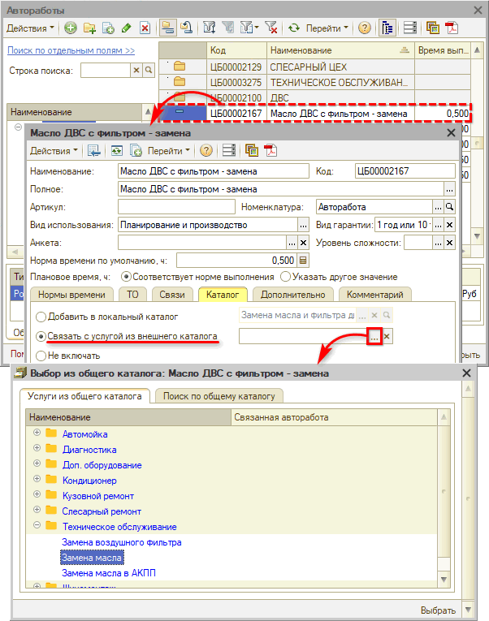

После привязки работ установленная связь отображается в карточке автоработы на вкладке “Каталог”, а также в каталоге услуг для мобильного приложения:

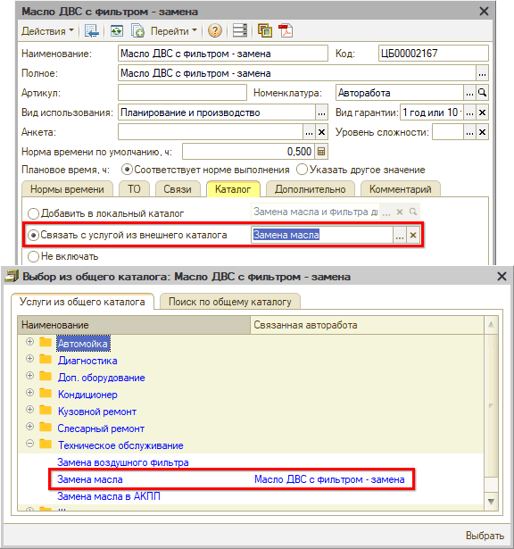

### 2. Добавление новых услуг

Перейти в справочник “Каталог услуг для внешних сервисов” можно по кнопке “Открыть справочник”:

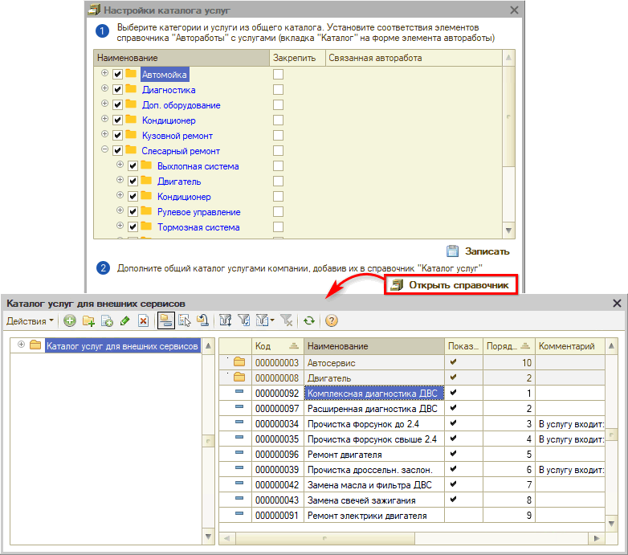

Есть возможность добавлять работы и группировать их в папки, т.е. категории.

Для создания карточки работы следует нажать кнопку “Добавить”:

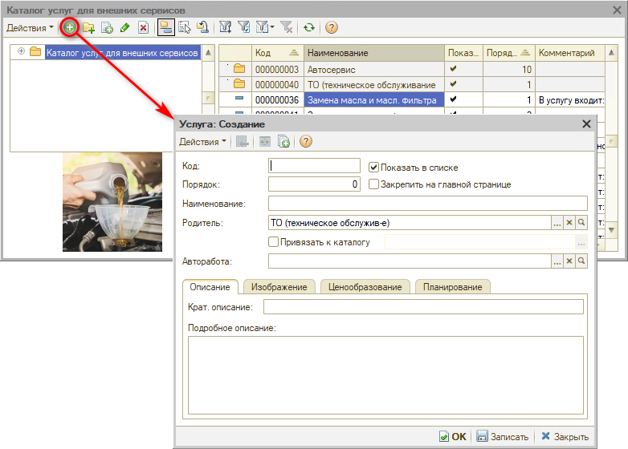

Необходимо заполнить следующие параметры:

- *Наименование* – наименование услуги;
- *Родитель* – папка, в которую добавляется услуга, т.е. категория;
- *Порядок* – порядковый номер услуги в категории;
- *Привязать к каталогу* – отметка о привязке к категории в общем каталоге;
- *Авторабота* – возможность установить связь с автоработой из внутреннего справочника программы;
- *Показать в списке* – отметка для отображения данной услуги в приложении в разделе услуг;
- *Закрепить на главной странице* – отметка для закрепления услуги в слайдере на главной странице приложения.

Затем следует заполнить параметры на следующих вкладках:

- *Описание* – необходимо заполнить краткое описание, которое будет отображаться в приложении под наименованием услуги, и подробное описание состава работ, которое пользователь сможет прочитать, открыв карточку услуги;
- *Изображение* – на данной вкладке можно добавить изображение для услуги: см. *[ниже](#4-добавление-изображений).*

Все внесенные изменения необходимо *записать.*

### 3. Настройка категорий

Для группировки услуг по категориям создаются и настраиваются группы каталога:

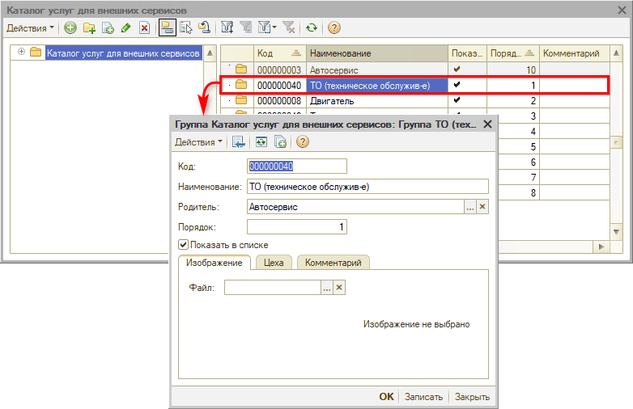

Для групп также есть возможность задать наименование, определить порядок, загрузить изображение, установить или снять отметку “Показать в списке”.

***Связь с группой в общем каталоге***

При добавлении услуг во внутренний каталог может произойти дублирование групп в приложении, т.е. две папки с одинаковым наименованием – одна из общего каталога, другая из своей базы.

Для того, чтобы этого не произошло, следует установить соответствие услуги в своей базе с *категорией* из общего каталога. Для этого следует в карточке созданной работы переназначить родителя на категорию в общем каталоге – установить галочку “Привязать к каталогу” и выбрать группу:

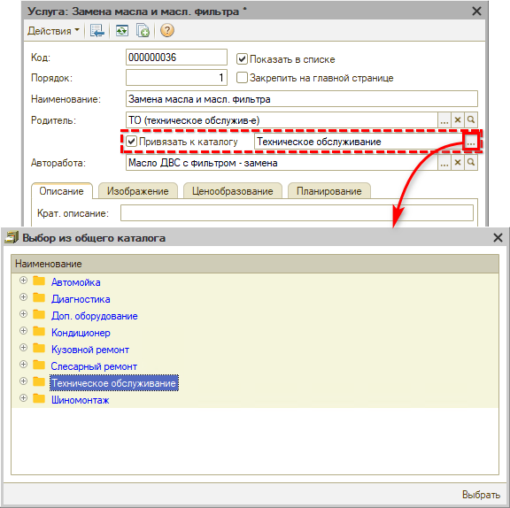

### 4. Добавление изображений

Для каждой категории и отдельной работы в общем каталоге подгружаются картинки по умолчанию, но есть возможность загрузить свои изображения.

Для загрузки картинки следует на вкладке “Изображение” выбрать файл со своего компьютера:

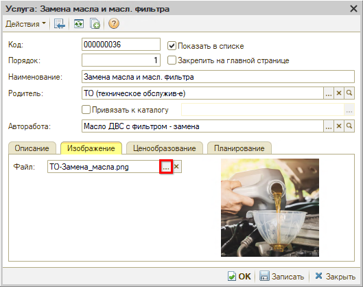

***Рекомендуемые параметры файла изображения:***

1. *Формат:* webp[\*](#snoska), png или jpg

   *\*Имеет существенно меньший вес и быстрее загружается.*

2. *Размер:* 768 x 768 px (в случае медленной загрузки картинок в приложении можно использовать меньший размер либо переформатировать изображение в webp)

После добавления изображения необходимо *сохранить* изменения в карточке.

### 5. Закрепление в слайдере

Услуги можно закрепить, чтобы они выводились в слайдере на главном экране в приложении – для этого следует установить галочку в столбце *“Закрепить”* напротив каждой нужной услуги:

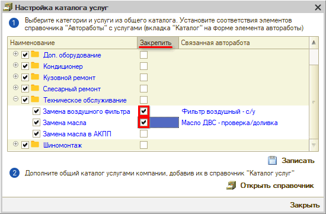

После внесения изменений необходимо нажать кнопку *“Записать”.*

Закрепленные услуги появятся в слайдере в приложении:

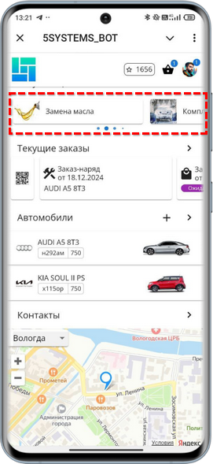

---

**Теги:** 5s link, каталог услуг, автоработы, категории, изображения

