

# Настройка приложения 5S LINK v2

<table><tr><td><b>Время чтения:</b> 18 мин.</td><td><b>Обновлено:</b> 13.05.2025</td></tr></table>

Источник: https://www.5systems.ru/help/nastroyka-prilozheniya-5s-link-v2

> *Актуально для 5S LINK версии* ***v2***.  *Доступно начиная с версии релиза 2.8.1 в рамках [отдельной подписки "Приложение 5S LINK"](https://www.5systems.ru/services/prilozhenie-5s-link)* *либо в рамках [комплексной подписки "Контакт-центр 5S Chat"](https://www.5systems.ru/services/kontakt-centr-5s-chat) (актуальные тарифы см. в [Каталоге услуг](https://www.5systems.ru/services?field_tags_target_id%5B21%5D=21&sort_by=created&sort_order=ASC))*

## Содержание

1. [Введение](#введение)
2. [Этапы настройки](#этапы-настройки)
   - [1. Настройка внешнего подключения](#1-настройка-внешнего-подключения)
   - [2. Настройка интеграции](#2-настройка-интеграции)
   - [3. Каталог услуг](#3-каталог-услуг)
   - [4. Каналы доставки кода подтверждения](#4-каналы-доставки-кода-подтверждения)
   - [5. DNS-имя](#5-dns-имя)
   - [6. Филиалы компании](#6-филиалы-компании)
   - [7. Фирменный стиль](#7-фирменный-стиль)
   - [8. Описание бонусной системы](#8-описание-бонусной-системы)
   - [9. Метрики](#9-метрики)
   - [10. Оплата в приложении](#10-оплата-в-приложении)
      - [Оплата документов через СБП](#оплата-документов-через-сбп)
      - [Самостоятельная оплата клиентом бонусами](#самостоятельная-оплата-клиентом-бонусами)
3. [Сохранение ярлыка приложения на рабочий стол устройства клиента](#сохранение-ярлыка-приложения-на-рабочий-стол-устройства-клиента)
4. [Обновление внешнего кэша данных](#обновление-внешнего-кэша-данных)

## Введение

***5S LINK v2*** – это приложение для автовладельцев, при помощи которого пользователи имеют возможность:

- просматривать информацию о своих автомобилях, историю обслуживания и рекомендации;
- ознакомиться с услугами компании, добавить их в корзину, записаться на сервис;
- отслеживать текущие заказы и заявки,
- оплачивать заказы;
- видеть актуальные акции;
- авторизоваться удобным способом: по звонку, Telegram или sms;
- находить контакты сервиса, открыть карту с отметкой ближайшего филиала и построить маршрут;
- отслеживать информацию о своих бонусных баллах, подтверждать списание и делиться ими через QR-код;
- вести переписку в чате; 
  и многое другое.

*5S LINK v2* – это вторая версия 5S LINK, приложение доступно через web-браузер и Telegram-бота. Предыдущая версия v1 работает только как мобильное приложение на платформах Play Market для Android и AppStore для iOS – см. статьи в разделе “[Мобильное приложение 5S LINK v1](../Мобильное%20приложение%205S%20LINK%20v1/)”.

## Этапы настройки

### 1. Настройка внешнего подключения

Первым шагом необходимо в настройках интеграции с API 5S AUTO указать параметры внешнего подключения. Суть данной настройки заключается в том, что в ней задаются параметры доступа к базе 1С. Подробнее см. в статье *[API 5S AUTO](../../Администрирование%20и%20настройка%20системы/API%205S%20AUTO/api-5s-auto.md#2-настройка-внешнего-подключения).*

### 2. Настройка интеграции

Настройки *интеграции с 5S LINK* в программе производятся в справочнике “Интеграции” – *Администрирование → Компания → CRM → Интеграции:*

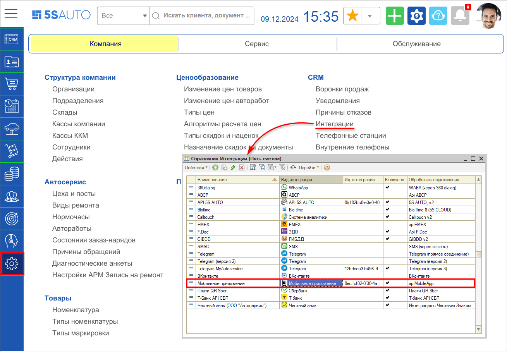

Следует проверить наличие интеграции с *Мобильным приложением* либо, если ее нет, *создать новую.*

В карточке интеграции с Мобильным приложением необходимо заполнить следующие параметры:

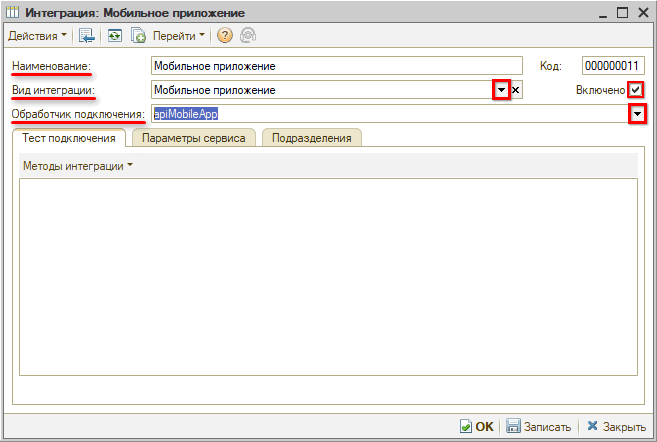

1. *Наименование* – например, “Мобильное приложение”;
2. *Вид интеграции* – выбрать “Мобильное приложение”;
3. *Обработчик подключения* – выбрать apiMobileApp. 
  Установить галочку *“Включено”* и записать.

При необходимости также настраиваются *Параметры сервиса* на соответствующей вкладке:

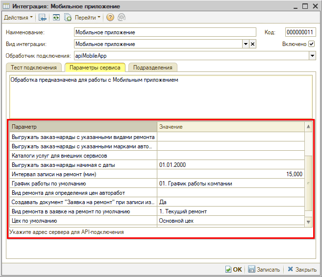

1. *Выгружать заказ-наряды с указанными видами ремонта* – если указать виды ремонта, то в списке заказ-нарядов в разделе “Мой авто” будут показаны заказ-наряды только с указанными видами ремонта. Например, можно указать все виды ремонта кроме гарантийного – и он не будет выводиться. Если список видов ремонта не указан, то отбор в списке заказ-нарядов по видам ремонта не делается – т.е. будут выводиться все заказ-наряды.
2. *Выгружать заказ-наряды с указанными марками автомобилей* – если указать марки автомобилей, то в списке заказ-нарядов в разделе “Мой авто” будут выводится заказ-наряды с марками автомобилей из указанного списка. Если список марок автомобилей не заполнять, то отбор в списке заказ-нарядов по маркам автомобилей производиться не будет.
3. *Каталоги услуг для внешних сервисов* – указанные каталоги услуг будут отображаться при выборе клиентом услуг, а также в Личном кабинете в разделе “Категории”. Если список каталогов не заполнять, то будут отображаться все каталоги услуг.
4. *Выгружать заказ-наряды начиная с даты* – можно ограничить показ заказ-нарядов с определенной даты. Если указать дату, то в список будут выводится заказ-наряды начиная с указанной даты. Если дата не указана, то будут показаны все заказ-наряды.
5. *Интервал записи на ремонт (мин)* – интервал в минутах, через который будут выполняться записи на ремонт. Т.е. с какими интервалами будет выводиться свободное для записи время. Например, 30 минут.
6. *График работы по умолчанию* – указанный график работы будет использоваться в случае, если в справочнике “Каталог услуг для внешних сервисов” не указаны цеха, в которых выполняются работы. Обычно выбирается график работы компании.
7. *Вид ремонта для определения цен авторабот* – указанный вид ремонта будет использоваться для определения цен авторабот.
8. *Создавать документ “Заявка на ремонт” при записи из моб. приложения* – Да/Нет: при нажатии пользователем кнопки “Записаться” помимо лида/сделки и Корзины в программе будет также создаваться документ “Заявка на ремонт”.
9. *Вид ремонта в заявке на ремонт по умолчанию* – если в предыдущем параметре настроено создание Заявки на ремонт при обращении из Мобильного приложения, то можно настроить вид ремонта, который будет по умолчанию устанавливаться в создаваемых Заявках на ремонт.
10. *Цех по умолчанию* – цех, который будет использоваться в случае, если в справочнике “Каталог услуг для внешних сервисов” не указаны цеха, в которых выполняются работы.

### 3. Каталог услуг

В приложении есть возможность использовать настраиваемый каталог, заполненный по умолчанию услугами из общего каталога. Услуги в данном каталоге можно отключать, добавлять свои – как в группы общего каталога, так и создавать собственную группировку. К услугам можно добавить описание, изображения, а также закрепить их в слайдере на главном экране в приложении. Описание настроек см. в статье "[Настройка каталога услуг](../Настройка%20каталога%20услуг/nastroyka-kataloga-uslug.md)".

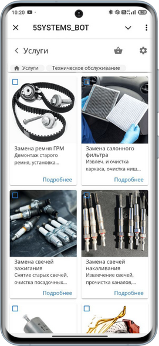

### 4. Каналы доставки кода подтверждения

Существует 3 способа авторизации в приложении:

1. Через Telegram-бот;
2. Отправка кода подтверждения по SMS;
3. Обратный звонок.

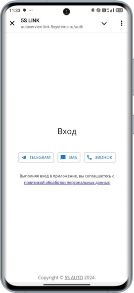

Основной способ авторизации – Telegram, но также рекомендуется настроить авторизацию по звонку и SMS, т.к. не у всех клиентов установлен Telegram, и должны быть предоставлены альтернативные способы входа в приложение. В частности обратный звонок – простой и бюджетный способ авторизации.

*Примечание:* При добавлении нового способа авторизации он появляется в приложении не сразу, а через 5 минут.

#### 1) Telegram

Предварительно должны быть сделаны следующие настройки:

1. создан бот компании и настроен его интерфейс;
2. настроена интеграция в программе с *Telegram (версия 3);*
3. настроено внешнее подключение в интеграции с [API 5S AUTO](../../Администрирование%20и%20настройка%20системы/API%205S%20AUTO/api-5s-auto.md).

Подробнее о создании бота и настройке интеграции см. в статье [*Интеграция с Telegram*](../../Сообщения/Интеграция%20с%20Telegram/integraciya-s-telegram.md).

Для использования данного способа авторизации у клиентов компании также должен быть установлен Telegram.

Клиент переходит в бот по ссылке, либо путем сканирования QR-кода, либо находит через поиск по наименованию. Затем нажимает кнопку запуска или отправляет команду */start.*

Авторизация в приложении 5S LINK производится путем отправки клиентом Telegram-боту компании своего телефона. После этого на нижней панели появляется кнопка “Меню”, при нажатии на которую происходит переход в интерфейс 5S LINK:

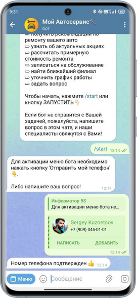

#### 2) SMS

Предварительно в программе должна быть настроена интеграция с провайдером отправки SMS – см. в [*статье*](../../Интеграция%20с%20внешними%20сервисами/Настройка%20интеграции%20с%20SMS%20Центр/nastroyka-integracii-s-sms-centr.md). Необходимо быть клиентом одного из провайдеров:

- [СМС.ru](#sms_ru) – в данном случае следует получить *ключ API* в личном кабинете;
- [SMS Центр](#smsc_ru) – в данном случае следует получить *логин и пароль.*

Для настройки каналов доставки кода подтверждения следует перейти в *Методы интеграции → Каналы доставки кода подтверждения:*

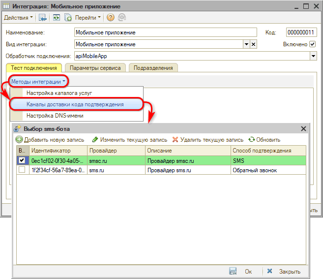

При добавлении требуется выбрать провайдера: *smsc.ru* или *sms.ru* – при этом активируются разные параметры настройки, – а также задать наименование в параметре “Описание”.

1. Добавление канала sms.ru:

   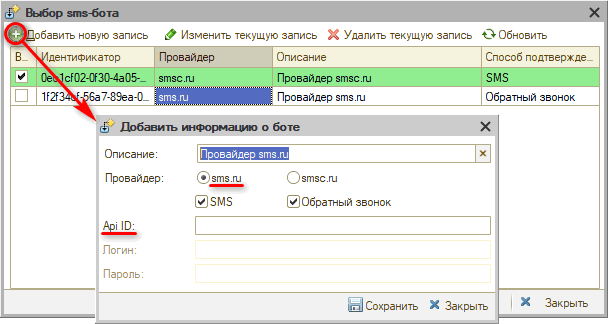

   *Api ID* – ключ API для внешних программ, который можно получить в личном кабинете на сайте [СМС.ru](https://sms.ru/):

   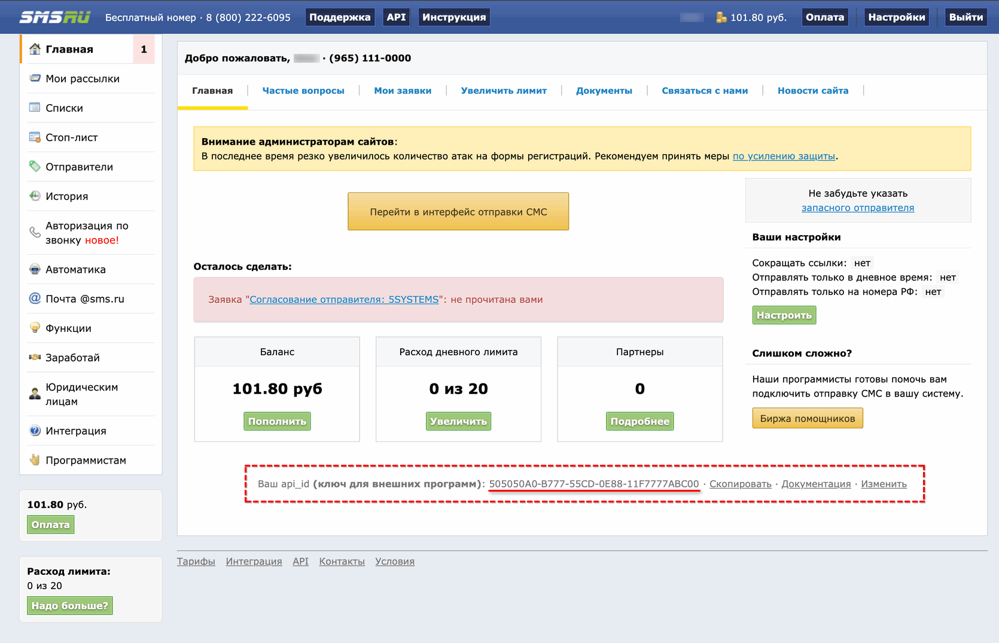

   

2. Добавление канала smsc.ru:

   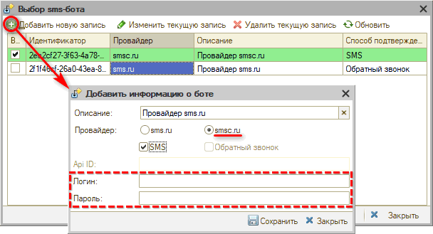

   *Логин и Пароль* – авторизационные данные, полученные у провайдера [SMS Центр](https://smsc.ru/).

#### 3) Звонок

Данный способ используется только у провайдера sms.ru.

Настройка производится аналогично настройке отправки кода по SMS через указанного провайдера – см. [*выше*](#2-sms). В параметрах следует отметить способ *“Обратный звонок”:*

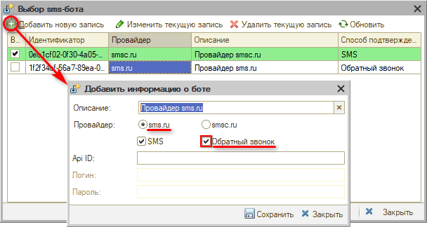

### 5. DNS-имя

Для настройки DNS следует перейти в *Методы интеграции → Настройка DNS-имени:*

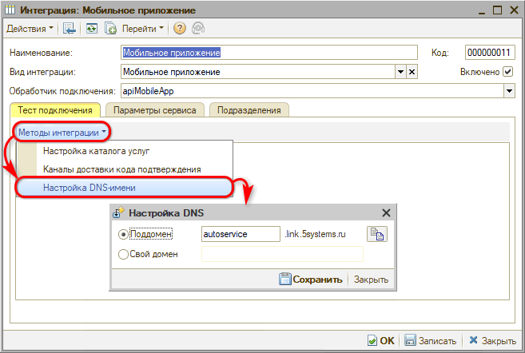

1. По умолчанию используется поддомен 5SYSTEMS: *“.link.5systems.ru”.* В данном случае следует задать значение *имени своей компании* в составе адреса данного поддомена. Например: *“autoservice”.* В данном случае полный адрес поддомена будет: `http://autoservice.link.5systems.ru`.

   В имени поддомена можно использовать только символы латинского алфавита и цифры.

2. В случае использования *своего домена* необходимо переключиться на данный параметр и ввести полный адрес публикации приложения на собственном сайте компании, например: *lk.yoursite.ru.*

   В данном случае необходимо произвести *настройки зоны DNS,* а также *передать их в виде скриншота в техподдержку 5SYSTEMS.*

### 6. Филиалы компании

Далее необходимо настроить *филиалы компании* в специальном справочнике программы – создать карточки филиалов, соотнести их с подразделениями, настроить отображение контактной информации для пользователей приложения, добавить время работы, фото и координаты местоположения. Если у компании несколько филиалов в разных городах, следует также настроить *регионы* для более удобной работы с картой и записью на ремонт. Описание настроек см. в статье "[Настройка филиалов компании](../Настройка%20филиалов%20компании/nastroyka-filialov-kompanii.md)".

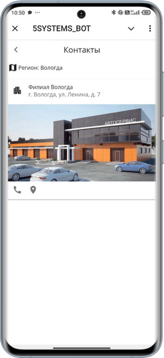

### 7. Фирменный стиль

Для перехода к странице управления приложением предварительно необходимо [подключить интеграцию](#2-настройка-интеграции) в программе, настроить [способ входа через Telegram](#1-telegram) и получить логин и пароль пользователя 5S Cloud.

Настройка фирменного стиля компании в 5S LINK заключается в задании заголовка страницы для браузерной версии приложения и загрузке логотипов.

Для перехода к странице управления приложением необходимо открыть 5S LINK в браузере и в адресной строке дописать окончание */admin.* В итоге адрес должен иметь следующий вид: `https://your_company.link.5systems.ru/admin`.

Для доступа к странице управления приложением требуется ввести *логин и пароль* пользователя 5S Cloud с правами администратора компании.

Открывается раздел *“Управление приложением”:*

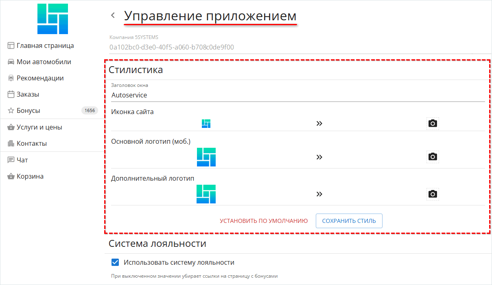

Есть возможность изменить стиль, заданный по умолчанию:

- *Заголовок окна* – заголовок, который будет отображаться на вкладке при использовании браузерной версии приложения.
- *Иконка сайта* – иконка favicon, которая будет отображаться на вкладке в браузере.
- *Основной логотип (моб.)* – логотип, который отображается в мобильной версии приложения.
- *Дополнительный логотип* – логотип для браузерной версии, можно установить широкий с наименованием компании. Если не задать, будет использоваться основной.

После добавления заголовка и изображений необходимо ***сохранить*** изменения нажатием кнопки *“Сохранить стиль”.*

***Рекомендуемые параметры файлов логотипов:***

1. *Формат:* png.
2. *Размер:*
   - *Иконка сайта (favicon):* <u>не менее</u> 144 х 144 px
   - *Основной логотип (моб.):* 512 x 256 px
   - *Дополнительный логотип:* 768 x 256 px
3. *Цвет:* логотип должен быть виден и на белом, и на черном фоне – для использования светлой и темной темы. Если логотип сливается со страницей при смене темы, рекомендуется добавить к нему контрастную *обводку* или *фон.*

### 8. Описание бонусной системы

Галочка *“Использовать систему лояльности”* установлена по умолчанию: она активирует раздел “Бонусы” – появляется вкладка в меню и значок на верхней панели приложения. Если у клиента есть бонусы, рядом со значком также будет отображаться их количество. При переходе в раздел можно увидеть историю и QR-код для подтверждения списания.

Есть возможность добавить описание бонусной системы:

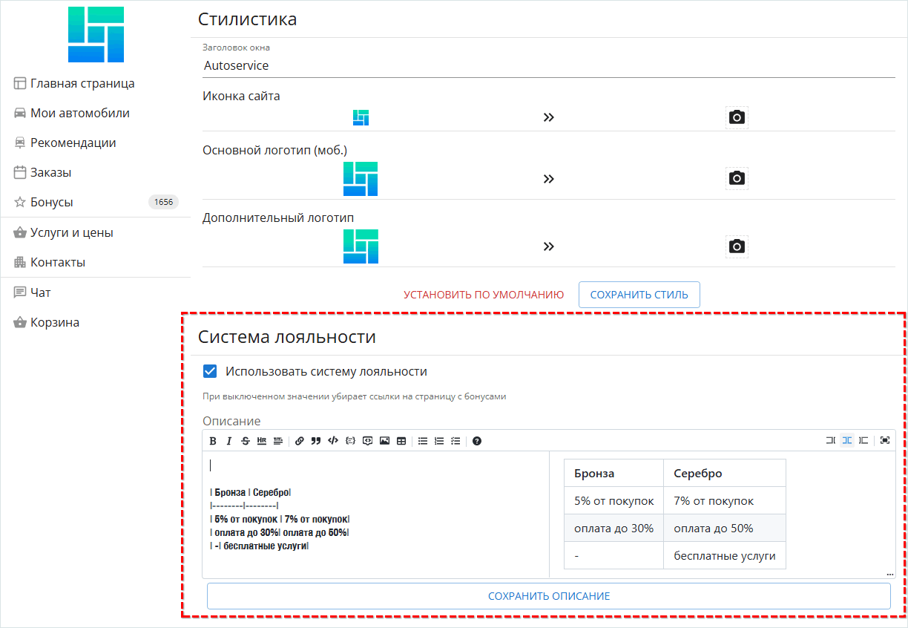

После сохранения изменений появится кнопка со стрелкой в разделе “Бонусы” рядом с количеством, при нажатии на которую открывается описание:

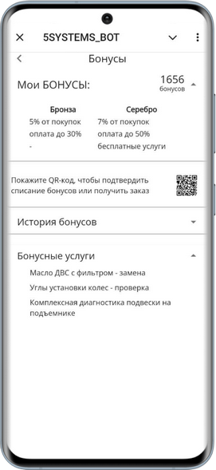

### 9. Метрики

В разделе "Метрики" следует ввести номер счетчика "Яндекс Метрики" для возможности отслеживать статистику использования приложения в системе "[Яндекс Метрика](https://metrika.yandex.ru)":

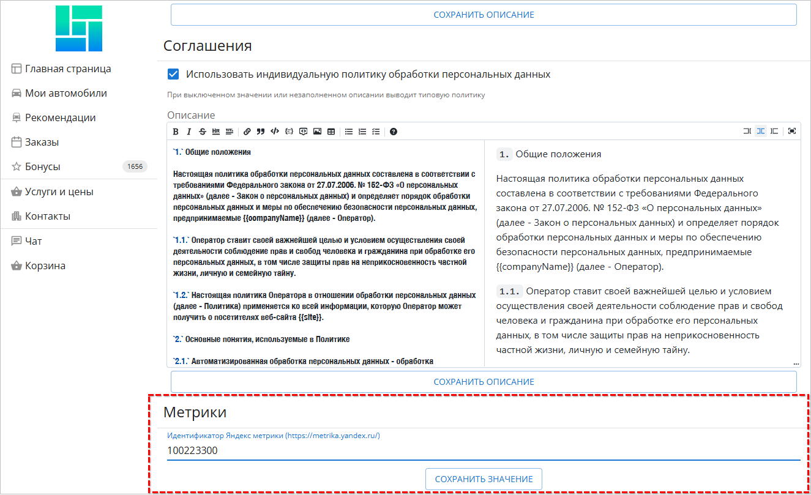

Значение следует скопировать из ЛК сайта "Яндекс-Метрика" в разделе "Счетчики":

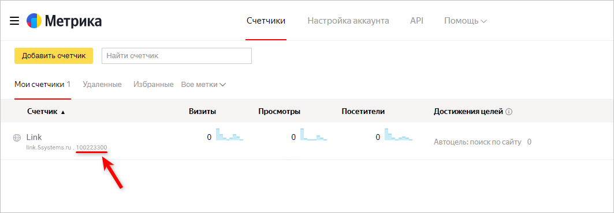

### 10. Оплата в приложении

#### Оплата документов через СБП

Для того, чтобы клиенты могли оплачивать заявки и заказы через 5S LINK, необходимо настроить в программе интеграцию с системой быстрых платежей – см. в статье [*Работа с СБП*](../../Банки%20и%20платежные%20системы/Система%20быстрых%20платежей/Работа%20с%20СБП/rabota-s-sbp.md).

После этого в приложении при открытии документов, по которым требуется оплата, появляется кнопка *“К оплате”* с указанием суммы платежа:

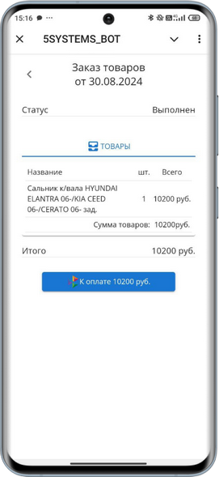

При нажатии на данную кнопку клиент переходит к осуществлению оплаты через СБП.

#### Самостоятельная оплата клиентом бонусами

В случае если у клиента есть накопленные [бонусы](../../Бонусная%20система/Работа%20с%20бонусами%20клиентов/rabota-s-bonusami-klientov.md), доступные к списанию для оплаты текущего документа, при переходе к оплате в приложении помимо кнопки “К оплате” будет отображаться кнопка *“Списать бонусы”.* При нажатии этой кнопки будет пересчитана сумма оплаты и появится кнопка отмены списания бонусов:

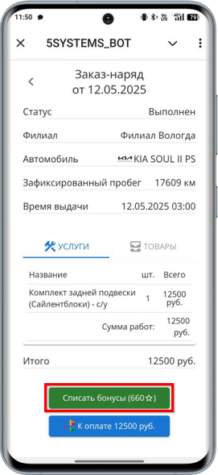 &nbsp;&nbsp;&nbsp;&nbsp;&nbsp;&nbsp;&nbsp;&nbsp; 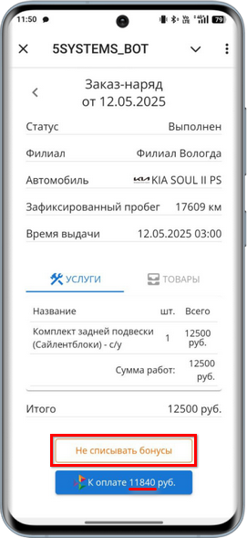

Сумма доступных для списания бонусов, отображаемая в скобках на кнопке “Списать бонусы”, зависит от количества активированных бонусов клиента и от [настроек бонусной программы](../../Бонусная%20система/Настройка%20бонусной%20системы/nastroyka-bonusnoy-sistemy.md), в частности, максимального процента оплаты бонусами.

После произведенной клиентом оплаты в программе автоматически создается документ *“Корректировка бонусов”* с хоз. операцией *“Резервирование бонусов на документ”,* в котором фиксируется количество бонусов к списанию:

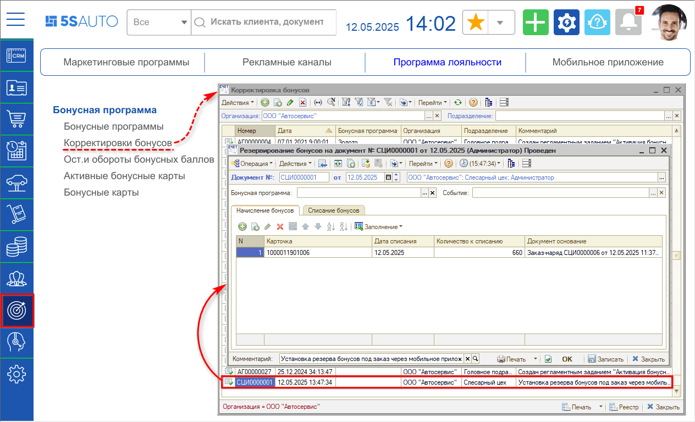

## Сохранение ярлыка приложения на рабочий стол устройства клиента

При открытии приложения *в браузере* мобильного телефона или компьютера внизу страницы всплывает вопрос: *“Добавить ярлык на рабочий стол?”*

При нажатии кнопки “Добавить” открывается окно “Установить приложение”, в котором требуется подтвердить установку ярлыка:

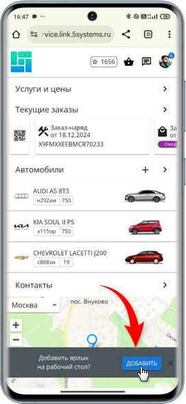 &nbsp;&nbsp;&nbsp;&nbsp;&nbsp;&nbsp;&nbsp;&nbsp;&nbsp; 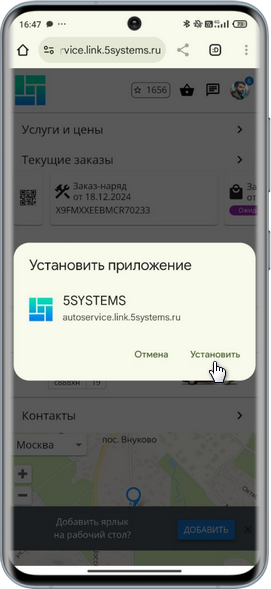

При нажатии кнопки *“Установить”* производится установка приложения на мобильное устройство или компьютер пользователя, на рабочий стол добавляется ярлык. При клике на данный ярлык открывается окно приложения:

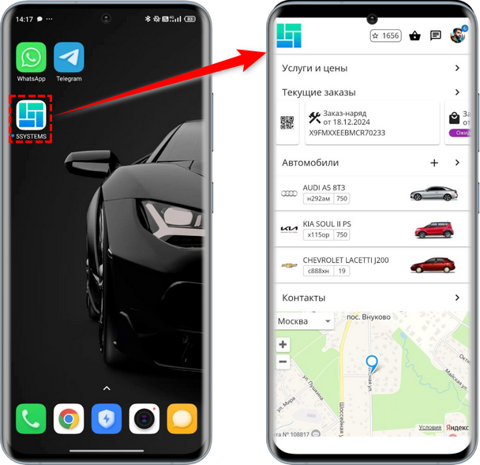

*Примечание 1:* Если не нажать кнопку “Добавить”, то вопрос исчезает через 30 сек., снова появляется при обновлении страницы. При нажатии кнопки “Отмена” кнопка добавления ярлыка больше не будет всплывать.

*Примечание 2:* В случае открытия приложения через Telegram кнопка добавления ярлыка не появляется.

## Обновление внешнего кэша данных

При добавлении новых филиалов или изменении параметров новые данные не сразу отображаются в приложении. Требуется синхронизация данных между базой 1С и web-приложением. В web-приложении содержится только кэш последних запросов данных, источником данных является база 1С.

Автоматическое обновление данных происходит 1 раз в 5 минут. при срабатывании *регламентного задания* “Обмен с микросервисом”.

Для того чтобы кэш обновился сразу, и внесенные настройки отобразились в приложении, следует выполнить регламентное задание вручную – нажать кнопку запуска. При успешном обновлении появится служебное сообщение системы об очистке кэша.

Подробнее см. в статье [*Интеграция с API 5S AUTO → Обновление внешнего кэша данных*](../../Администрирование%20и%20настройка%20системы/API%205S%20AUTO/api-5s-auto.md#4-обновление-внешнего-кэша-данных).

---

**Теги:** 5s link, мобильное приложение, настройка, интеграция, каталог услуг, филиалы, бонусы

