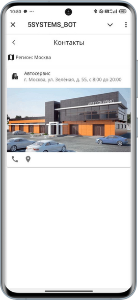
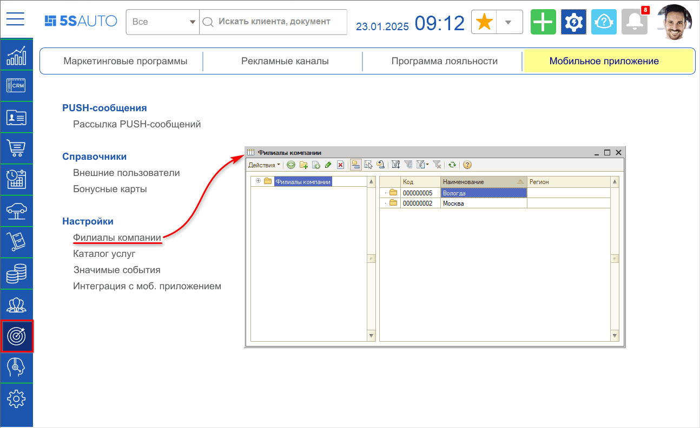
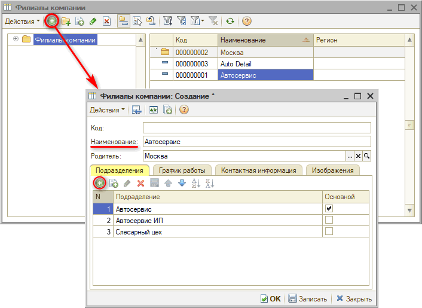
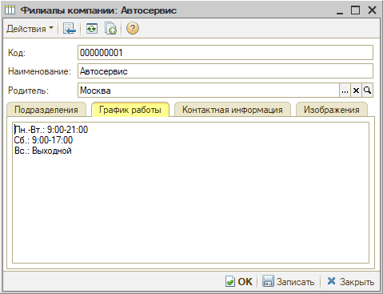
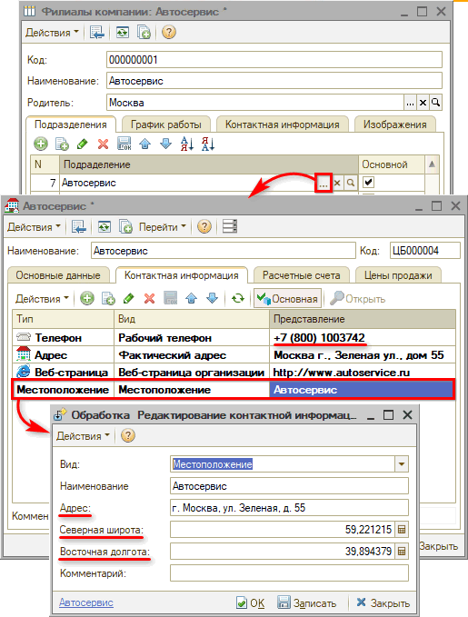
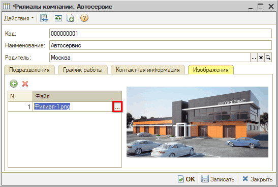
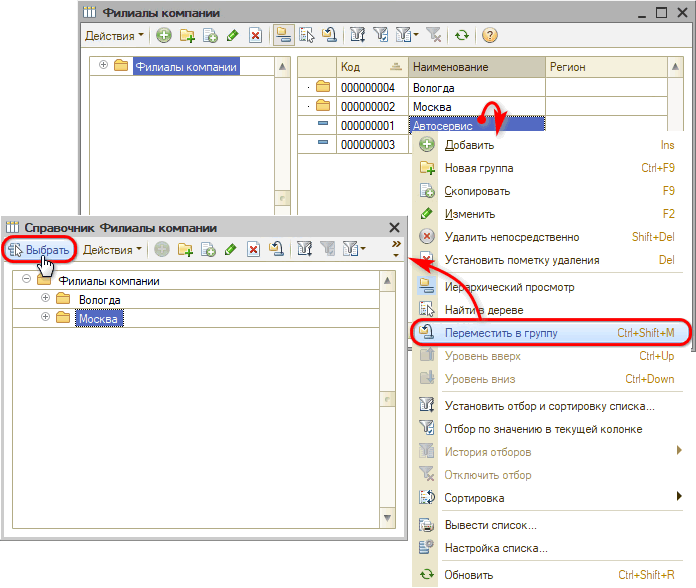
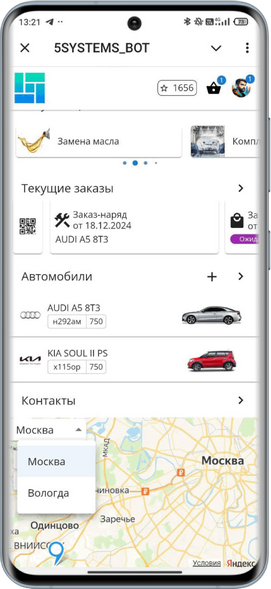
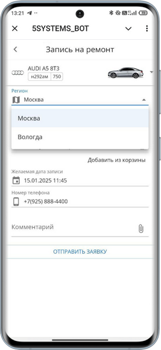
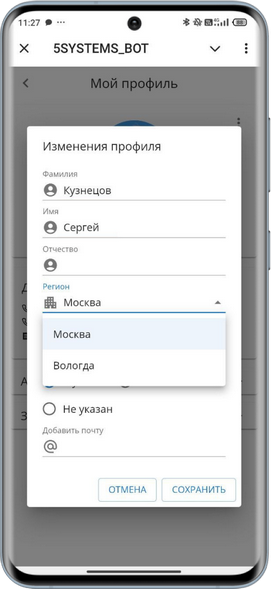

# Настройка филиалов компании

<table><tr><td><b>Время чтения:</b> 8 мин.</td><td><b>Обновлено:</b> 22.01.2025</td></tr></table>

Источник: https://www.5systems.ru/help/nastroyka-filialov-kompanii

> *Актуально для 5S LINK версии* ***v2***.  *Доступно начиная с версии релиза 2.8.1.*

## Содержание

1. [Введение](#введение)
2. [Настройка карточки филиала](#настройка-карточки-филиала)
   - [1. Создание](#1-создание)
   - [2. Время работы](#2-время-работы)
   - [3. Контактная информация](#3-контактная-информация)
   - [4. Добавление изображения](#4-добавление-изображения)
3. [Регионы](#регионы)

## Введение

*См. основную статью "[Настройка приложения 5S LINK v2](../Настройка%20приложения%205S%20LINK%20v2/nastroyka-prilozheniya-5s-link-v2.md)".*

В процессе настройки приложения *5S LINK v2* необходимо создать и заполнить карточки филиалов компании в специальном справочнике программы. Карточки филиалов следует соотнести с подразделениями компании, настроить отображение контактной информации для пользователей приложения, добавить график работы, фото и координаты местоположения.

В результате пользователи 5S LINK смогут через приложение выбрать ближайший филиал для записи в своем городе, позвонить, а также проложить маршрут:

Установка связи с подразделением в программе обеспечит корректное создание записи и формирование документов на нужный филиал.

## Настройка карточки филиала

### 1. Создание

Справочник находится в меню программы *CRM → Программа лояльности → Филиалы компании.* Данный справочник используется специально для приложения 5S LINK.

В справочнике следует создать карточку филиала компании, задать наименование и соотнести филиал с *подразделением* в справочнике программы:

В качестве *наименования* филиала необходимо указывать *коммерческое название,* а не полное юридическое наименование организации, т.к. данное наименование будет выводиться в контактной информации для пользователей приложения.

Филиалы в справочнике могут быть сгруппированы – в данном случае в параметре *"Родитель"* будет указано наименование группы (папки).

Подразделение следует добавить на вкладке “Подразделения”. Контактная информация из указанного подразделения подтягивается на вкладку “Контактная информация” в карточке филиала в приложении.

Подразделений в карточке филиала может быть добавлено несколько, но обычно выбирается одно основное – для него устанавливается галочка “Основной”. Оно будет по умолчанию подтягиваться в сделку, созданную при обращении через приложение, на него будет производиться запись и создаваться документы.

*Примечание:* При добавлении новых филиалов или изменении параметров требуется синхронизация данных между базой 1С и web-приложением. Автоматическое обновление происходит через несколько минут. Чтобы увидеть внесенные изменения сразу, следует очистить внешний кэш данных – см. в статье "[Настройка приложения 5S LINK v2](../Настройка%20приложения%205S%20LINK%20v2/nastroyka-prilozheniya-5s-link-v2.md#обновление-внешнего-кэша-данных)".

### 2. Время работы

На вкладке *“График работы”* следует прописать *текстом* время работы филиала, которое будет отображаться в приложении в разделе “Контакты” рядом с адресом филиала:

### 3. Контактная информация

В настройках подразделения указаны данные о местоположении компании, которые будут подтягиваться в приложение:

Значение параметра *“Адрес”* подтягивается в контактную информацию филиала, *координаты широты и долготы* определяют местоположение филиала на карте.

Телефон подтягивается в контактную информацию филиала из информации в карточке подразделения.

### 4. Добавление изображения

Для добавления фото филиала компании необходимо на вкладке “Изображения” загрузить файл:

***Рекомендуемые параметры файла изображения:***

1. Формат: webp[\*](#snoska), png или jpg

   *\*Имеет существенно меньший вес и быстрее загружается.*

2. Размер: 1024 x 523 px

После внесения любых изменений в карточку филиала, необходимо *сохранить* их нажатием на кнопку "Записать" или "ОК".

## Регионы

Если у компании несколько филиалов в разных городах, то для более удобной работы с картой и записью на ремонт следует настроить выбор *региона.* Для этого следует добавить папки, назвать их по наименованию местоположения и перенести в них карточки филиалов:

В приложении на карте появится меню выбора города для более удобного поиска нужного филиала:

Также добавится кнопка выбора региона при записи:

Основной регион пользователь может выбрать в настройках своего профиля:

*Примечание:* Если у компании два или более филиалов в одном городе, которые удобно отображаются на карте, регионы можно не настраивать.

---

**Теги:** 5s link, филиалы, время работы, контактная информация, регионы
