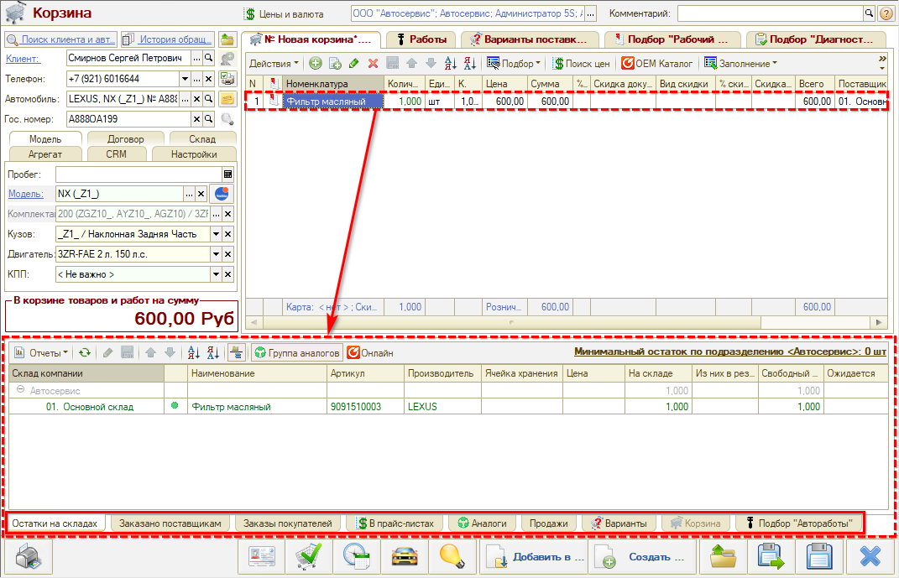

# Информационные вкладки Корзины

<table><tr><td><b>Время чтения:</b> 4 мин.</td><td><b>Обновлено:</b> 02.02.2024</td></tr></table>

Источник: https://www.5systems.ru/help/informacionnye-vkladki-korziny

Время просмотра — 1:41 мин.

На панели **«Информация»** в [Корзине](../Работа%20в%20АРМ%20Корзина/rabota-v-arm-korzina.md) представлена детализированная информация по товару или работе, которые активизированы, т. е. выделены на основной панели. Информация разбита на вкладки:

**Информационные вкладки Корзины:**

1. **Остатки на складах** — свободные остатки на складах компании по товарной позиции.
2. **Заказано поставщикам** — все заказы поставщикам по товарной позиции. По умолчанию отображаются заказы с остатками (активирована кнопка «Только остатки» командной панели).
3. **Заказы покупателей** — все заказы покупателей по товарной позиции. С помощью кнопок на панели действий можно резервировать товар, снять с резерва, отменить или отдать заказ.
4. **В прайс-листах** — предложения по товарной позиции из загруженных прайс-листов.
5. **Аналоги** — аналоги по товарной позиции.
6. **Продажи** — отчет по продажам товарной позиции.
7. **Варианты** — предложения по конкретной товарной позиции со страницы «Варианты поставки» Корзины.
8. **Корзина** — вкладка становится активной при переключении на страницу «Варианты поставки» — предложения по товарной позиции со страницы «Товары» Корзины.
9. **Подбор «Автоработы»** — связанные работы и детали.

---

**Теги:** корзина, панель информации, вкладки, остатки на складах, заказы поставщикам, аналоги, прайс-листы, автоработы

