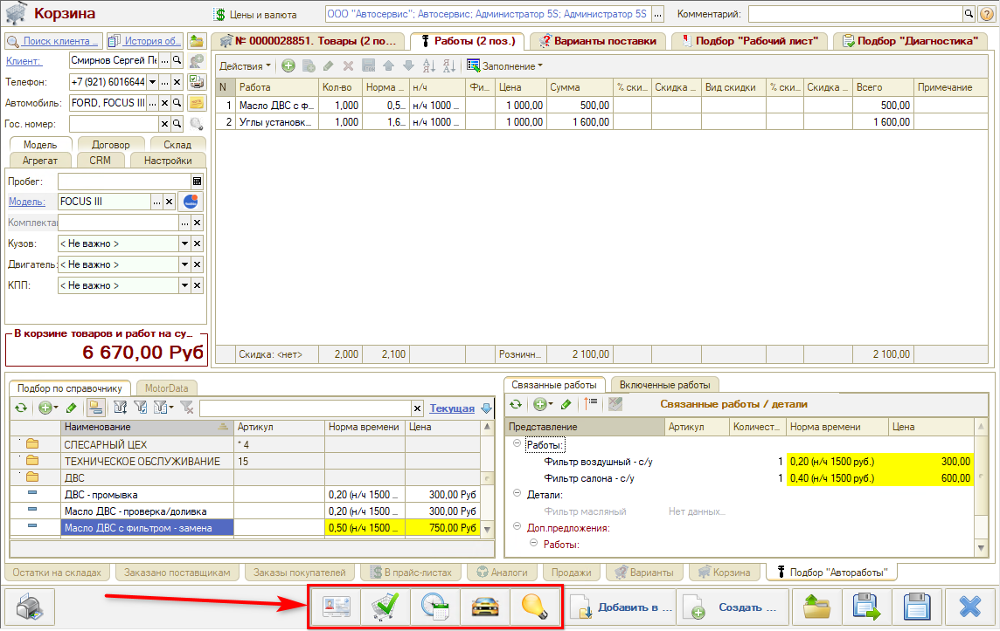

# Как выгрузить Корзину в другие АРМ

<table><tr><td><b>Время чтения:</b> 3 мин.</td><td><b>Обновлено:</b> 02.02.2024</td></tr></table>

Источник: https://www.5systems.ru/help/kak-vygruzit-korzinu-v-drugie-arm

Время просмотра — 1:06 мин.

После записи [Корзины](../Работа%20в%20АРМ%20Корзина/rabota-v-arm-korzina.md) с добавленными в нее товарами и работами можно выгрузить Корзину в связанные АРМ с помощью кнопок на нижней панели:

1.  **Перейти к АРМ «Клиенты и автомобили»** — откроется АРМ «[Клиенты и автомобили](../../Работа%20с%20клиентами/Работа%20в%20АРМ%20Клиенты%20и%20автомобили/rabota-v-arm-klienty-i-avtomobili.md)» в контексте клиента из Корзины.
2.  **Перейти в помощник оформления «Заказа покупателя»** — откроется помощник оформления заказа покупателя.
3.  **Перейти к АРМ «Запись на ремонт»** — откроется АРМ «Запись на ремонт» в контексте клиента из Корзины.
4.  **Переместить все позиции Корзины в Рекомендации** — все товары и работы будут сохранены как рекомендации для автомобиля.

---

**Теги:** корзина, выгрузка в АРМ, клиенты и автомобили, заказ покупателя, запись на ремонт, рекомендации

