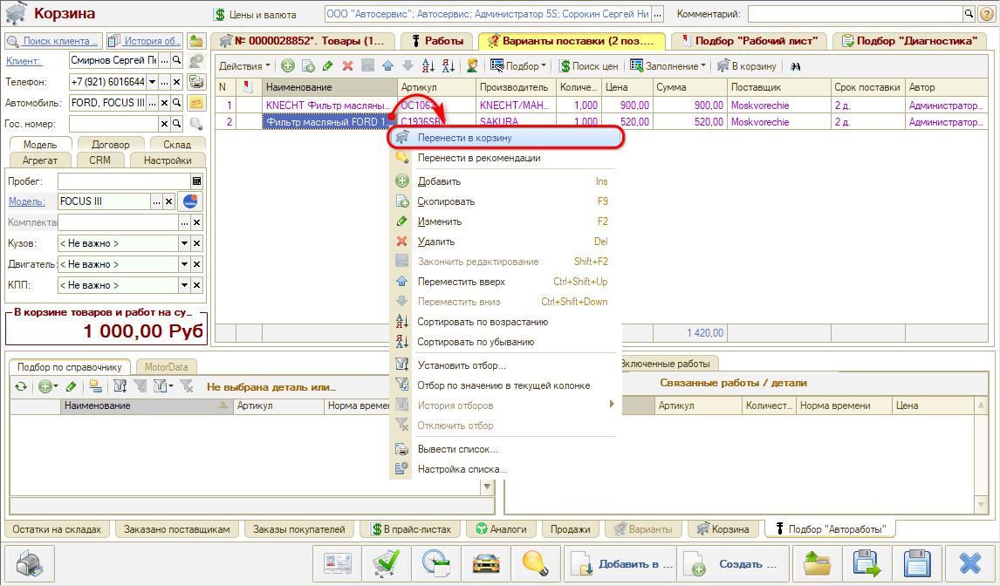
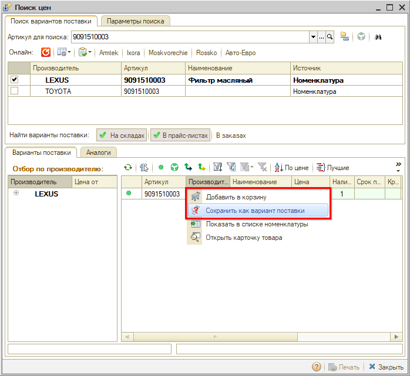
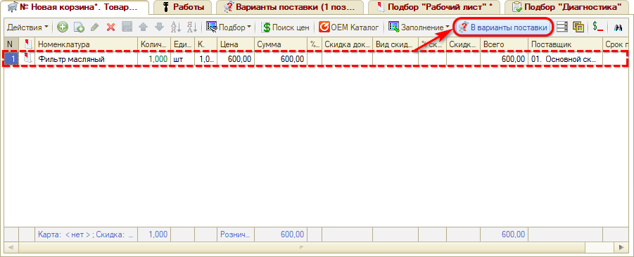

# Как добавить варианты поставки в Корзину

<table><tr><td><b>Время чтения:</b> 4 мин.</td><td><b>Обновлено:</b> 02.02.2024</td></tr></table>

Источник: https://www.5systems.ru/help/kak-dobavit-varianty-postavki-v-korzinu

Время просмотра — 2:10 мин.

**Добавление вариантов поставки в Корзину**

Вкладка **«Варианты поставки»** предназначена для согласования с клиентом одного из нескольких вариантов поставки товара.

Варианты поставки не влияют на итоговую сумму Корзины. При добавлении деталей в Варианты поставки номенклатура не создается. После согласования с клиентом нужный вариант поставки переносится в Корзину, т. е. добавляется на вкладку **«Товары»**:

**Способы подбора Вариантов поставки:**

**1.** Из обработки **«[Поиск цен](../Поиск%20цен/poisk-cen.md)»** — в процессе подбора предложений по товару предлагается сохранить товар как вариант поставки через меню действий:

После сохранения в качестве варианта поставки товар будет отображаться на странице «Варианты поставки» панели «Товары и работы» и на вкладке «Варианты поставки» панели «Информация».

**2.** Перенести в Варианты поставки товар из Корзины — с помощью кнопки на командном меню:

---

**Теги:** корзина, варианты поставки, согласование с клиентом, поиск цен, подбор запчастей

