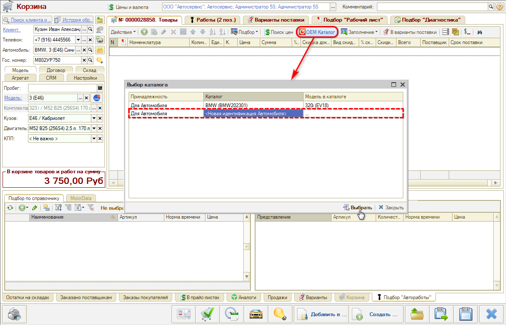
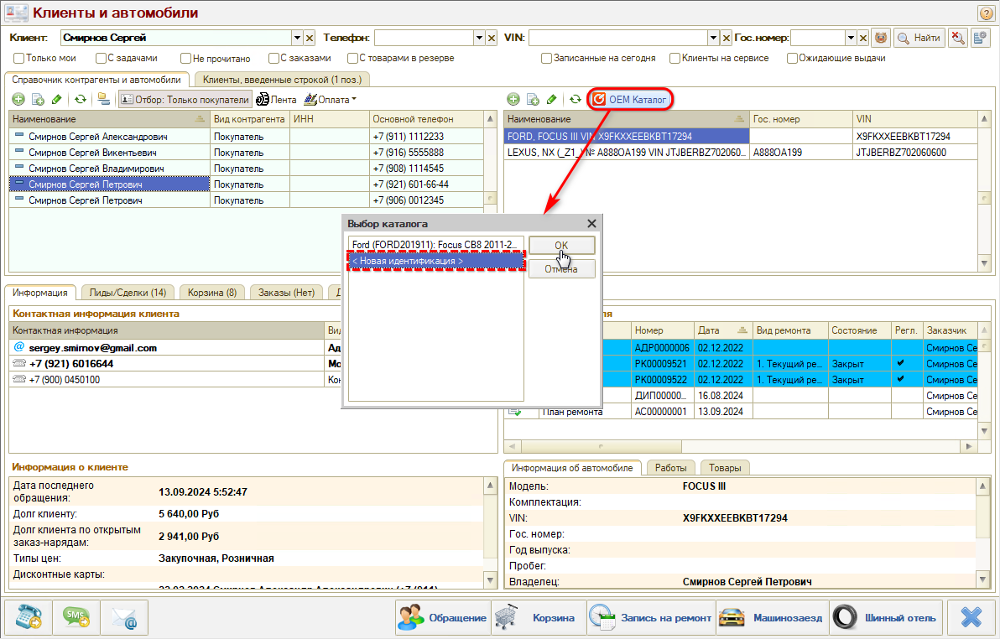
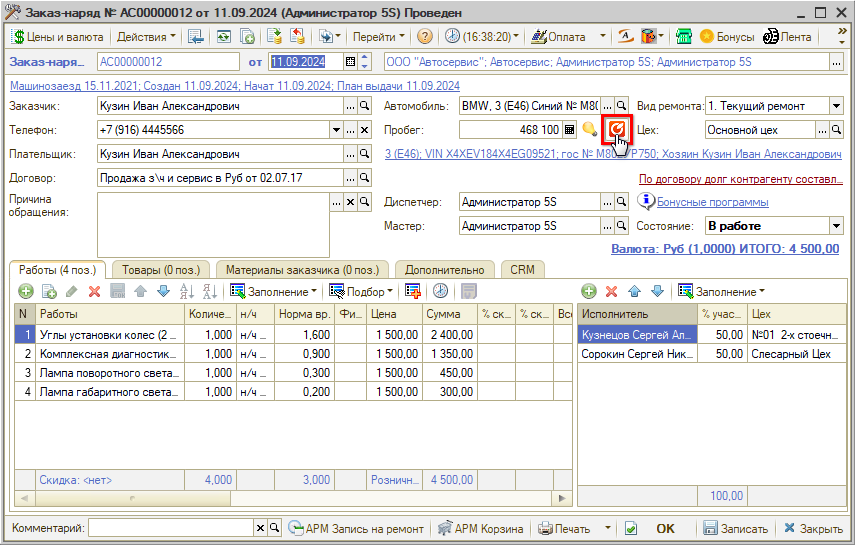

# Как перейти в Онлайн-каталог

<table><tr><td><b>Время чтения:</b> 3 мин.</td><td><b>Обновлено:</b> 07.09.2022</td></tr></table>

Источник: https://www.5systems.ru/help/kak-pereyti-v-onlayn-katalog

Время просмотра — 1:19 мин.

В онлайн-каталог оригинальных запчастей можно перейти из АРМ и документов.

Варианты перехода в онлайн-каталог:

**1.** Из АРМ **«[Корзина](../Работа%20в%20АРМ%20Корзина/rabota-v-arm-korzina.md)»** по кнопке **«OEM Каталог»** — нужно выбрать расшифровку автомобиля или сделать новую, предварительно должен быть введен VIN-номер автомобиля:

**2.** Из АРМ **«[Клиенты и автомобили](../../Работа%20с%20клиентами/Работа%20в%20АРМ%20Клиенты%20и%20автомобили/rabota-v-arm-klienty-i-avtomobili.md)»**:

**3.** Из Заказ-наряда или Заявки на ремонт:

---

**Теги:** онлайн-каталог, OEM каталог, переход в каталог, VIN, расшифровка автомобиля, корзина, заказ-наряд

