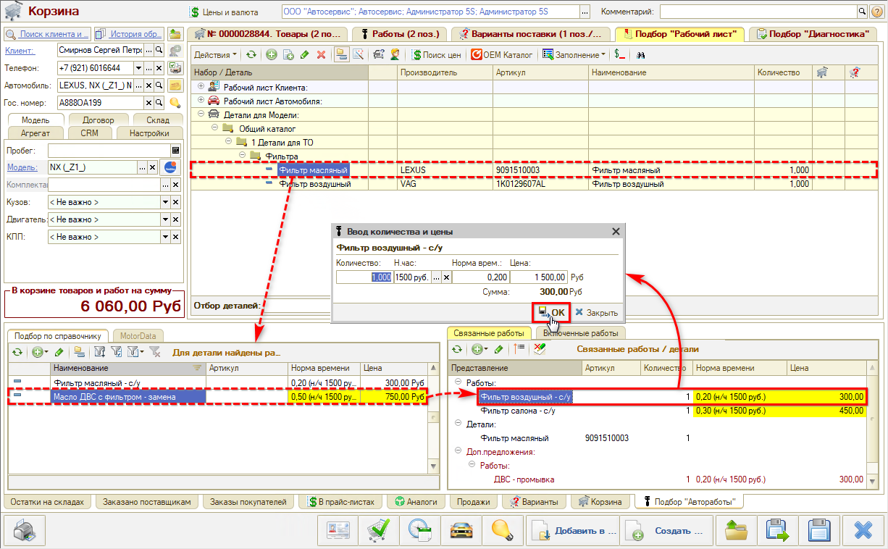
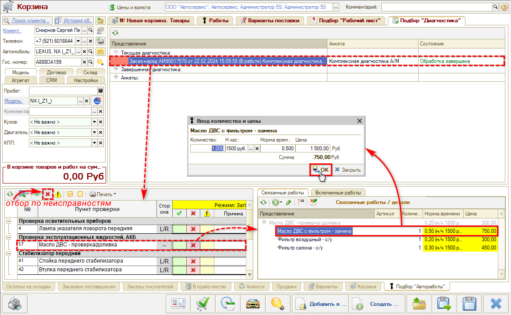

# Как подбирать автоработы в АРМ Корзина

<table><tr><td><b>Время чтения:</b> 4 мин.</td><td><b>Обновлено:</b> 02.02.2024</td></tr></table>

Источник: https://www.5systems.ru/help/kak-podbirat-avtoraboty-v-arm-korzina

Время просмотра — 1:55 мин.

**Варианты подбора авторабот в Корзине:**

**1.** Путем подбора по справочнику **«Автоработы»**. На вкладке Подбор **«Автоработы»** реализован «умный» поиск — по частичному совпадению:

Найденная авторабота добавляется в Корзину двойным кликом левой клавиши мыши.

**2.** Путем подбора связанных работ к деталям применяемости:

**3.** Через Подбор **«Диагностика»**:

---

**Теги:** корзина, автоработы, подбор работ, применяемость, диагностика, связанные работы

