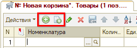
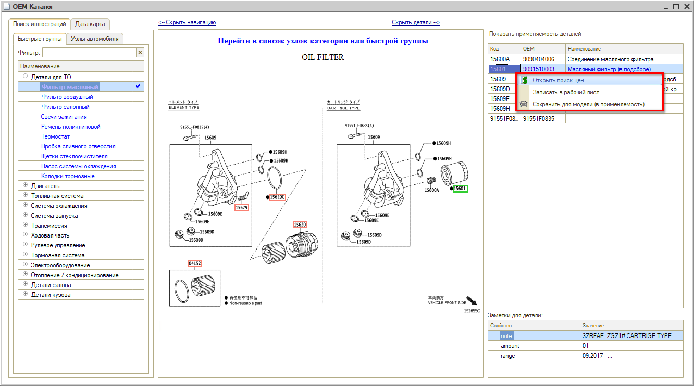
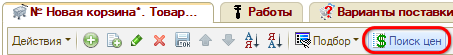
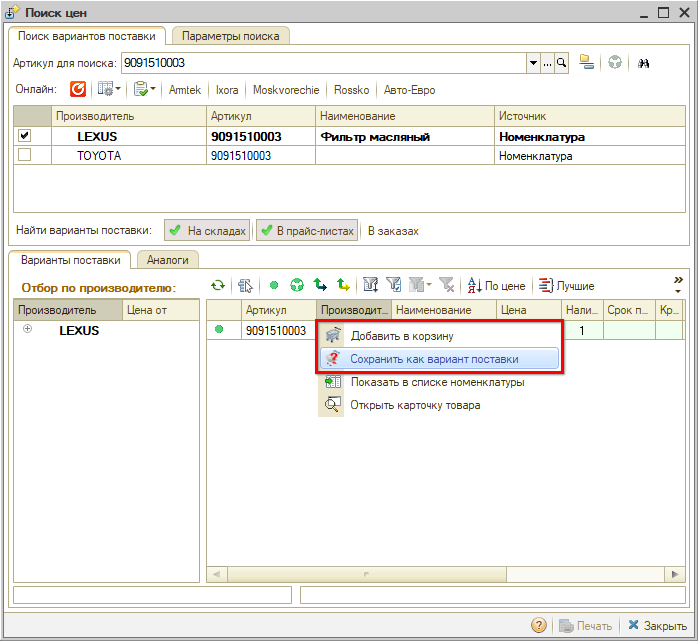
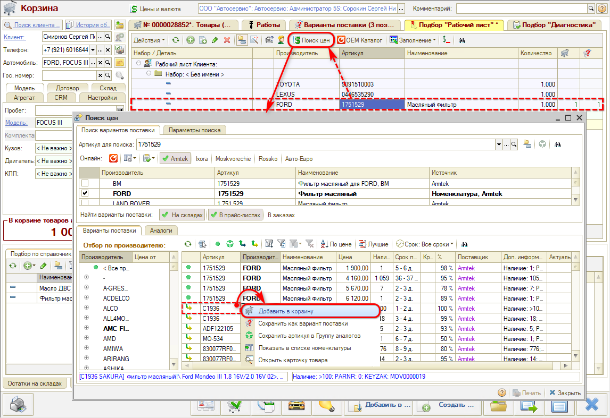
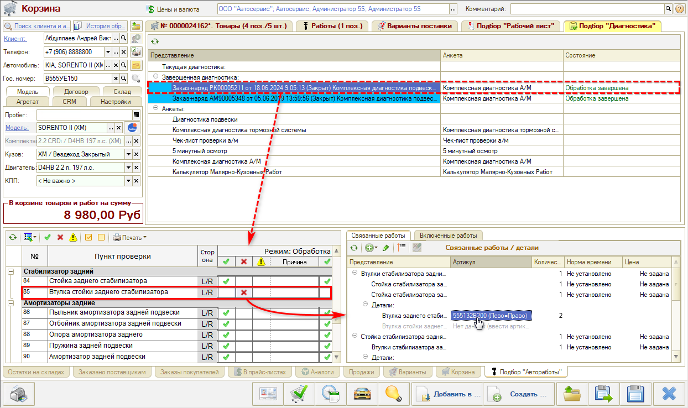

# Как подбирать запасные части в АРМ Корзина

<table><tr><td><b>Время чтения:</b> 6 мин.</td><td><b>Обновлено:</b> 02.02.2024</td></tr></table>

Источник: https://www.5systems.ru/help/kak-podbirat-zapasnye-chasti-v-arm-korzina

Время просмотра — 3:33 мин.

Варианты подбора запасных частей в Корзине:

**1.** Из справочника **«Номенклатура»** — добавление строки вручную:

**2.** Из оригинального каталога — для этого должен быть введен VIN-номер автомобиля:

В каталоге следует найти нужную деталь и перейти к ее проценке либо сохранить в рабочий лист или в применяемость:

Подробнее см. уроки «[Онлайн-каталог запчастей](../Работа%20с%20онлайн-каталогом%20запчастей/rabota-s-onlayn-katalogom-zapchastey.md)» и «[Работа с поиском цен](../Поиск%20цен/poisk-cen.md)».

**3.** Подобрать аналог или замену через обработку **«Поиск цен»**:

Найденную деталь можно сразу добавить в **«Товары»** или сохранить как вариант поставки:

**4.** Подобрать деталь из Вариантов поставки — выбрать нужную деталь и перенести в Корзину:

**5.** Подобрать из деталей применяемости — для этого следует в Подборе **«Рабочий лист»** выделить ранее добавленную в применяемость деталь, перейти в «Поиск цен», подобрать у поставщика товар и добавить в Корзину:

**6.** Подобрать деталь из результатов диагностики — следует на вкладке Подбор **«Диагностика»** выбрать обработанную [диагностическую анкету](../Диагностические%20анкеты/diagnosticheskie-ankety.md), найти в ней выявленную неисправность, выбрать связанную деталь и добавить в Корзину:

Также см. статью «[Работа в АРМ Корзина](../Работа%20в%20АРМ%20Корзина/rabota-v-arm-korzina.md)».

---

**Теги:** корзина, подбор запчастей, номенклатура, оригинальный каталог, поиск цен, варианты поставки, применяемость, диагностика

