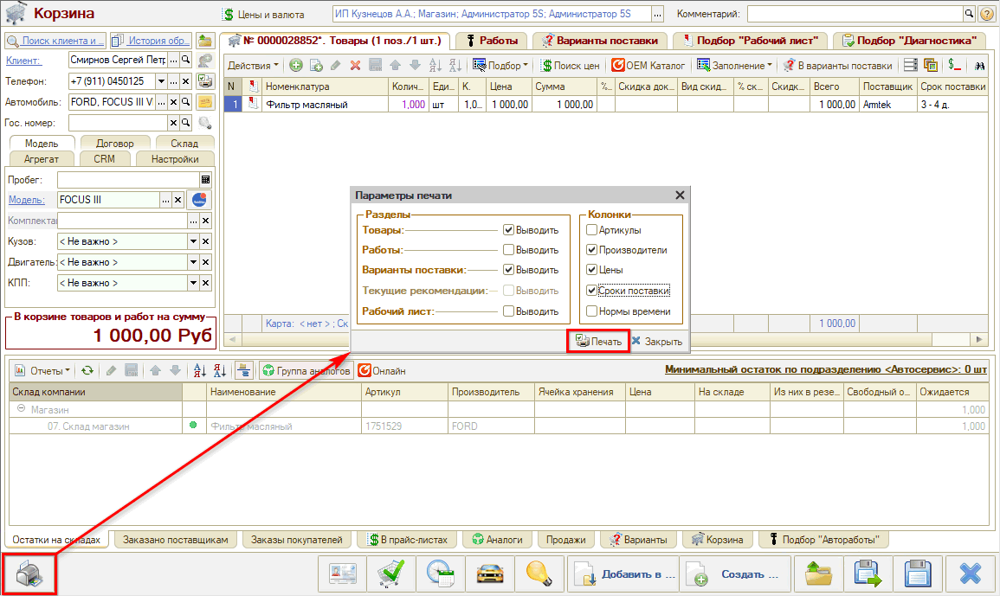
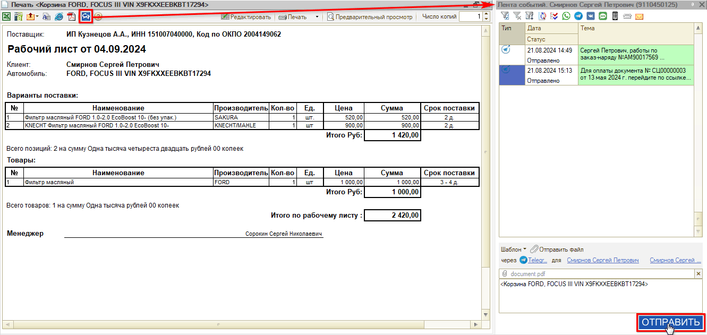

# Как распечатать Корзину или отправить в мессенджер

<table><tr><td><b>Время чтения:</b> 3 мин.</td><td><b>Обновлено:</b> 02.02.2024</td></tr></table>

Источник: https://www.5systems.ru/help/kak-raspechatat-korzinu-ili-otpravit-v-messendzher

Время просмотра — 1:23 мин.

Заполненную [Корзину](../Работа%20в%20АРМ%20Корзина/rabota-v-arm-korzina.md) можно вывести на печать — для этого следует нажать кнопку на нижней панели **«Печать Корзины»**, отметить нужные параметры и нажать кнопку **«Печать»**:

Открывшуюся печатную форму можно распечатать на бумаге либо отправить Корзину для согласования клиенту через мессенджер:

---

**Теги:** корзина, печать, отправка в мессенджер, рабочий лист, согласование с клиентом

