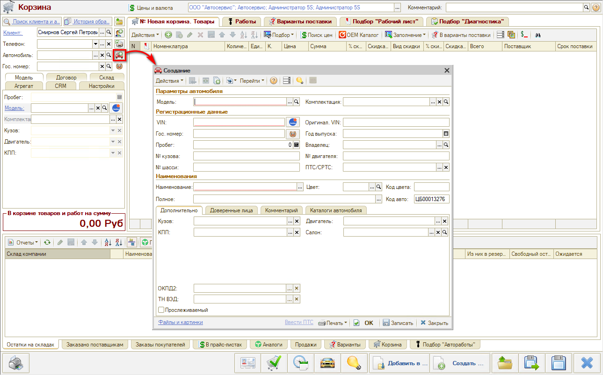
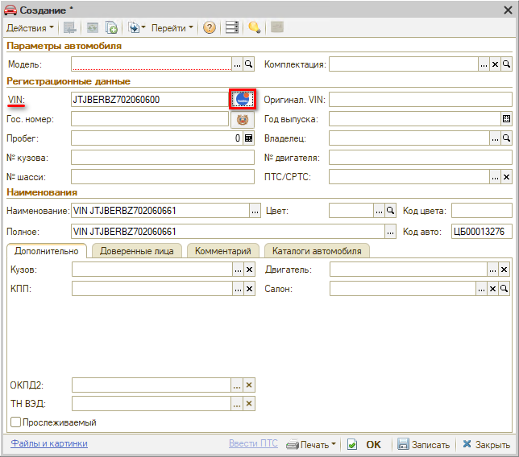
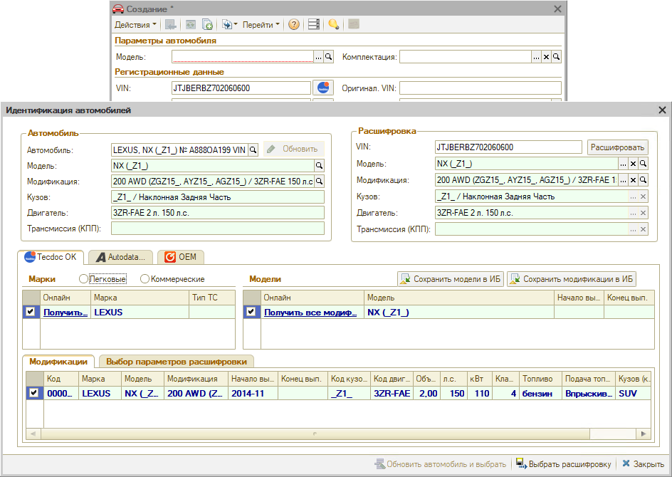
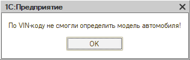
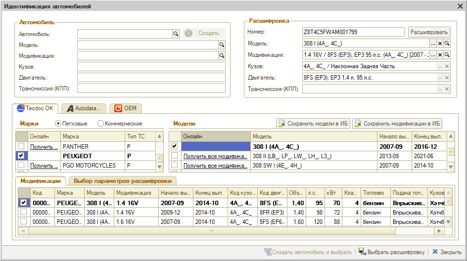
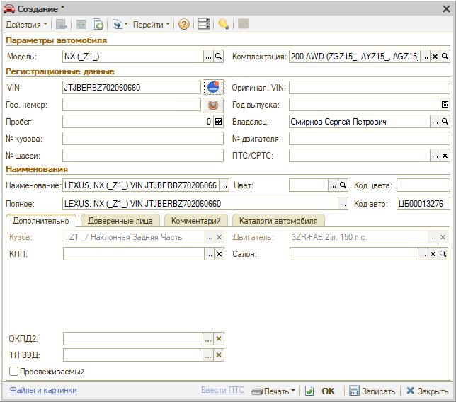

# Как создать автомобиль в Корзине

<table><tr><td><b>Время чтения:</b> 4 мин.</td><td><b>Обновлено:</b> 02.02.2024</td></tr></table>

Источник: https://www.5systems.ru/help/kak-sozdat-avtomobil-v-korzine

Время просмотра — 1:15 мин.

**Создание карточки автомобиля через АРМ «Корзина»**

Создать новый автомобиль можно нажатием кнопки **«Зарегистрировать новый автомобиль или обновить данные в карточке существующего»**:

Открывается форма создания автомобиля. Следует ввести VIN и нажать кнопку **«Расшифровать а/м»**:

Если программа расшифровала автомобиль по VIN-коду, то сразу откроется окно **«Идентификация автомобиля»** с заполненными параметрами:

В этом случае нужно нажать кнопку **«Выбрать расшифровку»** и на форме создания карточки автомобиля нажать **«ОК»**.

Если модель автомобиля не определилась по VIN, выйдет следующее сообщение:

В данном случае нужно создать новый автомобиль клиента вручную, выбирая нужную марку, модель и модификацию из имеющегося в программе каталога Tecdoc:

После автоматической или ручной расшифровки автомобиля следует нажать кнопку **«Выбрать расшифровку»**. Создается нужное наименование автомобиля с уникальным VIN-номером:

Нажимаем **«Записать»**. Все данные из расшифровки подтягиваются в [Корзину](../Работа%20в%20АРМ%20Корзина/rabota-v-arm-korzina.md).

---

**Теги:** корзина, создание автомобиля, VIN, расшифровка автомобиля, Tecdoc, идентификация автомобиля

