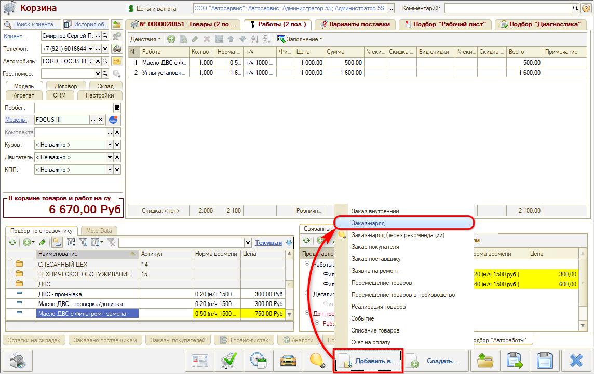

# Как создать документы на основании Корзины

<table><tr><td><b>Время чтения:</b> 3 мин.</td><td><b>Обновлено:</b> 02.02.2024</td></tr></table>

Источник: https://www.5systems.ru/help/kak-sozdat-dokumenty-na-osnovanii-korziny

Время просмотра — 1:37 мин.

**Создание документов на основании Корзины**

 Кнопка **«Создать…»** позволяет создать на основании [Корзины](../Работа%20в%20АРМ%20Корзина/rabota-v-arm-korzina.md) новый документ, например «Заказ внутренний» для пополнения склада или «Заказ покупателя»:

 Кнопка **«Добавить в…»** позволяет добавить товары и работы из Корзины в уже существующий документ, например в Заказ-наряд:

---

**Теги:** корзина, создание документов, заказ покупателя, заказ-наряд, заказ внутренний

