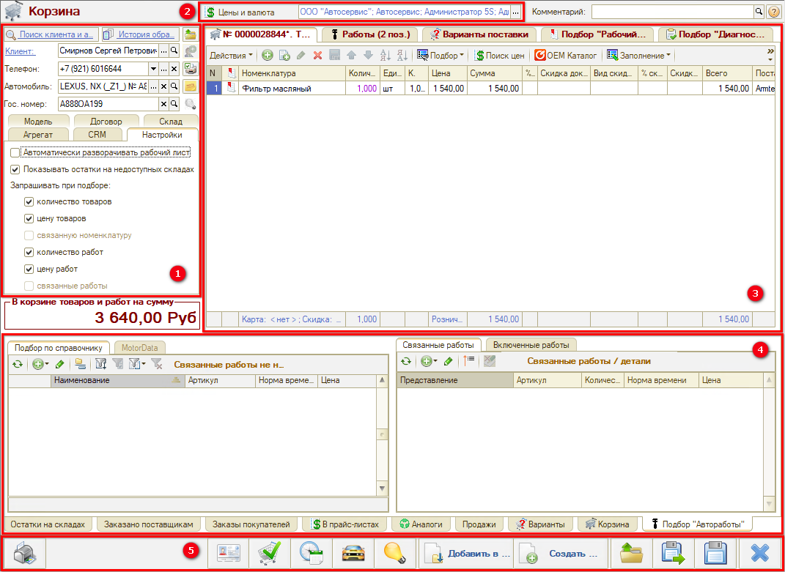
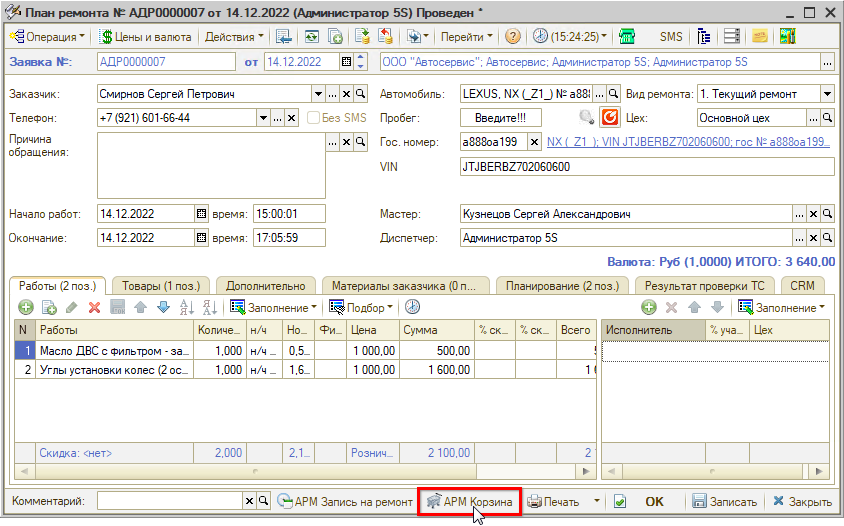

# Назначение и интерфейс АРМ Корзина

<table><tr><td><b>Время чтения:</b> 5 мин.</td><td><b>Обновлено:</b> 02.02.2024</td></tr></table>

Источник: https://www.5systems.ru/help/naznachenie-i-interfeys-arm-korzina

Время просмотра — 2:55 мин.

АРМ **«Корзина»** — центральный элемент программы, основной инструмент в работе мастеров-приемщиков и специалистов по запчастям. Корзина используется для проценки и подбора запчастей и авторабот. Наполнение Корзины осуществляется на вкладках **«Товары»** и **«Работы»**.

Изменения в Корзине можно сохранить и вернуться к работе позднее или создать на основании Корзины документы: Заказ-наряд, Заказ покупателя, Заказ поставщику и т. д. Документы создаются на основе параметров Корзины и подобранных товаров и работ.

Корзина состоит из нескольких областей:

**1.** Панель **«Параметры»** содержит основную информацию по клиенту и автомобилю, а также реквизиты и настройки Корзины.

**2.** Основные реквизиты Корзины.

**3.** Панель **«Товары и работы»** содержит главные рабочие вкладки.

Основные вкладки, на которых осуществляется наполнение Корзины:

- **«Товары»** — для подбора запчастей;
- **«Работы»** — для подбора авторабот.

В Корзине считается сумма по этим двум вкладкам.

Вспомогательные вкладки:

- **«Варианты поставки»** — для согласования с клиентом одного из нескольких вариантов поставки товара;
- Подбор **«Рабочий лист»** — для работы с применяемостью;
- Подбор **«Диагностика»** — для обработки диагностического листа.

**4.** Панель **«Информация»** содержит детализированную информацию по товару или работе.

**5.** Панель перехода в связанные АРМ и документы, сохранения и загрузки Корзины.

Перейти в Корзину можно из разных мест программы — из главного меню, из Сделки, из Записи на ремонт и других АРМ, из Заказ-наряда и других документов:

Подробнее см. в следующих уроках, а также в статье «[Работа в АРМ Корзина](../Работа%20в%20АРМ%20Корзина/rabota-v-arm-korzina.md)».

---

**Теги:** Корзина, АРМ, интерфейс, подбор запчастей, автоработы, проценка, варианты поставки

