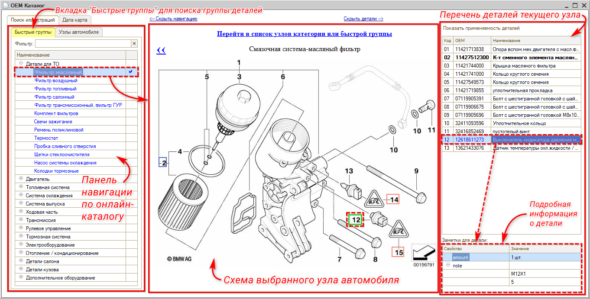

# Обзор интерфейса Онлайн-каталога

<table><tr><td><b>Время чтения:</b> 3 мин.</td><td><b>Обновлено:</b> 07.09.2022</td></tr></table>

Источник: https://www.5systems.ru/help/obzor-interfeysa-onlayn-kataloga

Время просмотра — 1:12 мин.

В систему 5S AUTO встроена интеграция с онлайн-каталогом оригинальных запчастей.

Интерфейс онлайн-каталога:

**Левая панель** представляет собой панель навигации по онлайн-каталогу. Вкладка **«Быстрые группы»** предназначена для поиска группы деталей. Нужный узел автомобиля выбирается двойным кликом мыши.

При этом на **центральную панель** выводится схема выбранного узла автомобиля. Схемы открываются также двойным кликом.

**Правая панель** содержит перечень деталей текущего узла. При выборе на схеме либо в перечне определенной детали выводится подробная информация о ней в нижней части правой панели.

---

**Теги:** онлайн-каталог, OEM каталог, интерфейс, схема узла, быстрые группы, подбор запчастей

