

# Поиск цен

<table><tr><td><b>Время чтения:</b> 20 мин.</td><td><b>Обновлено:</b> 17.06.2022</td></tr></table>

Источник: https://www.5systems.ru/help/poisk-cen

## Содержание

- [Введение](#введение)
- [Способы перехода](#способы-перехода)
- [Работа с Поиском цен](#работа-с-поиском-цен)
  - [Область поиска и отображения результатов поиска](#область-поиска-и-отображения-результатов-поиска)
  - [Параметры поиска](#параметры-поиска)
  - [Область работы с вариантами поставки и аналогами](#область-работы-с-вариантами-поставки-и-аналогами)
  - [Меню действий](#меню-действий)
- [Создание товара из Поиска цен](#создание-товара-из-поиска-цен)
- [Видеоинструкции по работе с Поиском цен](#видеоинструкции-по-работе-с-поиском-цен)

## Введение

Для поиска вариантов поставки по товарам предусмотрена обработка **«Поиск цен»**. Поиск цен позволяет:

- находить требуемые товары и их аналоги по артикулам производителей:
  - в справочнике номенклатуры и группах аналогов,
  - в загруженных прайс-листах поставщиков,
  - в Веб прайс-листах,
  - в онлайн каталогах Laximo;
- подбирать оптимальные предложения по ценам и срокам поставки с использованием различных параметров фильтрации и сортировки;
- добавлять найденные варианты поставки в документ или корзину.

Поиск цен может быть вызван из [корзины](../Работа%20в%20АРМ%20Корзина/rabota-v-arm-korzina.md), формы списка номенклатуры или любого документа, где есть номенклатура.

## Способы перехода

**1.** Обработка **«Корзина»**:

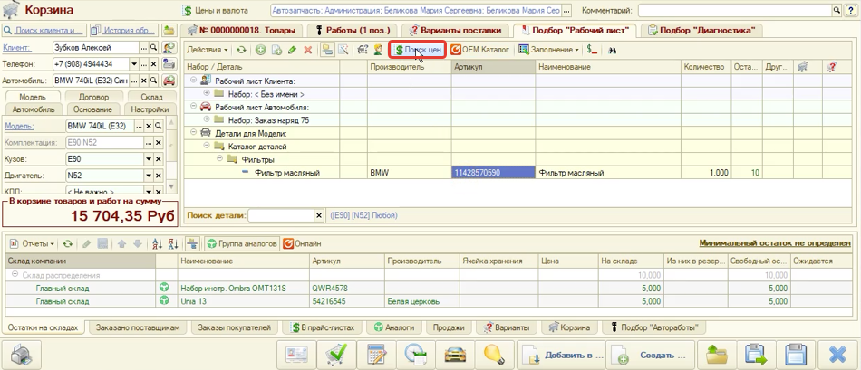

**2.** Справочник **«Номенклатура»**:

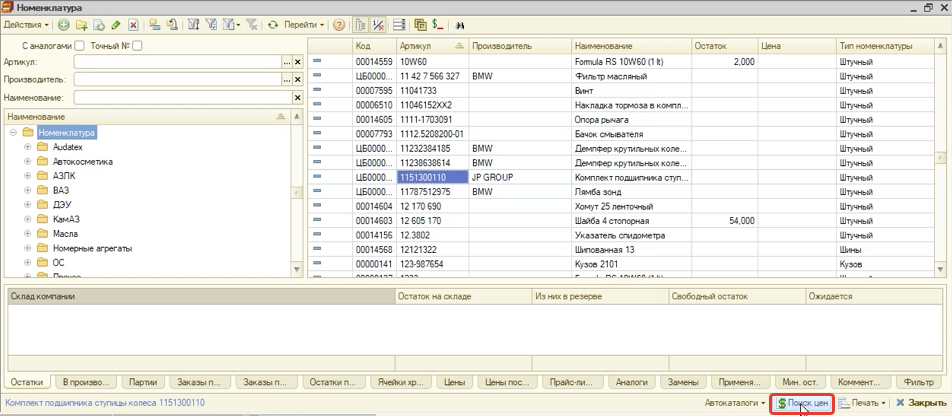

Поиск цен из справочника «Номенклатура» вызывается в контексте текущей строки списка. Если список пустой, то в Поиск цен будет передан артикул из параметров отбора.

**3.** Из документа по прямой ссылке (Заказ покупателя, Заказ поставщику и т. п.):

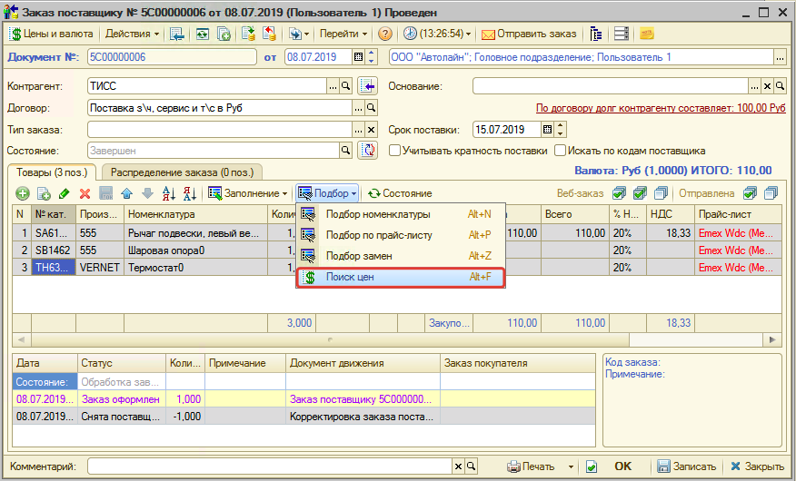

**4.** Из документа через справочник «Номенклатура» (Поступление товаров, Реализация товаров и т. п.):

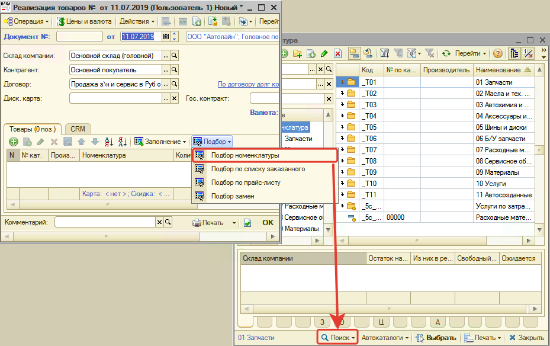

## Работа с Поиском цен

Поиск цен состоит из нескольких областей:

1. Область поиска и отображения результатов поиска.
2. Область работы с вариантами поставки и аналогами по товарной позиции.

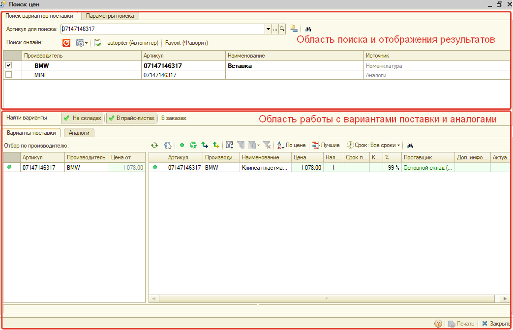

### Область поиска и отображения результатов поиска

Если Поиск цен вызван в контексте номенклатуры, то в строке поиска заполнится артикул из номенклатуры. Иначе строка поиска будет пустой. В этом случае необходимо ввести артикул в поле ввода и осуществить поиск.

В результате поиска по артикулу заполняется табличная часть **«Результаты поиска»**. Строки табличной части (товарные позиции) могут быть найдены из разных источников:

- **Номенклатура** — из справочника «Номенклатура».
- **Аналоги** — из группы аналогов.
- **Прайс-листы** — из загруженных прайс-листов контрагентов.
- **Онлайн** — из онлайн каталогов Laximo (поиск в онлайн каталогах происходит, если в Системе подключен сервис Laximo).
- **Веб прайс-лист** — из Веб прайс-листа (отображается название Веб прайс-листа, в котором найдена товарная позиция).

Установленные флажки рядом с товарными позициями означают выбор данной позиции для участия в поиске вариантов поставки. Если найдена одна позиция, то она будет помечена для поиска автоматически.

Командное меню справа от строки поиска:

**Сгруппировать найденные артикулы** — группирует товарные позиции по аналогам. Если товарные позиции являются аналогами друг другу, то они сгруппируются:

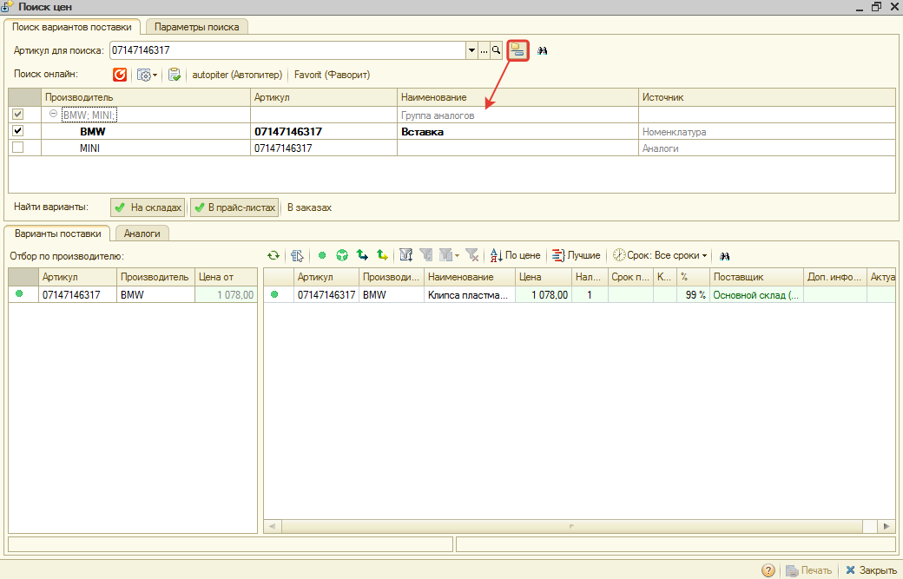

Командное меню поиска онлайн:

**Получить онлайн данные** — вызывает поиск в онлайн каталогах Laximo:

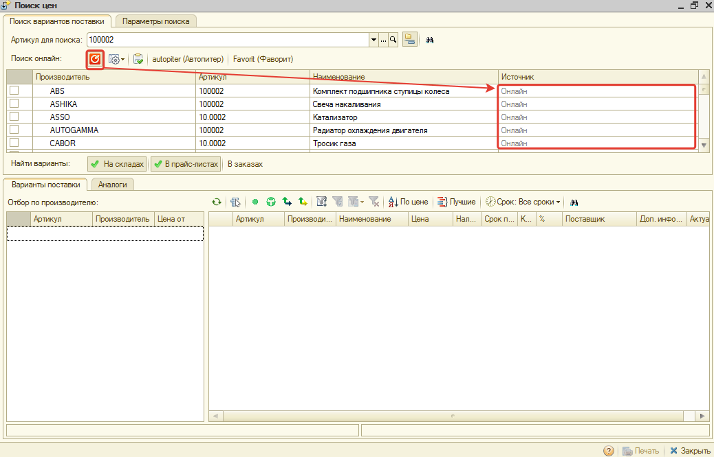

**Обновить кэш** — принудительно обновляет данные в кэш. При каждом обращении к онлайн каталогам данные сохраняются в кэш и используются при всех запросах пользователей. Нажатие кнопки удаляет ранее сохраненные данные и заново получает информацию из сервиса.

**Веб-проценка** — командная панель для поиска в Веб прайс-листах. Автоматически заполняется кнопками настроенных Веб прайс-листов поставщиков. Кнопка **«Проверить все прайс-листы»** нажимает все кнопки настроенных прайс-листов:

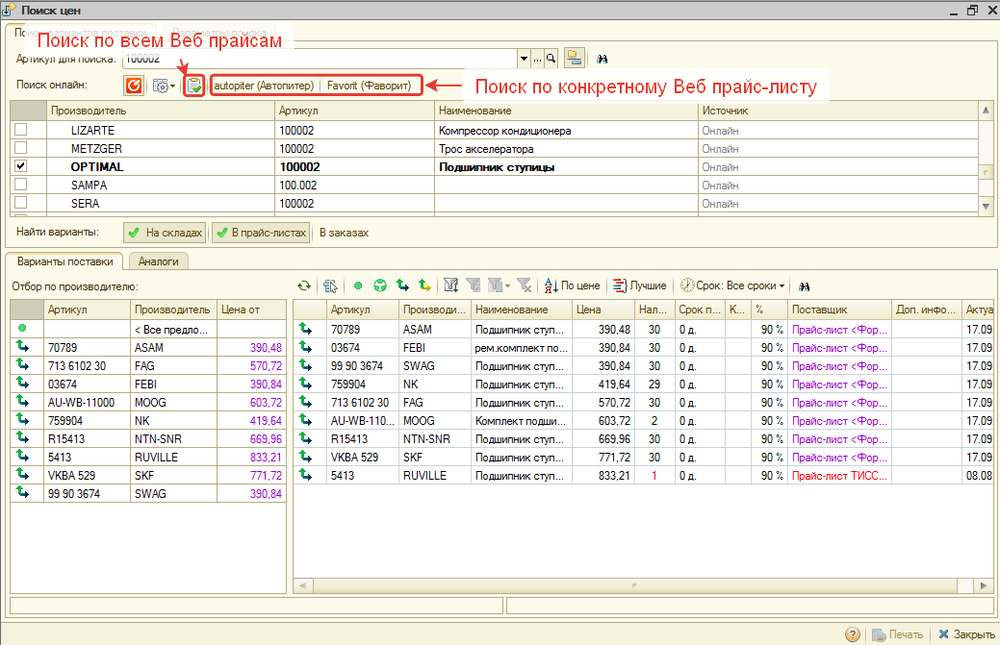

### Параметры поиска

Параметры поиска вариантов поставки настраиваются на вкладке **«Параметры поиска»**:

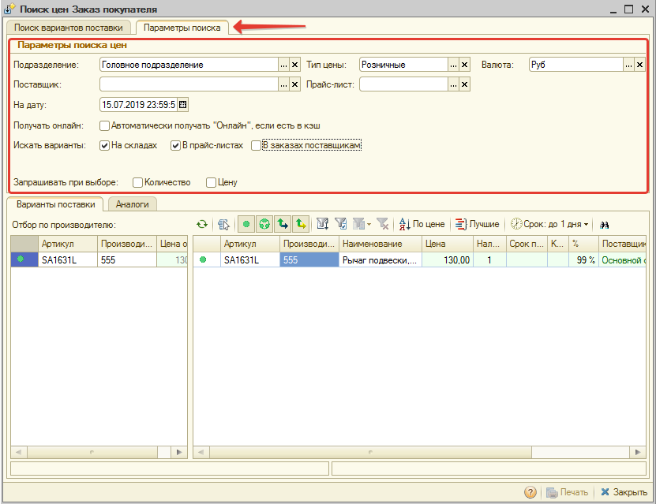

Параметры поиска цен:

| Параметр | Описание |
| --- | --- |
| Поле выбора **«Подразделение»** | Выводить предложения, доступные для указанного подразделения |
| Поле выбора **«Тип цен»** | Выводить цены указанного типа |
| Поле выбора **«Поставщик»** | Выводить предложения только от указанного поставщика |
| Поле выбора **«Прайс-лист»** | Выводить предложения только из указанного прайс-листа |
| Поле выбора **«Валюта»** | Выводить цены в указанной валюте |
| Поле выбора даты **«На дату»** | Рассчитывать цены по наценкам, актуальным на дату, указанную в параметре |
| Флажок **«Автоматически получать "Онлайн", если есть в кэш»** | Автоматически активировать кнопку «Получить онлайн данные» в командной панели строки поиска по артикулу, если данные по введенному артикулу ранее уже запрашивались в сервисе |
| Флажок **«Искать варианты на складах»** | Автоматически активировать кнопку «На складах» вкладки «Поиск вариантов поставки» |
| Флажок **«Искать варианты в прайс-листах»** | Автоматически активировать кнопку «В прайс-листах» вкладки «Поиск вариантов поставки» |
| Флажок **«Искать варианты в заказах поставщикам»** | Автоматически активировать кнопку «В заказах» вкладки «Поиск вариантов поставки» |
| Флажок **«Запрашивать при выборе количество»** | Требуется запрашивать количество при добавлении товарной позиции в документ или корзину |
| Флажок **«Запрашивать при выборе цену»** | Требуется запрашивать цену при добавлении товарной позиции в документ или корзину |

Измененные параметры поиска будут применены при следующем поиске по артикулу.

### Область работы с вариантами поставки и аналогами

По всем товарным позициям, отмеченным в табличной части с результатами поиска, отображаются предложения на вкладке **«Варианты поставки»**. Для удобного просмотра списка предложений с вариантами поставки предусмотрены:

- параметры поиска вариантов поставки,
- отбор по производителю,
- параметры фильтрации и сортировки.

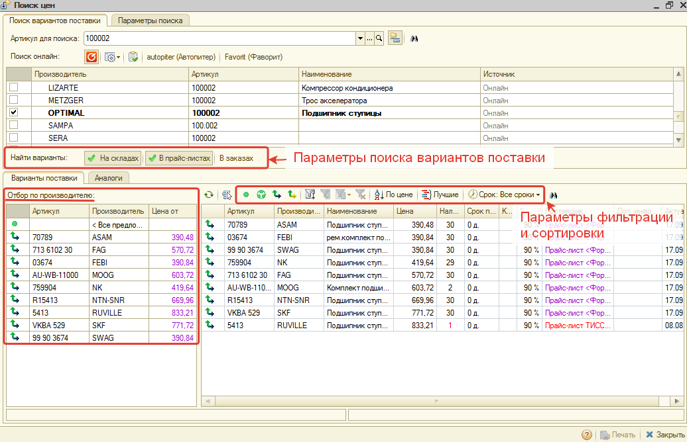

Полный перечень аналогов для отмеченных товарных позиций отображается на вкладке **«Аналоги»** (см. [Аналоги](#аналоги)).

Для работы со списком строк в любой табличной части Поиска цен предусмотрено [Меню действий](#меню-действий).

#### Параметры поиска вариантов поставки

В параметрах поиска вариантов поставки располагается командная панель выбора областей поиска.

Командная панель выбора областей поиска состоит из элементов:

- **На складах** — кнопка для поиска по наличию на складах.
- **В прайс-листах** — кнопка для поиска в загруженных прайс-листах контрагентов.
- **В заказах** — кнопка для поиска в неисполненных заказах поставщикам.

#### Отбор по производителю

При активизации строки с уникальным артикулом производителя будет установлен отбор предложений с вариантами поставки по этому артикулу производителя. При активизации верхней строки **«<Все предложения>»** отбор по уникальному артикулу производителя будет отменен:

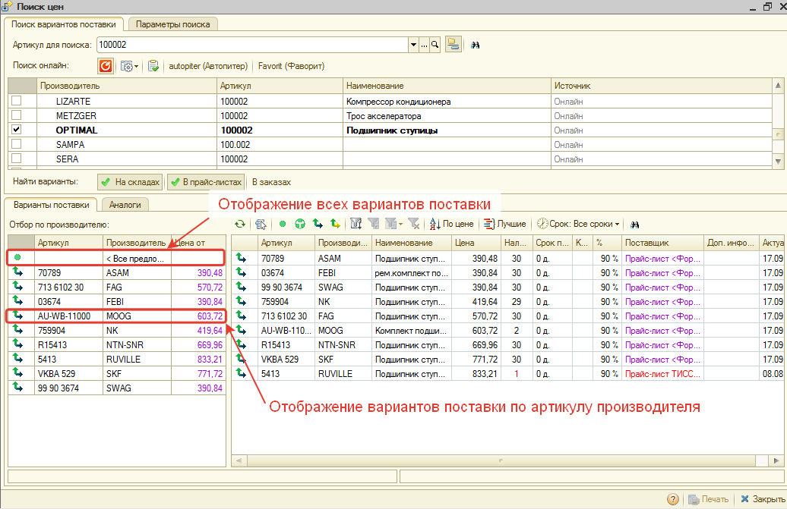

#### Параметры фильтрации и сортировки

| Отображение | Подпись | Описание |
| --- | --- | --- |
|  | Предложения для оригинального артикула | Отображает варианты поставки только для запрошенных артикулов |
|  | Предложения для группы аналогов | Отображает варианты поставки только для аналогов |
|  | Предложения для аналогов, полученных онлайн | Отображает варианты поставки только для аналогов, полученных из онлайн каталогов Laximo |
|  | Предложения для аналогов, полученных от поставщиков | Отображает варианты поставки только для аналогов, полученных из Веб прайс-листов |
|  | Отбор | Настройка фильтрации значений по колонкам в табличной части с вариантами поставки |
| 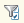 | Отбор по значению в текущей колонке | Фильтрация по выделенному значению в табличной части с вариантами поставки |
| 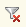 | Отключить отбор | Сброс настроенного отбора |
| 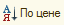 | Сортировка по цене аналогов | Сортировка по цене, по возрастанию |
| 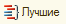 | Показать лучшие предложения | Отображение только самого дешевого варианта поставки и варианта поставки с наибольшим количеством |
| 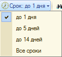 | Срок: \<Вариант срока\> | Меню выбора варианта срока. В зависимости от выбранного пункта меню применяется фильтрация по сроку поставки |

#### Аналоги

На вкладке «Варианты поставки» отображаются только аналоги с ценой. Чтобы посмотреть полный список аналогов по отмеченным товарным позициям, нужно перейти на вкладку **«Аналоги»**:

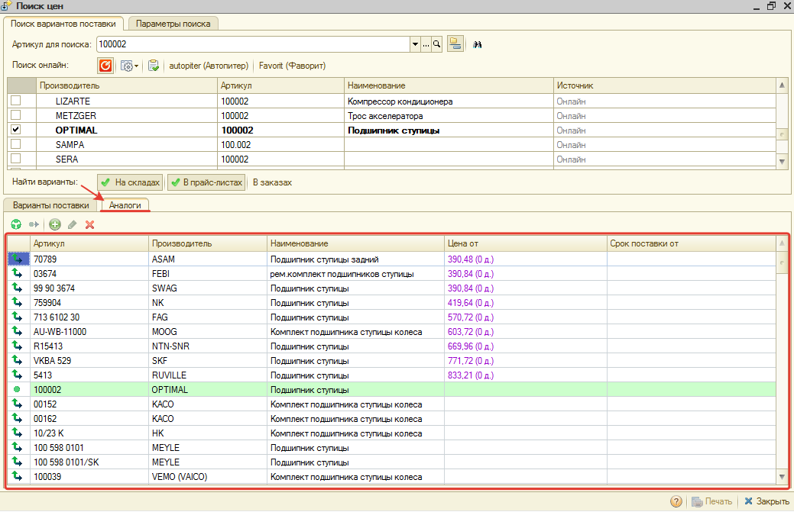

Список аналогов отсортирован по цене продажи, по возрастанию. По каждому аналогу отображается минимальная цена и минимальный срок поставки. Аналоги без цены выводятся в конце списка.

Список аналогов позволяет понять, какие аналоги относятся к группе аналогов, а какие найдены у Веб поставщиков и в онлайн каталогах. Вид аналога определяется по пиктограмме в левой колонке (см. [Пиктограммы товарной позиции](#пиктограммы-товарной-позиции)). Аналог, который найден из Веб прайс-листов или онлайн каталога, можно сохранить в группу аналогов с помощью меню действий.

Аналог с ценой или без можно добавить в документ, в контексте которого вызван Поиск цен. Добавить предложение с аналогом в документ можно с помощью меню действий. Если активизировать колонку **«Цена от»** строки с аналогом и выбрать добавление в документ в меню действий, то в документ добавится аналог с соответствующей ценой. Если активизировать колонку **«Срок поставки от»** строки с аналогом и выбрать добавление в документ в меню действий, то в документ добавится аналог с соответствующим сроком поставки.

Список аналогов можно отредактировать c помощью командной панели или контекстного меню.

#### Пиктограммы товарной позиции

| Отображение | Описание |
| --- | --- |
|  | Оригинальный артикул |
|  | Группа аналогов |
|  | Аналог из онлайн каталога Laximo |
|  | Аналог от Веб-поставщиков |

### Меню действий

Двойной клик по строке (выбор строки) в любой табличной части Поиска цен вызывает меню действий. Перечень пунктов меню действий:

- **Создать производителя** — если производитель отсутствует в справочнике (выделен красным цветом фона), то предлагается его добавить.
- **Создать новый товар** — если товар отсутствует в справочнике «Номенклатура», то предлагается его создать.
- **Создать товар и добавить в документ** — если товар отсутствует в справочнике «Номенклатура», то предлагается его создать и сразу добавить в документ, из которого вызвана обработка.
- **Сохранить в группу аналогов** — если товар из Веб прайс-листа или онлайн каталога, то предлагается сохранить его в группу аналогов.
- **Добавить в документ** — если «Поиск цен» вызван в контексте документа, то предлагается добавить товар или вариант поставки товара в документ.
- **Добавить в корзину** — если «Поиск цен» вызван в контексте корзины, то предлагается добавить товар или вариант поставки товара в корзину.
- **Показать в списке номенклатуры**.
- **Открыть карточку товара**.

## Создание товара из Поиска цен

Любую найденную запчасть из Поиска цен можно сохранить в справочник «Номенклатура», если она там отсутствует. Для этого вызовите Меню действий и выберите пункт меню **«Создать новый товар»**:

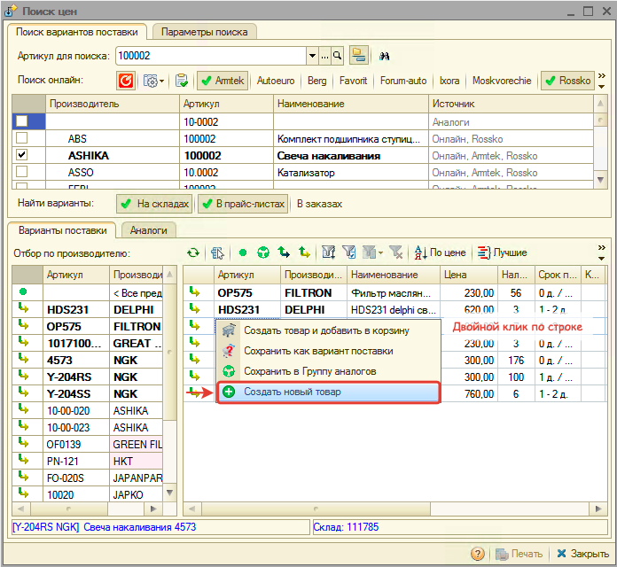

Выберите один из вариантов действий:

1. Открыть предзаполненную форму создания номенклатуры и создать номенклатуру вручную.
2. Создать номенклатуру автоматически.

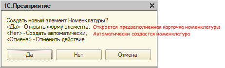

**Обратите внимание!** Номенклатура создается в группе, указанной в параметре «Группа для новой номенклатуры» [Настроек Помощника автосервиса](https://www.5systems.ru/help/nastroyki-pomoschnika-avtoservisa).

В случае ручного создания номенклатуры открывается предзаполненная из Поиска цен карточка номенклатуры. Подкорректируйте ее при необходимости и нажмите кнопку **«ОК»** для сохранения:

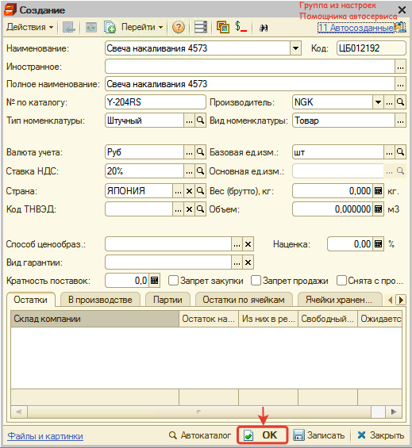

## Видеоинструкции по работе с Поиском цен

**1. [Назначение и интерфейс Поиска цен](../Назначение%20и%20интерфейс%20Поиска%20цен/naznachenie-i-interfeys-poiska-cen.md):**

**2. [Что отображается в предложениях поставщиков](../Что%20отображается%20в%20предложениях%20поставщиков/chto-otobrazhaetsya-v-predlozheniyakh-postavschikov.md):**

**3. [Как перейти в Поиск цен](https://www.5systems.ru/help/kak-pereyti-v-poisk-cen):**

**4. [Как проценить деталь по артикулу](https://www.5systems.ru/help/kak-procenit-detal-po-artikulu):**

**5. [Как работает фильтрация и сортировка в Поиске цен](https://www.5systems.ru/help/kak-rabotaet-filtraciya-i-sortirovka-v-poiske-cen):**

**6. [Как работать с аналогами в Поиске цен](https://www.5systems.ru/help/kak-rabotat-s-analogami-v-poiske-cen):**

**7. [Как изменить параметры Поиска цен](https://www.5systems.ru/help/kak-izmenit-parametry-poiska-cen):**

---

**Теги:** поиск цен, проценка, артикул, аналоги, варианты поставки, прайс-листы, Laximo, веб-проценка, номенклатура

