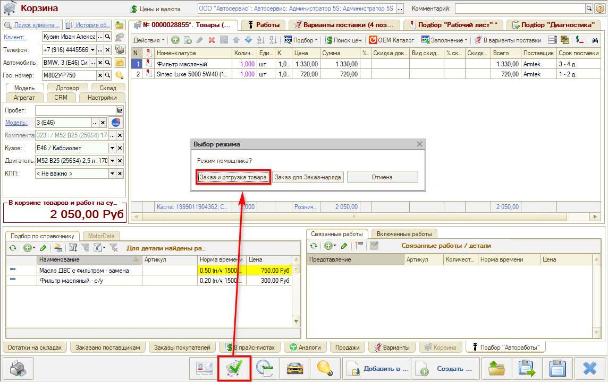
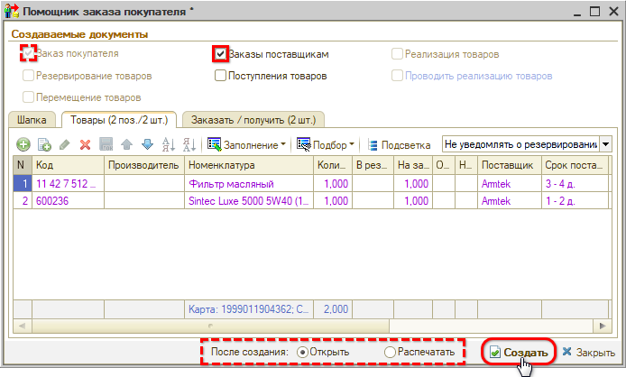

# Помощник оформления Заказа покупателя в АРМ Корзина

<table><tr><td><b>Время чтения:</b> 3 мин.</td><td><b>Обновлено:</b> 02.02.2024</td></tr></table>

Источник: https://www.5systems.ru/help/pomoschnik-oformleniya-zakaza-pokupatelya-v-arm-korzina

Время просмотра — 1:18 мин.

Помощник оформления Заказа покупателя позволяет на основании [Корзины](../Работа%20в%20АРМ%20Корзина/rabota-v-arm-korzina.md) быстро создать цепочку документов. Рекомендуется использовать, когда требуется создать несколько Заказов поставщику по одному Заказу покупателя.

Для перехода требуется нажать кнопку на нижней панели **«Помощник оформления Заказа покупателя»** и выбрать режим **«Заказ и отгрузка товара»**:

В открывшейся форме требуется отметить документы, которые требуется создать, выбрать действия с документами после создания и нажать кнопку **«Создать»**:

Будут созданы и проведены Заказ покупателя на эту Корзину и Заказы поставщикам.

---

**Теги:** корзина, помощник оформления, заказ покупателя, заказ поставщику, заказ-наряд

