

# Работа в АРМ Корзина

<table><tr><td><b>Время чтения:</b> 23 мин.</td><td><b>Обновлено:</b> 02.02.2024</td></tr></table>

Источник: https://www.5systems.ru/help/rabota-v-arm-korzina

## Содержание

- [Введение](#введение)
- [Описание элементов Корзины](#описание-элементов-корзины)
  - [1. Панель «Параметры»](#1-панель-параметры)
  - [2. Панель «Реквизиты»](#2-панель-реквизиты)
  - [3. Панель «Товары и работы»](#3-панель-товары-и-работы)
    - [Страница «Товары»](#страница-товары)
    - [Страница «Работы»](#страница-работы)
    - [Страница «Варианты поставки»](#страница-варианты-поставки)
  - [4. Панель «Информация»](#4-панель-информация)
  - [5. Панель действий](#5-панель-действий)
- [Подбор «Рабочий лист»](#подбор-рабочий-лист)
- [Подбор «Диагностика»](#подбор-диагностика)
- [Видео по теме](#видео-по-теме)

С принципами работы в АРМ «Корзина» можно также ознакомиться в [видеоинструкциях](#видео-по-теме).

## Введение

**Корзина** — обработка, предназначенная для оперативного подбора товаров и работ с помощью различных инструментов.

Перейти в Корзину можно из следующих мест программы:

**1.** Из меню интерфейса — **Автосервис → Приемка → АРМ → Корзина**:

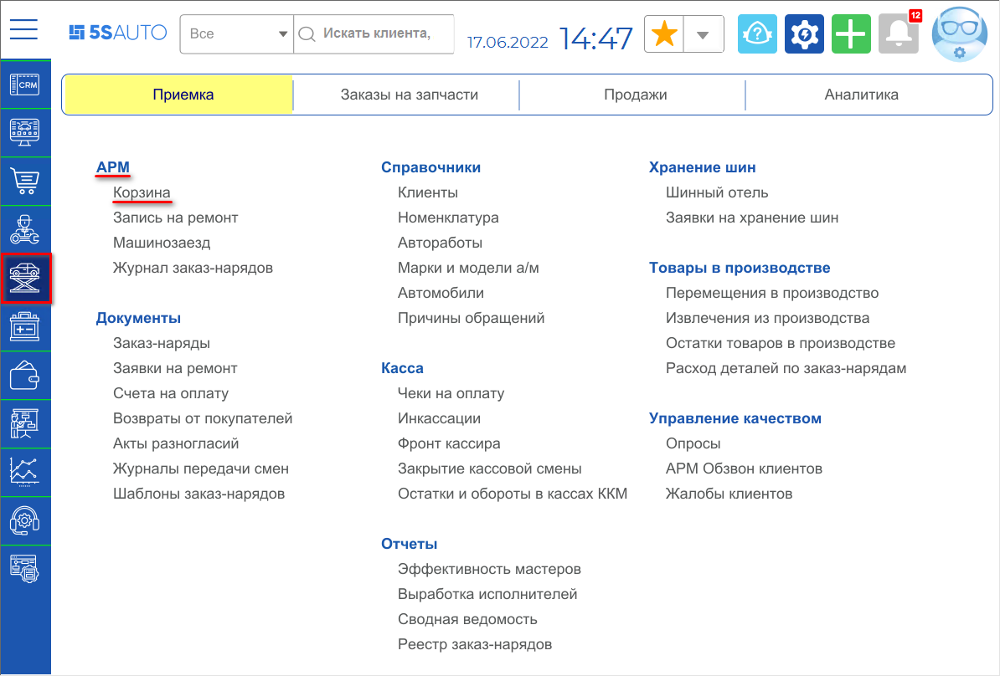

**2.** Из АРМ Клиенты и автомобили. При переходе Корзина откроется в контексте того клиента, который активизирован в АРМ (см. [Работа в АРМ Клиенты и автомобили](../../Работа%20с%20клиентами/Работа%20в%20АРМ%20Клиенты%20и%20автомобили/rabota-v-arm-klienty-i-avtomobili.md)).

**3.** Из документов автосервиса: заказ-наряд, заявка на ремонт. При переходе сохранится документ и откроется Корзина:

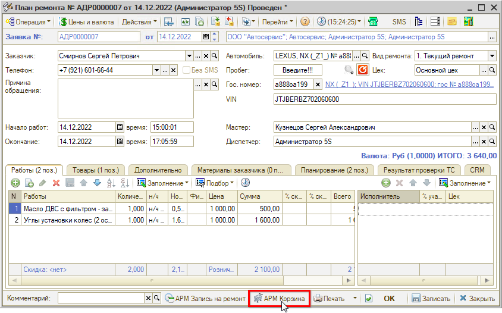

Наполнение корзины осуществляется на страницах **«Товары»** и **«Работы»** панели **«Товары и работы»**.

Изменения в Корзине можно сохранить и вернуться к работе позднее или создать на основании Корзины документы: заказ-наряд, заказ покупателя, заказ поставщику и т. д. Документы создаются на основе параметров Корзины и подобранных товаров и работ.

## Описание элементов Корзины

Корзина состоит из нескольких областей:

### 1. Панель «Параметры»

Панель **«Параметры»** состоит из функциональных элементов (кнопок-ссылок, кнопок), основных параметров и дополнительных параметров, разбитых по вкладкам.

Функциональные элементы:

| Функциональный элемент | Описание |
| --- | --- |
|  | Открывает форму поиска клиентов и автомобилей |
|  | Открывает форму со списком всех сохраненных корзин |
|  | Открывает меню действий с пунктами:  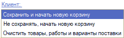 |
|  | Открывает форму выбора корзины |
|  | Открывает форму быстрого ввода контрагента |
|  | Устанавливает и отображает согласие на обработку персональных данных |
|  | Открывает форму создания автомобиля |
|  | Расшифровывает автомобиль по гос. номеру — при условии настроенной [интеграции с ГИБДД](https://www.5systems.ru/help/integraciya-s-bazoy-gibdd) |
|  | Открывает список заметок к автомобилю |

Основные параметры:

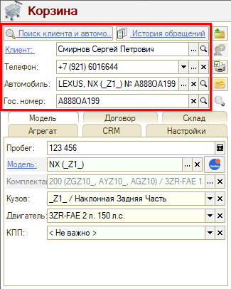

1. **Клиент** — заполняется строковым значением или выбирается значение из справочника [«Контрагенты и контакты»](../../Работа%20с%20клиентами/Контрагенты%20и%20контакты/kontragenty-i-kontakty.md). Если вводится текст, то система выполнит поиск в базе данных и при наличии совпадений будет предложено выбрать существующего клиента или оставить введенное значение строкой.
2. **Телефон** — заполняется строковым значением; выбирается из списка предложенных телефонов для заполненного клиента; добавляется через специальное окно ввода телефона. Если вводится текст, то система выполнит поиск в базе данных и при наличии совпадений будет предложено выбрать существующего клиента или оставить введенное значение строкой. Заполнение поля поможет идентифицировать клиента при дальнейшем с ним взаимодействии. Например, если клиент ранее обращался и ему уже подобрали товары, то по кнопке-ссылке **«История обращений»** верхней части панели можно его найти и продолжить работу с ним.
3. **Автомобиль** — заполняется строковым значением или выбирается значение из справочника [«Автомобили»](https://www.5systems.ru/help/avtomobili-0). Если вводится текст, то система выполнит поиск в базе данных и при наличии совпадений будет предложено выбрать существующий автомобиль или оставить введенное значение строкой.
4. **Гос. номер** — заполняется строковым значением или выбирается из карточки автомобиля, указанной в поле «Автомобиль». Если вводится текст, то можно осуществить поиск в базе данных автомобиля по гос. номеру и выбрать автомобиль.

Дополнительные параметры настраиваются на нескольких вкладках:

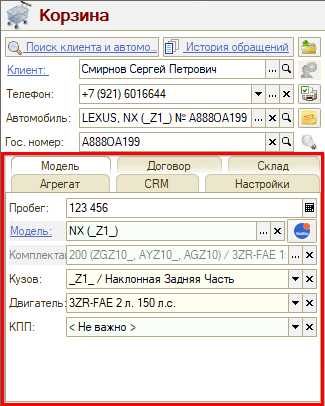

1. **Модель** — автоматически заполняется при выборе Автомобиля. Данные могут быть изменены. Эти параметры используются при создании нового автомобиля и участвуют при поиске деталей в подборах «Рабочий лист» и «Диагностика».
2. **Агрегат** — уточняется агрегат автомобиля для подбора к нему запчастей. См. [Учет агрегатного ремонта](https://www.5systems.ru/help/uchet-agregatnogo-remonta).
3. **Договор** — заполняются параметры взаиморасчетов с клиентом.
4. **Склад** — указывается «Склад», с которого будет отгружаться товар, заполняются параметры «Вид ремонта» и «Цех», если планируются автосервисные работы.
5. **CRM** — отображаются контекстные данные из CRM: основание (Сделка), задача подбор — если переход в корзину был осуществлен оттуда, причина обращения и комментарий.
6. **Настройки** — настраиваются опции подбора деталей и работ:
   - **Автоматически разворачивать рабочий лист** — при включении опции после добавления или обновления данных в рабочем листе рабочий лист раскроется.
   - **Показывать остатки на недоступных складах** — при включении опции будут отображаться остатки на складах, которые не доступны текущему пользователю.
   - **Запрашивать при подборе** — при включении одной из опций в процессе добавления в корзину будет запрашиваться для ввода соответствующая информация.

### 2. Панель «Реквизиты»

Включает два реквизита Корзины:

1. **Цены и валюты** — для задания типа цен и валюты Корзины.
2. **Общие реквизиты** — для определения принадлежности Корзины организации и подразделению, а также для задания автора и менеджера.

### 3. Панель «Товары и работы»

Панель состоит из нескольких страниц:

1. Товары
2. Работы
3. Варианты поставки
4. Подбор «Рабочий лист»
5. Подбор «Диагностика»

#### Страница «Товары»

Представляет собой табличную часть с подобранными товарными предложениями. Данные со страницы можно распечатать на панели действий и предоставить клиенту или добавить в документ.

Способы наполнения страницы «Товары»:

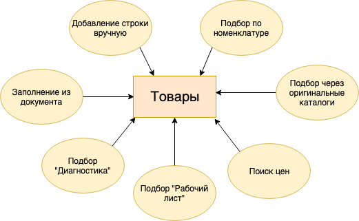

Соотнесение способа наполнения с вызовом функции:

| Способ наполнения | Вызов функции |
| --- | --- |
| Добавление строки вручную | 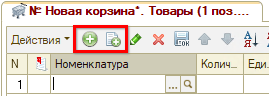 |
| Подбор по номенклатуре | 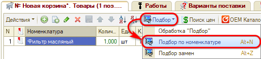 |
| Поиск цен | 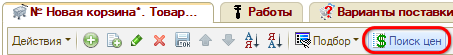 |
| Подбор через оригинальные каталоги | 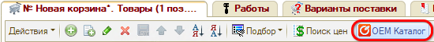 |
| Заполнение из документа | 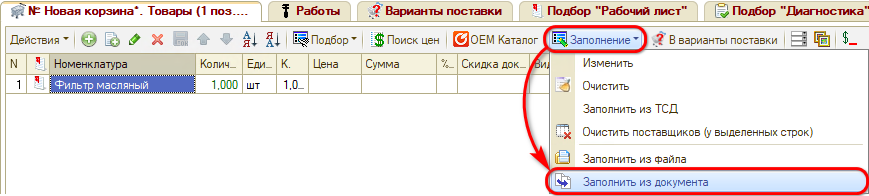 |
| Подбор «Рабочий лист» | см. [Подбор «Рабочий лист»](#подбор-рабочий-лист) |
| Подбор «Диагностика» | см. [Подбор «Диагностика»](#подбор-диагностика) |

#### Страница «Работы»

Представляет собой табличную часть с подобранными автоработами. Данные со страницы можно распечатать на панели действий и предоставить клиенту или добавить в документ.

Подбор работ осуществляется с помощью Подбора **«Автоработы»**, расположенного на панели «Информация»:

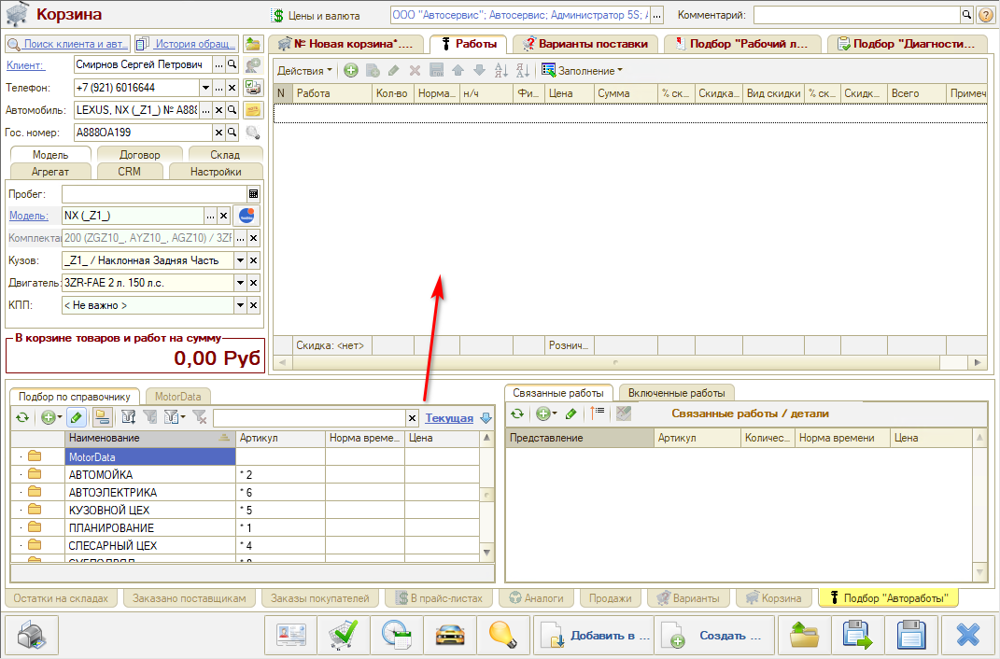

Поиск работ в Подборе «Автоработы» происходит по частичному совпадению:

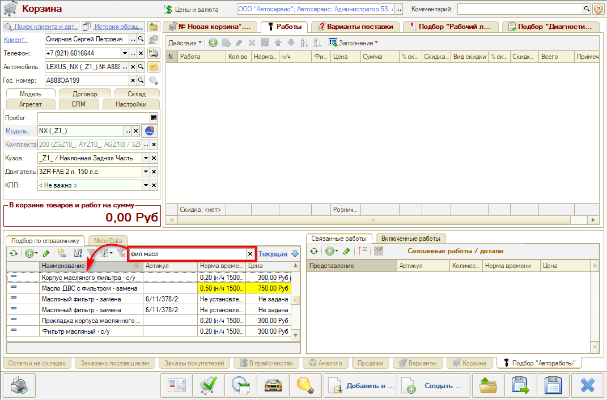

Найденная авторабота в Подборе «Автоработы» добавляется в Корзину двойным кликом левой клавиши мыши.

При условии настроенной интеграции возможен подбор работ по данным MotorData (см. [статью](https://www.5systems.ru/help/integraciya-s-motordata)).

#### Страница «Варианты поставки»

Варианты поставки предназначены для создания нескольких предложений поставки по товару для согласования с клиентом. После согласования выбранный вариант поставки переносится в Корзину и отображается на странице «Товары».

Способы наполнения страницы «Варианты поставки»:

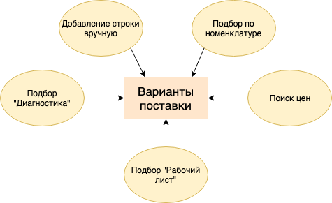

Наполнение производится по аналогии со страницей «Товары».

В процессе подбора предложений по товару, например в поиске цен, через меню действий предлагается сохранить товар как вариант поставки:

После сохранения в качестве варианта поставки товар будет отображаться на странице «Варианты поставки» панели «Товары и работы» и на вкладке «Варианты поставки» панели «Информация».

Предложение в Корзине можно перенести в вариант поставки из командного меню:

### 4. Панель «Информация»

На панели **«Информация»** представлена детализированная информация по товару или работе из активизированной строки панели «Товары и работы».

Информация разбита на вкладки:

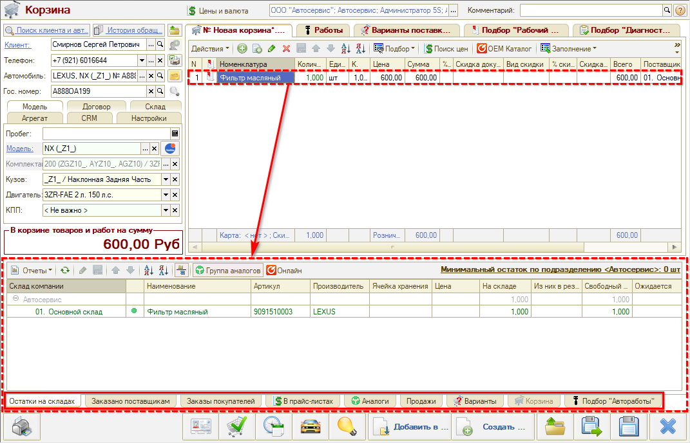

1. **Остатки на складах** — представлены свободные остатки на складах компании по товарной позиции.
2. **Заказано поставщикам** — представлены все заказы поставщикам по товарной позиции. По умолчанию отображаются заказы с остатками (активирована кнопка «Только остатки» командной панели).
3. **Заказы покупателей** — представлены все заказы покупателей по товарной позиции с возможностью резервировать товар, снять с резерва, отменить заказ или отдать заказ.
4. **В прайс-листах** — представлены все прайс-листы, в которых найдена товарная позиция.
5. **Аналоги** — представлены аналоги по товарной позиции.
6. **Продажи** — отчет по продажам товарной позиции.
7. **Варианты поставки** — представлены предложения по товарной позиции, которые находятся на странице «Варианты поставки» текущей корзины.
8. **Корзина** — представлены предложения по товарной позиции, которые находятся на странице «Товары» текущей корзины.
9. **Подбор «Автоработы»** — представлены связанные работы/детали.

### 5. Панель действий

После добавления товаров или работ в Корзину можно распечатать все для клиента и сохранить или выполнить одно из возможных действий:

| Кнопка | Наименование | Описание |
| --- | --- | --- |
|  | Перейти к АРМ «Клиенты и автомобили» | Откроется АРМ «Клиенты и автомобили» в контексте клиента из Корзины |
|  | Перейти в помощник оформления «Заказ покупателя» | Откроется помощник оформления заказа покупателя |
| 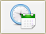 | Перейти к АРМ «Запись на ремонт» | Откроется АРМ «Запись на ремонт» в контексте клиента из Корзины |
|  | Создать заказ-наряд и перейти к АРМ «Машинозаезд» | Откроется АРМ «Машинозаезд» в контексте клиента из Корзины |
|  | Сохранить все выбранные позиции как рекомендации для автомобиля | См. [Работа с рекомендациями](https://www.5systems.ru/help/rabota-s-rekomendaciyami) |
| 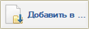 | Добавить в … | Добавить подобранные товары или работы в один из документов |
|  | Создать… | Создать документ для заполненного клиента и подобранных товаров или работ |

**Внимание!** Если по товарам или работам в Корзине создается документ, то товары/работы, сохраненные в документе, удаляются из Корзины.

## Подбор «Рабочий лист»

**Подбор «Рабочий лист»** — инструмент подбора товаров и работ с целью продажи их клиенту. Представляет собой перечень наборов/деталей, разбитых на разделы:

1. **Рабочий лист Клиента** — отображается, если выбран клиент в параметрах.
2. **Рабочий лист Автомобиля** — отображается, если выбран автомобиль в параметрах. Набор деталей будет сохранен по данному автомобилю.
3. **Детали для Модели** — отображается, если выбрана модель автомобиля в параметрах.

### Рабочий лист Клиента и Автомобиля

По Клиенту или Автомобилю добавляются и хранятся подобранные наборы деталей:

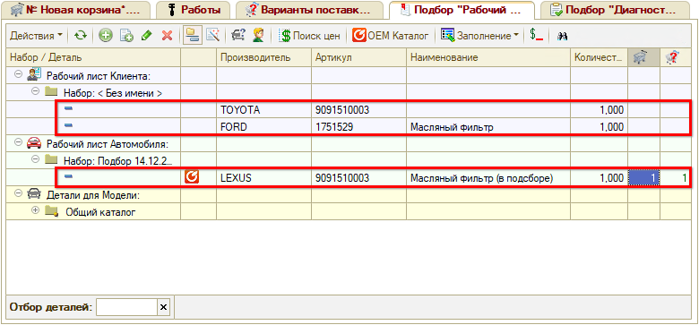

Отображаются все ранее созданные наборы для Клиента или Автомобиля; удалить набор может только автор — пользователь, сохранивший набор, или пользователь с правами редактирования всех рабочих листов.

### Добавление набора в Рабочий лист

Добавить набор деталей в Рабочий лист можно следующими способами:

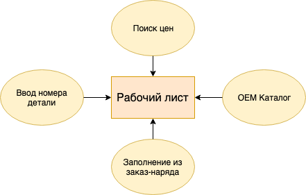

#### Ввод номера детали

Для ввода номера детали необходимо выполнить следующие действия:

1. Активизировать строку **«Рабочий лист Клиента»** или **«Рабочий лист Автомобиля»**.
2. Нажать на кнопку **«Добавить»** командной панели.
3. В форме ввода номера детали отредактировать название набора деталей при необходимости, заполнить данные о детали и нажать на кнопку **«Ок»**:

   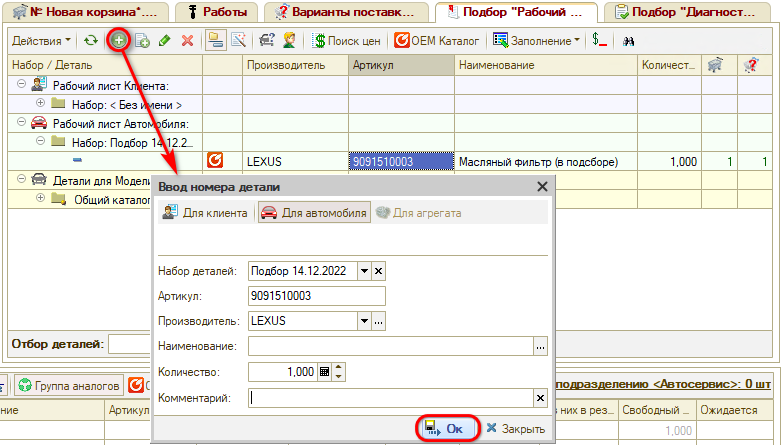

Добавить деталь можно и в созданный набор деталей. Для этого нужно активизировать строку с набором и нажать на кнопку **«Добавить»** командной панели или в окне ввода номера детали выбрать ранее созданный набор деталей.

#### Поиск цен

Для поиска цен по детали необязательно добавлять деталь в Рабочий лист. Можно найти деталь непосредственно в Поиске цен. Для этого необходимо выполнить следующие действия:

1. Активизировать строку **«Рабочий лист Клиента»** или **«Рабочий лист Автомобиля»**.
2. Нажать на кнопку **«Поиск цен»** командной панели.
3. Ввести номер детали в поле поиска и осуществить поиск.
4. Добавить подходящий вариант поставки в Корзину:

   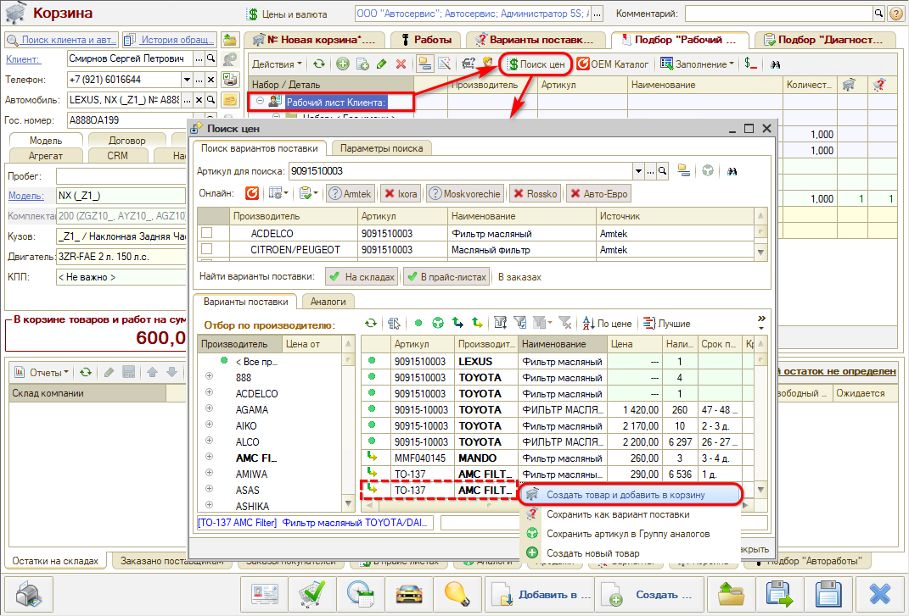

При добавлении в Корзину неоригинальной детали (аналог запрошенной) в рабочем листе автоматически создается набор с оригинальной (запрашиваемой) деталью:

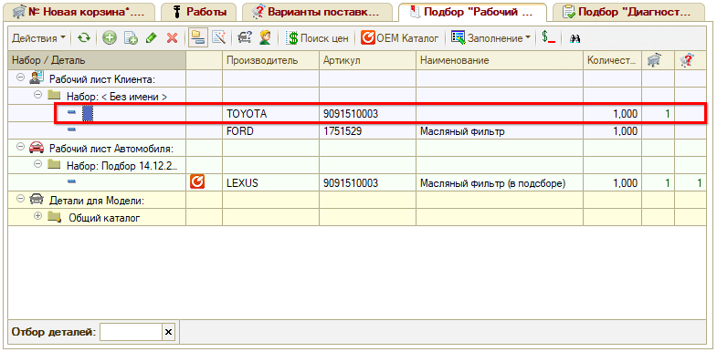

#### OEM Каталог

Деталь можно найти в оригинальных каталогах и добавить ее в набор рабочего листа. Для этого необходимо выполнить следующие действия:

1. Активизировать строку **«Рабочий лист Автомобиля»** или c подбором по Автомобилю.
2. Нажать на кнопку **«OEM Каталог»** командной панели.
3. Выбрать каталог, идентифицированный ранее для автомобиля, или создать новую идентификацию Автомобиля:

   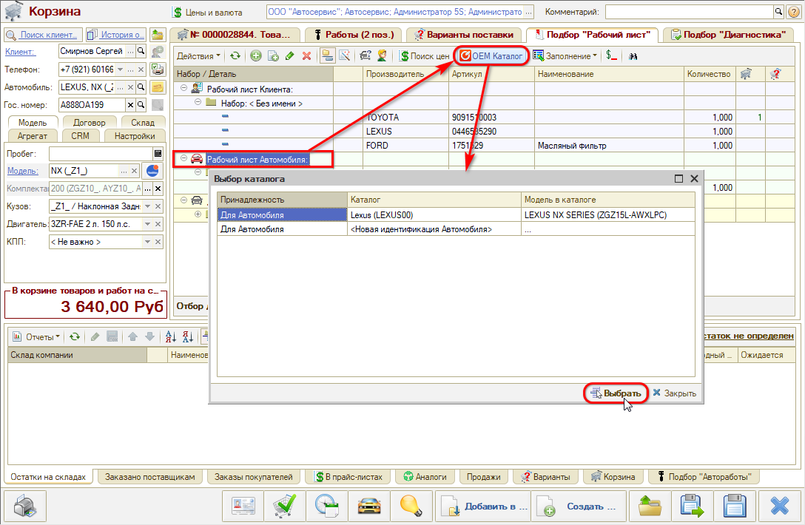

4. Выбрать деталь в оригинальных каталогах.
5. Дважды кликнуть по строке с деталью для вызова меню действий и выбрать пункт **«Записать в рабочий лист»**:

   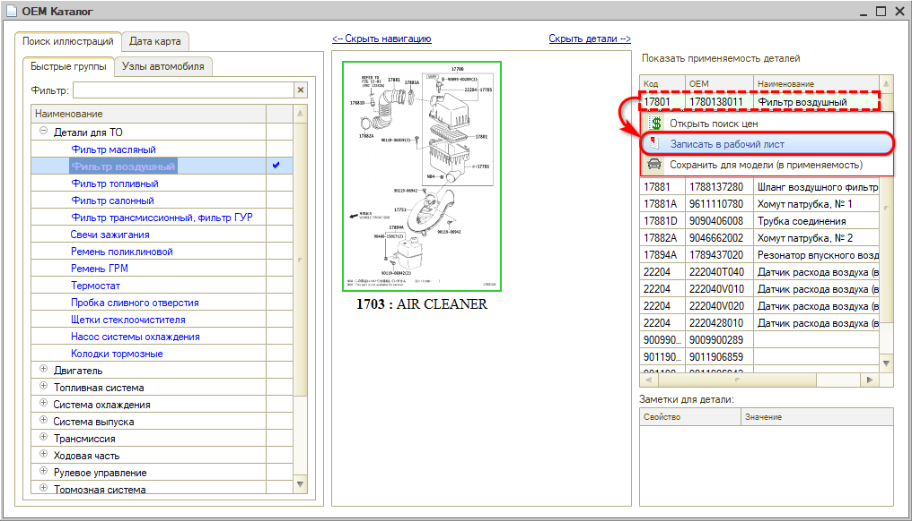

6. В окне ввода наименования подбора ввести новое наименование или выбрать созданный ранее подбор и нажать на кнопку **«Ок»**:

   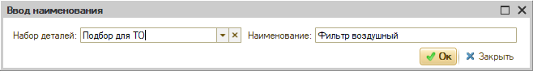

7. Закрыть окно с OEM каталогом.
8. Убедиться, что выбранная деталь появилась в Рабочем листе:

   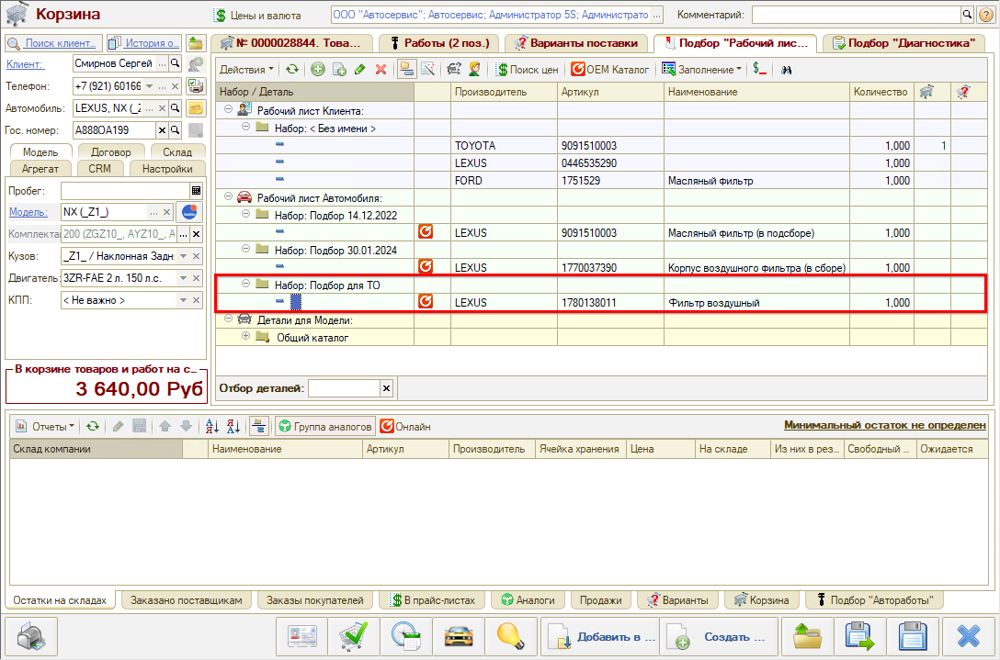

#### Заполнение из Заказ-наряда

Добавить детали в Рабочий лист можно из Заказ-нарядов, созданных для Автомобиля. Для этого необходимо выполнить следующие шаги:

1. Нажать на кнопку **«Заполнить из заказ-нарядов Автомобиля»**:

   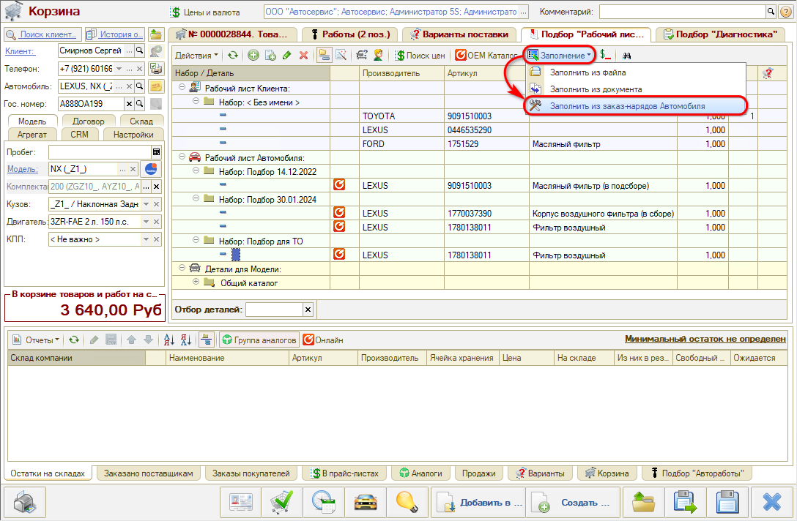

2. Убрать ненужные детали из добавленных наборов.

Добавляются все детали из всех Заказ-нарядов, сгруппированные по наборам. Каждый созданный набор деталей соотносится с товарами из Заказ-наряда. В наименовании созданного набора отображается вид ремонта из Заказ-наряда:

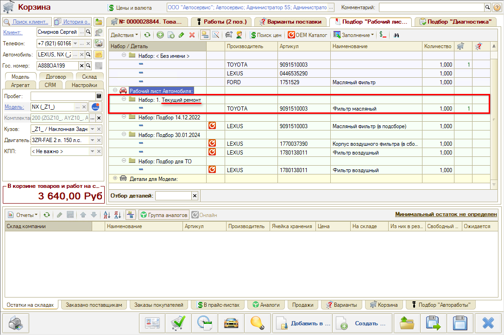

### Добавление товаров в Корзину из Рабочего листа

Из созданного набора в Рабочем листе можно добавить товары в Корзину, используя:

1. Поиск цен.
2. Панель «Информация».
3. Остатки в строке Рабочего листа.

#### Поиск цен

По строке детали Рабочего листа можно перейти в обработку «Поиск цен» из командного меню и добавить подходящий вариант поставки в Корзину.

#### Панель «Информация»

По строке детали Рабочего листа можно видеть сопутствующую информацию на панели «Информация». Из любого раздела панели «Информация» предусмотрена возможность добавить товар в Корзину. Например, если есть подходящий вариант на вкладке «В прайс-листах», достаточно двойным кликом мыши по строке вызвать меню действий и добавить товар в Корзину:

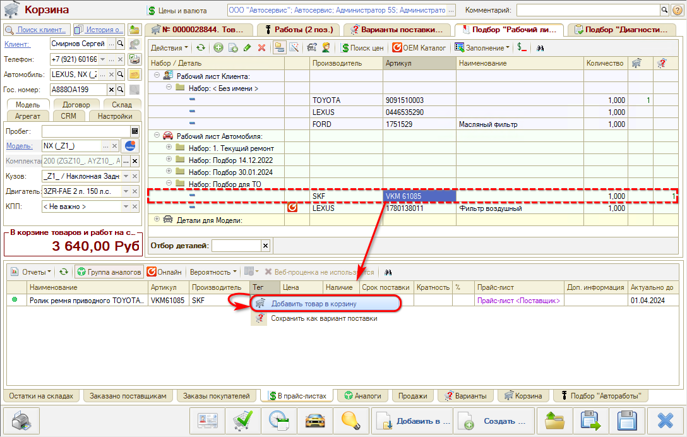

#### Остатки в строке Рабочего листа

В табличной части Рабочего листа можно отобразить остатки на складах. Для этого нужно выбрать колонки **«Остаток»** и **«Другие склады»** в настройках списка:

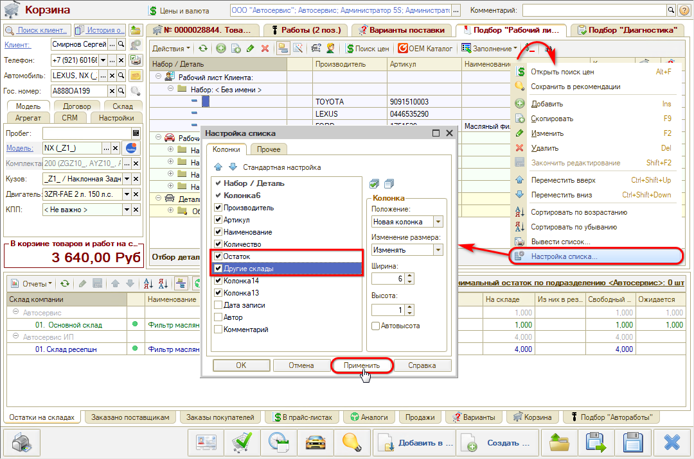

В колонке «Остаток» отображаются остатки на складе, выбранном на вкладке «Склад» в параметрах Корзины. В колонке «Другие склады» отображаются остатки на остальных складах. Все остатки считаются с учетом аналогов для детали.

По остаткам, отображаемым в табличной части, можно добавить деталь в корзину. Для этого необходимо выполнить следующие действия:

1. Дважды кликнуть мышью на ячейку с остатком.
2. Выбрать товар со склада.
3. В окне «Добавление…» нажать на кнопку **«В корзину»**.

Товары, добавленные в Корзину из Рабочего листа, помечаются соответствующей пиктограммой:

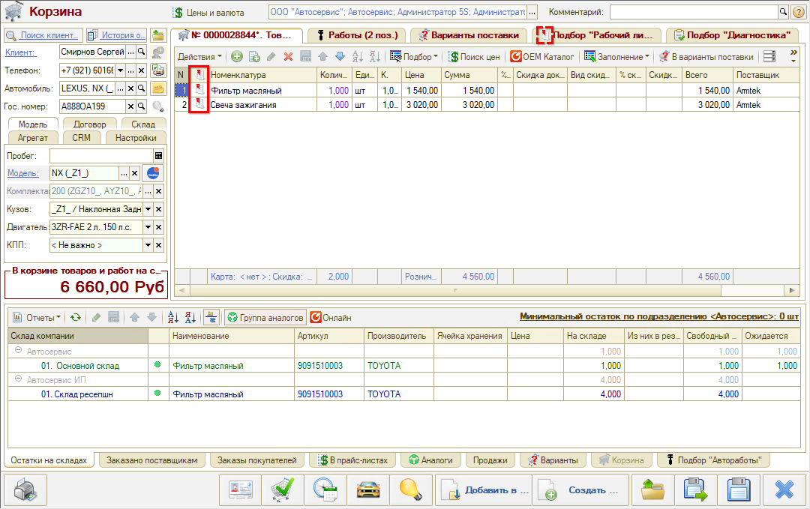

### Быстрый просмотр товаров в Корзине и Вариантах поставки

Если предложения с деталью в Рабочем листе есть в Корзине, то в колонке **«Выбрано в корзине»** отображается их количество. По двойному клику мыши на ячейке с количеством активизируется вкладка «Корзина» панели «Информация»:

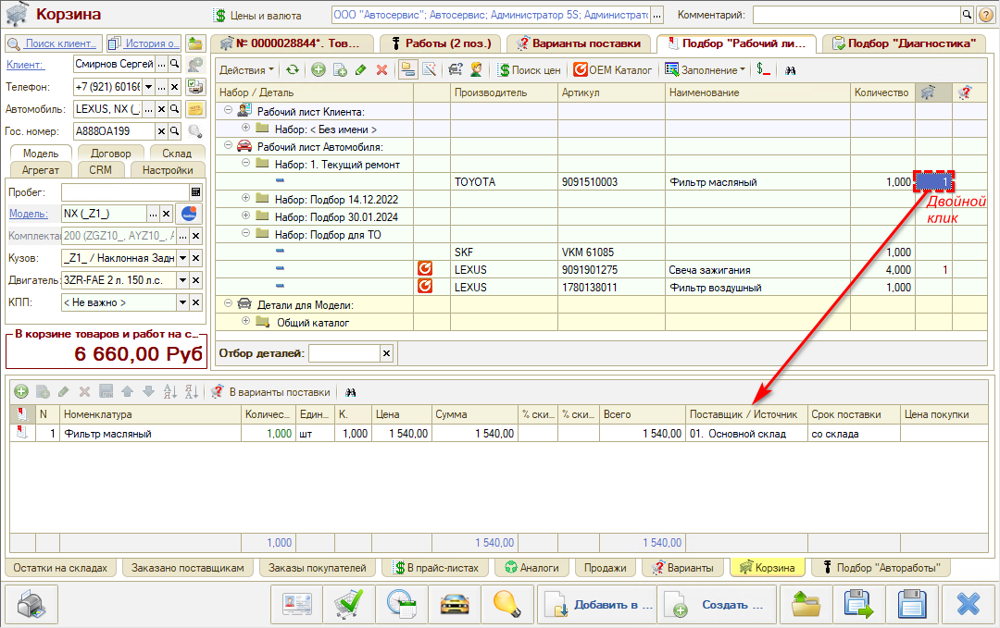

Если предложения с деталью в Рабочем листе сохранены как Варианты поставки, то в колонке **«Выбрано в вариантах поставки»** отображается их количество. По двойному клику мыши на ячейке с количеством активизируется вкладка «Варианты поставки» панели «Информация»:

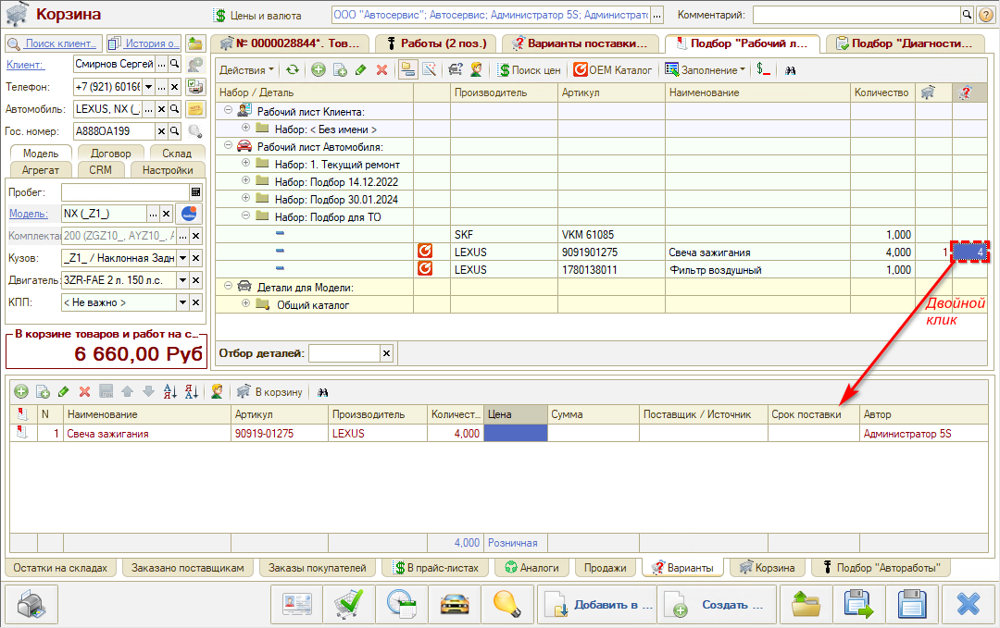

### Детали для модели (Применяемость)

Раздел по деталям для модели предназначен для заполнения применяемости. См. статью [Работа с применяемостью](https://www.5systems.ru/help/rabota-s-primenyaemostyu).

## Подбор «Диагностика»

Подбор **«Диагностика»** предназначен для обработки результатов проведенной диагностики автомобилей с помощью диагностических анкет. См. статью [Диагностические анкеты](https://www.5systems.ru/help/diagnosticheskie-ankety).

## Видео по теме

### 1. Видеоинструкции по теме «АРМ Корзина»

1. [Назначение и интерфейс АРМ «Корзина»](https://edu.5systems.ru/video/Korzina/Korzina-1_Naznachenie_i_interfeys.mp4)
2. [Как подбирать запасные части в АРМ Корзина](https://edu.5systems.ru/video/Korzina/Korzina-2_Podbor_zapchastey.mp4)
3. [Как добавить варианты поставки в Корзину](https://edu.5systems.ru/video/Korzina/Korzina-3_Varianty_postavki.mp4)
4. [Информационные вкладки Корзины](https://edu.5systems.ru/video/Korzina/Korzina-4_Vkladki.mp4)
5. [Как подбирать автоработы в АРМ Корзина](https://edu.5systems.ru/video/Korzina/Korzina-5_Podbor_avtorabot.mp4)
6. [Как создать автомобиль в Корзине](https://edu.5systems.ru/video/Korzina/Korzina-6_Sozdanie_avtomobilya.mp4)
7. [Как распечатать Корзину или отправить в мессенджер](https://edu.5systems.ru/video/Korzina/Korzina-7_Pechat_ili_otpravka_v_messendjer.mp4)
8. [Как выгрузить Корзину в другие АРМ](https://edu.5systems.ru/video/Korzina/Korzina-8_Vygruzka_v_drugie_ARM.mp4)
9. [Как создать документы на основании Корзины](https://edu.5systems.ru/video/Korzina/Korzina-9_Sozdanie_dokumentov_iz_Korziny.mp4)
10. [Помощник оформления заказа покупателя в АРМ Корзина](https://edu.5systems.ru/video/Korzina/Korzina-10_Pomoshchnik_oformleniya_Zakaza_pokupatelya.mp4)

### 2. Видеоинструкции по теме «Работа с онлайн-каталогом»

1. [Обзор интерфейса Онлайн-каталога](https://edu.5systems.ru/video/Online_katalog/Online_katalog-1_Obzor_interfeysa.mp4)
2. [Как перейти в Онлайн-каталог](https://edu.5systems.ru/video/Online_katalog/Online_katalog-2_Varianty_perehoda.mp4)
3. [Как идентифицировать автомобиль в Онлайн-каталоге](https://edu.5systems.ru/video/Online_katalog/Online_katalog-3_Identifikaciya_avtomobilya.mp4)
4. [Как найти деталь в Онлайн-каталоге](https://edu.5systems.ru/video/Online_katalog/Online_katalog-4_Poisk_zapchastey.mp4)
5. [Действия с подобранными деталями в Онлайн-каталоге](https://edu.5systems.ru/video/Online_katalog/Online_katalog-5_Obrabotka_rezultatov_poiska.mp4)

---

**Теги:** корзина, АРМ, подбор запчастей, рабочий лист, варианты поставки, поиск цен, OEM каталог, автоработы, онлайн-каталог, применяемость

