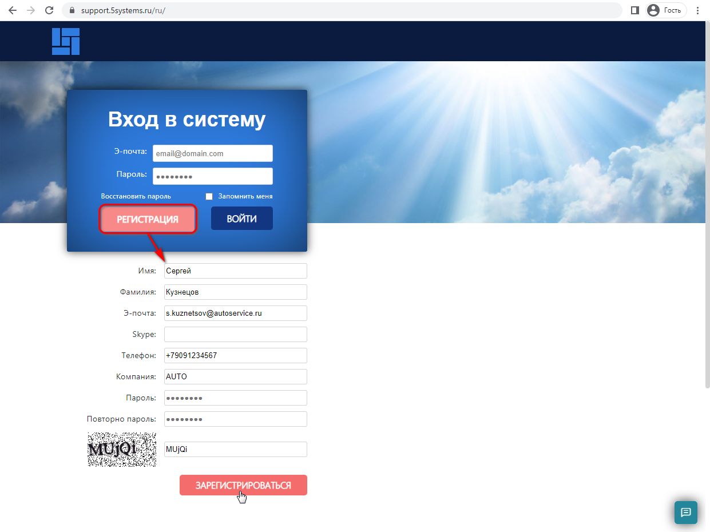
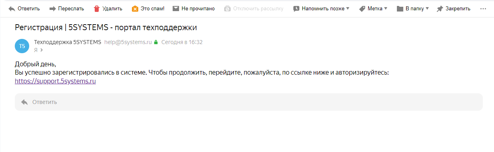
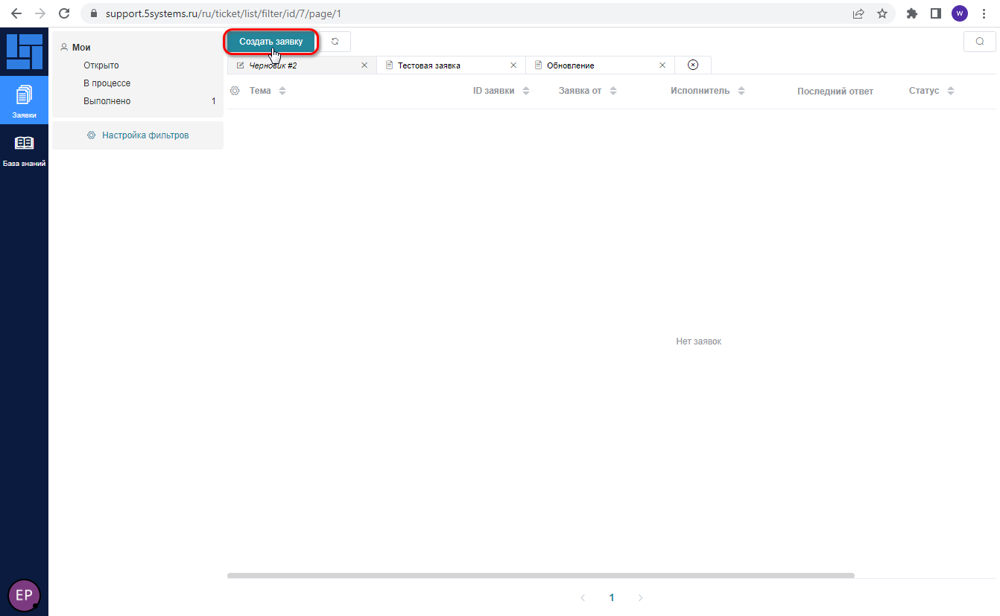
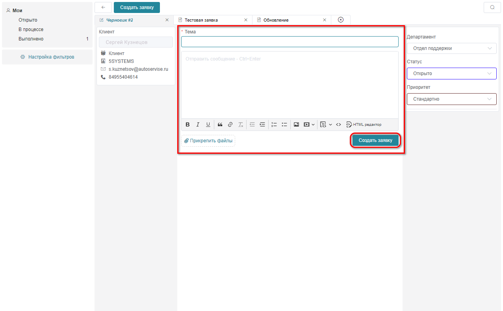

# Как обратиться в техническую поддержку

<table><tr><td><b>Время чтения:</b> 9 мин.</td><td><b>Обновлено:</b> 24.06.2026</td></tr></table>

Источник: https://www.5systems.ru/help/kak-obratitsya-v-tekhnicheskuyu-podderzhku

## Содержание

1. [Введение](#введение)
2. [Рекомендации по составлению запроса в техподдержку](#рекомендации-по-составлению-запроса-в-техподдержку)
3. [Способы обращения в техподдержку](#способы-обращения-в-техподдержку)
   - [1. Через портал](#1-через-портал)
   - [2. По e-mail](#2-по-e-mail)
   - [3. Через Telegram-бот](#3-через-telegram-бот)
   - [4. Через MAX-бот](#4-через-max-бот)
   - [5. По телефону](#5-по-телефону)
4. [График работы техподдержки](#график-работы-техподдержки)
5. [Обращение в аварийных ситуациях](#обращение-в-аварийных-ситуациях)

## Введение

Прежде чем составлять запрос в техподдержку, проверьте, нет ли готового ответа на Ваш вопрос в [Базе знаний](../../../) или в [Уроках](../../../../lessons/) по программе. Большую часть ответов на вопросы по работе с функционалом программы можно найти там. Для удобства можно воспользоваться поиском.

Если Вы не нашли нужную информацию в [Базе знаний](../../../), а также если проблема значимая или неоднозначная, то смело пишите в техническую поддержку 5SYSTEMS, где Вам помогут разобраться в программе и проконсультируют.

## Рекомендации по составлению запроса в техподдержку

1. *Сформулируйте суть проблемы* 
   Опишите свою проблему по существу, отталкиваясь от конкретики и фактов. Укажите, о каком функционале идет речь, как воспроизводится проблема, подробно приведите все необходимые данные.
2. *Создавайте отдельные тикеты на разные вопросы* 
   Если у вас несколько вопросов на разные темы, лучше создать для каждого вопроса отдельный тикет. Это ускорит процесс, так как для решения разных вопросов могут быть задействованы разные специалисты – каждый сможет заняться своим отдельным вопросом.
3. *Не создавайте несколько запросов по одной и той же проблеме* 
   Это создаст путаницу в тикетах и увеличит время обработки запроса.

### Как ускорить ответ?

Пожалуйста, предоставьте всю информацию, необходимую для ответа. Для того чтобы избежать дополнительных вопросов, рекомендуем:

1. При создании обращения укажите все источники, где вы искали и не нашли ответ. Это избавит вас от получения ссылок вместо ответа.
2. Предоставьте необходимую информацию. Расскажите:
   - о ваших действиях, которые привели к возникновению вопроса – это даст нам возможность воспроизвести ситуацию;
   - что вы ожидали увидеть – иногда нормальная работа программы воспринимается как ошибка;
   - что вы увидели, приложите скриншот, приведите полный код ошибки – обычно это дает информацию о ее причинах.
3. Не приводите в обращении данные, которые не имеют отношения к делу. Определите, что именно является проблемой и четко ее сформулируйте. Избыток информации может затянуть решение.

## Способы обращения в техподдержку

Есть несколько способов обратиться в техническую поддержку.

### 1. Через портал

Основным и самым удобным способом обращения в нашу техподдержку является обращение ***через портал***. 
Адрес портала техподдержки 5SYSTEMS: [***https://support.5systems.ru***](https://support.5systems.ru)

#### Регистрация

Сначала необходимо зарегистрироваться на портале:

На указанный адрес электронной почты придет письмо, содержащее ссылку для активации аккаунта:

Следует перейти по ссылке и авторизоваться на портале.

Если под полем ввода электронной почты выходит уведомление: *"Введённая э-почта уже используется другим пользователем!"*, значит, регистрация уже была пройдена ранее, и следует авторизоваться через кнопку "Вход". Если Вы не помните пароль, нажмите на ссылку "Восстановить пароль" – пароль будет сброшен, а на указанную электронную почту придет письмо, содержащее ссылку для смены пароля.

При последующих входах на портал нужно будет ввести e-mail и пароль, указанные при регистрации, и нажать кнопку "Войти". Если установить галочку "Запомнить меня", то учетные данные будут заполняться автоматически.

#### Создание заявки

Для перехода к форме отправки запроса нужно нажать кнопку "Создать заявку":

В открывшемся окне следует написать тему обращения, в тексте заявки подробно изложить суть проблемы (см. [*рекомендации*](#рекомендации-по-составлению-запроса-в-техподдержку) выше), также можно прикрепить скриншоты, затем нажать кнопку "Создать заявку":

*Примечание:* Статус заявки трогать не следует – специалисты 5SYSTEMS сами изменяют его.

### 2. По e-mail

Можно написать письмо на электронную почту: [*help@5systems.ru*](mailto:help@5systems.ru)

При обращении через электронную почту автоматически создается задача на портале техподдержки, где в качестве комментария прикрепляется отправленное сообщение. При этом:

- комментарии исполнителей задачи приходят в ответ на сообщения на электронную почту,
- уточнения (новые сообщения) по открытой задаче сохраняются в виде новых комментариев к этой задаче,
- после выполнения задачи исполнителем информация о завершении работ приходит в виде ответного сообщения.

### 3. Через Telegram-бот

Еще один способ обращения – написать в Telegram: [*http://t.me/Help5SBot*](http://t.me/Help5SBot)

При обращении через Telegram-бота автоматически формируются заявки на портале от Вашего имени. Зайдя на портал, Вы сможете просмотреть историю Ваших обращений.

### 4. Через MAX-бот

Также для обращения в техподдержку 5SYSTEMS можно написать в Max: [https:/max.ru/id3525450990_3_bot](http://max.ru/id3525450990_3_bot).

***Max-бот "Help5S"** с возможностями ИИ* поможет *найти готовые ответы* на большинство вопросов в статьях на Базе знаний.

Если нужная информация не будет найдена, а также если проблема сложная и неоднозначная, можно *создать заявку* с помощью бота – при обращении через Max автоматически формируются заявки на портале от имени Вашей компании.

При наличии уже открытых заявок бот позволяет *просматривать* их список, переключаться на нужную заявку и *вести переписку* по ней.

*Подробнее см. статью "[Бот техподдержки в Max](../Бот%20техподдержки%20в%20Max/bot-tekhpodderzhki-v-max.md)".*

### 5. По телефону

*Предпочтительными* являются *письменные способы обращения* в техподдержку. Обращения ***по телефону*** техподдержка готова принимать ***исключительно в аварийный ситуациях** – см. [ниже](#обращение-в-аварийных-ситуациях).*

## График работы техподдержки

Техподдержка 5SYSTEMS работает по **графику 5/2 с 08:00 до 19:00** МСК.

Прямая связь с техподдержкой осуществляется ***в указанные часы работы** **с** **понедельника по пятницу**, за исключением праздничных дней РФ.*

*Оставлять заявки* можно в любое время, включая выходные и праздники, через приоритетный для вас канал связи.

При возникновении *аварийной ситуации* вы можете [*установить "Аварийный" приоритет*](#обращение-в-аварийных-ситуациях) в обращении.

## Обращение в аварийных ситуациях

***При возникновении** **аварийной ситуации** вы можете **установить "Аварийный" приоритет** в обращении через любой из каналов связи.*

***Аварийными ситуациями*** считаются любые проблемы с сервером и службами, связанными с 1С – например, проблемы с входом в 1С, – а также зависания.

Аварийный приоритет в обращении предусмотрен *только для пользователей облачной версии* программы. Если сервер не наш, то описанные выше проблемы решает системный администратор владельца сервера.

***Для обращения при аварийной ситуации:***

1. *По телефону:*
   - *в часы работы техподдрежки **с 8:00 до 19:00 по МСК*** позвоните по телефону 8-800-100-3742.
   - *в нерабочее время, выходные и праздничные дни:* выберите в голосовом меню цифру, соответствующую аварийному вопросу, озвучьте свою проблему и положите трубку.
2. *В электронном письме* – напишите сообщение, содержащее словосочетание "Мой вопрос Аварийного приоритета";
3. *В Telegram* – напишите первое сообщение, далее следуйте инструкциям бота: нажмите кнопку “Мой вопрос аварийный”, подробно опишите вопрос;
4. *В Max* – нажмите кнопку меню "Создать заявку" и следуйте инструкциям бота: выберите приоритет "Аварийный" и подробно опишите вопрос;
5. *На портале* – выберите вручную приоритет “Аварийный” при создании заявки или после создания.

---

**Теги:** прочее, техподдержка, портал, e-mail, telegram, max, телефон, аварийная ситуация

