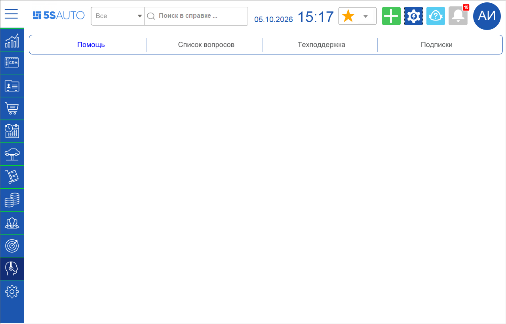
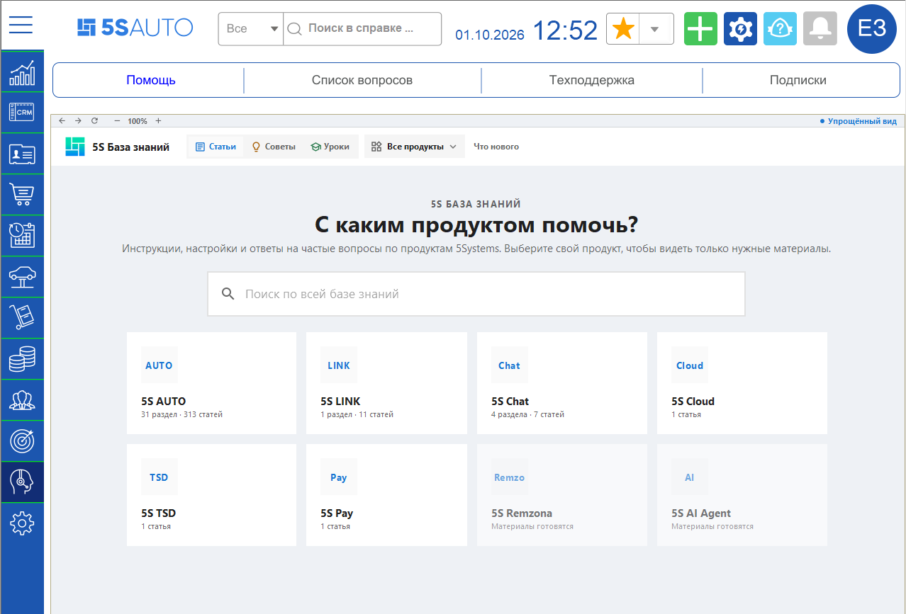
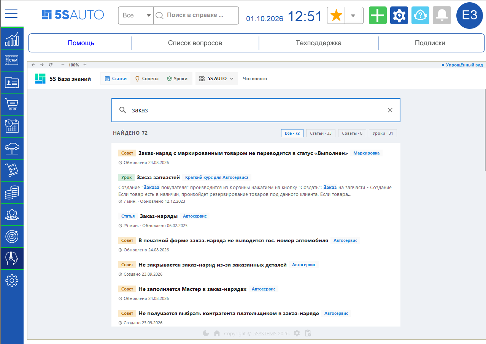
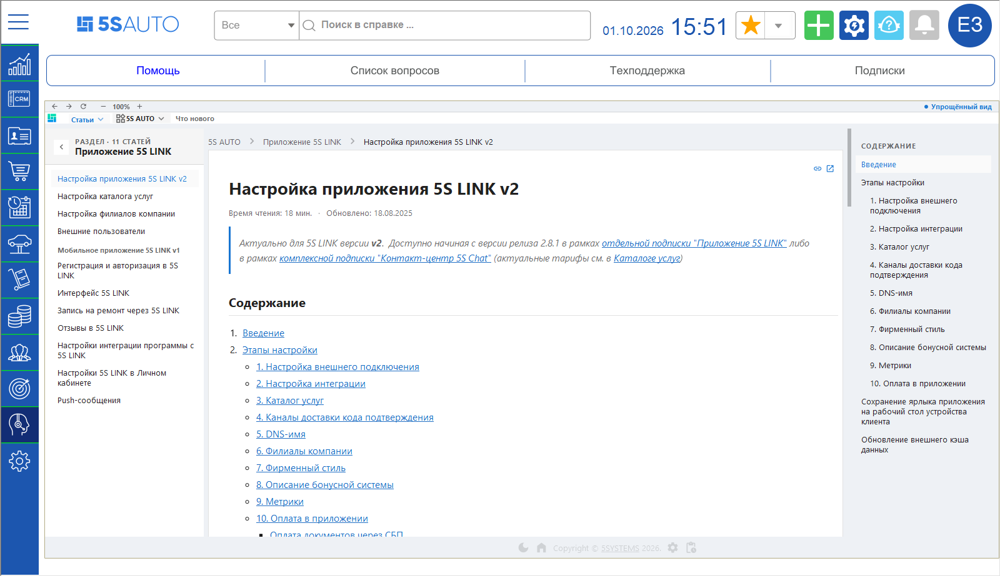

# Переход к Базе знаний из программы

<table><tr><td><b>Время чтения:</b> 3 мин.</td><td><b>Создано:</b> 06.10.2026</td></tr></table>

> *Актуально начиная с версии релиза 5S AUTO **2.8.5**.*

## Содержание

- [Введение](#введение)
- [Как открыть Базу знаний в программе](#как-открыть-базу-знаний-в-программе)
- [Работа с Базой знаний](#работа-с-базой-знаний)

## Введение

Базу знаний 5SYSTEMS можно открыть прямо в программе 5S AUTO, не переходя в браузер. В программе доступны те же статьи, советы и уроки, что и на сайте [kb.5systems.ru](https://kb.5systems.ru), – с выбором продукта, разделами и поиском.

## Как открыть Базу знаний в программе

В боковом меню выберите раздел ***«Техподдержка»*** – откроется вкладка ***«Помощь»***.

Подробнее о разделах бокового меню и верхней панели – в статье «[Структура интерфейса 5S AUTO](https://kb.5systems.ru/articles/5s-auto/crm/struktura-interfeysa-5s-auto)».

## Работа с Базой знаний

На вкладке ***«Помощь»*** открывается главная страница Базы знаний. Выберите свой продукт, например *5S AUTO*, – после этого в разделах будут видны только материалы по выбранному продукту.

Над Базой знаний расположена панель с кнопками ***«Назад»***, ***«Вперед»*** и ***«Обновить»***, масштабом страницы (кнопки ***«−»*** и ***«+»***) и переключателем ***«Упрощенный вид»***.

Чтобы найти нужный материал, начните вводить запрос в строку поиска: результаты появляются сразу во время ввода. Их можно отфильтровать по статьям, советам и урокам.

Статья открывается здесь же, на вкладке ***«Помощь»***: слева – список статей раздела, справа – содержание статьи.

О работе с сайтом Базы знаний – в советах «[Как перейти в Базу знаний](https://kb.5systems.ru/tips/tekhpodderzhka/kak-pereyti-v-bazu-znaniy)» и «[Как быстро найти нужную статью на Базе знаний](https://kb.5systems.ru/tips/tekhpodderzhka/kak-bystro-nayti-nuzhnuyu-statyu-na-baze-znaniy)».

---

**Теги:** База знаний, справка, помощь, техподдержка, поиск в справке, статьи, советы, уроки
