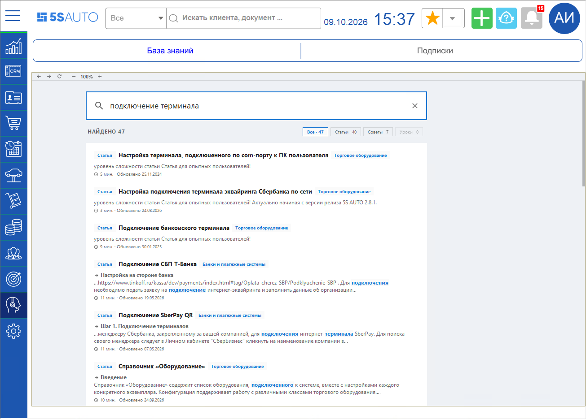
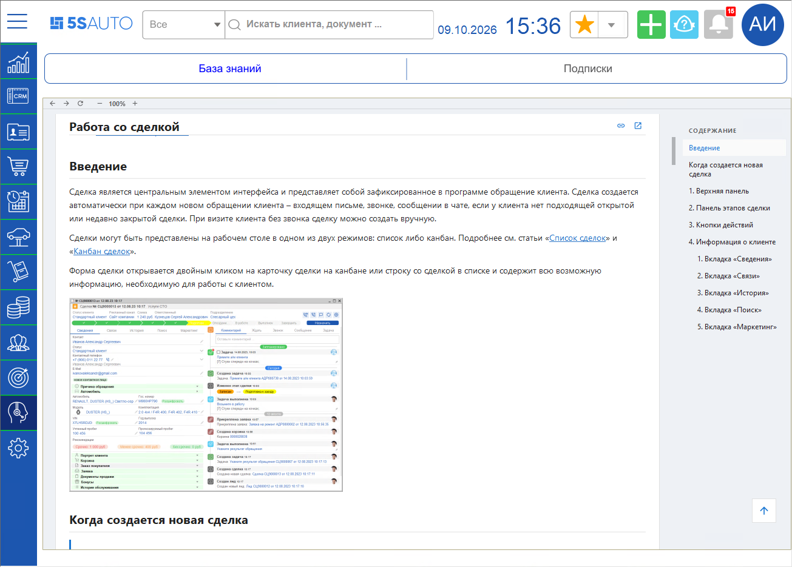

# Переход к Базе знаний из программы

<table><tr><td><b>Время чтения:</b> 3 мин.</td><td><b>Обновлено:</b> 06.10.2026</td></tr></table>

> *Актуально начиная с версии релиза 5S AUTO **2.8.5**.*

> 🛠 Комментарий для черновика: *Реализовано в конфигурации версии 2.8.4.57. Черновик переработан 09.10.2026 по описанию функционала (составлено по коду конфигурации от 07.10.2026 и обработки «Рабочий стол» от 08.10.2026, в программе не проверялось). Все скриншоты – из прежней версии (вкладка «Помощь», кнопка с шестеренкой в шапке, «Поиск в справке …») – переснять.*

## Содержание

- [Введение](#введение)
- [База знаний на рабочем столе](#база-знаний-на-рабочем-столе)
- [Панель «Техподдержка»](#панель-техподдержка)
- [Поиск по Базе знаний из документа](#поиск-по-базе-знаний-из-документа)

## Введение

Базу знаний 5SYSTEMS можно открыть прямо в программе 5S AUTO, не переходя в браузер. В программе доступны те же статьи, советы и уроки, что и на сайте [kb.5systems.ru](https://kb.5systems.ru), – с выбором продукта, разделами и поиском.

Открыть Базу знаний можно тремя способами:

- в разделе ***«Техподдержка»*** рабочего стола – на всю рабочую область;
- в панели ***«Техподдержка»*** – справа, не уходя из текущего раздела;
- кнопкой ***«Поиск в базе знаний»*** в форме документа – сразу с результатами поиска по этому виду документа.

> [!NOTE]
> Для работы с Базой знаний нужен доступ в интернет к сайту kb.5systems.ru. Без доступа область Базы знаний останется пустой или покажет ошибку браузера.

## База знаний на рабочем столе

В боковом меню выберите раздел ***«Техподдержка»*** и подвкладку ***«База знаний»*** – откроется главная страница Базы знаний.

Подробнее о разделах бокового меню и верхней панели – в статье «[Структура интерфейса 5S AUTO](https://kb.5systems.ru/articles/5s-auto/crm/struktura-interfeysa-5s-auto)».

Выберите свой продукт, например *5S AUTO*, – после этого в разделах будут видны только материалы по выбранному продукту.

Над Базой знаний расположена панель с кнопками ***«Назад»***, ***«Вперед»*** и ***«Обновить»***, масштабом страницы (кнопки ***«−»*** и ***«+»***) и переключателем ***«Упрощенный вид»***.

> 🛠 Комментарий для черновика: *Осталась ли панель «Назад / Вперед / Обновить», масштаб и «Упрощенный вид»? В описании сказано только, что сайт открывается в режиме для 1С – без шапки, боковой панели и подвала. (вопрос еще не задан)*

Чтобы найти нужный материал, начните вводить запрос в строку ***«Поиск по всей базе знаний»*** на странице: результаты появляются сразу во время ввода. Их можно отфильтровать по статьям, советам и урокам.

> [!NOTE]
> Строка поиска в шапке рабочего стола по Базе знаний не ищет – она ищет клиентов и документы, как и в остальных разделах.

Статья открывается здесь же, на подвкладке ***«База знаний»***: слева – список статей раздела, справа – содержание статьи.

Если перейти в другой раздел и вернуться, страница не перезагружается – останется открытой та же статья. Главная страница Базы знаний откроется заново после перезапуска рабочего стола.

О работе с сайтом Базы знаний – в советах «[Как перейти в Базу знаний](https://kb.5systems.ru/tips/tekhpodderzhka/kak-pereyti-v-bazu-znaniy)» и «[Как быстро найти нужную статью на Базе знаний](https://kb.5systems.ru/tips/tekhpodderzhka/kak-bystro-nayti-nuzhnuyu-statyu-na-baze-znaniy)».

## Панель «Техподдержка»

Панель ***«Техподдержка»*** открывается голубой кнопкой со знаком вопроса в шапке рабочего стола – между зеленой кнопкой ***«+»*** и кнопкой уведомлений. Панель появляется у правого края окна, в ней три вкладки:

- ***«Новости»*** – страница *«Что нового»* Базы знаний: новые и обновленные материалы;
- ***«База Знаний»*** – главная страница Базы знаний;
- ***«Тикеты»*** – обращения в техподдержку.

Панель узкая, поэтому сайт в ней показывается в компактном виде.

> 🛠 Комментарий для черновика: *Нужен скриншот панели «Техподдержка» (вкладки «Новости» и «База Знаний»). Подсказку голубой кнопки установить по коду не удалось. На какой вкладке панель открывается по умолчанию – в описании сказано, что на «Новостях», проверить.*

## Поиск по Базе знаний из документа

В формах документов – например, в заказ-наряде – на верхней командной панели есть кнопка с лупой ***«Поиск в базе знаний»***, последняя в ряду кнопок.

**1.** Нажмите кнопку с лупой – откроется окно ***«Поиск»***. В строку поиска автоматически подставляется название вида документа, например *«Заказ-наряд»*. 
**2.** Откройте нужную статью из результатов поиска или измените запрос в строке поиска на странице. 
**3.** Закройте окно кнопкой ***«Закрыть»***.

Поиск идет по всей Базе знаний, а не только по материалам 5S AUTO. Номер документа, клиент и другие данные документа в запрос не передаются.

Окно ***«Поиск»*** в программе одно: если оно уже открыто, при нажатии кнопки в другом документе в нем выполняется новый поиск, а открытая статья закрывается.

> [!NOTE]
> Стандартная кнопка справки со знаком вопроса и клавиша ***F1*** в формах документов по-прежнему открывают встроенную справку программы, а не Базу знаний.

> 🛠 Комментарий для черновика: *Вопросы (вопрос еще не задан):*
> - *На каких формах документов есть кнопка с лупой? В выгрузке от 07.10.2026 единственный вызов процедуры добавления кнопки закомментирован; на снимке экрана разработчика кнопка есть на форме заказ-наряда. По коду кнопка добавляется только в обычном приложении и только на формы с верхней командной панелью (153 из 156 основных форм документов).*
> - *Как открывается окно «Поиск»: свободным окном или прикрепленным к краю экрана, какого размера?*
> - *Куда открываются внешние ссылки со страниц Базы знаний (на другие сайты) – внутри программы или в браузере?*
>
> *Нужны скриншоты: кнопка с лупой в заказ-наряде, окно «Поиск» с результатами.*

> 🛠 Комментарий для черновика: *Техническая информация из описания (для справки, на сайт не выводится):*
> - *Подвкладка «Помощь» раздела «Техподдержка» переименована в «База знаний», подвкладки «Список вопросов» и «Техподдержка» удалены; сохраненные настройки рабочего стола обработчик обновления (_5с_ОбновитьБСАвтоДо_2_8_4_57) исправляет сам. Нужно подтвердить, что у пользователя без сохраненной настройки тоже будут новые подвкладки (макет кнопок по умолчанию еще содержит старые).*
> - *Программа открывает страницы kb.5systems.ru /articles, /whats-new и /articles с запросом в режиме для 1С (без шапки, боковой панели, подвала и входа в учетную запись). Старые источники справки (wiki.5-systems.ru, раздел помощи на 5systems.ru, поиск по форуму) больше не вызываются.*
> - *Из шапки рабочего стола убрана синяя кнопка с шестеренкой рядом с зеленым «плюсом» (ничего не делала); режим «Поиск в справке …» строки поиска убран.*
> - *Отдельных прав и настроек нет.*

---

**Теги:** База знаний, справка, помощь, техподдержка, поиск в справке, поиск в базе знаний, статьи, советы, уроки, панель Техподдержка
