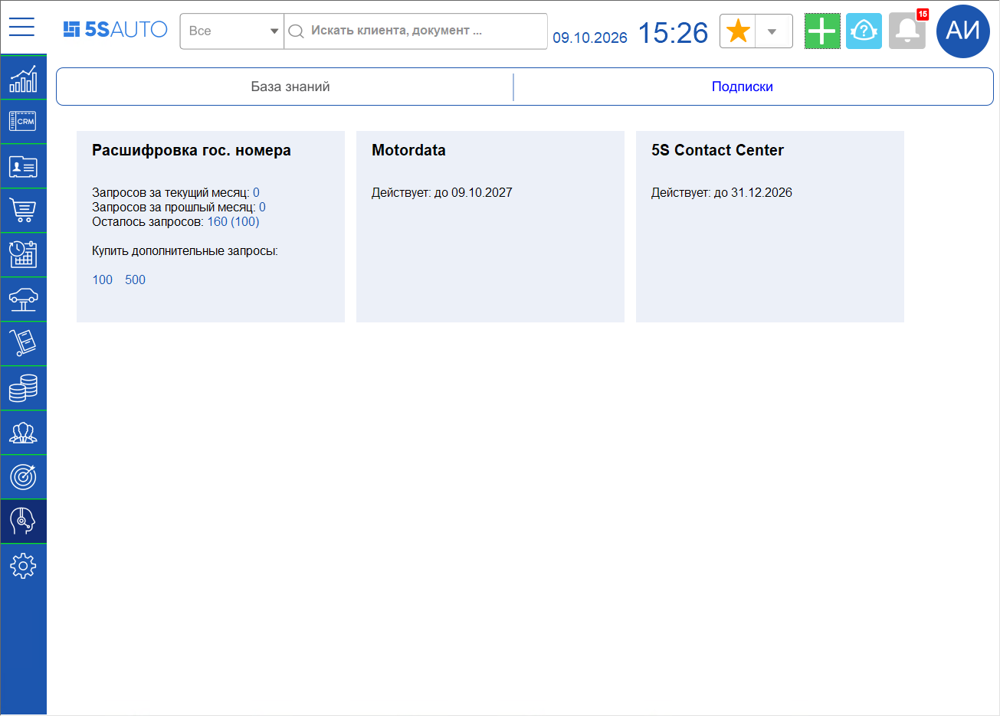
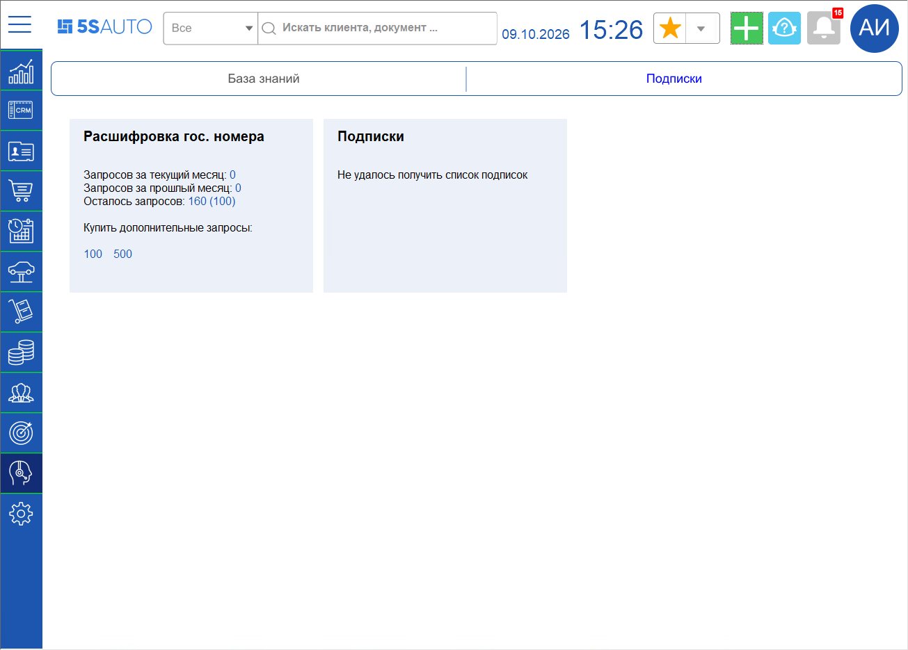

# Подписки компании в программе

<table><tr><td><b>Время чтения:</b> 2 мин.</td><td><b>Создано:</b> 09.10.2026</td></tr></table>

> *Актуально начиная с версии релиза 5S AUTO **2.8.5**.*

> 🛠 Комментарий для черновика: *Реализовано в конфигурации версии 2.8.4.57. Черновик по описанию функционала (составлено по коду, в программе не проверялось). Проверено Катей 09.10.2026: в тестовой базе подписки не получены (сообщение «Не удалось получить список подписок»). Скриншот с карточками собран: основа – база Кати, карточки «Motordata» и «5S Contact Center» – из базы Кати-разработчика, «бессрочно» заменено датами окончания.*

## Содержание

- [Введение](#введение)
- [Где посмотреть подписки](#где-посмотреть-подписки)
- [Карточка подписки](#карточка-подписки)
- [Если подписки не отображаются](#если-подписки-не-отображаются)

## Введение

В программе 5S AUTO можно посмотреть, какие подписки 5SYSTEMS подключены у компании и до какого числа они действуют. Данные о подписках программа получает от сервиса 5SYSTEMS при каждом открытии.

## Где посмотреть подписки

**1.** В боковом меню выберите раздел ***«Техподдержка»***. 
**2.** Откройте подвкладку ***«Подписки»***.

Справа от карточки ***«Расшифровка гос. номера»*** появятся карточки подписок компании – по одной на каждую подписку.

Список подписок запрашивается заново при каждом открытии подвкладки и в программе не сохраняется, поэтому для его просмотра нужен доступ в интернет.

Карточки раскладываются в ряд по ширине окна и при нехватке места переносятся на следующую строку.

> 🛠 Комментарий для черновика: *Проверено 09.10.2026 (база Кати-разработчика, 3 карточки): при сужении окна последняя карточка («5S Contact Center») перешла на нижний ряд, а вторая («Motordata») осталась в первом и обрезана краем окна, внизу – горизонтальная прокрутка. Похоже на недоработку раскладки (по коду раскладка считается один раз при открытии подвкладки). Вертикальной прокрутки по коду нет.*

## Карточка подписки

В карточке подписки указаны:

- ***название подписки*** (тарифа) – например, *«5S Contact Center»* или *«Motordata»*;
- ***срок действия*** – строка *«Действует: до ДД.ММ.ГГГГ»* с датой окончания подписки или *«Действует: бессрочно».*

Других данных в карточке нет, по нажатию на карточку ничего не открывается.

> 🛠 Комментарий для черновика: *«Бессрочно» выводится, когда год окончания больше текущего более чем на 50. Названия тарифов программа выводит так, как их возвращает сервис; в описании сервиса перечислены 5S AUTO Cloud, 5S AUTO Server, Contact Center, Contact Center Avito, Contact Center VK, Motordata, WABA – полный список названий неизвестен. Дата начала, цена, число пользователей и подразделений сервис возвращает, но в карточке они не выводятся.*

Карточка ***«Расшифровка гос. номера»*** не изменилась: в ней по-прежнему количество запросов за текущий и прошлый месяц, остаток запросов и кнопки покупки дополнительных запросов.

## Если подписки не отображаются

Если получить подписки не удалось, вместо карточек подписок выводится одна карточка ***«Подписки»*** с сообщением:

| Сообщение | Когда появляется |
| --- | --- |
| Интеграция с API 5S AUTO не настроена | В программе нет настроенной интеграции с API 5S AUTO (см. статью «[API 5S AUTO](https://kb.5systems.ru/articles/5s-auto/administrirovanie-i-nastroyka-sistemy/api-5s-auto)») |
| Активных подписок нет | Сервис ответил, но действующих подписок у компании нет |
| Не удалось получить список подписок | Сервис не ответил или вернул ошибку – например, нет доступа в интернет |

Если сообщение «Не удалось получить список подписок» появляется постоянно, обратитесь в техническую поддержку (см. статью «[Как обратиться в техническую поддержку](https://kb.5systems.ru/articles/5s-auto/prochee/kak-obratitsya-v-tekhnicheskuyu-podderzhku)»).

> 🛠 Комментарий для черновика: *Техническая информация из описания (для справки, на сайт не выводится):*
> - *Подписки запрашиваются методом «TariffCheck» обработки «api5sAuto_v2» (адрес метода сервиса – tariff/v1/check); в запрос передается идентификатор компании текущего пользователя сервиса, возвращаются тарифы, действующие на текущую дату.*
> - *Нужна интеграция вида «_5s_auto» (в интерфейсе – «Интеграция: API 5S AUTO»); какие поля интеграции должны быть заполнены – по коду не установить, используется существующий механизм получения токена.*
> - *Причину ошибки («Не удалось получить список подписок») программа пользователю не сообщает.*
> - *Отдельных прав и настроек нет.*

---

**Теги:** подписки, тарифы, срок действия подписки, техподдержка, API 5S AUTO, расшифровка гос. номера
