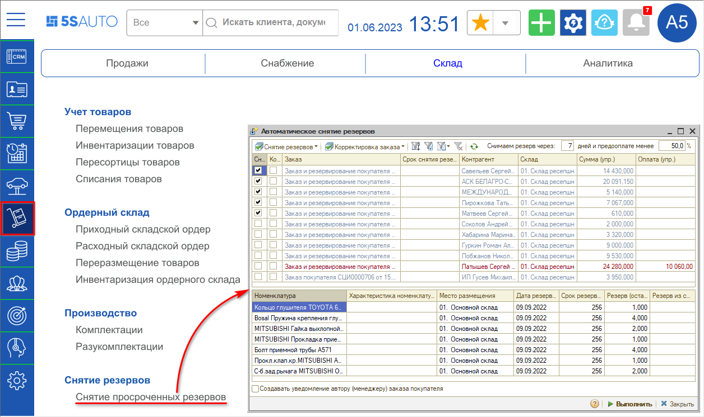
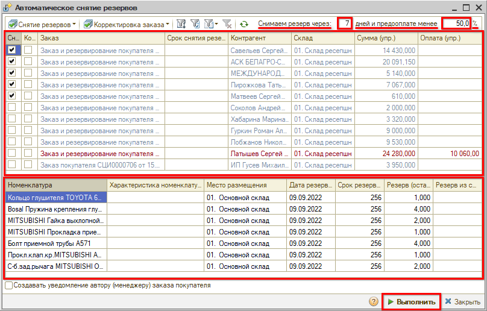
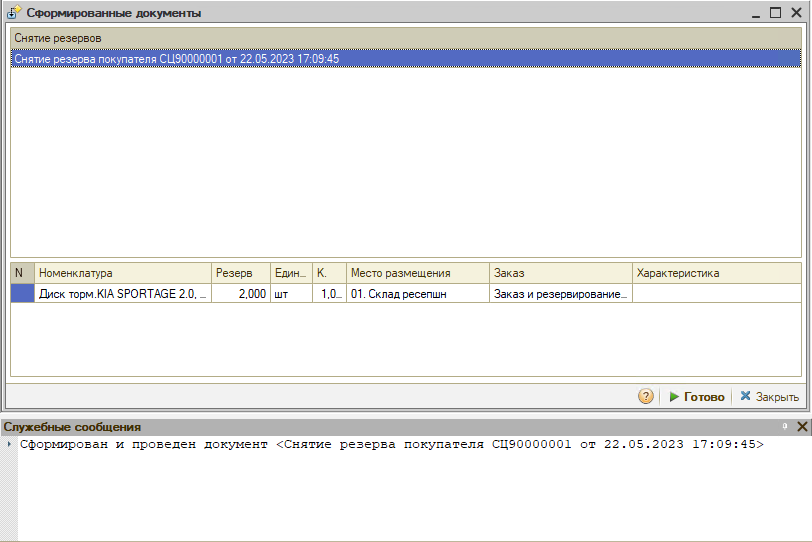
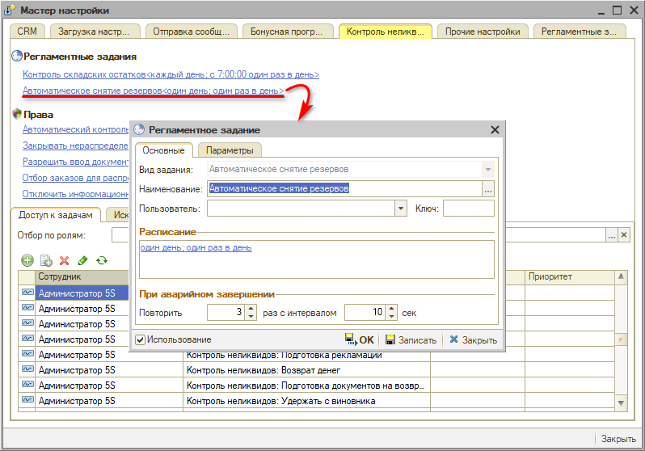
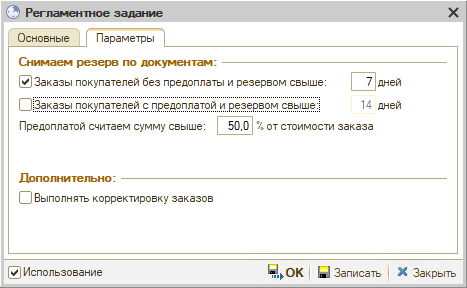

# Автоматическое снятие резервов

<table><tr><td><b>Время чтения:</b> 7 мин.</td><td><b>Обновлено:</b> 08.06.2023</td></tr></table>

Источник: https://www.5systems.ru/help/avtomaticheskoe-snyatie-rezervov

## Содержание

- [Введение](#введение)
- [Обработка для снятия резервов](#обработка-для-снятия-резервов)
- [Регламентное задание "Автоматическое снятие резервов"](#регламентное-задание-автоматическое-снятие-резервов)
- [Уведомление автору заказа покупателя](#уведомление-автору-заказа-покупателя)

## Введение

Механизм ***автоматического снятия резервов*** выявляет заказы покупателя с превышенным сроком резервирования, по каждому из них создает на основании документ "Снятие резерва", а также документ "Корректировка заказа" по необходимости.

Резервы можно снимать с помощью [регламентного задания](#регламентное-задание-автоматическое-снятие-резервов) [*"Автоматическое снятие резервов"*](#регламентное-задание-автоматическое-снятие-резервов) либо с помощью [обработки](#обработка-для-снятия-резервов) *["Снятие просроченных резервов"](#обработка-для-снятия-резервов).*

## Обработка для снятия резервов

Обработка *"Снятие просроченных резервов"* открывается через меню программы *Запчасти и склад → Склад → Снятие резервов*\*:

*\*Примечание: В случае если данного пункта меню нет на рабочем столе, можно добавить его вручную – см. статью "[Настройка рабочего стола](https://www.5systems.ru/help/nastroyka-rabochego-stola#nastrrazdelov)".*

***Интерфейс обработки:***

На верхней панели расположены параметры: через сколько дней снимать резерв и при каком проценте предоплаты.

В верхней части формы выводятся заказы. Следует отметить галочками заказы, по которым нужно снять резерв и по которым следует создать корректировки заказов. Можно перейти в конкретный заказ, открыв его двойным кликом. В нижней части формы отображается номенклатура, которая входит в заказ.

Нажатием на кнопку "Выполнить" формируется документ "Снятие резерва покупателя":

Обработка создает документ "Снятие резерва" по заказу покупателя, который в свою очередь запускает процесс [контроля неликвидов](https://5systems.ru/help/prinyatie-resheniya-po-nelikvidam).

## Регламентное задание "Автоматическое снятие резервов"

Регламентное задание *"Автоматическое снятие резервов"* выполняет автоматическое снятие резервов заказов покупателей при превышении допустимого срока резерва. Сроки регулируются настройками регламентного задания: устанавливаются отдельно для неоплаченных заказов и для тех, по которым была внесена предоплата. Также регламентное задание создает корректировки заказов при необходимости.

Открыть регламентное задание можно через *Мастер настройки → Вкладка "Контроль неликвидов":*

На вкладке *"Основные"* расположены основные параметры настройки – в частности, настройка расписания запуска регламентного задания.

На вкладке *"Параметры"* задаются условия, при которых будут сниматься резервы:

**Параметры:**

***1.*** ***Заказы покупателей без предоплаты и с резервом свыше: _ дней*** – указывается количество дней, при превышении которого необходимо выполнять автоматическое снятие резервов *неоплаченных* заказов покупателей. Рекомендуется устанавливать срок 7 дней, но можно больше или меньше.

***2.*** ***Заказы покупателей с предоплатой и резервом свыше: _ дней*** – устанавливается количество дней, при превышении которого необходимо выполнять автоматическое снятие резервов *предоплаченных* заказов покупателей.

***Предоплатой считаем сумму свыше: _ % от стоимости заказа*** – указывается процент, резервы с предоплатой ниже которого следует контролировать. Предоплату программа проверяет по оплате счёта на Заказ покупателя.
Если предоплата больше указанного процента, резервы по ним не снимаются и не попадают в бизнес процесс Контроля неликвидов. В таких случаях должен решаться вопрос с клиентом – нужна ли ему до сих пор данная предоплаченная запчасть.

Таким образом, программа проверяет сначала все заказы, по которым нет оплаты, затем все заказы, по которым есть оплата с заданными параметрами.

***3.*** ***Выполнять корректировку заказов*** – отметка необходимости создавать документы "Корректировка заказа", т.е. фиксировать уменьшение заказанного количества товара.

## Уведомление автору заказа покупателя

Настройка отправки уведомления о снятии резерва автору заказа покупателя производится в справочнике *Уведомления → Запчасти и склад → "Снятие резерва".* Подробное описание настройки уведомлений см. в статье: [Настройка параметров уведомлений](../../CRM/Настройка%20параметров%20уведомлений/nastroyka-parametrov-uvedomleniy.md).

---

**Теги:** Складской учет, снятие резервов, заказ покупателя, регламентное задание, корректировка заказа, контроль неликвидов, предоплата

