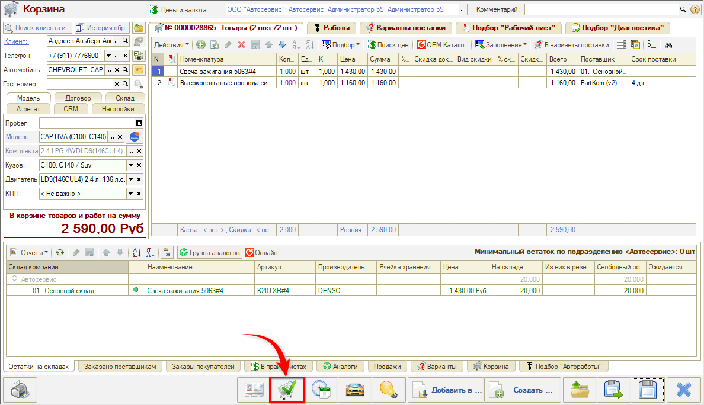
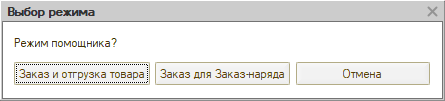
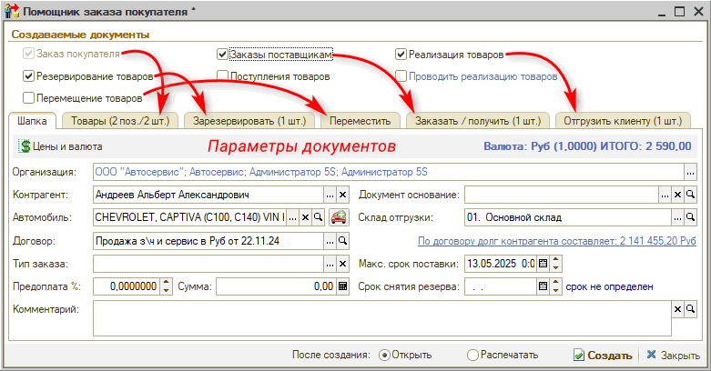
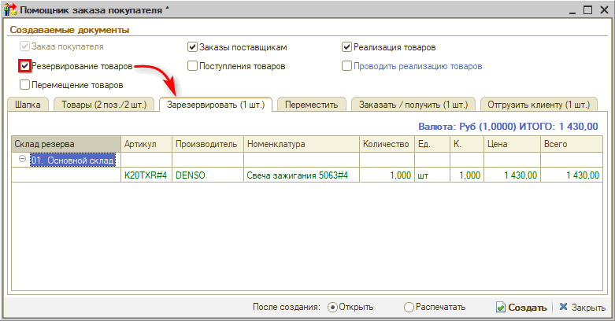
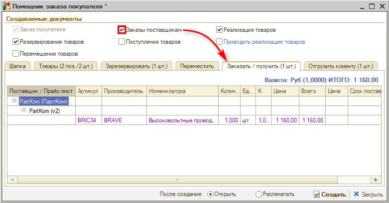
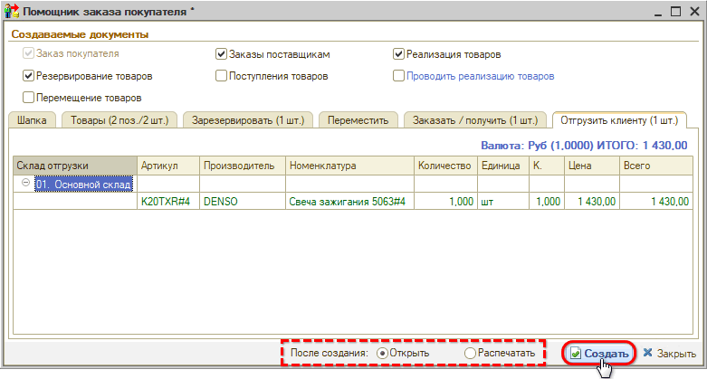

# Помощник оформления заказа покупателя

<table><tr><td><b>Время чтения:</b> 5 мин.</td><td><b>Обновлено:</b> 06.05.2025</td></tr></table>

Источник: https://www.5systems.ru/help/pomoschnik-oformleniya-zakaza-pokupatelya

## Содержание

1. [Введение](#введение)
2. [Работа с Помощником оформления заказа покупателя](#работа-с-помощником-оформления-заказа-покупателя)

## Введение

***Помощник оформления заказа покупателя*** - инструмент, позволяющий на основе подобранных в Корзине товаров быстро создать цепочки документов: Заказ покупателя, Резервирование товаров, Перемещение товаров, Заказы поставщикам, Реализация товаров.

## Работа с Помощником оформления заказа покупателя

См. *[видеоурок](../../Проценка%20запчастей%20и%20работ/Помощник%20оформления%20Заказа%20покупателя%20в%20АРМ%20Корзина/pomoschnik-oformleniya-zakaza-pokupatelya-v-arm-korzina.md)* по работе с Помощником оформления заказа покупателя.

Перейти к Помощнику можно из [АРМ Корзина](../../Проценка%20запчастей%20и%20работ/Работа%20в%20АРМ%20Корзина/rabota-v-arm-korzina.md):

Есть два режима *Помощника оформления заказа покупателя*:

1. *Заказ и отгрузка товара* - сформируются документы, не связанные с заказ-нарядом.
2. *Заказ для Заказ-наряда* - документы сформируются на основании выбранного заказ-наряда.

Форма *Помощника оформления заказа покупателя* выглядит следующим образом:

Флажками отмечаются документы, которые требуется создать. Параметры документов уточняются в нижней части формы, где в зависимости от доступности документов для выбора отображаются соответствующие вкладки.

Для создания цепочки документов выберите документы:

Выберите действия с документами после создания и нажмите кнопку "Создать":

---

**Теги:** помощник оформления заказа, заказ покупателя, АРМ Корзина, цепочка документов, резервирование, заказ поставщику

