

# Работа с заказами покупателя

<table><tr><td><b>Время чтения:</b> 14 мин.</td><td><b>Обновлено:</b> 06.05.2025</td></tr></table>

Источник: https://www.5systems.ru/help/rabota-s-zakazami-pokupatelya

## Содержание

1. [Введение](#введение)
2. [Работа с Заказом покупателя](#работа-с-заказом-покупателя)
   - [Заполнение документа](#заполнение-документа)
   - [Создание Заказа покупателя из АРМ Корзина](#создание-заказа-покупателя-из-арм-корзина)
3. [Корректировка Заказа покупателя](#корректировка-заказа-покупателя)
4. [Замена в Заказе покупателя](#замена-в-заказе-покупателя)
5. [Снятие резерва с Заказа покупателя](#снятие-резерва-с-заказа-покупателя)

## Введение

Поскольку торговля запасными частями предполагает большой перечень номенклатуры, а держать широкий ассортимент на собственном складе не выгодно, то большая доля продаж происходит по предварительным ***заказам покупателей***.

Программа позволяет решать задачи приема заказа, размещения заказа у поставщика, резервирования, корректировки, поставки и отгрузки. Отследить состояние заказа покупателя помогает отчет "Состояние заказов покупателей".

## Работа с Заказом покупателя

### Заполнение документа

Поступивший от клиента магазина запчастей или автосервиса заказ оформляется с помощью документа *"Заказ покупателя" (Автосервис → Заказы на запчасти → Заказы покупателей):*

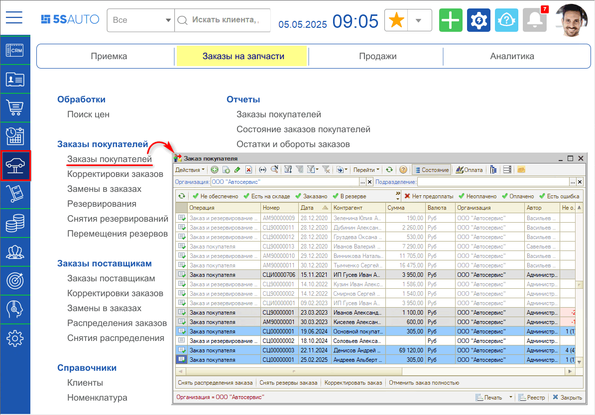

Документ создается вручную либо *вводом на основании* других документов: Заказ-наряд, Счет на оплату.

У заказа покупателя может быть одна из трех хозяйственных операций:

1. *Заказ покупателя* - когда все товары не в наличии, и нужно заказывать у поставщика.
2. *Заказ и резервирование покупателя* - когда часть товаров в наличии, и нужно их зарезервировать, а части товаров нет в наличии, и нужно их у заказать поставщика.
3. *Резервирование покупателя* - когда все товары в наличии, и нужно их зарезервировать для покупателя.

При создании документа "Заказ покупателя" заполняются следующие параметры:

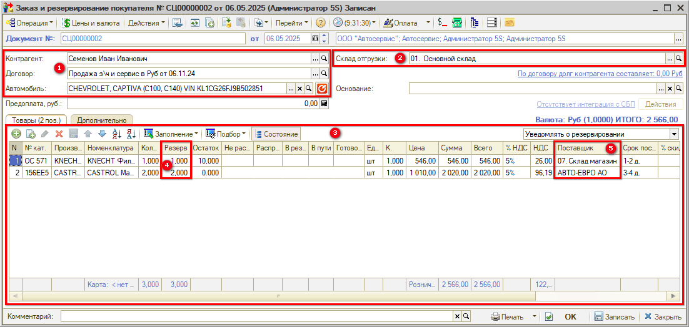

1. *Контрагент, договор взаиморасчетов с контрагентом, автомобиль контрагента*.
2. *Склад отгрузки*.
3. *Перечень товаров* в табличной части, требуемых для заказа.
4. *Количество товара, которое требуется зарезервировать* при проведении документа. Если у товарной позиции выбран склад, то товар резервируется на указанном складе.
5. *Поставщик* - *источник обеспечения* может быть:
   1. Контрагент (Поставщик) - поставщик, у которого планируется заказать товар.
   2. Прайс-лист контрагента - прайс-лист поставщика, по которому планируется заказать товар.
   3. Склад компании - склад, на котором планируется зарезервировать товар.

На вкладку "Дополнительно" вынесены следующие параметры:

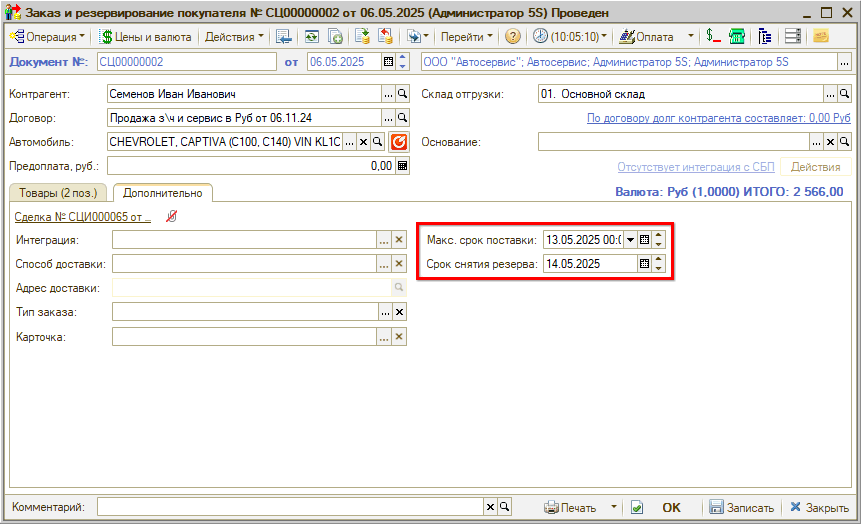

1. *Макс. срок поставки* - максимальный срок поставки, в который поставщик гарантирует поставить товар. Это необходимо, чтобы менеджер мог отследить, что по заказу покупателя товар не поступил в срок, и разобраться в данной ситуации.
2. *Срок снятия резерва* - по истечении срока резерва резервирование снимается менеджером вручную или автоматически (см. [*Снятие резерва с заказа покупателя*](#снятие-резерва-с-заказа-покупателя)*).*

Опция ***"Уведомлять о резервировании"** или **"Уведомлять о полном резервировании"*** выставляется менеджером в случае, если необходимо сообщить о частичном или полном поступлении запчастей по заказу и их резервировании на складах компании:

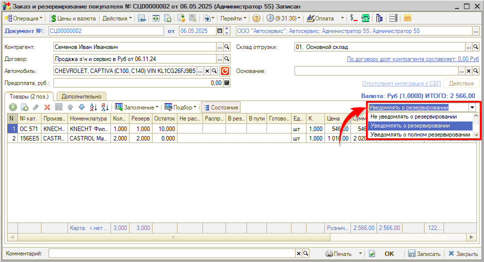

Для работы уведомлений должно быть включено [право](https://5systems.ru/help/ustanovka-prav-i-nastroek-polzovatelya) по компании *"Активность значимых событий"* (Код 10012).

При проведении документа "Заказ покупателя" увеличивается остаток на регистре "Заказы покупателя", а при одновременном резервировании резерв отражается на регистре "Остатки товаров компании".

После проведения документа появляется ***цветовая индикация состояний строк заказа*** в табличной части, если нажата кнопка "Состояние". При наведении мышкой на кнопку "Состояние" появляется подсказка по цветовому оформлению строк заказа:

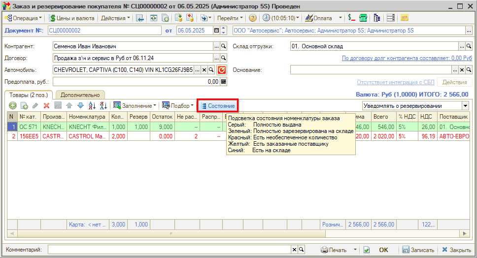

В списке заказов покупателей также есть ***цветовая индикация состояний заказов***, если нажата кнопка "Состояние":

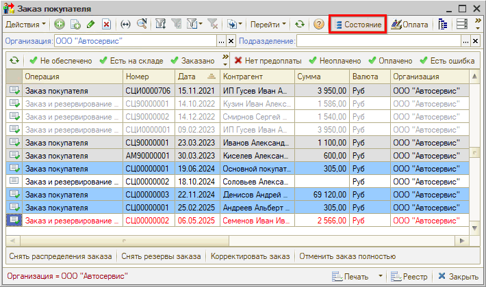

Цветовое оформление состояний заказов можно изменить в справочнике "Статусы и состояния" (см. [*Настройка цветового оформления статусов и состояний*](https://5systems.ru/help/nastroyka-cvetovogo-oformleniya-statusov-i-sostoyaniy)*).*

Для товаров без резерва далее необходимо оформить заказ поставщику (см. [*Работа с заказами поставщикам*](../Работа%20с%20заказами%20поставщикам/rabota-s-zakazami-postavschikam.md)*).*

### Создание заказа покупателя из АРМ Корзина

В программе 5S AUTO предлагается формировать заказ поставщику на основе подобранных товаров в [*АРМ "Корзина"*](../../Проценка%20запчастей%20и%20работ/Работа%20в%20АРМ%20Корзина/rabota-v-arm-korzina.md). При этом можно:

1. создать документ "Заказ покупателя", а затем на основании него создать необходимые для реализации товаров клиенту документы: Перемещение товаров, Реализация товаров, Заказ поставщику,
2. создать цепочку связанных документов с помощью *[Помощника оформления заказа покупателя](../Помощник%20оформления%20заказа%20покупателя/pomoschnik-oformleniya-zakaza-pokupatelya.md)* (также см. *[видеоурок](../../Проценка%20запчастей%20и%20работ/Помощник%20оформления%20Заказа%20покупателя%20в%20АРМ%20Корзина/pomoschnik-oformleniya-zakaza-pokupatelya-v-arm-korzina.md)).*

Подобранные варианты поставки товаров среди прайс-листов поставщиков переносятся из АРМ "Корзина" в Заказ покупателя с указанием прайс-листа контрагента:

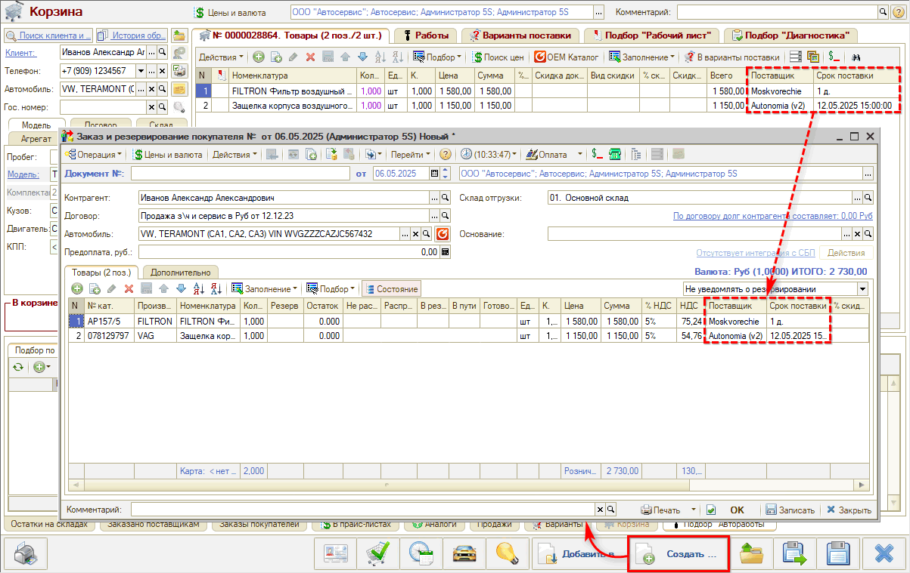

Это позволяет по заказу покупателя сформировать заказы тем поставщикам, прайс-листы которых указаны у товарных позиций заказа покупателя.

Если в Корзине подобраны остатки по складам, отличным от основного склада отгрузки, то в Заказе покупателя эти склады отобразятся в колонке "Поставщик" в качестве склада отгрузки для конкретной товарной позиции.

## Корректировка заказа покупателя

В случае отмены или замены деталей в заказе покупателя оформляется документ "Корректировка заказа покупателя". Документ всегда вводится на основании заказа покупателя.

После проведения документа изменяется состояние регистра "Заказы покупателей" (как для уменьшения остатка на нем, так и для увеличения). Состояние регистра изменяется в соответствии с данными, введенными в табличную часть.

*Если изменение необходимо внести по детали заказа, у которой установлен резерв*, то для начала необходимо *снять резервирование*.

*Если изменение необходимо внести по детали заказа, которая распределена на заказ поставщику*, то для начала необходимо снять распределение заказа покупателя (ввести на основании заказа покупателя документ "Снятие распределения заказа покупателя"), а затем:

1. Откорректировать заказ покупателя через документ "Корректировка заказа покупателя":
   1. обнулить количество в табличной части для отмены заказа:

      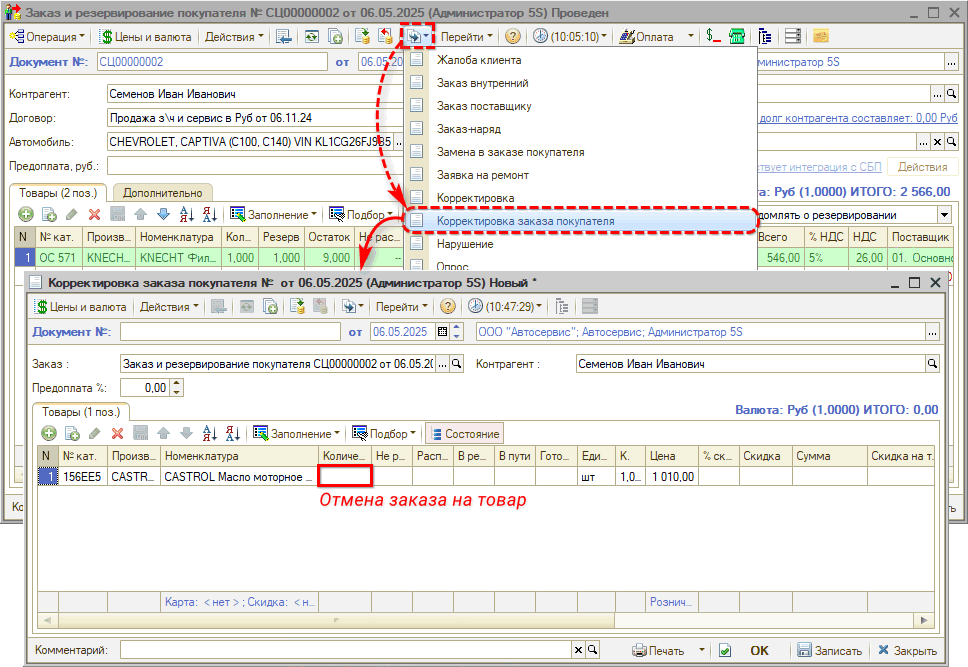
   2. заменить детали или изменить количество деталей для изменения заказа покупателя:

      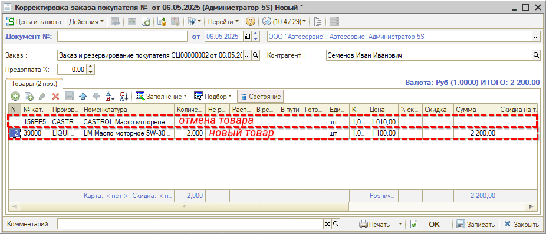
   3. отменить все товары по заказу (обнулить количество) и создать новый документ для изменения заказа покупателя,
2. Откорректировать заказ поставщику и при необходимости распределить откорректированный заказ поставщику на откорректированный или новый заказ покупателя (см. [*Работа с заказами поставщикам → Замена/отмена заказа поставщику*](../Работа%20с%20заказами%20поставщикам/rabota-s-zakazami-postavschikam.md#заменаотмена-заказа-поставщику)*).*

## Замена в заказе покупателя

В случае, когда вместо одной запчасти от поставщика поступает другая, необходимо выполнить замену в заказе покупателя: ввести на основании заказа покупателя документ "Замена в заказе покупателя". Замена может быть одиночная, если одна запчасть меняется на другую, либо множественной, если одна запчасть заменяется на несколько запчастей.

В табличной части документа 2 строки: верхняя строка - с той деталью, заказ на которую нужно отменить (выделена жирным шрифтом), а нижняя строка - с деталью, которая поступит вместо отмененной:

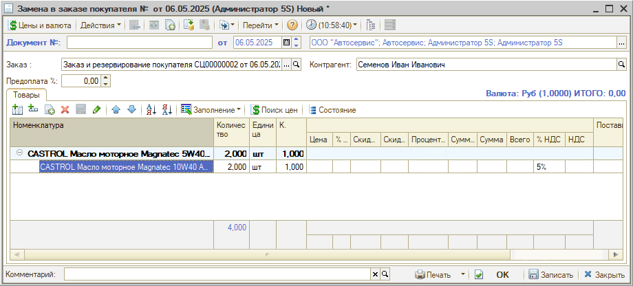

Проведение замены в заказе изменяет состояние регистров таким образом, что остаток в регистре "Заказы покупателей" по старой детали уменьшается, а по новой – увеличивается. При этом по регистру "Распределение заказов" выполняется запись на отмену старой детали.

На новую запчасть требуется оформить новый заказ поставщику, либо выполнить корректировку существующего заказа (см. [*Работа с заказами поставщикам*](../Работа%20с%20заказами%20поставщикам/rabota-s-zakazami-postavschikam.md)*).*

Если замена в заказе покупателя оформляется после поступления товаров на склад, то на новую деталь нужно также оформить документ "Резервирование заказов покупателя".

## Снятие резерва с заказа покупателя

Для снятия резерва с заказа покупателя используется документ *"Снятие резервов заказов покупателей"*. Документ можно создать и заполнить вручную *(Автосервис → Заказы на запчасти → Заказы покупателей → Снятие резервирований)* или ввести на основании заказа покупателя.

При хозяйственной операции "Снятие резерва покупателя" списывается резерв с заказа покупателя на регистре "Заказы покупателей", а также снимаетcя резервирование на регистре "Остатки товаров компании".

При установленном флажке "Отменить заказ покупателя" списывается и сам заказ на деталь на регистре "Заказы покупателей", т.е. при очередных поступлениях запчасть не будет резервироваться под заказ клиента:

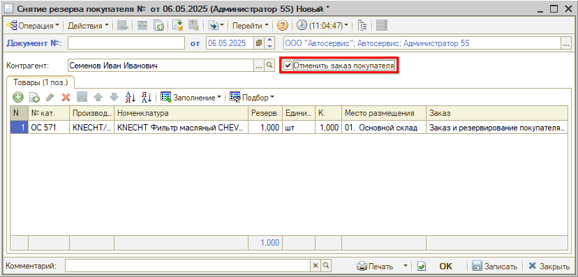

В программе также реализована возможность *автоматического снятия резерва* по истечении срока, указанного в Заказе покупателя. Для этого должно быть добавлено и активировано регламентное задание *"Автоматическое снятие резерва":*

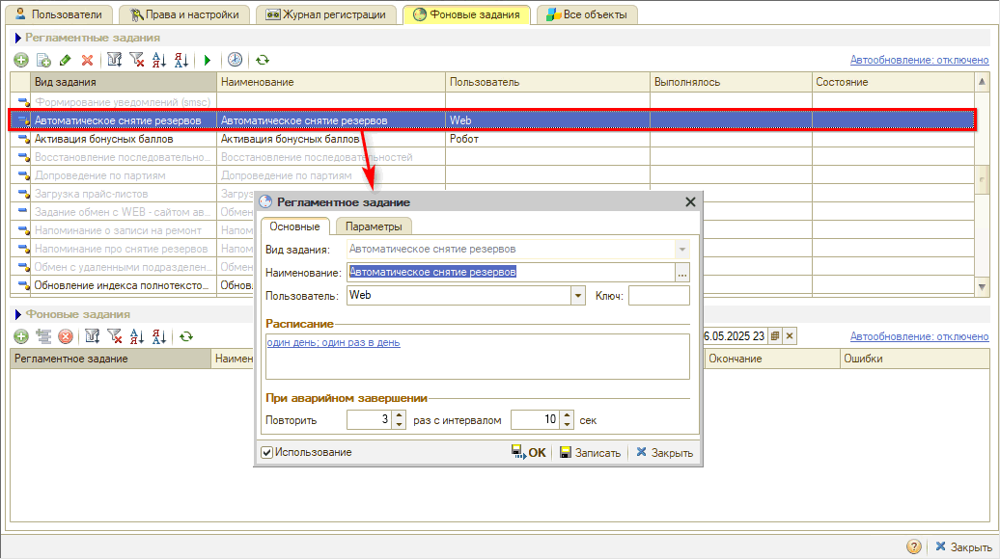

***Обратите внимание!*** Возможность снятия резерва регламентируется правом на пользователя *"Разрешение снятие резервов"* (Код 43012).

---

**Теги:** заказ покупателя, резервирование, корректировка заказа, замена в заказе, снятие резерва, заказ поставщику, АРМ Корзина

