

# Работа с заказами поставщикам

<table><tr><td><b>Время чтения:</b> 18 мин.</td><td><b>Обновлено:</b> 19.05.2025</td></tr></table>

Источник: https://www.5systems.ru/help/rabota-s-zakazami-postavschikam

## Содержание

1. [Введение](#введение)
2. [Общий алгоритм работы с заказами поставщикам](#общий-алгоритм-работы-с-заказами-поставщикам)
   - [Оформление заказа поставщику](#оформление-заказа-поставщику)
   - [Замена/отмена заказа поставщику](#заменаотмена-заказа-поставщику)
3. [Работа с Веб-заказами поставщикам](#работа-с-веб-заказами-поставщикам)
4. [Обработка "Ввод ответа поставщика"](#ввод-ответа-поставщика)
5. [Отслеживание состояний заказов поставщику](#отслеживание-состояний-заказов-поставщику)

## Введение

На товары, заказанные покупателем, но которые отсутствуют на данный момент на складе, оформляется документ ***"Заказ поставщику"***.

Программа позволяет работать с заказами поставщику по следующим схемам:

- *Централизованная* - заказы поставщику отправляются только с одного склада, который занимается взаимодействием с поставщиками (центральный склад). При этом территориально удаленный склад принимает от клиентов заказы, размещает их во внутреннем заказе, и уже внутренний заказ пересылает в центральное подразделение.
- *Децентрализованная* - заказы поставщику отправляются с каждого склада самостоятельно в соответствии со своими потребностями и заказами покупателей.
- *Смешанная* - заказы поставщику отправляются как из центрального склада, так и из территориально удаленных складов.

## Общий алгоритм работы с заказами поставщикам

Все заказы поставщикам обрабатываются единым образом:

1. Создается и заполняется документ "Заказ поставщику".
2. Заказ отправляется поставщику через Веб-сервис, по e-mail или другим способом.
3. После отправки заказа устанавливается флажок "Отправлена" у каждой отправленной позиций заказа. Это можно сделать в табличной части документа или с помощью обработки *"Ввод ответа поставщика"*.
4. После получения от поставщика подтверждения, что заказ оформлен, в каждой позиции заказа вводится полученный у поставщика номер заказа. Это можно сделать в табличной части документа или с помощью обработки *"Ввод ответа поставщика"*.
5. При отгрузке товара поставщиком на основании заказа поставщику вводится, но не проводится, документ "Поступление товаров".
6. Если в заказе поставщику произошли изменения (клиент отказался от детали или поставщик отказал в поставке), то отменяется заказ поставщику.
7. При получении товара на склад ранее созданный документ "Поступление товаров" должен быть проведен или может быть создан и проведен новый документ "Поступление товаров".

При использовании Веб прайс-листов появляется дополнительная возможность отправить заказ поставщику через Веб-сервис (см. *[Работа с Веб-заказами поставщикам](#работа-с-веб-заказами-поставщикам)).* Данная возможность появляется, если Веб-сервис конкретного поставщика принимает заказы, а в настройке Веб прайс-листа разрешена отправка заказов (см. [*Создание и настройка Веб прайс-листа*](../../Склад%20и%20запчасти/Создание%20и%20настройка%20Веб%20прайс-листа/sozdanie-i-nastroyka-veb-prays-lista.md)*).*

Для фиксирования различных изменений по заказу поставщику создана специальная обработка "Ввод ответа поставщика" (см. *[Ввод ответа поставщика](#ввод-ответа-поставщика)).*

### Оформление заказа поставщику

***Оформление заказа поставщику с целью удовлетворения потребностей покупателя*** может происходить несколькими способами:

- Вводом на основании заказа покупателя или внутреннего заказа.
- Созданием документа "Заказ поставщику" с заполнением табличной части с помощью:
    - Подбор по справочнику "Номенклатура" на вкладке "Товары",
    - Подбор по списку заказанного на вкладке "Распределение заказа":

      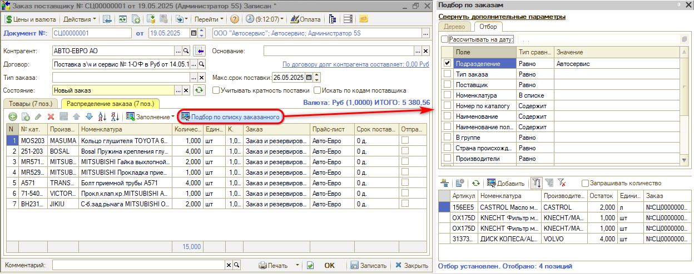
    - Заполнение по заказам на вкладке "Распределение заказа":

      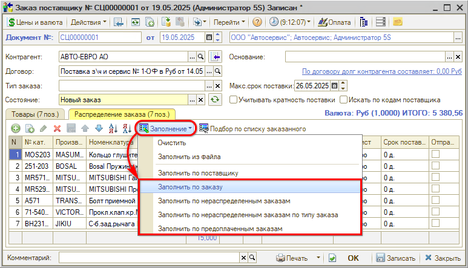

***Для оформления заказа поставщику с целью пополнения складских запасов*** можно:

- Создать документ и заполнить его по минимальным остаткам товара и на основании товаров выбранного поставщика:

  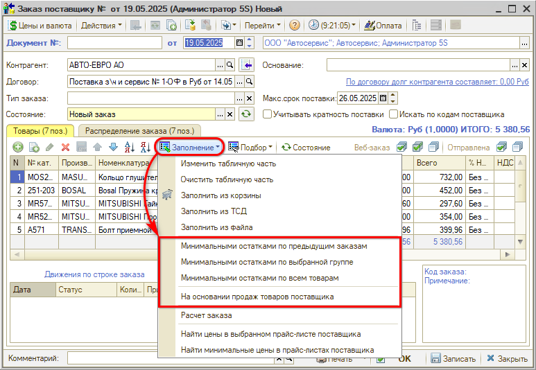

- Воспользоваться обработкой [*Пополнение складских запасов*](../../Склад%20и%20запчасти/Пополнение%20складских%20запасов/popolnenie-skladskikh-zapasov.md).

Документ имеет 2 табличные части, распределенные по вкладкам "Товары" и "Распределение заказа". Табличная часть «Товары» хранит свернутую (просуммированную по заказам) информацию о заказываемой номенклатуре, а табличная часть «Распределение заказа» - информацию по номенклатуре, развернутую по заказам покупателей (или по внутренним заказам).

При проведении документа «Заказ поставщику» увеличивается остаток на регистре «Заказы поставщикам» и на регистре «Заказы распределение». Регистр «Заказы распределение» хранит связку заказа поставщика с заказом покупателя до момента поставки (проведение документа "Поступление товаров").

### Замена/отмена заказа поставщику

Для ***отмены заказа поставщику***, в программе предусмотрено 2 способа: ввод на основании необходимых документов или использование обработки "Ввод ответа поставщика".

**Способ отмены №1**

1. Если заказ поставщику распределен по заказам (заказ покупателя или внутренний заказ), то на основании заказа поставщику введите документ "Снятие распределения поставщика":

   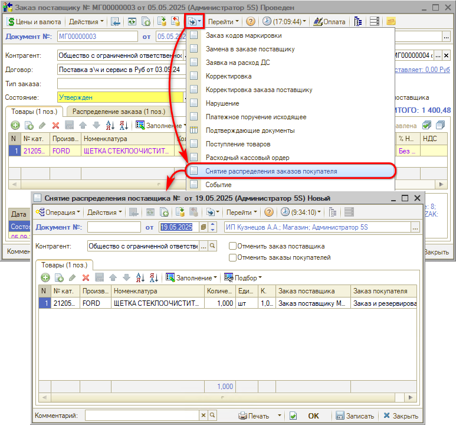
2. На основании заказа поставщику введите документ "Корректировка заказа поставщику" и внесите необходимые изменения в количестве заказанных позиций:

   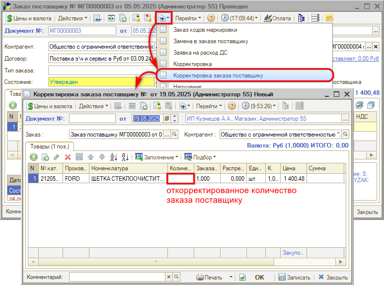

**Способ отмены №2**

Отмена с помощью обработки *Ввод ответа поставщика:*

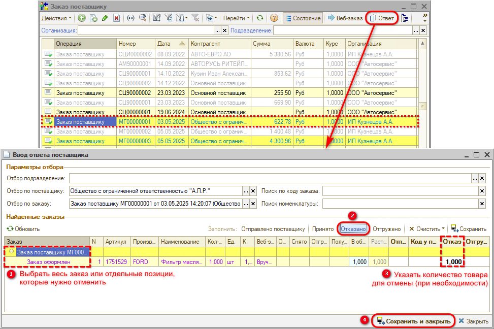

При отмене с помощью обработки "Ввод ответа поставщика":

- Если по заказу поставщика было распределение по заказам, создается документ "Снятие распределения поставщика", который также является корректировкой заказа поставщику:

  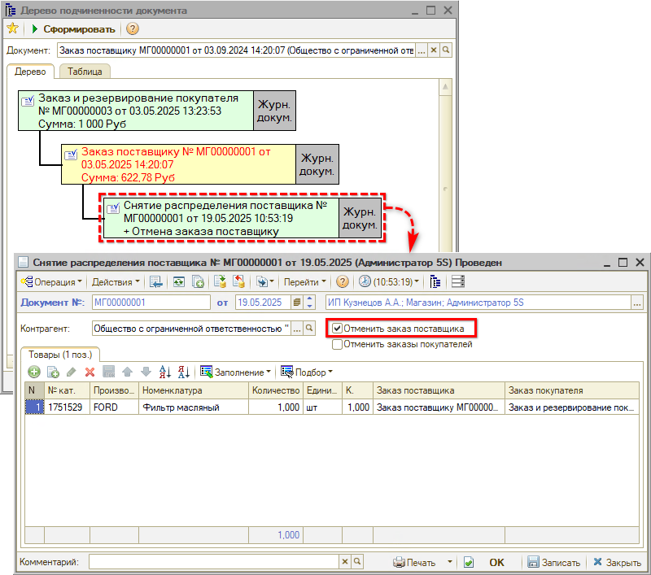

- Если по заказу поставщика не было распределения по заказам, создается документ "Корректировка заказа поставщику".

***Для замены деталей в заказе поставщику*** выполните следующие действия:

1. Если заказ поставщику распределен по заказам (заказ покупателя или внутренний заказ), то на основании заказа поставщику введите документ "Снятие распределения поставщика":

   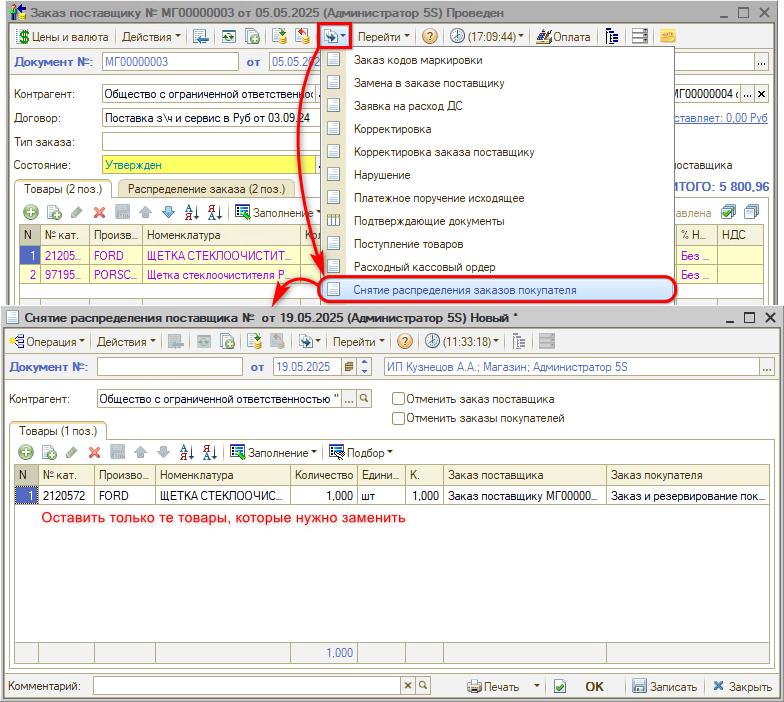
2. На основании заказа поставщику введите документ "Корректировка заказа поставщику" и внесите необходимые изменения (обнулите количество у старой детали и добавьте новую):

   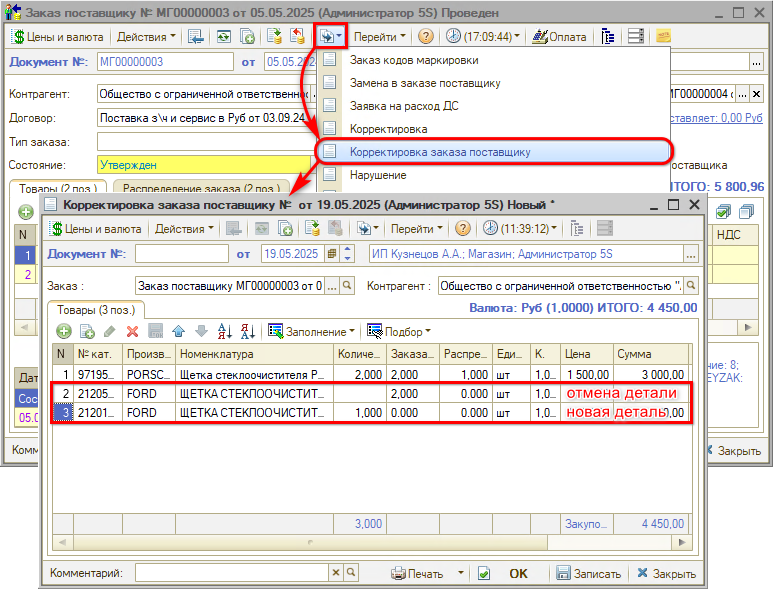
3. Распределите новую деталь через документ "Распределение заказа покупателя" *(Автосервис → Заказы на запчасти → Заказы поставщикам)* на откорректированный или новый заказ покупателя (внутренний заказ):

   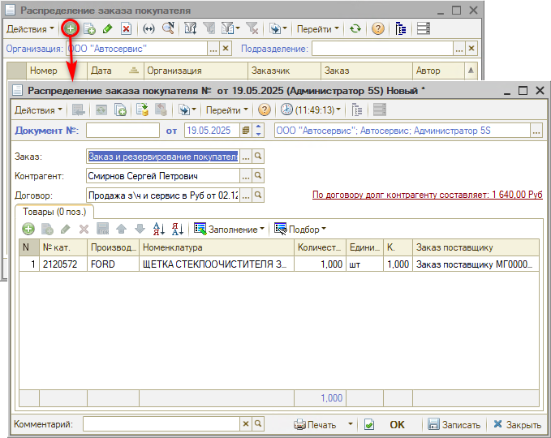

## Работа с Веб-заказами поставщикам

При работе с документом "Заказ поставщику" с позициями из Веб прайс-листов или из локальных прайс-листов, для которых настроена отправка Веб-заказа, становится доступна опция "Веб-заказ":

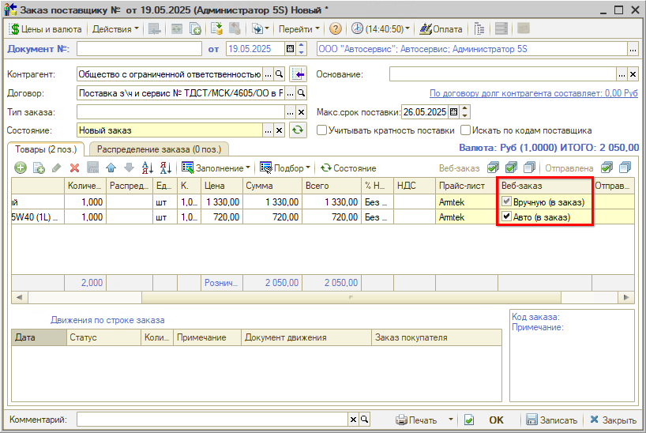

Опция "Веб-заказ" позволяет:

- отправить Веб-заказ автоматически при проведении документа (будут использованы опции отправки заказа, предустановленные в карточке Веб прайс-листа).
- отправить Веб-заказ вручную после проведения документа (опции отправки заказа могут быть выбраны непосредственно в момент отправки).
- не отправлять Веб-заказ, т.е. отказаться от автоматического размещения заказа у поставщика.

Опция "Веб-заказ" доступна только для тех Веб прайс-листов, у которых настроена отправка заказа (см. *Настройка параметров для отправки заказа поставщику).*

Таким образом, в момент обработки заказа поставщику всегда можно принять решение: заказывать товары у поставщика через Веб-сервис или самостоятельно. При отправке заказа поставщику с использованием Веб-сервиса автоматически установятся флажки "Отправлена" и заполнится колонка "Код заказа у поставщика" по каждой позиции.

Стоит отметить, что при установке опции "Веб-заказ" = "Вручную (в заказ)" появляется возможность отправить Веб-заказ с опциями, отличными от преднастроенных в Веб прайс-листе. Для этого после проведения документа "Заказ поставщику" необходимо:

1. Установить курсор мыши на заказ, который необходимо отправить поставщику.
2. Нажать на кнопку "Веб-заказ" на панели инструментов списка документов:

   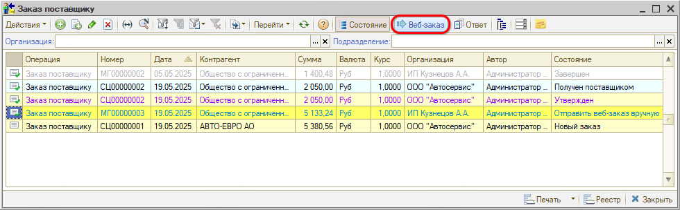
3. В появившемся окне установить необходимые для данного заказа опции.
4. Нажать кнопку "Корзина", если она доступна и необходимо только положить товары в корзину на сайте поставщика, или "Заказ" для непосредственного размещения Веб-заказа:

   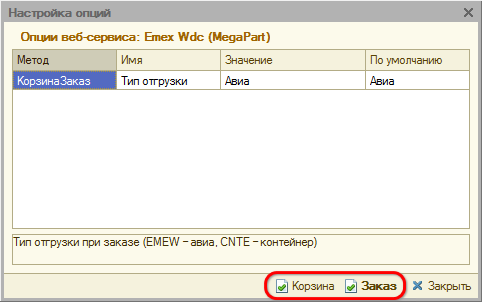

## Ввод ответа поставщика

Обработка "Ввод ответа поставщика" позволяет в одном месте отразить все изменения по заказу(-ам) поставщику. Чтобы вызвать данную обработку необходимо нажать кнопку "Ответ" на командной панели списка документов "Заказ поставщику":

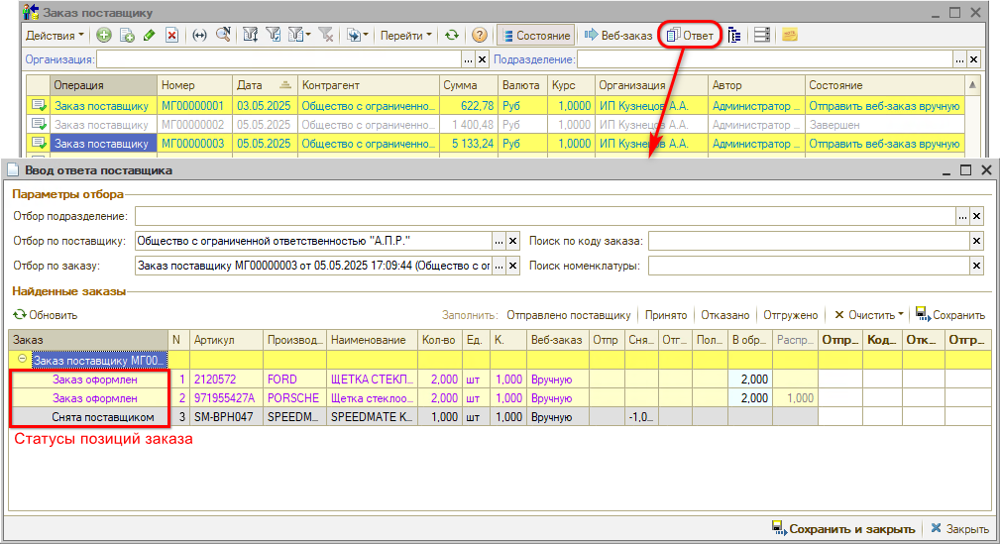

Обработка представляет собой форму, состоящую из следующих элементов:

1. Параметры отбора - поля для поиска заказа или позиций заказа поставщика. При открытии формы из списка документов установлены значения для полей "Отбор по поставщику" и "Отбор по заказу" согласно текущего заказа списка. При необходимости можно изменить параметры поиска и нажать на кнопку "Найти заказы".
2. Найденные заказы - область для работы с позициями заказа поставщику, удовлетворяющими параметрам поиска. В свою очередь состоит из:
   1. Командной панели (см. *[Табл. 1](#табл-1---элементы-командной-панели)).*
   2. Табличной части с найденными заказами (в виде дерева), в которой можно выделить весь заказ или конкретные позиции заказа и выполнить действия над ними с помощью кнопок командной панели.

### Табл. 1 - Элементы командной панели

| № п/п | Элемент управления | Действие |
| --- | --- | --- |
| 1 | Кнопка "Обновить" | Перезаполняет таблицу найденных заказов. Внесенные в таблицу данные будут очищены |
| 2 | Кнопка "Найти заказы" | Осуществляет поиск заказов по установленным параметрам отбора |
| 3 | Кнопка "Отправлено поставщику" | Проставляет флажок "Отправлена" по выбранным в табличной части строкам заказа. В заказах поставщику изменения применятся после сохранения |
| 4 | Кнопка "Принято" | Открывает форму ввода кода заказа, присвоенного поставщиком. В открывшейся форме необходимо ввести код и нажать кнопку "ОК". В заказах поставщику изменения применятся после сохранения |
| 5 | Кнопка "Отказано" | Заполняет у выбранных строк количество товара, снятое поставщиком, равное текущему количеству товаров в заказе (за минусом отгруженного количества). Количество снятое поставщиком может быть отредактировано вручную. После сохранения изменений создастся документ "Корректировка заказа поставщику" или "Снятие распределения заказа поставщика" |
| 6 | Кнопка "Отгружено" | Заполняет у выбранных строк количество товара, отправленное поставщиком, равное текущему количеству товаров в заказе (за минусом снятого количества). Количество отгруженное поставщиком может быть отредактировано вручную. После сохранения изменений создастся документ "Поступление товаров" |
| 7 | Подменю "Очистить" | Состоит из кнопок:<ul><li>Отправлено и Код заказа</li><li>Отказано</li><li>Отгружено</li></ul>Очищает соответствующие колонки в выбранных строках табличной части заказов |
| 8 | Кнопка "Сохранить" | Применяет все изменения по позициям заказа, в результате чего обновляются заказы поставщику или создаются на основании новые документы |

### Примеры использования

#### Отметка об отправке заказа поставщику

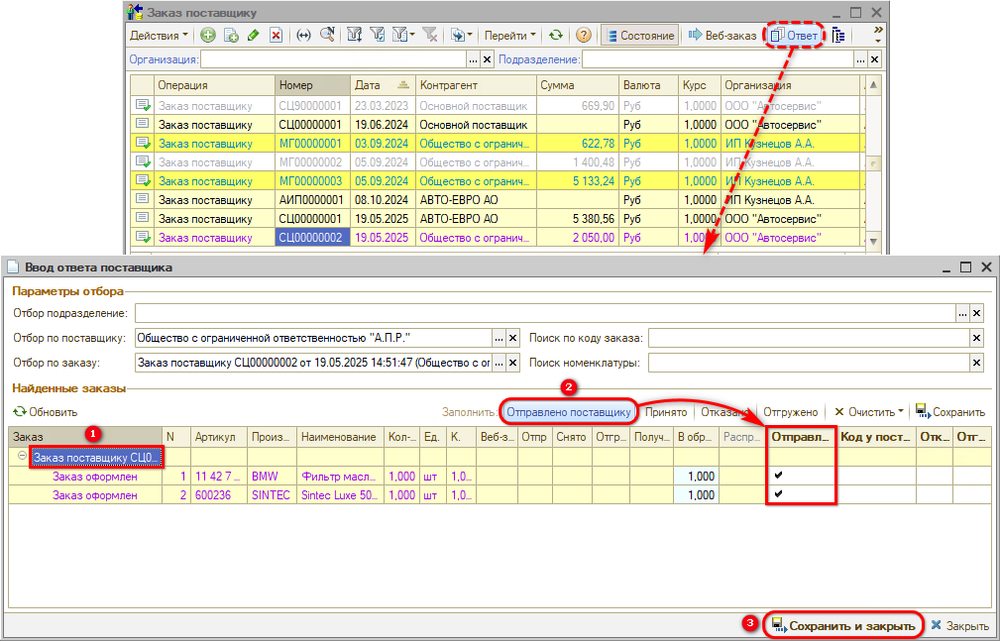

#### Отметка факта принятия заказа поставщиком

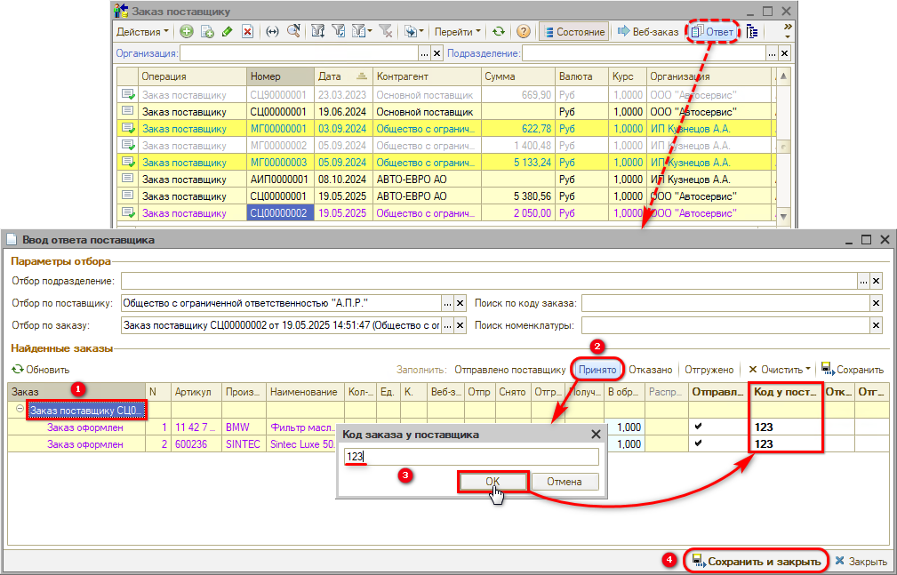

#### Отмена заказа поставщика

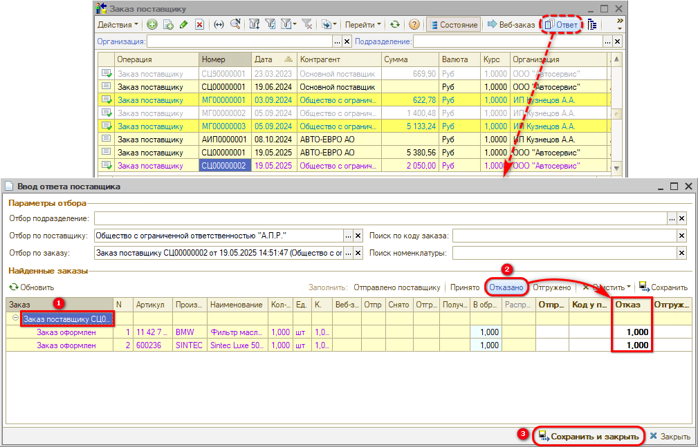

## Отслеживание состояний заказов поставщику

### Отображение состояний заказа

В Системе предусмотрено отображение состояний заказов поставщиков. Для этого необходимо нажать на кнопку "Состояние" командной панели:

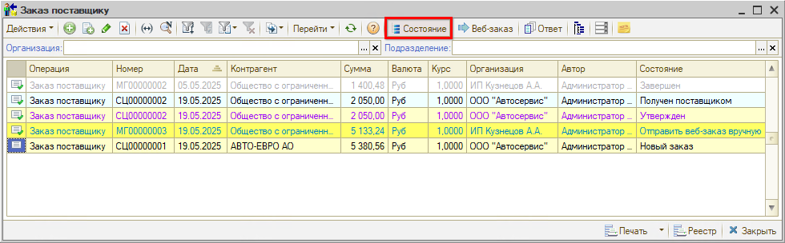

После активации кнопки "Состояние" отобразится колонка "Состояние" и строки с заказами выделятся цветом, характерным для текущего состояния заказа.

Цветовое оформление состояний заказов можно изменить в справочнике "Статусы и состояния" (см. [*Настройка цветового оформления статусов и состояний*](https://5systems.ru/help/nastroyka-cvetovogo-oformleniya-statusov-i-sostoyaniy)*).*

### Диаграмма состояний строки заказа поставщику

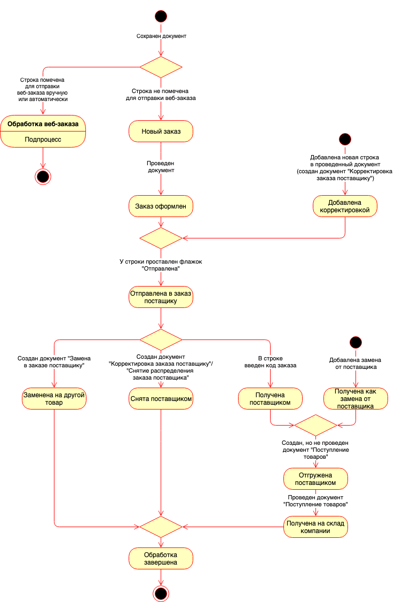

#### Подпроцесс "Обработка веб-заказа"

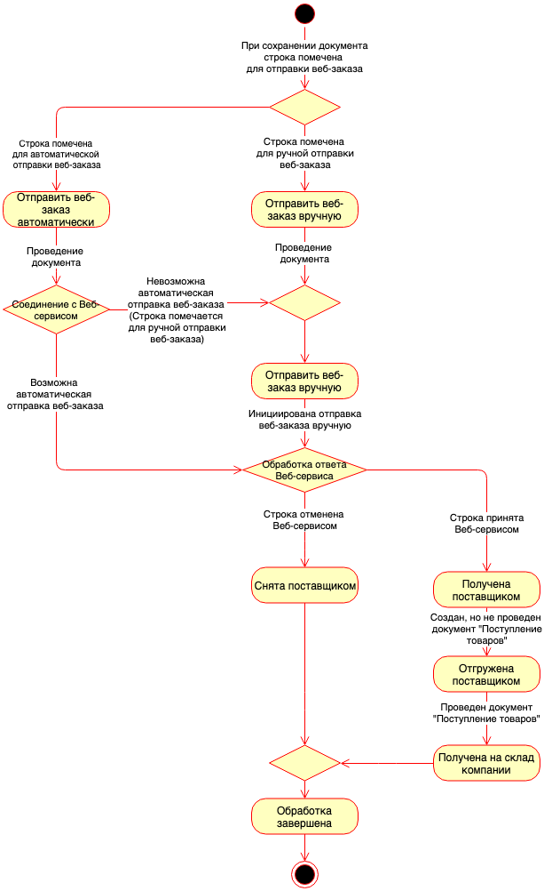

### Диаграмма состояний документа "Заказ поставщику"

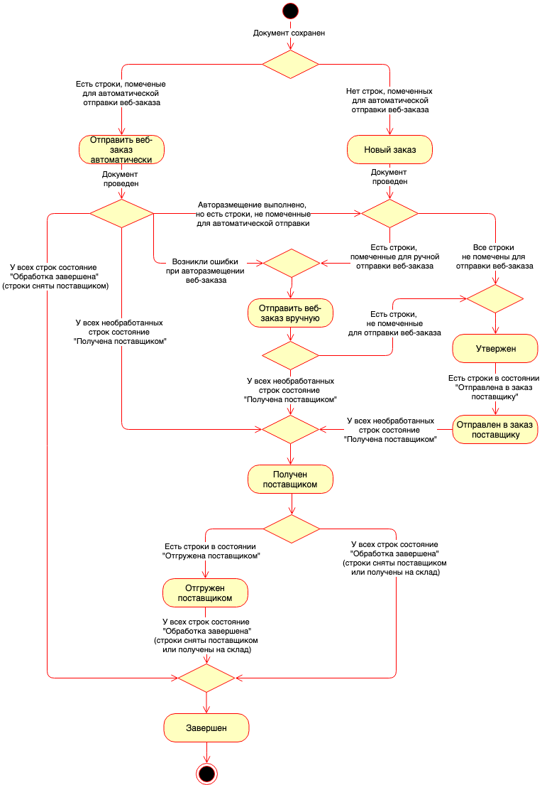

---

**Теги:** заказ поставщику, веб-заказ, ввод ответа поставщика, корректировка заказа, снятие распределения, состояния заказов, распределение заказа

