

# Распределение поступлений по заказам

<table><tr><td><b>Время чтения:</b> 20 мин.</td><td><b>Обновлено:</b> 03.04.2023</td></tr></table>

Источник: https://www.5systems.ru/help/raspredelenie-postupleniy-po-zakazam

## Содержание

1. [Введение](#введение)
2. [Способ распределения в Поступлении товаров](#способ-распределения-в-поступлении-товаров)
3. [Основная логика работы с функционалом](#основная-логика-работы-с-функционалом)
4. [Интерфейс формы "Распределение номенклатуры"](#интерфейс-формы-распределение-номенклатуры)
5. [Режимы распределения](#режимы-распределения)
   - [1. Автоматическое распределение](#1-автоматическое-распределение)
   - [2. Выборочное и автоматическое распределение](#2-выборочное-и-автоматическое-распределение)
   - [3. Выборочное распределение](#3-выборочное-распределение)
6. [Принцип распределения товара по заказам](#принцип-распределения-товара-по-заказам)
   - [Документы для учета в распределении](#документы-для-учета-в-распределении)
   - [Приоритет заказов для распределения](#приоритет-заказов-для-распределения)
7. [Права](#права)
   - [1. Разрешить ввод документов без распределения](#1-разрешить-ввод-документов-без-распределения)
   - [2. Контролировать распределение при нехватке товара на все заказы покупателей](#2-контролировать-распределение-при-нехватке-товара-на-все-заказы-покупателей)
   - [3. Отключить информационные сообщения при проведении Поступления товаров](#3-отключить-информационные-сообщения-при-проведении-поступления-товаров)
   - [4. Закрывать нераспределенные заказы покупателей](#4-закрывать-нераспределенные-заказы-покупателей)
   - [5. Отбор заказов для распределения поступившего товара](#5-отбор-заказов-для-распределения-поступившего-товара)

## Введение

Функционал представляет собой систему управления распределением поступившего товара под определенные заказы. Программа подсказывает, что есть заказы, на которые можно распределить номенклатуру, а также позволяет выбрать режим распределения – автоматически или вручную.

Система распределения поступления товаров по заказам помогает решать следующие задачи:

***1. Управляемое распределение:*** контроль оптимального распределения товара по заказам – в случае, если поступает товар в меньшем количестве, чем на данный момент ожидается по заказам.
Например, одну и ту же номенклатуру ждут трое клиентов, а поступило две единицы данного товара. Программа находит все подходящие заказы, и пользователь вручную распределяет, под какие конкретно заказы встанет резерв.

***2. Контроль поставок:*** при поступлении товара в большем количестве, чем было заказано, либо который вообще не заказывали, система информирует, что поступивший товар никто не ждет.
Как правило, для автосервисов и магазинов автозапчастей, особенно крупных, важно четко понимать, под какие заказы поступил товар. Если нераспределенный товар останется "висеть" на складе – с большой вероятностью образуется неликвид.

## Способ распределения в Поступлении товаров

В документе "Поступление товаров" в таблице отображается "Способ распределения":

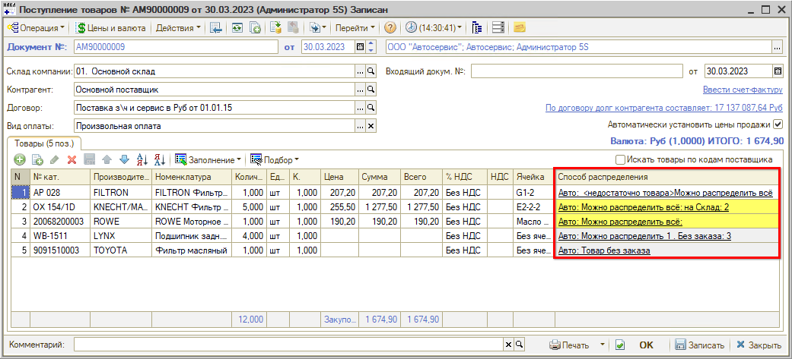

Если колонка "Способ распределения" не отображается, следует настроить таблицу:

1. кликнуть правой кнопкой мыши в любом месте строки заголовков таблицы;
2. в выпадающем меню выбрать "Настройки списка";
3. в открывшемся окне настроек найти и отметить галочкой колонку "Способ распределения";
4. нажать "ОК":

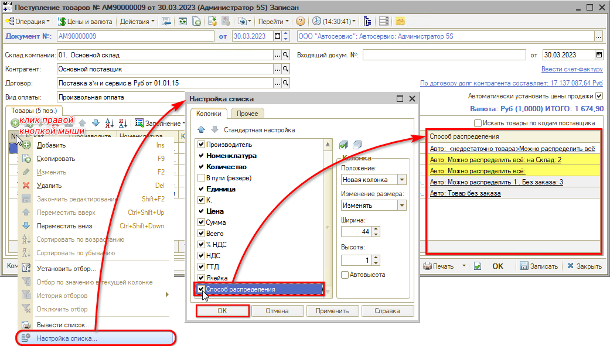

В колонке "Способ распределения" отображается режим распределения товара и количество товара, который можно распределить (см. описание [ниже](#режимы-распределения)).

## Основная логика работы с функционалом

При поступлении запчастей вводится документ "Поступление товаров". По умолчанию весь товар должен распределиться автоматически.

При этом товар мог быть заказан для пополнения склада, либо для конкретного клиента, но не был создан Заказ покупателя. В этом случае можно найти в системе документы с заказами и распределить на них данный товар. См. описание [ниже](#документы-для-учета-в-распределении).

Также программой может быть выявлен *товар без заказа:*

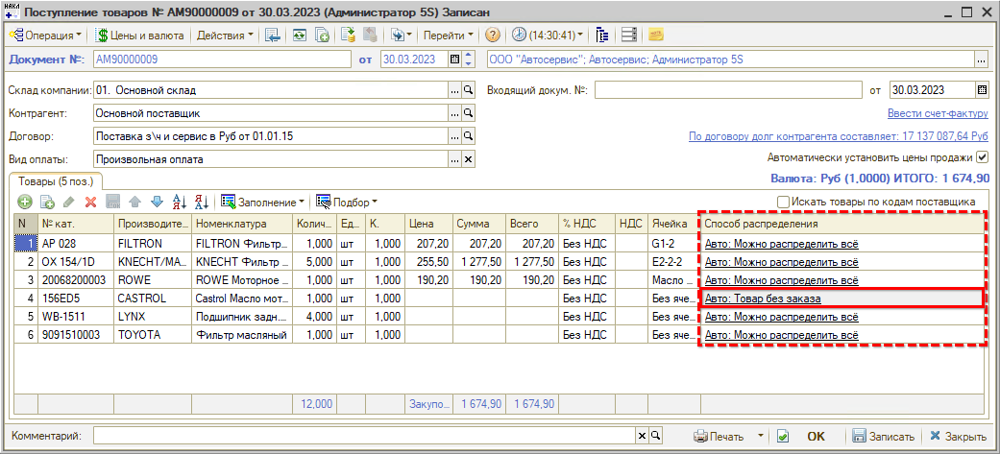

Это означает, что поступил товар, который никто не заказывал и никто не ожидает. В случае если программой найден товар *без заказа*, требуется решить, что с ним делать. Возможны следующие варианты действий:

- создать заказ под этот товар;
- отправить товар обратно;
- провести документ в текущем виде, т.е. с нераспределенным товаром.

Если для пользователя установлен запрет в праве [Разрешить ввод документов без распределения](#1-разрешить-ввод-документов-без-распределения), то программа не позволит провести нераспределенное поступление. В данном случае нужно будет передать документ для дальнейшей работы другому сотруднику, у которого такое право есть, либо разрешить всем, кто работает с поступлениями, проводить нераспределенные документы. Если далее предусмотрена работа с функционалом "Решение по партии", то лишний товар не станет неликвидом.

Информационные сообщения системы при проведении поступления, что пришло лишнее либо не хватило и т.д. - можно отключить специальной [настройкой](#3-отключить-информационные-сообщения-при-проведении-поступления-товаров).

В случае если наоборот товара поступило меньше, чем ожидается, программа также это проконтролирует – для этого должно быть включено право "[Контролировать распределение при нехватке товара на все заказы покупателей](#2-контролировать-распределение-при-нехватке-товара-на-все-заказы-покупателей)". Программа не позволит провести документ, будет выведено предупреждение, и нужно будет распределить товар вручную (см. п. [Выборочное распределение](#3-выборочное-распределение)).

## Интерфейс формы "Распределение номенклатуры"

Если нажать на ссылку в столбце "Способ распределения" – открывается форма "Распределение номенклатуры" в контексте данной поступившей номенклатуры:

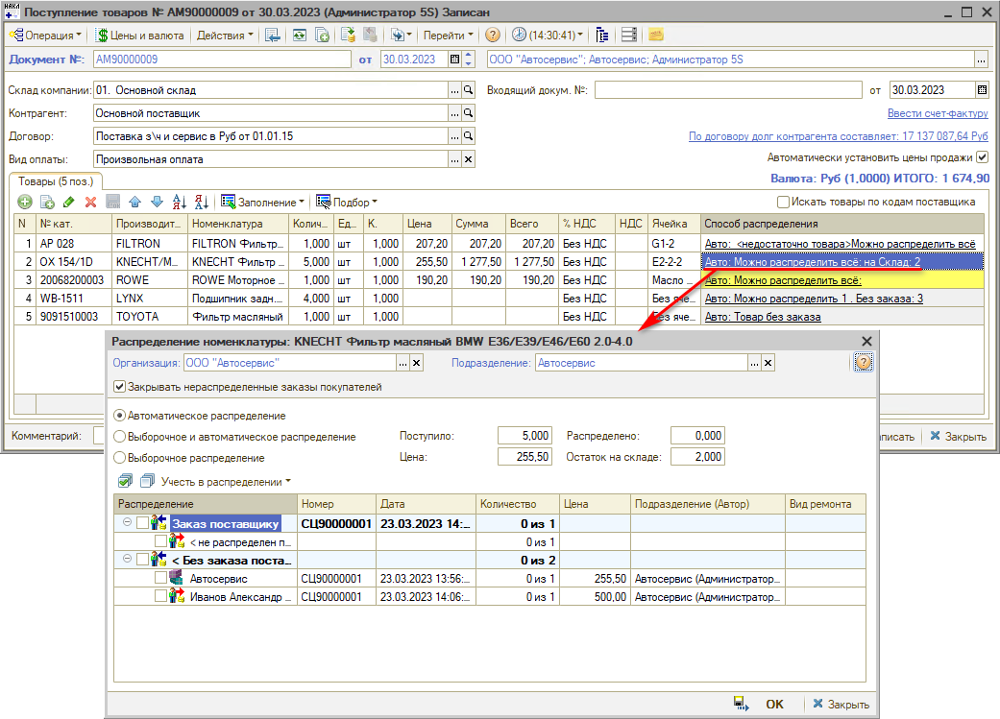

Примечание: если в "Поступлении товара" одна и та же единица номенклатуры повторяется в отдельных строках, то в форму "Распределение номенклатуры" данный товар будет выведен общим количеством.

***Поля формы "Распределение номенклатуры":***

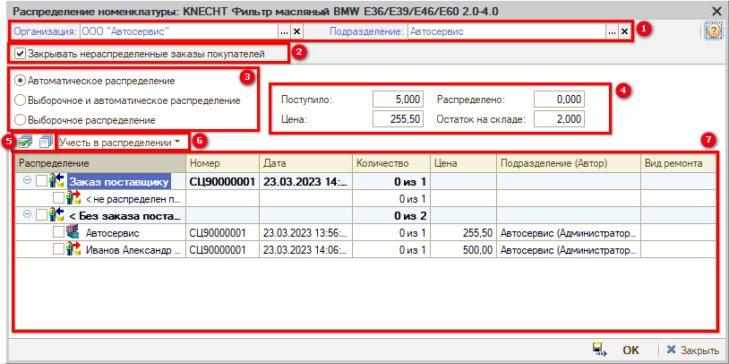

**1. *Организация* и *Подразделение:*** подразделение можно выбирать в зависимости от права [Контроль распределения в поступлении товаров](#5-отбор-заказов-для-распределения-поступившего-товара). Если у компании несколько филиалов, и включен контроль, то производится отбор документов по подразделению пользователя. Другими словами, пользователь сможет распределять товар только на документы своего филиала.

**2. Галочка *"Закрывать нераспределенные заказы покупателей"*** – это признак документа "Поступление товаров", т.е. относится ко всему документу "Поступление товаров", а не к одной строке. Галочка стоит или не стоит по умолчанию в зависимости от значения права "[Закрывать нераспределенные заказы покупателей](#4-закрывать-нераспределенные-заказы-покупателей)".
Если стоит данная галочка, то для учета в распределении будут автоматически выбраны "Заказы покупателя (нераспределенные)" (см. [ниже](#документы-для-учета-в-распределении)).

**3. *Режимы распределения:*** см. описание [ниже](#режимы-распределения).

**4. *Показатели:***

1. *Поступило* – количество поступившего товара;
2. *Распределено* – количество распределенной номенклатуры заполняется при выборе заказов в таблице. Цветовая индикация:
   - *серый* – не распределено: 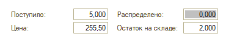
   - *белый* (без выделения цветом) – распределено: 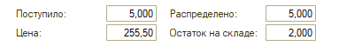
   - *розовый* – распределено больше, чем было заказано: 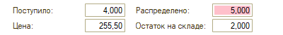
   - *жёлтый* – распределено меньше, чем было заказано: 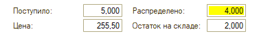
3. *Цена* – цена номенклатурной позиции;
4. *Остаток на складе* – реальный остаток на дату поступления до поступления товара: отображается свободный остаток, т.е. не под заказы.

**5. Кнопки** ***"Отметить все элементы" / "Снять отметку со всех элементов"*** используются для быстрого выбора документов для распределения*:*

**6. Кнопка *"Учесть в распределении ⏷"*** используется для отбора заказов, которые необходимо учесть при распределении – см. описание [ниже](#документы-для-учета-в-распределении);

**7. *Таблица:*** в табличную часть выводятся найденные системой документы с заказами, подходящие для учета в распределении данного товара. Если "Товар без заказа" – никакие документы для распределения не выводятся.

При выборе документов в таблице переставляется флажок у режима распределения – "Выборочное" или "Выборочное + автоматическое".

## Режимы распределения

### 1. Автоматическое распределение

Варианты отображения разбивки товара в автоматическом режиме:

- *"Авто: Можно распределить всё"* – система определяет, что есть Заказы поставщика, на которые можно распределить поступление*;*
- *"Авто: Можно распределить &lt;...&gt;. Без заказа: &lt;...&gt;"* – с указанием количества товара;
- *"Авто: &lt;недостаточно товара&gt; Можно распределить всё"* – отображается в случае, если товар ожидают несколько клиентов, а поступило его недостаточно для распределения по всем этим заказам. При включенном праве "[Контролировать распределение при нехватке товара на все заказы покупателей](#2-контролировать-распределение-при-нехватке-товара-на-все-заказы-покупателей)" невозможно будет использовать автоматический режим распределения – программа выведет предупреждение, и нужно будет распределить товар вручную;
- *"Авто: Товар без заказа"* – если система не нашла поступившую номенклатуру ни в одном из заказов, т.е. данный товар никто не ожидает.

По умолчанию программа пытается распределить поступивший товар автоматически по конкретным Заказам покупателя, а нераспределенный товар – распределить по ФИФО.

В автоматическом режиме можно распределить весь товар по имеющимся Заказам покупателя и Заказам поставщикам.

Автоматически можно распределять только "Заказы покупателя", "Заказы поставщикам" и "Внутренние заказы": по кнопке "Учесть в распределении" (см. [ниже](#документы-для-учета-в-распределении)) нельзя будет выбрать "Заявки на ремонт" и "Заказ-наряды".

При выборе автоматического режима доступна галочка *"Закрывать нераспределенные заказы покупателей":* можно ее снять или установить.

### 2. Выборочное и автоматическое распределение

Режим устанавливается, если нужно разнести определенное количество товара на конкретные Заказы, а остальное количество товара можно оставить для автоматического распределения программой.

Если отметить галочками документы в таблице, происходит переключение на данный режим. Вручную этот режим не выбирается.

Галочка "Закрывать нераспределенные заказы покупателей" также доступна.

### 3. Выборочное распределение

Режим выбирается в случае, если требуется производить ручное распределение всего поступившего товара в полном количестве. Если отметить галочками заказы, по которым полностью распределится поступивший товар, происходит автоматическое переключение на данный режим.

В режиме "Выборочное распределение" в "Поступлении товара" в колонке "Способ распределения" отображается количество товара для распределения по следующим критериям:

- *"Выб: Распределить: &lt;...&gt;";*
- *"Выб: Без заказа: &lt;...&gt;";*
- *"Выб: По ЗН: &lt;...&gt;".*

При выборе режима выборочного распределения галочка "Закрывать нераспределенные заказы покупателей" становится недоступна.

Автоматическое распределение в этом случае не производится – необходимо указать конкретные заказы.

Можно взять в работе за основу данный режим и всегда распределять весь поступивший товар вручную по конкретным заказам.

## Принцип распределения товара по заказам

Типовое распределение поступившего товара производится только по основанию, т.е. в соответствии с документами в дереве связей, и закрывает только Заказы поставщикам.
Однако, как правило, приходят разные поступления вперемешку по разным заказам – поэтому необходимо их правильно распределить.

Есть возможность делать автораспределение по всем актуальным заказам, в которых программа найдет данную номенклатуру, либо распределять вручную, отмечая заказы, которые программа найдет и выведет в таблицу (см. [выше](#режимы-распределения)).

### Документы для учета в распределении

Нажатием на кнопку "Учесть в распределении" раскрывается список дополнительных документов, на которые, помимо типового распределения по Заказам покупателей, также можно распределить поступивший товар:

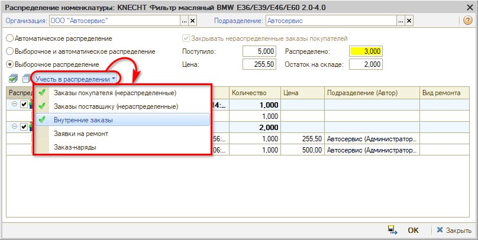

Для [режимов](#режимы-распределения) "Автоматическое распределение" и "Выборочное и автоматическое распределение" можно выбрать только "Заказы покупателя", "Заказы поставщику" и "Внутренние заказы".

Для режима "Выборочное распределение" помимо этих документов для учета в распределении товаров можно выбрать "Заявки на ремонт" и "Заказ-наряды": если в Заявке или незакрытом Заказ-наряде есть данная номенклатура, документ также будет выведен в таблицу. Попадают Заявки на ремонт и Заказ-наряды, созданные за последние 3 месяца, если по ним не было создано Заказов покупателя. Не попадают Заявки отмененные и Заявки, по которым был создан Заказ-наряд.

Галочки, установленные в списке "Учесть в распределении", сохраняются для текущего режима распределения.

### Приоритет заказов для распределения

Программа ищет товары в заказах согласно следующим ***приоритетам:***

1) *Заказы поставщикам:* типовой процесс по умолчанию, работает без установки галочек.

2) *Заказы покупателя,* которые не распределены по заказам поставщикам. Галочка будет стоять автоматически, если в документе "Поступление товаров" будет установлен признак "[Закрывать нераспределенные заказы покупателей](#galochka)".

3) *Заказы поставщикам нераспределенные* – когда товар у поставщика заказывается для пополнения склада, т.е. то, что нужно постоянно держать в наличии в нужном количестве.

4) *Внутренние заказы* – тоже заказывается на пополнение склада, без привязки к определенному поставщику. Т.е. создается заказ того, что нужно, а где это купить – решается на следующем этапе.

Также, в режимах распределения "Выборочное" и "Выборочное и автоматическое", может использоваться распределение по следующим документам:

5) *Заказ-наряды* – когда без Заявки и без Заказа покупателя сразу создается Заказ-наряд.

6) *Заявка на ремонт* – если по ней не было создано Заказов покупателя. Также не попадают отмененные Заявки и по которым был создан Заказ-наряд.

Распределение по Заказ-нарядам и Заявкам на ремонт рекомендуется преимущественно для небольших сервисов.

Все товары из Поступления, которые распределяются в найденные программой документы в таблице, – это точно нужные товары. Если программа отмечает, что товар без заказа – значит, пришли запчасти, которые не были нами заказаны: необходимо будет решить, что с ними делать (см. п. [Основная логика работы](#основная-логика-работы-с-функционалом)).

Далее клиентам отправляются уведомления о поступлении товаров.

## Права

### 1. Разрешить ввод документов без распределения

Описание права: *"Разрешает проводить нераспределенные Заказы поставщику, Замены в заказе поставщику, Поступления товаров":*

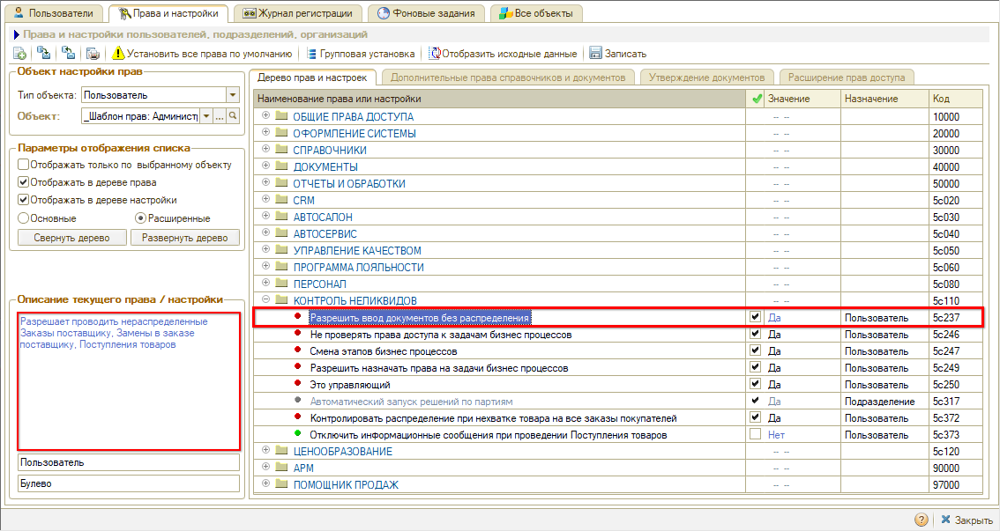

Другими словами, если значение данного права у пользователя будет установлено "Нет", то программа не позволит ему провести нераспределенное Поступление товаров – если даже по одной из всех строк документа не будет полного распределения.

### 2. Контролировать распределение при нехватке товара на все заказы покупателей

*Новое право.* Описание: *"Если поступивший товар может быть распределен на несколько заказов и его не достаточно на все заказы, то требуется указать распределение по заказам".*

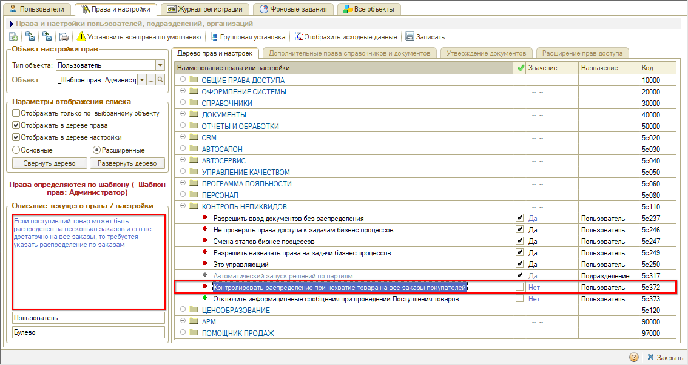

По умолчанию значение данного права устанавливается "Нет". Если установить значение "Да", включается контроль программы за достаточным количеством поступившего товара под все актуальные заказы. Если товар ожидают несколько клиентов, а поступило его мало, то система предупредит, что поступившего товара недостаточно. При попытке провести Поступление с автоматическим режимом распределения программа выдаст предупреждение – нужно будет распределить товар по заказам вручную.

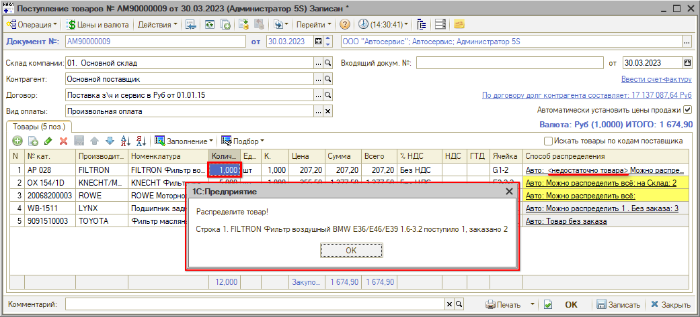

### 3. Отключить информационные сообщения при проведении Поступления товаров

Описание настройки: *"Отключает предупреждения при проведении документа Поступление товаров о возможности дополнительного распределения товаров по Заказам".*

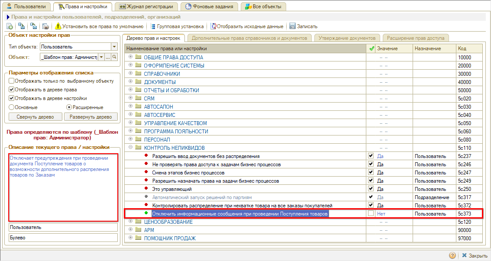

Другими словами, данной настройкой можно отключить информационные сообщения при проведении Поступления о том, что пришла лишняя номенклатура, и можно ее дополнительно распределить по Заказам.

### 4. Закрывать нераспределенные заказы покупателей

Описание права: *"При поступлении товара производится автоматическое закрытие еще нераспределенных заказов покупателей".* Право устанавливается на подразделение, откуда подтягивается к правам текущего пользователя:

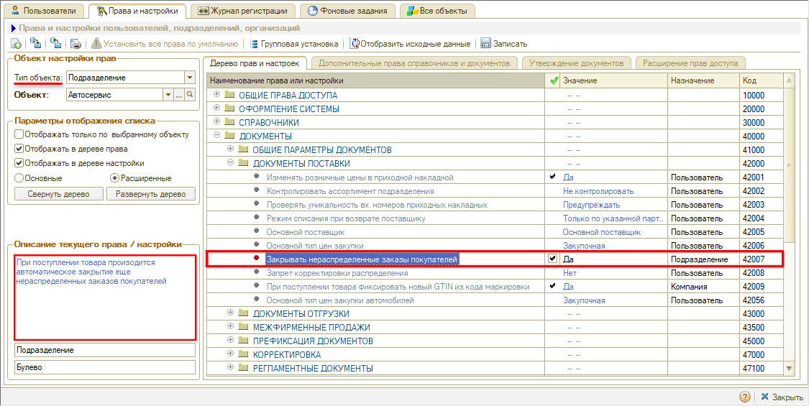

***Варианты использования:***

1) Установить значение "Нет":
При проведении Поступления товаров не будет резервироваться товар под заказы покупателей. Фиксируется только поступление товара на склад.

2) Установить значение "Да":
При проведении Поступления товар будет резервироваться под Заказы покупателей, даже если на их основании не был создан Заказ поставщику.
В документе "Поступление товаров" будет установлен по умолчанию признак *"Закрывать нераспределенные заказы покупателей"*. Галочка отображается в форме "Распределение номенклатуры". Если галочка установлена, то также автоматически будет устанавливаться галочка в меню "Учесть в распределении" напротив пункта "Заказы покупателя (нераспределенные)".

### 5. Отбор заказов для распределения поступившего товара

Описание права: *"Контролирует соответствие подразделения и организации в Заказах (заявках на ремонт, заказ-нарядах), по которым распределяется поступивший товар".*

Право устанавливается на подразделение, откуда подтягивается к правам текущего пользователя.

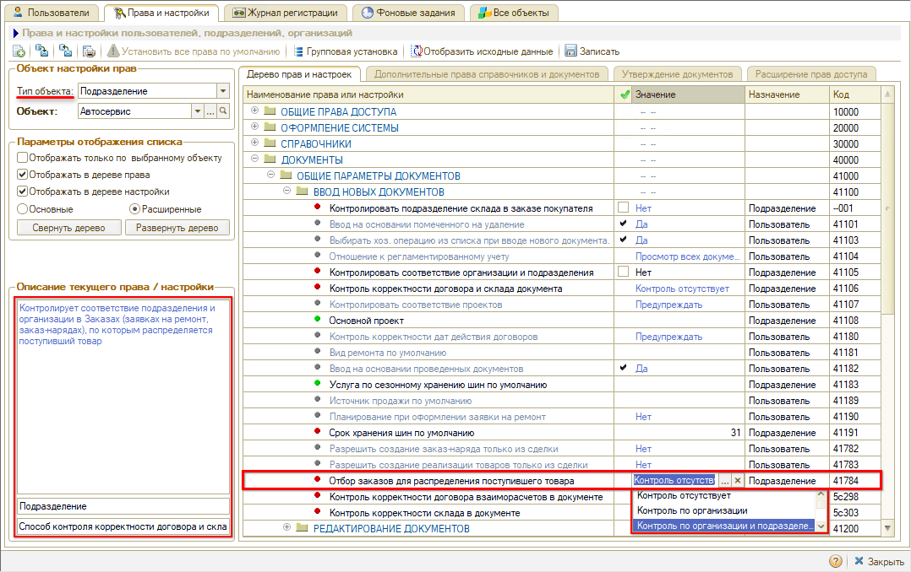

Варианты значений права:

- Контроль отсутствует;
- Контроль по организации;
- Контроль по организации и подразделению.

Право используется для отбора документов, по которым можно распределять поступивший товар при работе с формой "Распределение номенклатуры". То есть, если у организации несколько филиалов, и включен контроль, то пользователь сможет распределять товар только на документы своего филиала.

---

**Теги:** распределение поступлений, поступление товаров, режимы распределения, заказы покупателя, заказы поставщикам, права пользователя, товар без заказа

