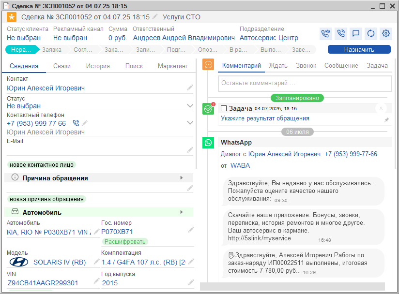

# Идентификация клиента на форме Сделки

<table><tr><td><b>Время чтения:</b> 3 мин.</td><td><b>Обновлено:</b> 23.07.2025</td></tr></table>

Источник: https://www.5systems.ru/help/identifikaciya-klienta-na-forme-sdelki

При звонке клиента в первую очередь требуется его идентифицировать.

При обращении **первичного клиента**, т. е. того, который позвонил или приехал первый раз, требуется заполнить [карточку клиента](../Контрагенты%20и%20контакты/kontragenty-i-kontakty.md). В сделке отобразится только номер его телефона: остальные данные потребуется ввести — либо сразу, либо после записи на ремонт, при непосредственном заезде клиента.

При звонке **повторного клиента** в сделку будут подтягиваться все его данные из созданной ранее карточки клиента, информация об автомобилях клиента, а также история всех его предыдущих обращений, включая документы, задачи, рекомендации и т. д.:

Может потребоваться отредактировать или добавить какие-либо данные.

Если клиент уже есть в базе, но звонит с нового номера телефона, карточку клиента создавать не нужно. Необходимо найти клиента через вкладку **«Поиск»**, перейти в карточку клиента и записать его новый номер телефона:

---

**Теги:** идентификация клиента, сделка, карточка клиента, первичный клиент, повторный клиент, поиск клиента

