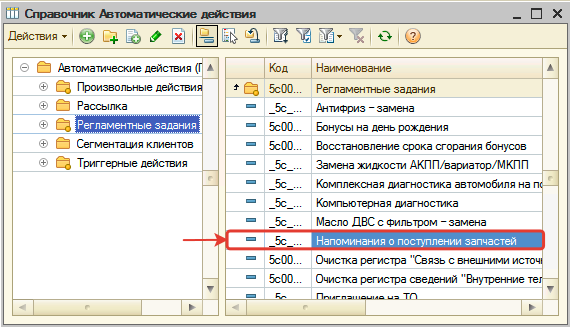
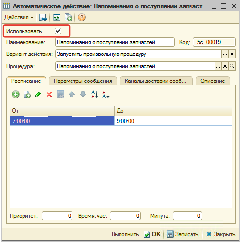
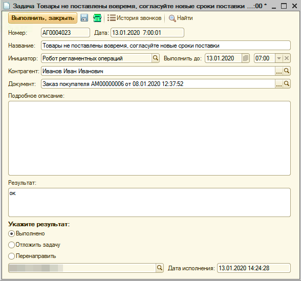
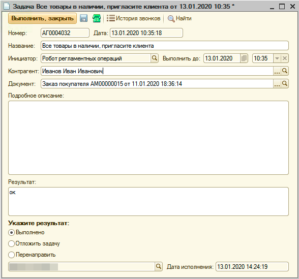
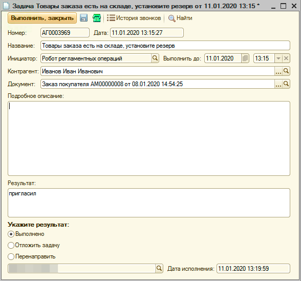
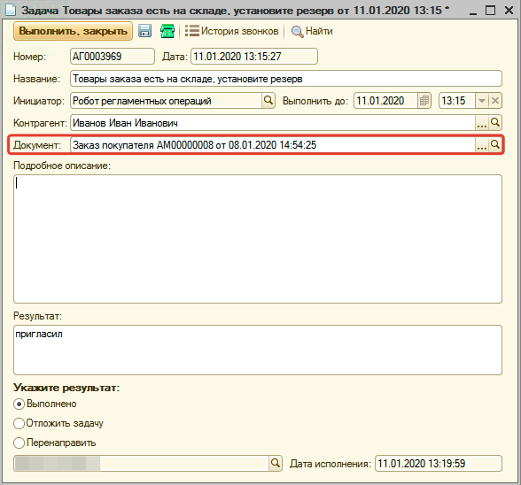
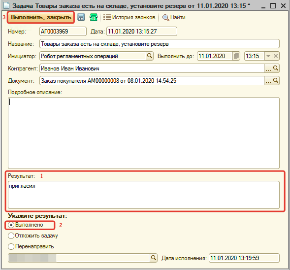

# Информирование клиента о состоянии заказа покупателя

<table><tr><td><b>Время чтения:</b> 7 мин.</td><td><b>Обновлено:</b> 28.06.2022</td></tr></table>

Источник: https://www.5systems.ru/help/informirovanie-klienta-o-sostoyanii-zakaza-pokupatelya

## Введение

В программе есть регламентное задание, при исполнении которого проверяются активные заказы покупателей. В зависимости от текущего состояния заказа автоматически формируется задача для информирования клиента о поступлении товаров или о задержке в поставке.

## Настройка регламентного задания

Для того, чтобы задачи по состояниям заказов покупателей формировались, необходимо активировать автоматическое действие **«Напоминание о поступлении запчастей»**, которое будет выполняться через регламентное задание.

Чтобы активировать автоматическое действие:

**1.** Перейдите в справочник **«Автоматические действия»** (**CRM → Справочники → Автоматические действия**).

**2.** Перейдите в группу **«Регламентные задания»** и найдите действие **«Напоминания о поступлении запчастей»**:

**3.** Перейдите к редактированию действия и установите флажок **«Использовать»**. Можно также установить расписание, в рамках которого будет срабатывать действие:

**4.** Сохраните изменения.

Готово! Автоматическое действие активировано.

## Формируемые типы задач

Формируется один из трех [типов задач](../../CRM/Типы%20задач/tipy-zadach.md) по заказу покупателя:

1. Товары не поставлены вовремя, согласуйте новые сроки.
2. Все товары в наличии, пригласите клиента.
3. Товары заказа есть на складе, установите резерв.

### Товары не поставлены вовремя, согласуйте новые сроки

Если максимальный срок поставки заказа покупателя превышает текущую дату и товар отсутствует на складе, то формируется тип задачи **«Товары не поставлены вовремя, согласуйте новые сроки»**:

В рамках исполнения задачи разберитесь в причинах задержки. При необходимости согласуйте с клиентом новые сроки поставки и исполните задачу.

### Все товары в наличии пригласите клиента

Если товары, зарезервированные для заказа покупателя, поступили на склад, то формируется тип задачи **«Все товары в наличии пригласите клиента»**:

В рамках исполнения задачи проинформируйте клиента о поступлении товаров по заказу и пригласите его для реализации или обслуживания. Результат общения с клиентом зафиксируйте и исполните задачу.

### Товары заказа есть на складе, установите резерв

Если товары, указанные в заказе покупателя, поступили на склад, но по каким-то причинам не зарезервированы под заказ, то формируется тип задачи **«Товары заказа есть на складе, установите резерв»**:

В рамках исполнения задачи зарезервируйте товары в заказе покупателя, проинформируйте клиента о поступлении товаров и пригласите его для реализации или обслуживания. Результат общения с клиентом зафиксируйте и исполните задачу.

## Исполнение задачи

Задача с целью информирования клиента о поступлении или задержке в поставке назначается автору заказа покупателя.

В поле **«Документ»** указан заказ покупателя, по которому необходимо исполнить задачу:

Для исполнения задачи укажите результат, выберите действие **«Выполнено»** и нажмите кнопку **«Выполнить, закрыть»**:

---

**Теги:** заказ покупателя, информирование клиента, регламентное задание, автоматические действия, типы задач, резерв, поступление запчастей

