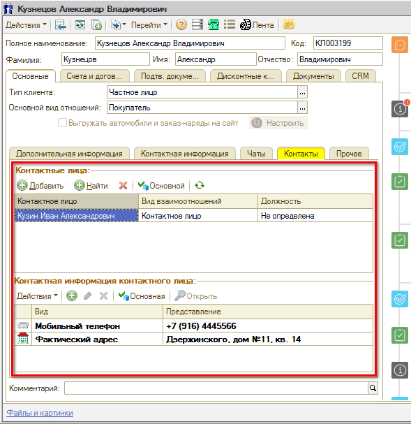
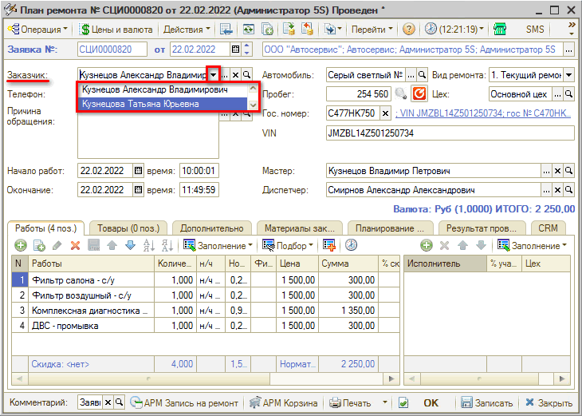

# Контактные лица

<table><tr><td><b>Время чтения:</b> 4 мин.</td><td><b>Обновлено:</b> 14.07.2025</td></tr></table>

Источник: https://www.5systems.ru/help/kontaktnye-lica

## Содержание

- [Введение](#введение)
- [Добавление контактных лиц](#добавление-контактных-лиц)
- [Использование функционала](#использование-функционала)

## Введение

Одни контрагенты могут быть контактными лицами других.

**Пример 1.** У юр. лица может быть несколько контактных лиц — сотрудников, которые будут приезжать ремонтировать свои рабочие автомобили.

**Пример 2.** У физ. лица контактными лицами могут быть родственники. Например, если одним автомобилем пользуются муж и жена или если автомобиль оформлен на одного члена семьи, а фактически пользуется им другой член семьи.

## Добавление контактных лиц

Контактные лица клиента указываются в [карточке контрагента](../Контрагенты%20и%20контакты/kontragenty-i-kontakty.md#карточка-контрагента) на вкладке **«Контакты»**:

Если контрагент уже есть в базе, можно нажать на кнопку , ввести в открывшейся форме номер телефона или Ф. И. О. контактного лица и выбрать. Если такого лица в базе нет, то требуется создать контрагента нажатием на кнопку .

Если у клиента несколько контактных лиц, можно выбрать одного из них в качестве основного нажатием на кнопку .

Если контрагент больше не является контактным лицом клиента, то нужно его удалить из карточки клиента нажатием на кнопку .

В поле **«Контактная информация контактного лица»** указываются контактные данные: номера телефонов, электронная почта, адрес и т. д.

## Использование функционала

Контактные лица могут быть выбраны в качестве Заказчика в документах **«Заявка на ремонт»** и **«Заказ-наряд»**.

Например: муж является владельцем автомобиля, а водит автомобиль, приезжает в автосервис на ремонт и забирает автомобиль жена. Ее нужно выбрать в поле **«Заказчик»**:

В качестве контактного номера будет отображаться телефон Заказчика.

---

**Теги:** контактные лица, контрагенты, карточка клиента, заказчик, заявка на ремонт, заказ-наряд

