

# Контрагенты и контакты

<table><tr><td><b>Время чтения:</b> 20 мин.</td><td><b>Обновлено:</b> 19.12.2024</td></tr></table>

Источник: https://www.5systems.ru/help/kontragenty-i-kontakty-0

## Содержание

- [Справочник «Контрагенты и контакты»](#справочник-контрагенты-и-контакты)
- [Карточка контрагента](#карточка-контрагента)
- [Справочник «Виды взаимоотношений»](#справочник-виды-взаимоотношений)
- [Справочник «Виды контактной информации»](#справочник-виды-контактной-информации)
- [Адресная книга](#адресная-книга)
- [Способы перехода в карточку клиента в программе](#способы-перехода-в-карточку-клиента-в-программе)
- [Добавление клиента в базу](#добавление-клиента-в-базу)

## Справочник «Контрагенты и контакты»

Справочник **«Контрагенты и контакты»** содержит перечень всех контрагентов компании — клиентов, поставщиков, подрядчиков и т. п. — и их контактных лиц.

### Способы перехода в справочник

**1. Из стандартного меню системы:** **Справочники → Идентификационные → Контрагенты и контакты**.

**2. Из меню интерфейса:** **Автосервис → Приемка → Справочники → Клиенты**:

### Работа со справочником

Кнопки панели управления:

| Кнопка | Описание |
| --- | --- |
|  | **Добавить** — создать новую карточку контрагента |
|  | **Добавить группу** — создать папку для группировки списка |
|  | **Добавить новый элемент копированием** |
|  | **Изменить** текущий элемент |
|  | **Установить пометку удаления** |
|  | **Включить/отключить иерархический просмотр** |
|  | **Переместить элемент в другую группу** |
|  | **Фильтры и отборы** |
|  | **Ввести на основании** |
|  | **Обновить** текущий список |
|  | **Перейти к связанной информации** |
|  | **Отобразить/скрыть панель информации** |
|  | **Поиск** по справочнику |
|  | **Вывод на печать** |

## Карточка контрагента

Карточка элемента справочника **«Контрагенты и контакты»** содержит несколько вкладок.

### 1. «Основные»

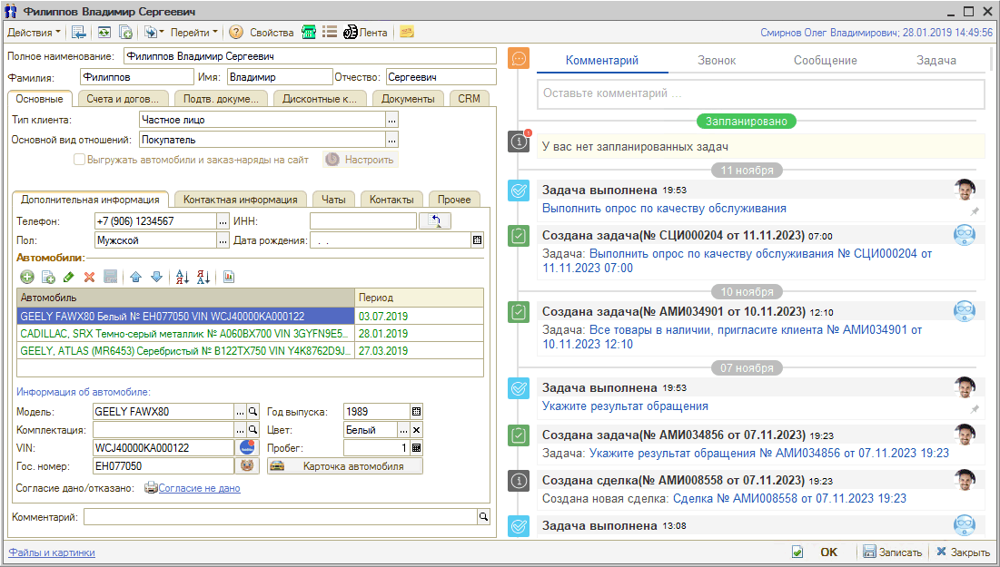

Описание полей вкладки:

| Поле | Содержимое |
| --- | --- |
| **Полное наименование** | Полное наименование контрагента. Реквизит обязателен для заполнения |
| **Тип клиента** | Форма собственности контрагента. Возможные значения: Юридическое лицо, Частный предприниматель, Частное лицо, Обособленное подразделение, Прочее |
| **Основной вид отношений** | Основной вид взаимодействия компании с контрагентом: Покупатель, Поставщик, Подотчетное лицо, Филиал, Собственник, Контактное лицо, Прочее.  Контрагент может быть поставщиком, подотчетным лицом, клиентом и др. Все они находятся в одном справочнике, но имеют разные виды взаимоотношений. Назначение вида не строгое: например, поставщику можно производить отгрузку |
| **Срок поставки** | Количество дней, в течение которых обычно осуществляется поставка данным контрагентом. По умолчанию «0». Реквизит доступен только при виде отношений «Поставщик» |

Выбор основного вида отношений:

Вкладка **«Основные»** в свою очередь разделена на пять вложенных вкладок.

**1. Дополнительная информация:**

- **ИНН** — идентификационный номер налогоплательщика. Не активно при типе клиента «Частное лицо».
- **Код по ОКПО** — код контрагента по Общероссийскому классификатору предприятий и организаций. Недоступно при типе клиента «Частное лицо».
- **КПП** — код причины постановки на учет. Формируется из ИНН. Недоступно при типе клиента «Частное лицо».
- **Код ИМНС** — код налоговой инспекции контрагента, первые 4 цифры ИНН. Недоступно при типе клиента «Частное лицо».
- **Комментарий** — дополнительная информация о контрагенте.

В таблице **«Автомобили»** отображается список автомобилей данного контрагента.

**2. Контактная информация.** Здесь вводятся телефоны, адреса, адреса электронной почты и пр.:

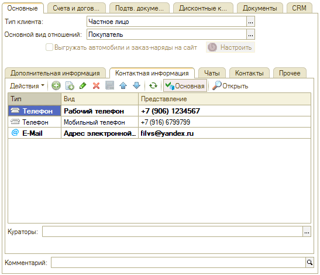

**3. Чаты.** Отображается информация о чатах, с которыми связан клиент:

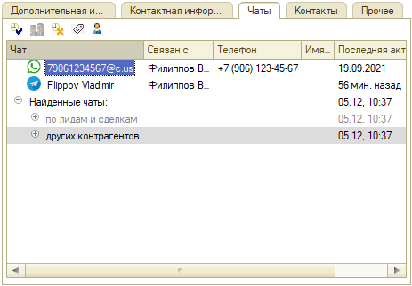

Подробнее см. статью «[Чаты клиента](../../CRM/Чаты%20клиента/chaty-klienta.md)».

**4. Контакты:**

- **Контактные лица** — данные о контактных лицах данного контрагента (Ф. И. О., вид взаимоотношений, должность и др.). Подробнее см. статью «[Контактные лица](../Контактные%20лица/kontaktnye-lica.md)».
- **Контактная информация контактного лица** — телефон, адрес, адрес электронной почты и т. п. для каждого контактного лица данного контрагента.

**5. Прочее.** Дополнительная информация о контрагенте:

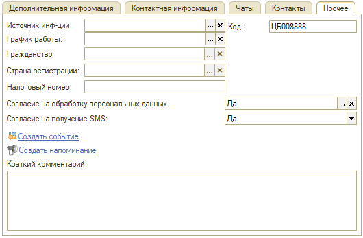

- **Источник инф-ции** — внешние источники информации о контрагенте, ссылается на справочник «Источники информации».
- **График работы** — график работы контрагента, ссылается на справочник «Графики работы».
- **Гражданство** — гражданство контрагента.
- **Страна регистрации** — страна, где зарегистрирован контрагент.
- **Налоговый номер** — налоговый номер контрагента.
- **Согласие на обработку персональных данных** — отметка о согласии на обработку персональных данных.
- **Согласие на получение SMS** — отметка о согласии на получение SMS.

### 2. «Счета и договоры»

Вкладка содержит таблицу, в которую заносится информация из справочников **«Банковские счета»** и **«Договоры взаиморасчетов»**:

Можно задать основной банковский счет и основной договор: они выделяются полужирным шрифтом и будут подставляться в документы при создании по умолчанию. Для этого нужно выделить нужную строку в таблице и нажать кнопку **«Основной»**.

### 3. «Подтв. документы»

Вкладка содержит список подтверждающих документов для контрагента — доверенность, лицензия и т. п.:

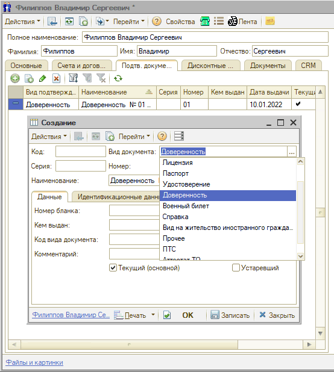

Реквизиты **«Текущий»** и **«Устаревший»** информируют, актуален ли этот документ в данный момент или устарел и не используется.

### 4. «Дисконтные карты»

Таблица со списком дисконтных карт, зарегистрированных на контрагента, с накопленной суммой. Над таблицей справа отображается общая расчетная сумма, накопленная данным контрагентом:

### 5. «Документы»

Здесь собраны все документы, созданные в программе по данному контрагенту, — Заказы, Поступление товаров, Приходные ордера, Банковские выписки, Заявки на ремонт, Заказ-наряды и т. д.:

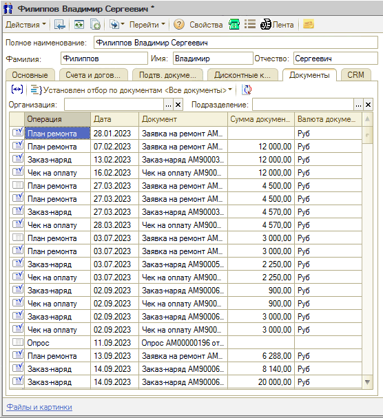

### 6. «CRM»

Информация о клиенте представлена на трех вкладках:

- **«Бонусы»**;
- **«Внешние пользователи»** — отмечена регистрация клиента в Мобильном приложении, участие в программе лояльности и т. д.;
- **«Категории клиентов»** — позволяет отметить особый статус клиента.

## Справочник «Виды взаимоотношений»

Справочник **«Виды взаимоотношений»** (**Справочники → Идентификационные → Виды взаимоотношений**) служит для классификации отношений между контрагентами и/или их контактными лицами:

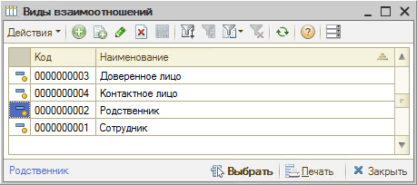

## Справочник «Виды контактной информации»

Справочник **«Виды контактной информации»** (**Справочники → Идентификационные → Виды контактной информации**) служит для классификации контактной информации:

Типы и виды контактной информации различаются.

**Типы** контактной информации жестко заданы в конфигурации и не могут быть изменены пользователем. К ним относятся: Телефон, Адрес, E-Mail, Веб-страница, Номер ICQ, Другое, Местоположение.

**Виды** контактной информации пользователь может задавать в произвольном количестве в рамках одного типа. Так, типу «Адрес» соответствуют четыре предопределенных вида:

- Юридический адрес;
- Почтовый адрес;
- Фактический адрес;
- Адрес за пределами РФ.

Эти четыре значения уже занесены в текущую конфигурацию и не могут быть изменены пользователем. Но перечень видов контактной информации можно расширить кнопкой **«Добавить»** на командной панели справочника.

## Адресная книга

Обработка **«Адресная книга»** (**Справочники → Идентификационные → Адресная книга**) предназначена для просмотра, поиска и редактирования контактной информации:

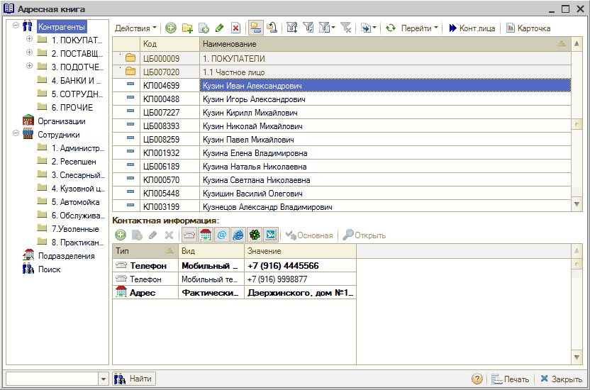

Окно обработки разделено на три области:

**1. Дерево объектов** (слева). Содержит разделы «Контрагенты», «Организации», «Сотрудники», «Подразделения», а также команду «Поиск», при помощи которой можно осуществить полнотекстовый поиск записей по нужному объекту.

**2. Список контрагентов** (справа вверху) с функциональной панелью. При выборе раздела дерева объектов в списке отображаются соответствующие этому разделу строки. Кнопка **«Карточка»** позволяет вывести на печать карточку клиента.

**3. Контактная информация** (справа внизу). Предназначена для просмотра и редактирования контактной информации по выбранному объекту. Кнопки фильтрации ограничивают состав выводимой информации. Кнопка **«Основная»** устанавливает выбранную контактную информацию в качестве основной для данного типа. Кнопка **«Открыть»** открывает выделенный в списке веб-сайт или создает электронное письмо.

## Способы перехода в карточку клиента в программе

### 1. Из Сделки

При нажатии на имя клиента в [Сделке](../../CRM/Работа%20со%20сделкой/rabota-so-sdelkoy.md) появляются кнопки **«Выбрать»**, **«Очистить»** и **«Показать»**:

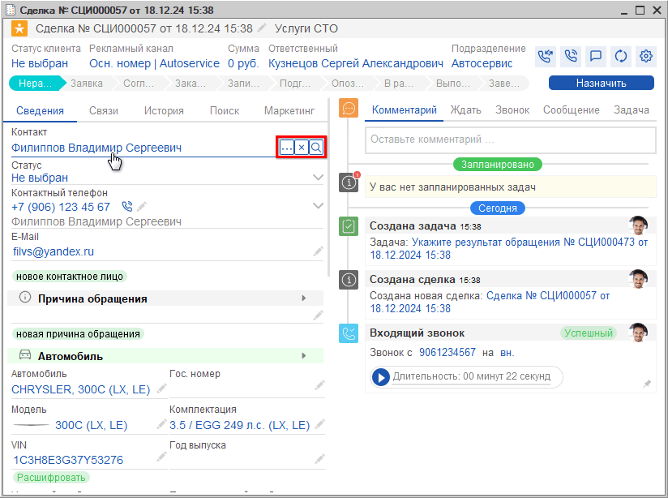

Кнопка  **«Показать»** открывает карточку клиента. Кнопка  **«Выбрать»** открывает справочник «Контрагенты и контакты».

### 2. Из АРМ «Клиенты и автомобили»

В АРМ **«[Клиенты и автомобили](https://www.5systems.ru/help/rabota-v-arm-klienty-i-avtomobili)»** можно найти имеющегося в базе клиента по фамилии или номеру телефона и открыть карточку клиента двойным кликом по нужной строке в списке клиентов:

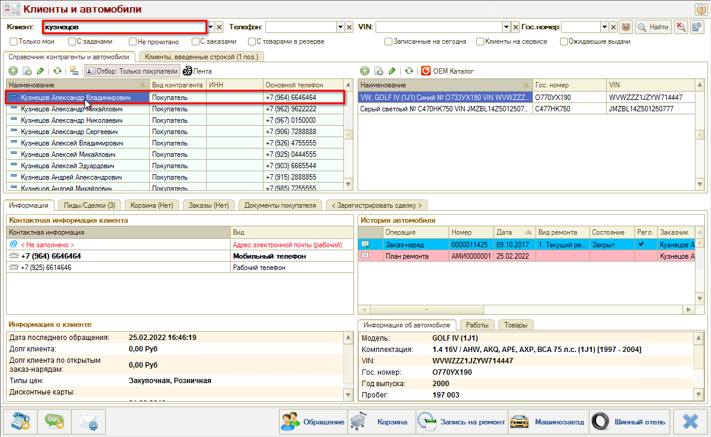

### 3. Из АРМ «Корзина»

Открыть карточку клиента или перейти в справочник для выбора другого клиента можно из АРМ **«[Корзина](https://www.5systems.ru/help/rabota-v-arm-korzina)»** нажатием на кнопки **«Выбрать»** или **«Открыть»** в поле **«Клиент»**:

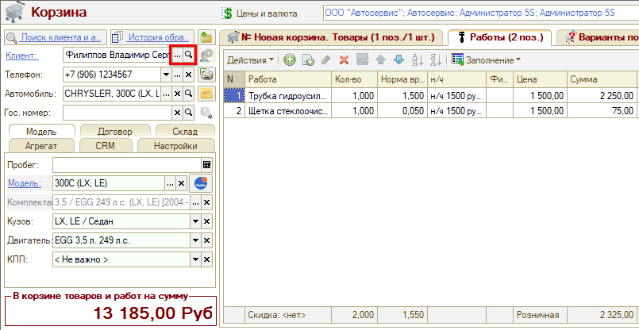

### 4. Из АРМ «Запись на ремонт»

Из АРМ **«[Запись на ремонт](https://www.5systems.ru/help/kalendar-dlya-planirovaniya-rabot)»** также можно перейти в карточку клиента или открыть справочник «Контрагенты и контакты» нажатием кнопок **«Выбрать»** или **«Открыть»** в поле **«Клиент»**:

### 5. Из документов

Из документов **«Заявка на ремонт»**, **«Заказ-наряд»**, **«Заказ покупателя»** карточка контрагента и справочник «Контрагенты и контакты» открываются кнопками **«Выбрать»** и **«Открыть»** в поле **«Заказчик»** (а также в поле **«Плательщик»**):

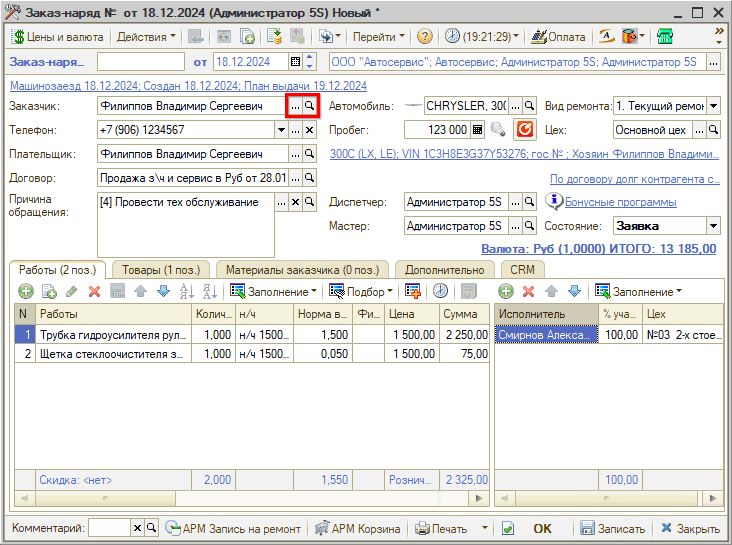

## Добавление клиента в базу

### 1. Из АРМ «Клиенты и автомобили»

В АРМ **«Клиенты и автомобили»** можно найти имеющегося в базе клиента и зарегистрировать новую Сделку. Если клиент не найден в программе по телефону, то можно создать карточку клиента по кнопке **«Добавить»** в области **«Список клиентов»** и заполнить данные:

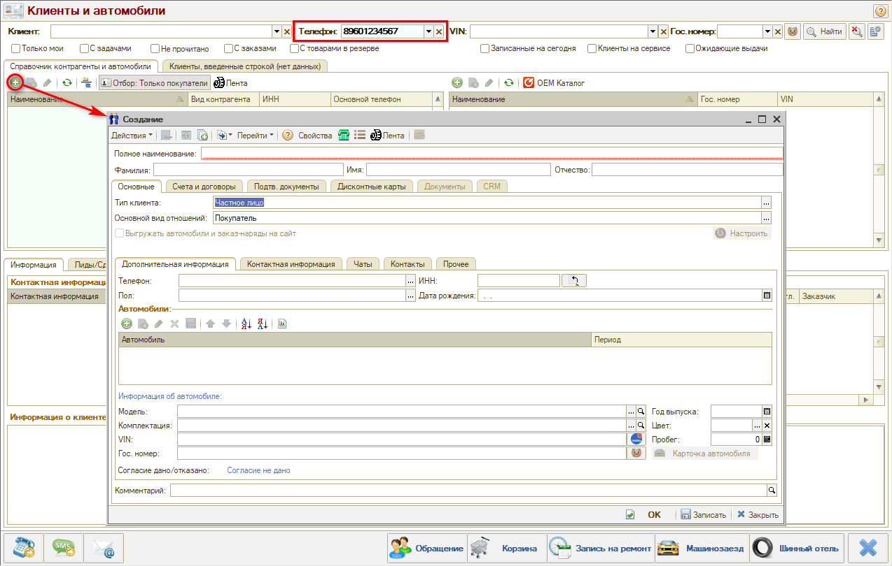

### 2. Из Сделки

#### Способ 1

Если клиент звонит в первый раз, нужно его записать: спросить имя или Ф. И. О. и ввести в строку **«Контакт»**. Это уже уникальный клиент — по номеру телефона, — соответственно, можно создать карточку клиента.

Для этого следует сохранить сделку нажатием на кнопку **«Сохранить»**, затем нажать кнопку **«Добавить в карточку»** под номером телефона и снова **«Сохранить»**:

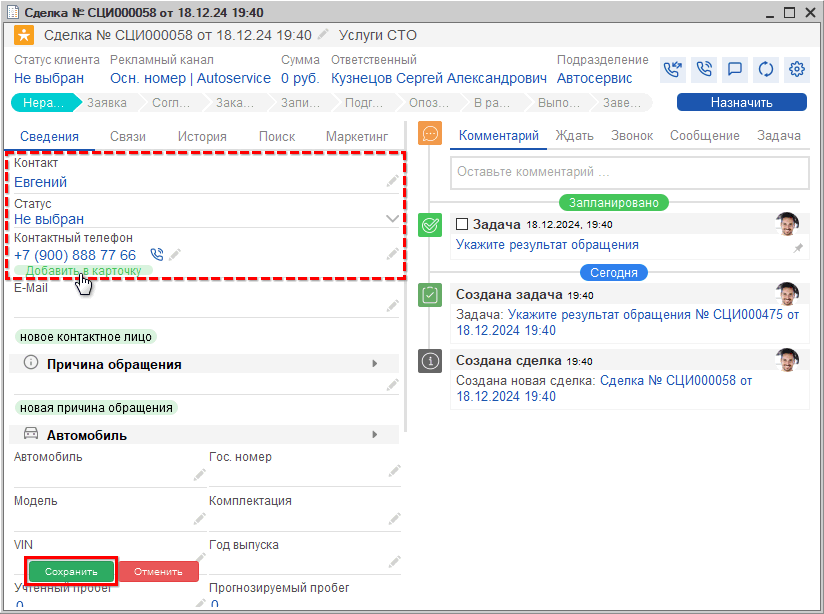

Карточка клиента создана в базе, в нее подгружаются имя и номер телефона клиента. Для записи клиента на ремонт достаточно телефона и имени клиента, а также наименования автомобиля.

При заезде клиента требуется заполнить полные Ф. И. О. и все остальные данные по клиенту — пол, контакты и т. д.:

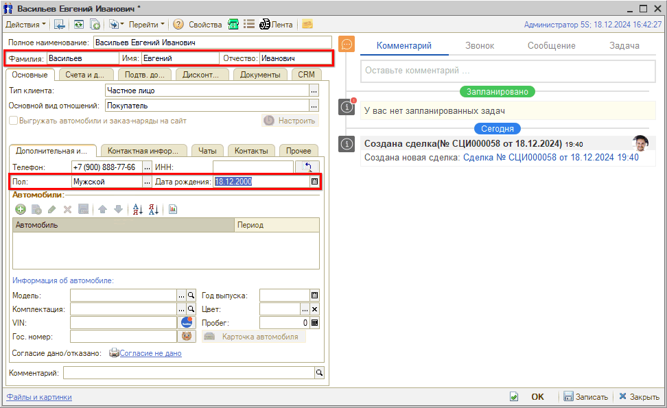

#### Способ 2

В поле **«Контакт»** нажать на карандаш (редактирование), затем на появившуюся кнопку **«Очистить»**:

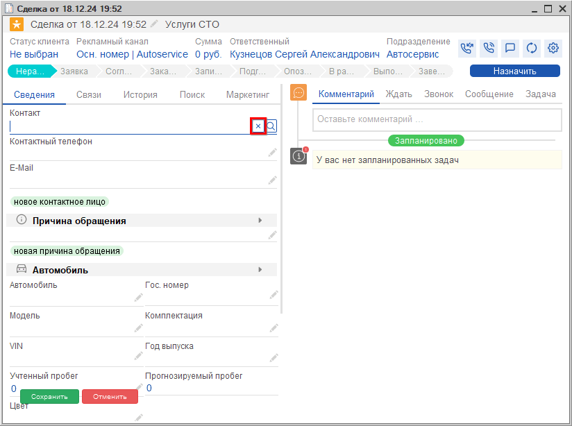

Появляется кнопка **«Выбрать»**, нажатием на которую открывается окно **«Выбор типа данных»**. Требуется выбрать **«Контрагенты и контакты»** и нажать **«ОК»**:

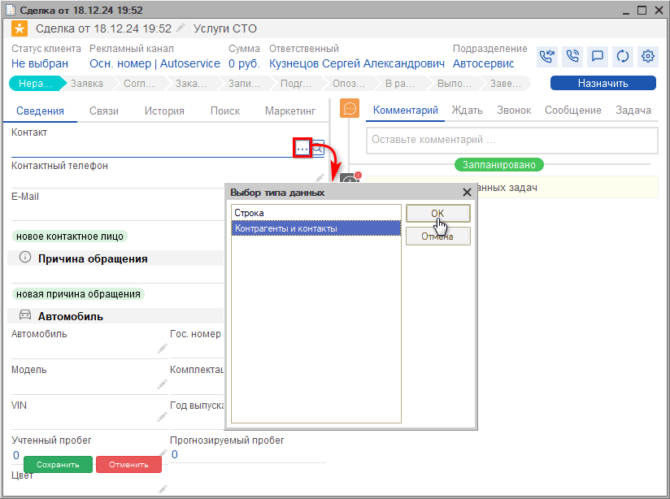

Появляются кнопки **«Выбрать»**, **«Очистить»** и **«Показать»**. Нажатием на кнопку **«Выбрать»** открывается справочник «Контрагенты и контакты»:

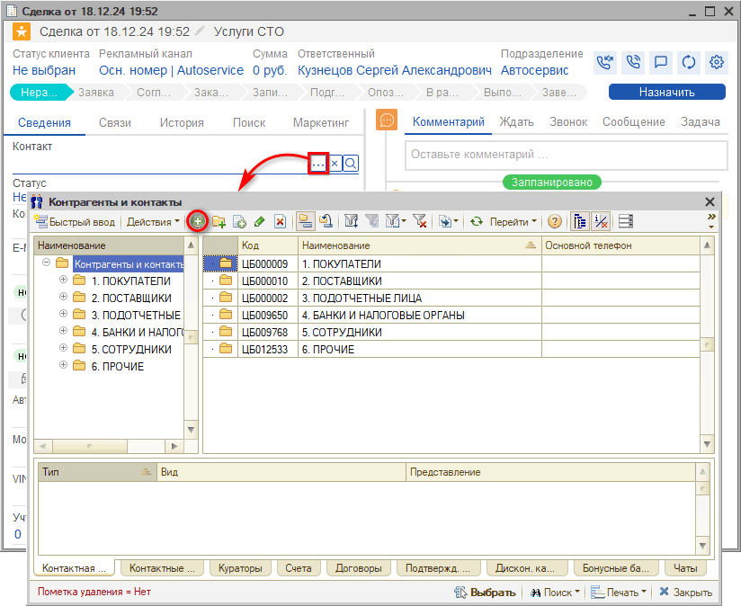

В справочнике требуется создать новый элемент — карточку клиента — нажатием на кнопку **«Добавить»** и полностью заполнить данные по клиенту.

### 3. Из справочника «Контрагенты и контакты»

При необходимости можно открыть через меню программы справочник «Контрагенты и контакты» (см. выше) и создать карточку клиента добавлением нового элемента:

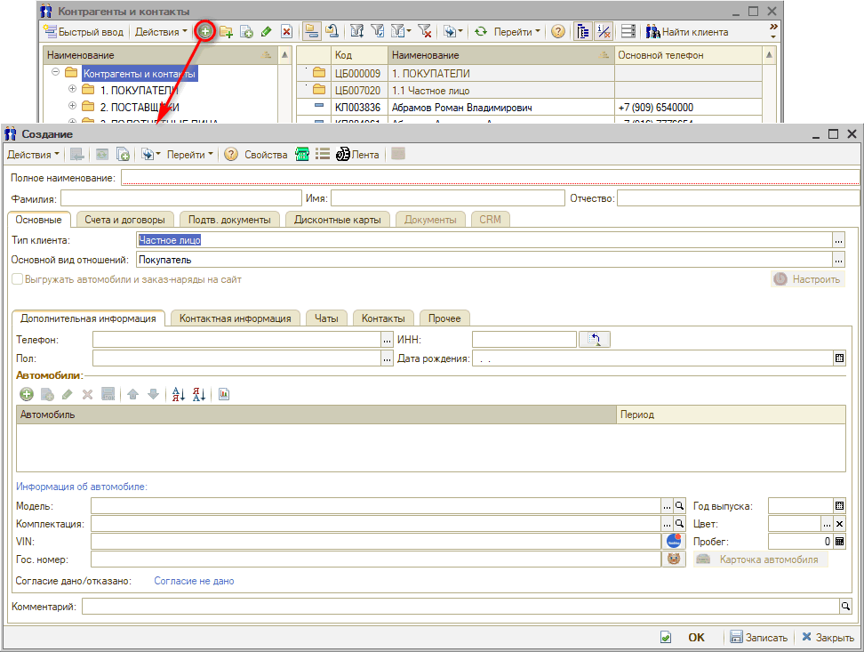

**Примечание.** Для дальнейшего удобства работы со справочником рекомендуется включить иерархический просмотр и выбрать или создать определенную папку, в которой располагаются именно клиенты. Для поиска по всему справочнику, напротив, рекомендуется отключить иерархический просмотр.

### 4. Из Заказ-наряда

При создании Заказ-наряда на основании Заявки на ремонт, если клиент был введен строкой, открывается диалоговое окно, из которого можно создать карточку контрагента нажатием на кнопку **«Открыть форму ввода контрагента»**:

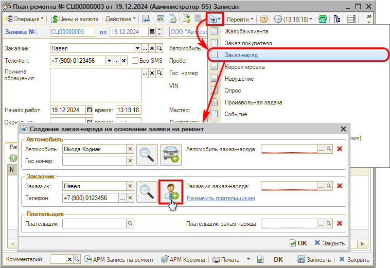

---

**Теги:** Контрагенты, контакты, карточка клиента, справочник, контактная информация, виды взаимоотношений, адресная книга, дисконтные карты, добавление клиента, АРМ

