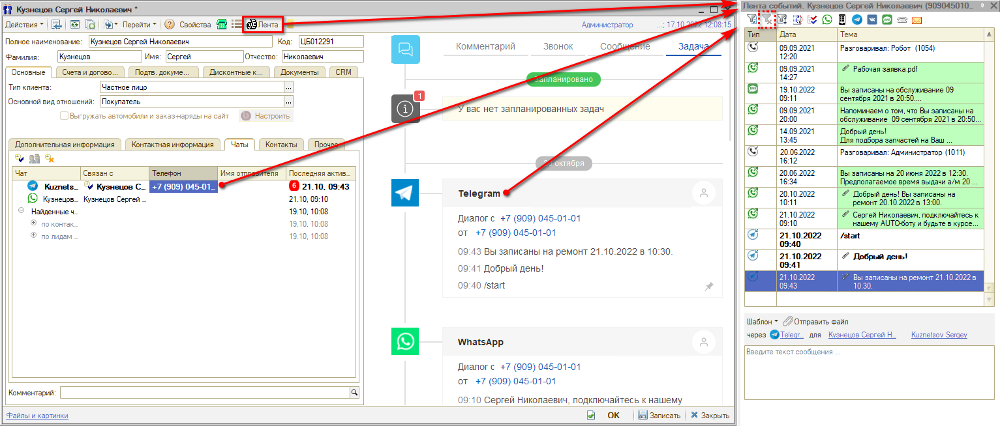
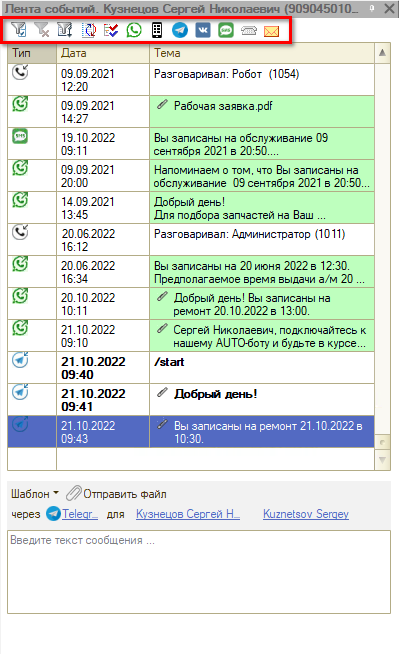
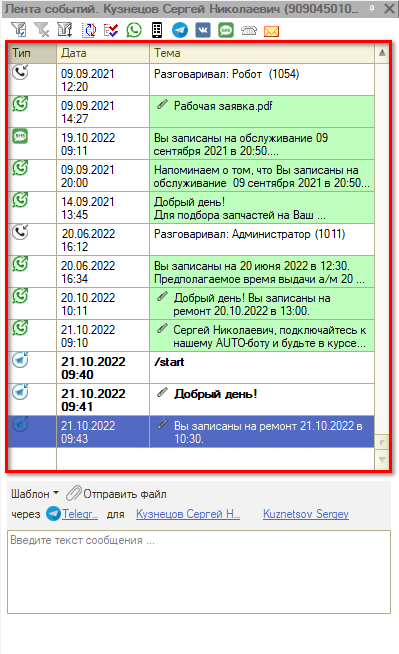
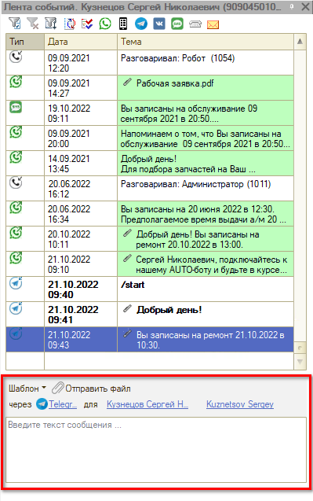
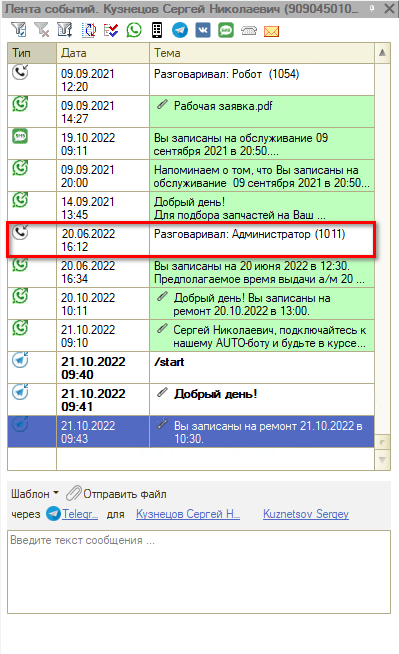
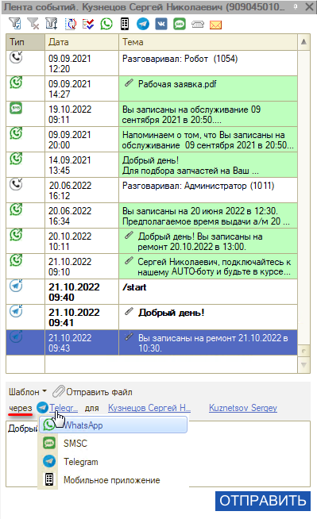
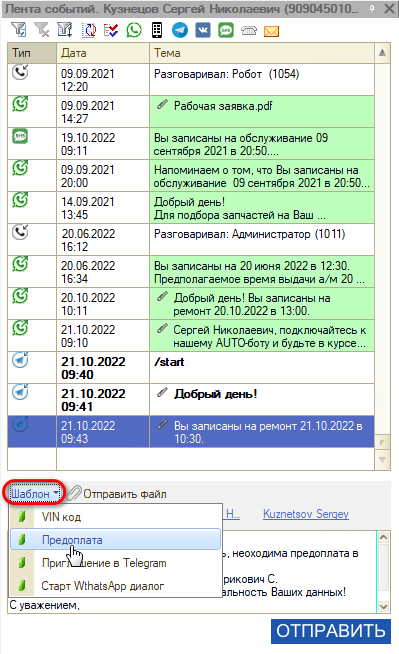
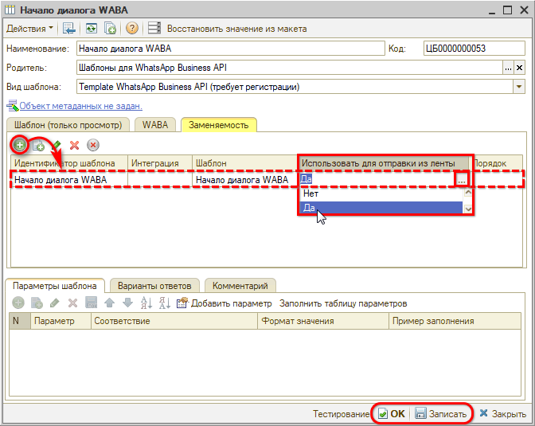

# Лента событий

<table><tr><td><b>Время чтения:</b> 8 мин.</td><td><b>Обновлено:</b> 27.06.2022</td></tr></table>

Источник: https://www.5systems.ru/help/lenta-sobytiy

## Содержание

- [Введение](#введение)
- [Интерфейс Ленты событий](#интерфейс-ленты-событий)
  - [Кнопки верхней панели](#кнопки-верхней-панели)
  - [История общения](#история-общения)
  - [Поле отправки сообщений](#поле-отправки-сообщений)
- [Использование Ленты событий](#использование-ленты-событий)
  - [Прослушивание разговоров с клиентами](#прослушивание-разговоров-с-клиентами)
  - [Отправка сообщений клиентам](#отправка-сообщений-клиентам)
  - [Использование шаблона для отправки сообщения](#использование-шаблона-для-отправки-сообщения)

## Введение

Общение с клиентом в программе осуществляется посредством телефонии, через отправку SMS, через мессенджеры MAX, ВКонтакте, а также через мобильное приложение. Просмотр истории общения с клиентом производится в **«Ленте событий»**:

Лента событий может быть открыта нажатием на кнопку **«Лента»** в [карточке клиента](../Контрагенты%20и%20контакты/kontragenty-i-kontakty.md#карточка-контрагента) или нажатием на [диалог или чат](../../Сообщения/Чаты%20клиента/chaty-klienta.md) в карточке клиента или сделке, а также из других мест программы.

**Примечание.** При вызове нажатием на чат или диалог Лента событий открывается в контексте определенного мессенджера или конкретного диалога. Чтобы просмотреть всю историю общения с клиентом, следует отключить отбор (см. описание кнопок отбора далее).

## Интерфейс Ленты событий

### Кнопки верхней панели

На верхней панели Ленты событий расположены следующие элементы управления и отборы:

| Кнопка | Описание |
| --- | --- |
| **Отборы** | |
|  | Отбор по значению в текущей колонке |
|  | Отключить отбор |
|  | Установить отбор: открывается окно установки отборов |
| **Кнопки управления** | |
|  | Обновить |
|  | Пометить как прочтенные |
| **Фильтры по мессенджерам и другим каналам связи** | |
|  | WhatsApp |
|  | Мобильное приложение |
|  | Telegram |
|  | ВКонтакте |
|  | SMS-сообщения |
|  | Телефонные звонки |
|  | Электронная почта |

### История общения

История общения с клиентом содержит перечень всех входящих и исходящих звонков и сообщений, отсортированных по дате:

В колонке **«Тип»** отображается значок канала связи: направление стрелки на нем указывает, входящее или исходящее это сообщение или звонок.

### Поле отправки сообщений

Внизу Ленты событий находится поле для отправки сообщений клиенту:

Отсюда можно отправить клиенту сообщение — произвольное либо с использованием шаблона (см. далее).

## Использование Ленты событий

### Прослушивание разговоров с клиентами

Чтобы прослушать разговор с клиентом, необходимо дважды кликнуть левой клавишей мыши на событие **«Звонок»**:

### Отправка сообщений клиентам

Для отправки сообщения клиенту необходимо в меню **«Отправить через»** выбрать способ отправки:

Затем в форме ввода сообщения следует ввести текст сообщения, при необходимости можно прикрепить файл и нажать на кнопку **«Отправить»**.

Отправленное сообщение отобразится в Ленте событий.

### Использование шаблона для отправки сообщения

Для отправки сообщений клиентам можно использовать преднастроенные шаблоны сообщений. Для этого достаточно выбрать нужный шаблон, после чего автоматически заполнится поле ввода сообщения:

Чтобы добавить для выбора другие шаблоны сообщений, необходимо в нужном шаблоне включить параметр использования для отправки из Ленты. Для этого:

1. В справочнике **«Шаблоны сообщений»** (**Администрирование → Компания → CRM → Шаблоны сообщений**) выберите и откройте форму нужного шаблона.
2. Перейдите на вкладку **«Заменяемость»**.
3. Добавьте новую строку — в нее автоматически подтянется шаблон.
4. Дважды кликните на ячейку в столбце **«Использовать для отправки из ленты»** и выберите значение **«Да»**:

   

5. Запишите изменения нажатием на кнопку **«Записать»** или **«ОК»**.

---

**Теги:** лента событий, история общения, мессенджеры, WhatsApp, Telegram, ВКонтакте, SMS, шаблоны сообщений, прослушивание разговоров

