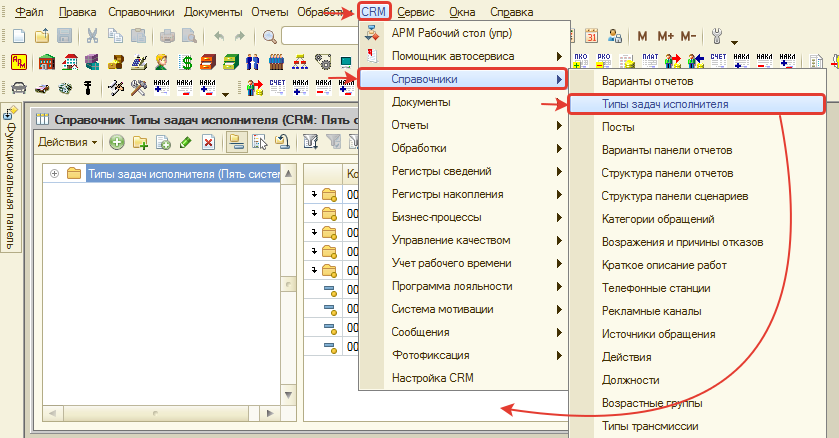
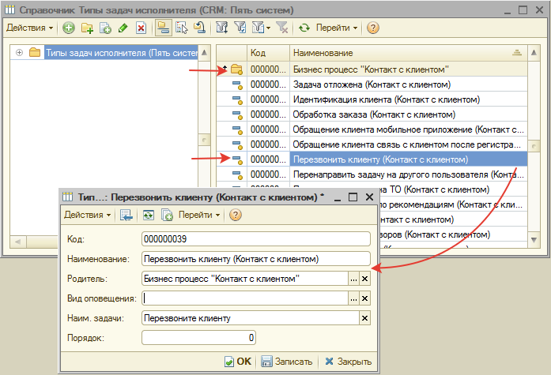
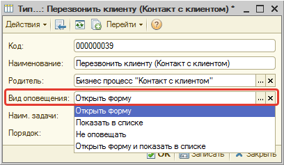
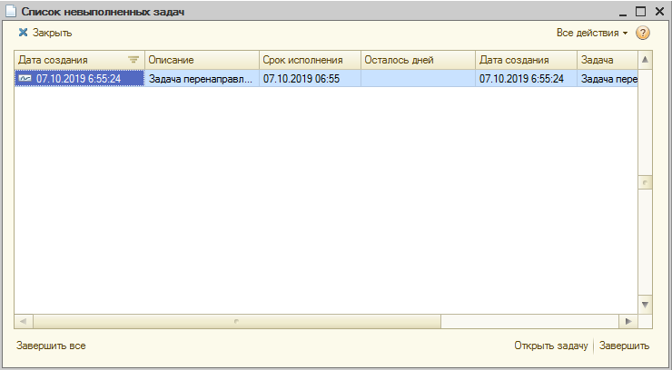

# Напоминания по задачам

<table><tr><td><b>Время чтения:</b> 7 мин.</td><td><b>Обновлено:</b> 27.06.2022</td></tr></table>

Источник: https://www.5systems.ru/help/napominaniya-po-zadacham

## Введение

В программе предусмотрен функционал напоминаний по задачам при наступлении срока их исполнения.

Напоминания могут срабатывать разными способами:

1. **Открытие формы задачи** текущему пользователю — исполнителю задачи.
2. **Отображение задачи в окне напоминаний** — представляет собой список невыполненных задач текущего пользователя.

Для включения функционала напоминаний необходимо:

1. Установить права и настройки напоминаний для пользователей.
2. Установить способ напоминаний по типу задач.

## Права и настройки напоминаний

Для включения функционала напоминаний необходимо активизировать настройку **ПЯТЬ СИСТЕМ → БАЗОВАЯ CRM → Напоминать о невыполненных задачах**.

Кроме того, предусмотрены еще настройки раздела **ПЯТЬ СИСТЕМ → БАЗОВАЯ CRM**:

1. **Период напоминаний** — указывается, через сколько секунд должны срабатывать напоминания.
2. **Период открытия форм задач** — указывается, через сколько секунд проверять наличие задач, требующих напоминания.

## Настройка способов напоминаний по типам задач

Каждая задача относится к тому или иному [типу](../../CRM/Типы%20задач/tipy-zadach.md): Перезвоните клиенту, Пригласите клиента на ТО, Примите решение и т. п. Для настройки напоминаний необходимо определить типы задач, по которым требуется напоминать об исполнении, и указать, каким способом производить напоминание. Для этого:

**1.** Перейдем в справочник **«Типы задач исполнителя»**:

**2.** Выберем тип задач, для которого необходимо включить напоминание, и откроем его форму:

Для удобства типы задач разбиты на группы с названием Бизнес-процесса, в котором они участвуют.

**3.** Установим значение для поля **«Вид оповещения»**:

Если значение не установлено или установлено значение «Не оповещать», то по типу задач напоминания срабатывать не будут.

**4.** Сохраним изменения, нажав кнопку **«ОК»** формы типа задачи.

### Способы напоминаний

1. **Открыть форму** — исполнителю сразу открывается форма задачи для исполнения.
2. **Показать в списке** — исполнителю открывается окно «Список невыполненных задач», в котором отображается задача, требующая исполнения.
3. **Открыть форму и показать в списке** — совмещены первые два способа.

## Список невыполненных задач

Если для типа задач установлен вид оповещения **«Показать в списке»** или **«Открыть форму и показать в списке»**, то при наступлении срока исполнения задачи она отобразится в окне **«Список невыполненных задач»**:

Для того, чтобы напоминания по задаче больше не появлялись, необходимо:

1. либо **завершить ее** — выделить задачу в списке и нажать кнопку **«Завершить»** для завершения определенной задачи или нажать кнопку **«Завершить все»** для исполнения всех задач в списке;
2. либо **открыть форму задачи** — выделить задачу и нажать кнопку **«Открыть задачу»**.

---

**Теги:** напоминания, задачи, типы задач, вид оповещения, список невыполненных задач, базовая CRM

