

# Работа в АРМ Клиенты и автомобили

<table><tr><td><b>Время чтения:</b> 20 мин.</td><td><b>Обновлено:</b> 17.06.2022</td></tr></table>

Источник: https://www.5systems.ru/help/rabota-v-arm-klienty-i-avtomobili

## Содержание

- [Введение](#введение)
- [Поиск клиентов и автомобилей](#поиск-клиентов-и-автомобилей)
  - [Настройка полей поиска](#настройка-полей-поиска)
  - [Результаты поиска](#результаты-поиска)
- [Обработка данных](#обработка-данных)
  - [1. Просмотр информации по клиенту и его автомобилям](#1-просмотр-информации-по-клиенту-и-его-автомобилям)
  - [2. Редактирование контактной информации](#2-редактирование-контактной-информации)
  - [3. Связь с клиентом по телефону/SMS/e-mail](#3-связь-с-клиентом-по-телефонуsmse-mail)
  - [4. Переход в связанные АРМ по выбранному клиенту](#4-переход-в-связанные-арм-по-выбранному-клиенту)
  - [5. Просмотр и создание документов, связанных с клиентом](#5-просмотр-и-создание-документов-связанных-с-клиентом)
  - [6. Подбор товаров](#6-подбор-товаров)
  - [7. Отслеживание состояний по заказам покупателей и их обработка](#7-отслеживание-состояний-по-заказам-покупателей-и-их-обработка)
  - [8. Просмотр истории подборов товаров в корзине](#8-просмотр-истории-подборов-товаров-в-корзине)
  - [9. Регистрация обращения](#9-регистрация-обращения)
- [Видеоинструкции по работе с АРМ Клиенты и автомобили](#видеоинструкции-по-работе-с-арм-клиенты-и-автомобили)

## Введение

АРМ **«Клиенты и автомобили»** содержит всю основную информацию по клиентам и автомобилям, предоставляет возможность быстрого поиска и обработки данных.

## Поиск клиентов и автомобилей

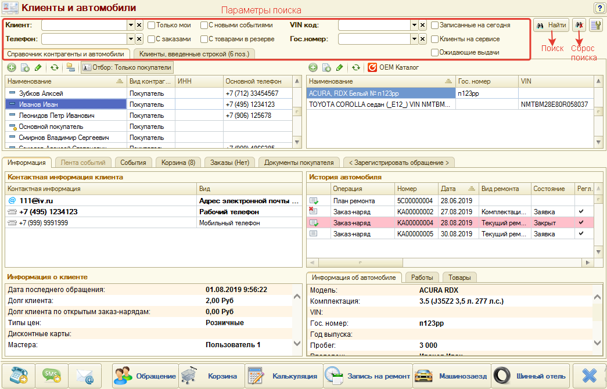

Поиск можно осуществлять конкретного клиента/автомобиля или списка клиентов/автомобилей, удовлетворяющего различным критериям.

Для поиска конкретного клиента/автомобиля используются параметры в виде полей ввода:

- **Клиент** — поиск по наименованию или номеру дисконтной карты.
- **Телефон (контактная информация)** — поиск по номеру телефона, адресу электронной почты, другой контактной информации.
- **VIN код** — поиск по VIN/номеру кузова.
- **Гос. номер** — поиск по государственному номеру автомобиля.

Поиск происходит по частичному совпадению введенных данных в полях ввода. Параметры поиска в полях ввода можно настроить при необходимости (см. [Настройка полей поиска](#настройка-полей-поиска)).

Для отбора списка клиентов/автомобилей используются критерии, которые устанавливаются в виде флажков:

- **Только мои** — отображаются клиенты, у которых есть заказы, события, заказ-наряды, заявки на ремонт, где автором или менеджером является текущий пользователь.
- **С новыми событиями/задачами** — отображаются клиенты, для которых есть необработанные события.
- **С заказами** — отображаются клиенты, у которых есть незавершенные заказы.
- **С товарами в резерве** — отображаются клиенты, у которых есть зарезервированные на складах товары.
- **Записанные на сегодня** — отображаются клиенты, автомобили которых записаны на ремонт на текущий день.
- **Клиенты на сервисе** — отображаются клиенты, для автомобилей которых производятся работы (заказ-наряд в состоянии «В работе»).
- **Ожидающие выдачи** — отображаются клиенты, у которых имеются заказ-наряды в состоянии «Выполнен».

### Настройка полей поиска

Для полей поиска предусмотрена настройка, которая задает параметры поиска в данных о клиенте или автомобиле. Переход в настройку осуществляется по соответствующей кнопке:

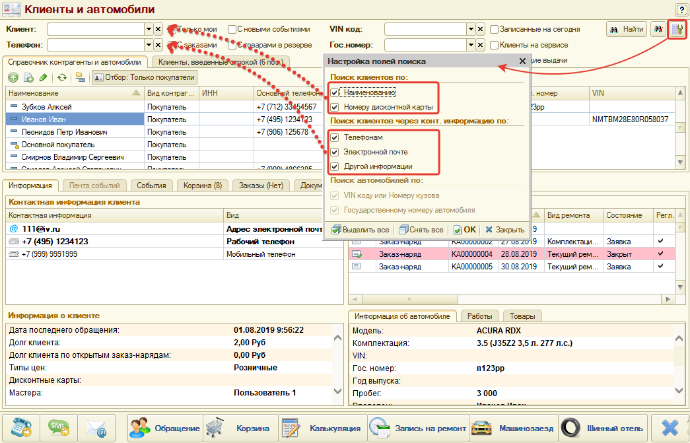

### Результаты поиска

Результаты поиска отображаются на двух вкладках:

**1. Справочник контрагенты и автомобили** — представлены записи из справочников [«Контрагенты и контакты»](../Контрагенты%20и%20контакты/kontragenty-i-kontakty.md) и «Автомобили»:

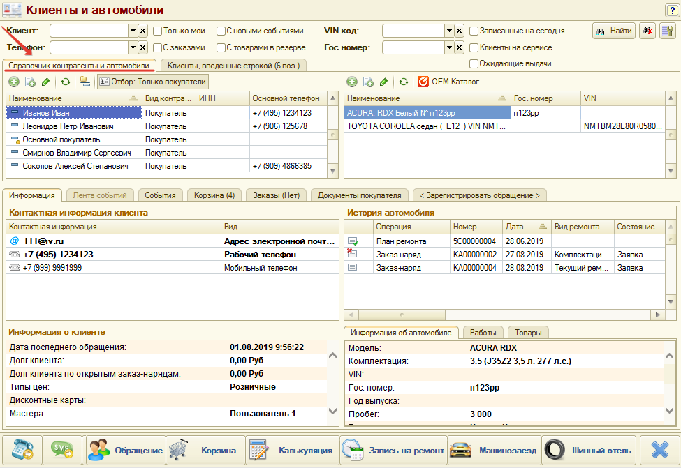

**2. Клиенты, введенные строкой** — представлены клиенты или автомобили, введенные строкой в Программу:

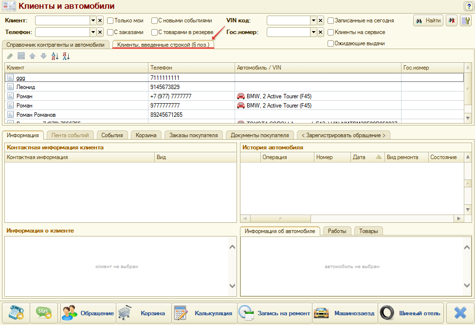

## Обработка данных

В рамках АРМ «Клиенты и автомобили» можно выполнять следующие действия:

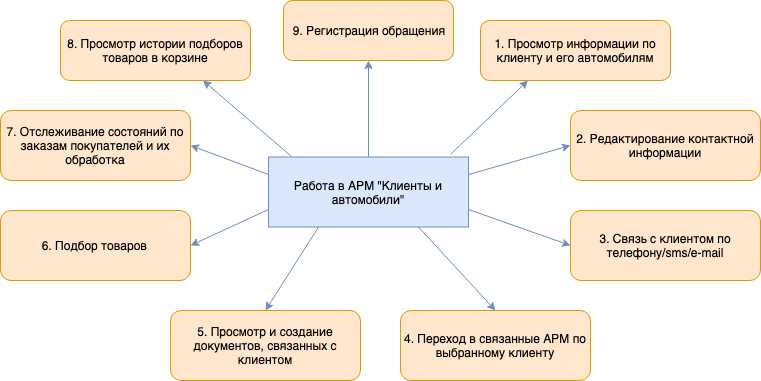

### 1. Просмотр информации по клиенту и его автомобилям

По умолчанию в АРМ «Клиенты и автомобили» активна вкладка **«Информация»**, где отображается краткая информация по клиенту (долги, последнее обращение, дисконтные карты и т. п.), краткая информация и история работ по автомобилю:

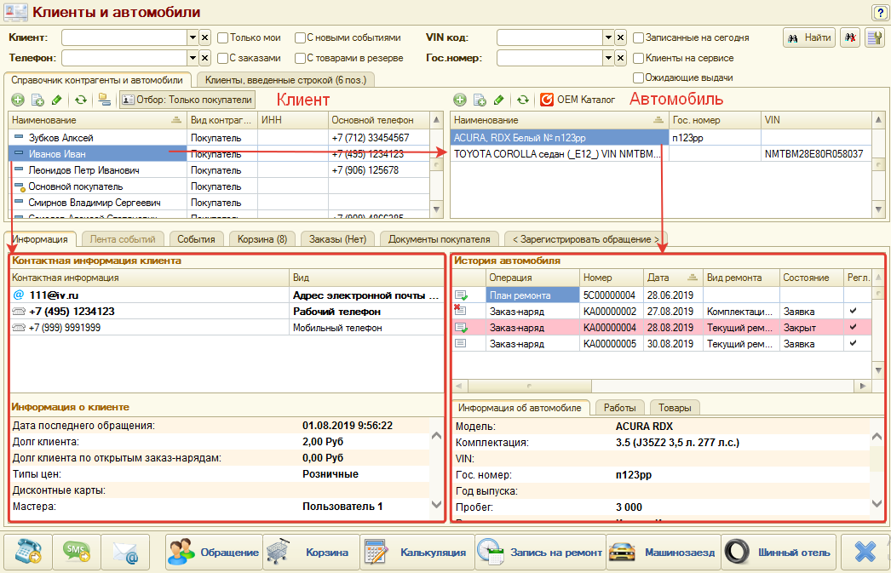

По автомобилям можно также посмотреть детализацию документов (заявка на ремонт, заказ-наряд и т. п.) по работам и товарам:

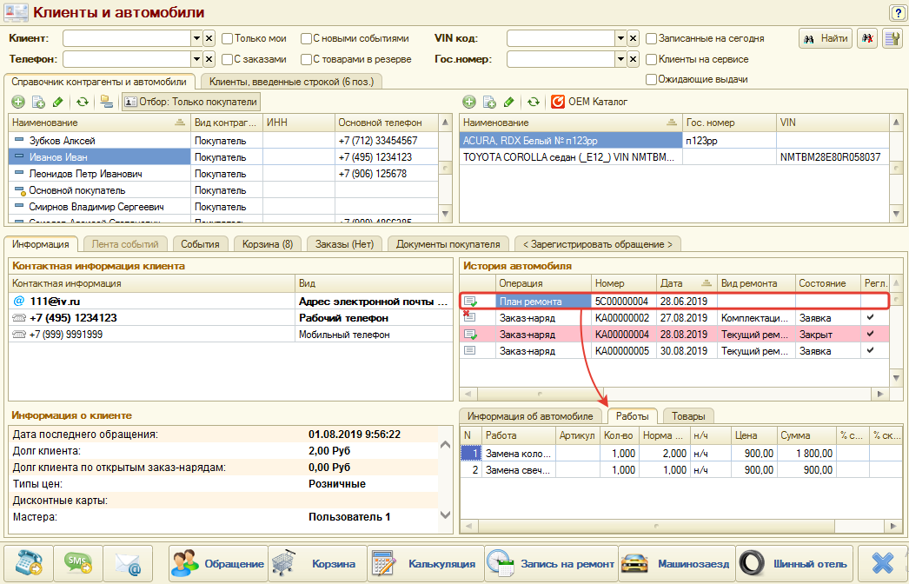

Если информации по клиенту или автомобилю нет, то можно добавить данные в АРМ, нажав на кнопку **«Добавить»** в командной панели области с клиентами — для добавления клиента, или области с автомобилями — для добавления автомобиля.

Для просмотра полной информации по клиенту или автомобилю можно перейти к форме клиента/автомобиля по двойному клику мыши на запись.

### 2. Редактирование контактной информации

При необходимости есть возможность отредактировать имеющуюся контактную информацию. Для этого достаточно двойным кликом мыши перейти в форму редактирования контактной информации и внести изменения.

Для добавления контактной информации необходимо:

- кликнуть правой клавишей мыши по табличной части с контактной информацией;
- выбрать соответствующий пункт контекстного меню;
- в открывшейся форме внести информацию.

### 3. Связь с клиентом по телефону/SMS/e-mail

Из АРМ «Клиенты и автомобили» предусмотрена возможность связаться с клиентом. Для этого можно воспользоваться соответствующей панелью действий:

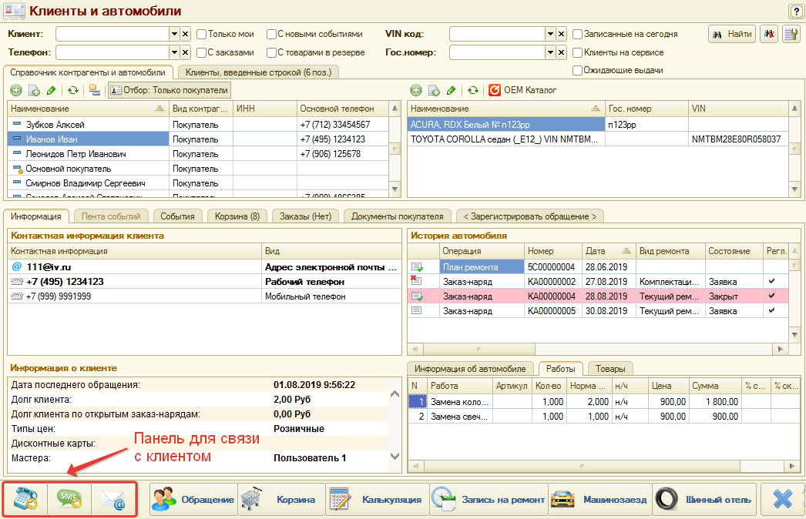

Для того, чтобы позвонить или отправить SMS, предварительно должна быть настроена телефония.

Для того, чтобы отправить e-mail, предварительно должна быть настроена встроенная почтовая система 1С и предоставлены права доступа на создание/редактирование эл. писем.

Все контакты с клиентом затем отразятся на вкладке **«События»**:

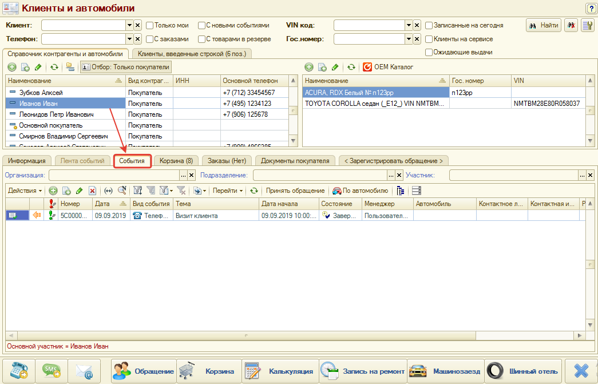

### 4. Переход в связанные АРМ по выбранному клиенту

Из АРМ «Клиенты и автомобили» можно перейти в связанные АРМ, используя панель действий:

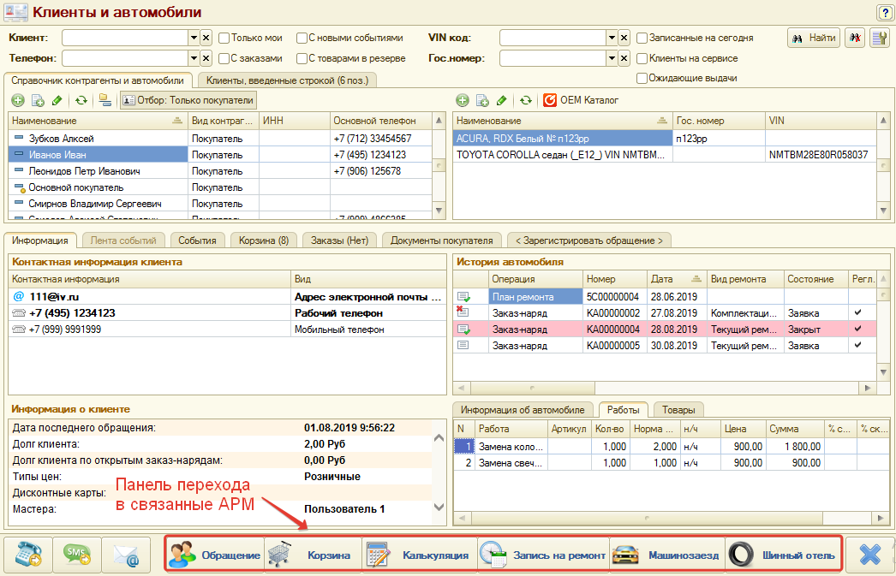

При этом в связанном АРМ будет отображен клиент, выбранный в АРМ «Клиенты и автомобили».

### 5. Просмотр и создание документов, связанных с клиентом

На вкладке **«Документы покупателя»** можно увидеть все документы и их детализацию, которые были созданы для взаимодействия с клиентами:

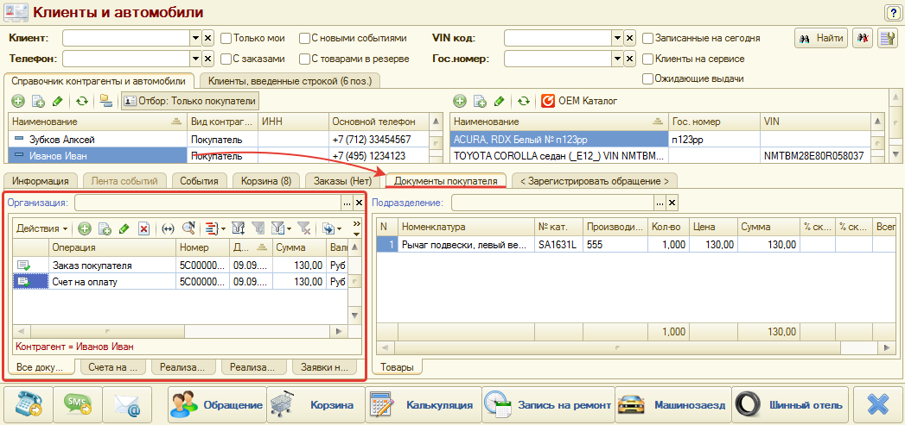

Здесь же можно открыть форму документа или добавить новый документ.

### 6. Подбор товаров

Если в Системе подключены оригинальные каталоги (OEM) Laximo, то для автомобиля можно подобрать запчасти из данных каталогов непосредственно в АРМ «Клиенты и автомобили». Для этого необходимо:

1. Выбрать автомобиль клиента.
2. Нажать на кнопку **«OEM Каталог»**:

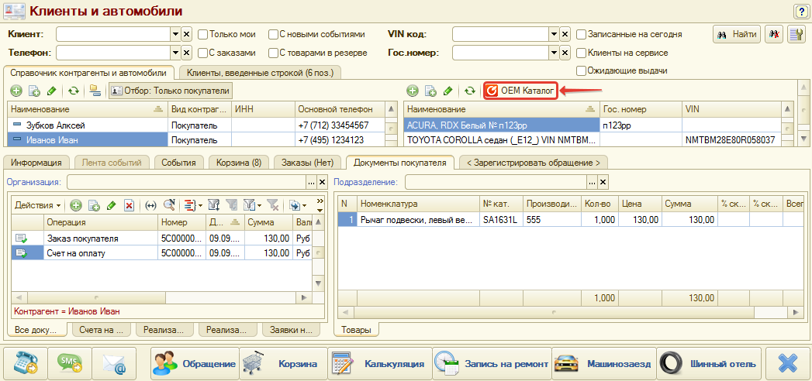

### 7. Отслеживание состояний по заказам покупателей и их обработка

В АРМ «Клиенты и автомобили» представлена детальная информация по заказам покупателей, что позволяет отследить их состояние, наличие долгов:

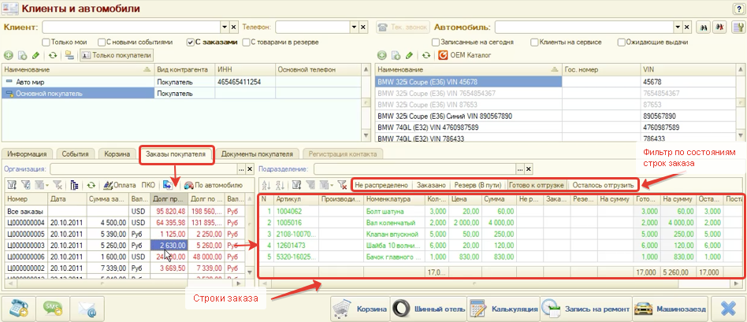

При наличии долгов у клиента можно сразу же принять оплату. Для того, чтобы принять оплату, предусмотрены кнопки командной панели области заказов покупателя:

- **Оплата** — для оплаты через кассу.
- **ПКО** — для оплаты через приходной кассовый ордер.

Заказы покупателя можно отобрать по конкретному автомобилю, нажав на кнопку **«По автомобилю»** командной панели заказов покупателя.

Кроме того, из командной панели заказов покупателей можно сразу перейти к созданию документов на основании. Например, если есть товары, готовые к отгрузке, то можно создать на основании заказа документ «Реализация товаров», не переходя на форму заказа покупателя.

Командная панель заказов покупателей:

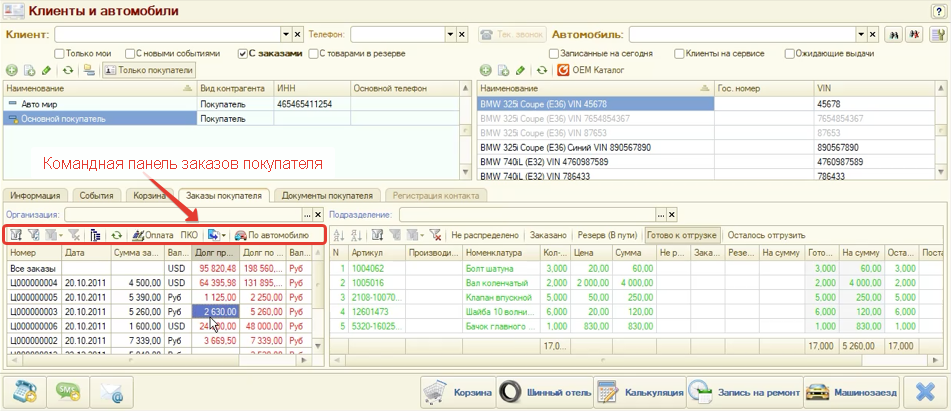

### 8. Просмотр истории подборов товаров в корзине

На вкладке **«Корзина»** можно просмотреть все сохраненные подборы товаров по клиенту:

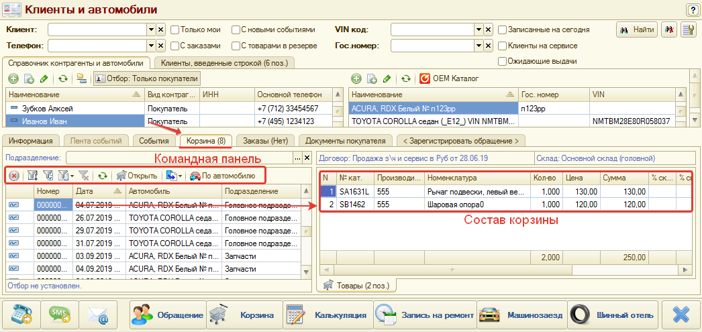

При необходимости можно отфильтровать записи по автомобилю, активировав кнопку **«По автомобилю»** на командной панели области с корзинами.

По корзине можно создать документы, воспользовавшись меню **«Создать из корзины документ»**:

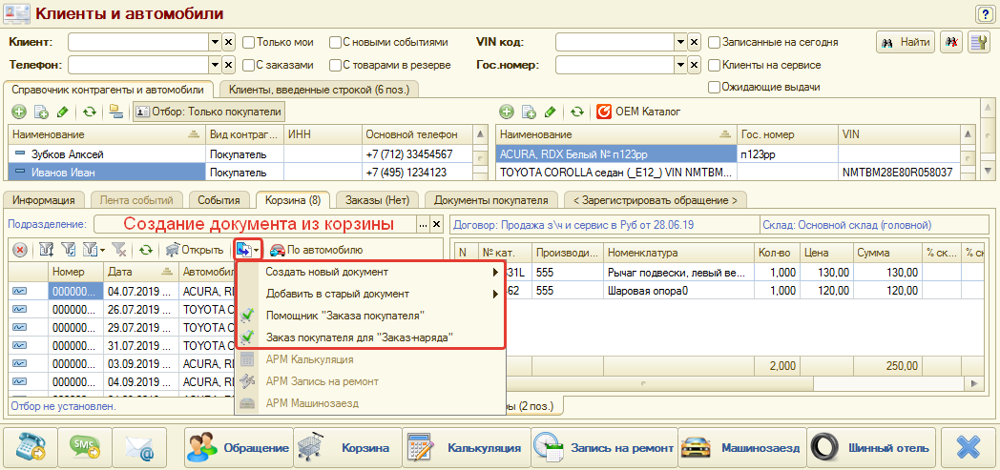

### 9. Регистрация обращения

В рамках обработки запросов от клиентов через АРМ «Клиенты и автомобили» необходимо регистрировать обращение. Для этого необходимо:

1. Нажать на кнопку **«Обращение»** в нижней панели:

   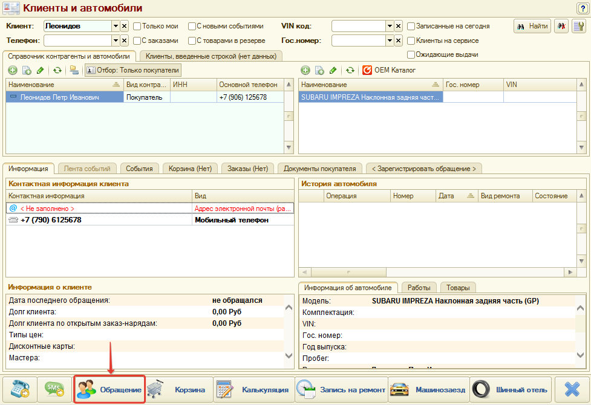

   ИЛИ кнопку **«Новое обращение»** на вкладке **«Зарегистрировать обращение»**:

   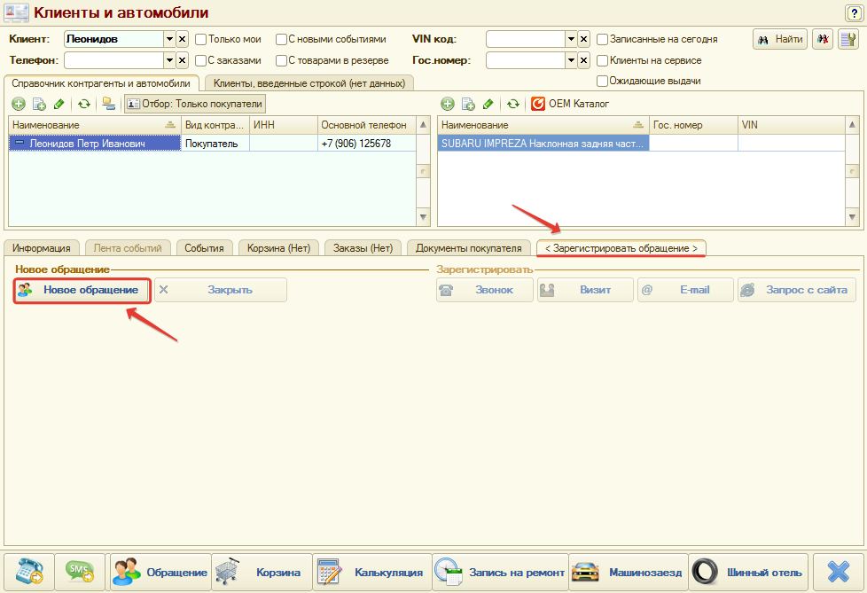

2. Уточнить данные по клиенту и автомобилю, причину обращения.
3. Нажать на кнопку **«Звонок клиента»** или **«Визит клиента»** в зависимости от способа коммуникации с клиентом:

   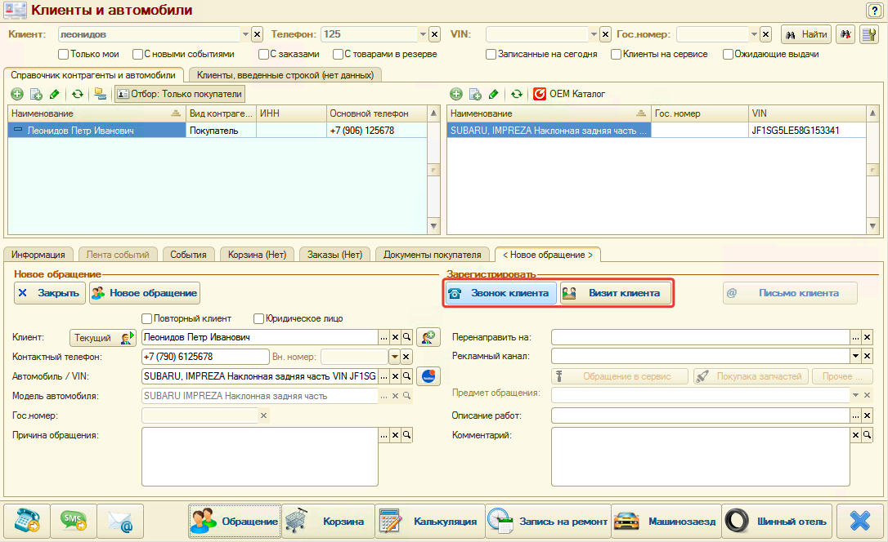

См. [Процесс работы с визитом клиента](https://www.5systems.ru/help/process-raboty-s-vizitom-klienta).

## Видеоинструкции по работе с АРМ Клиенты и автомобили

**1. [Интерфейс АРМ Клиенты и автомобили](https://www.5systems.ru/help/interfeys-arm-klienty-i-avtomobili):**

[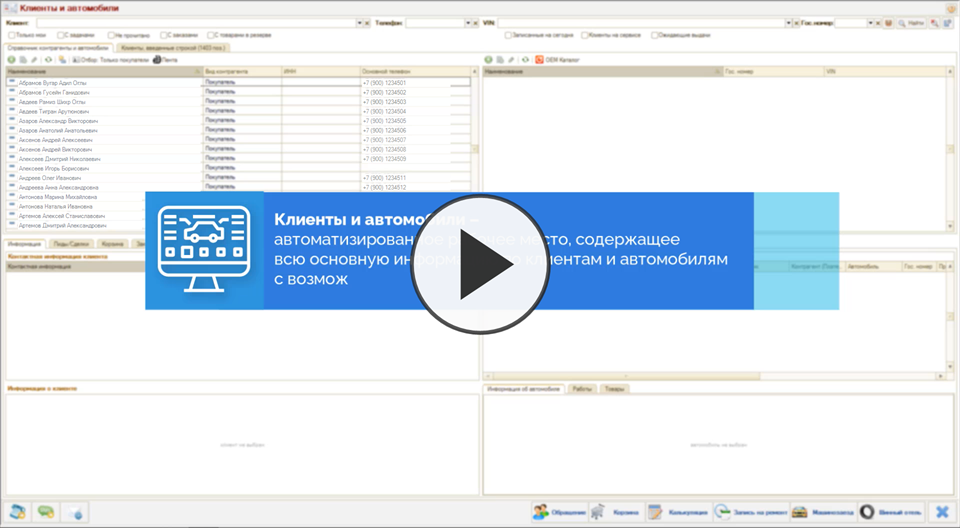](https://edu.5systems.ru/video/Klienty_i_Avtomobili/Klienty_i_Avtomobili_1-Naznachenie_i_interfeys.mp4)

**2. [Как найти клиента в АРМ Клиенты и автомобили](https://www.5systems.ru/help/kak-nayti-klienta-v-arm-klienty-i-avtomobili):**

[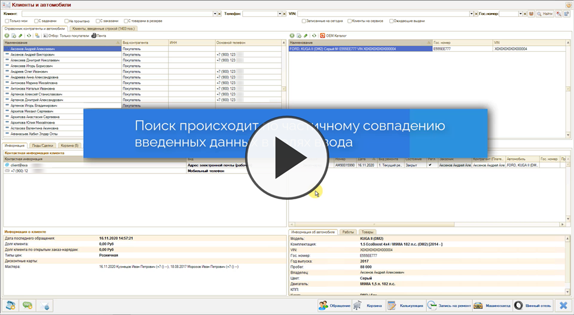](https://edu.5systems.ru/video/Klienty_i_Avtomobili/Klienty_i_Avtomobili_2-Stroki_poiska.mp4)

**3. [Дополнительные критерии поиска в АРМ Клиенты и автомобили](https://www.5systems.ru/help/dopolnitelnye-kriterii-poiska-v-arm-klienty-i-avtomobili):**

[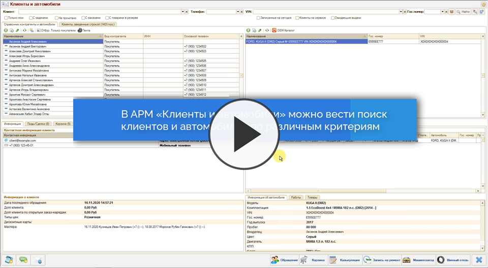](https://edu.5systems.ru/video/Klienty_i_Avtomobili/Klienty_i_Avtomobili_3-Filtry.mp4)

**4. [Вкладки АРМ Клиенты и автомобили](https://www.5systems.ru/help/vkladki-arm-klienty-i-avtomobili):**

[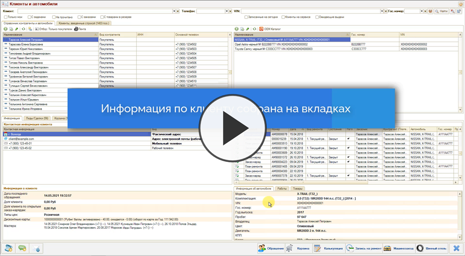](https://edu.5systems.ru/video/Klienty_i_Avtomobili/Klienty_i_Avtomobili_4-Informacionnye_zakladki.mp4)

**5. [Как создать обращение в АРМ Клиенты и автомобили](https://www.5systems.ru/help/kak-sozdat-obraschenie-v-arm-klienty-i-avtomobili):**

[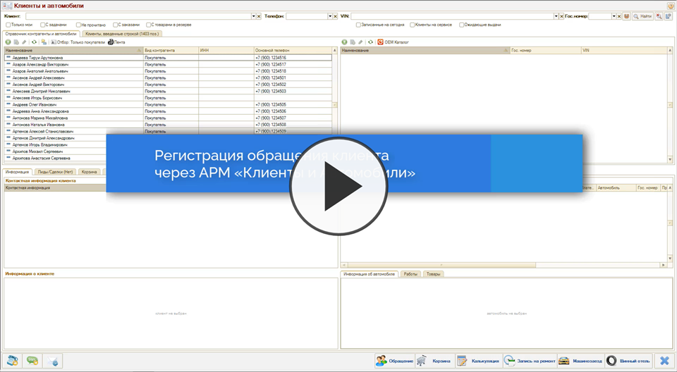](https://edu.5systems.ru/video/Klienty_i_Avtomobili/Klienty_i_Avtomobili_5-Sozdanie_obrashcheniya_vruchnuyu.mp4)

**6. [Как перейти в другие АРМ из Клиенты и автомобили](https://www.5systems.ru/help/kak-pereyti-v-drugie-arm-iz-klienty-i-avtomobili):**

[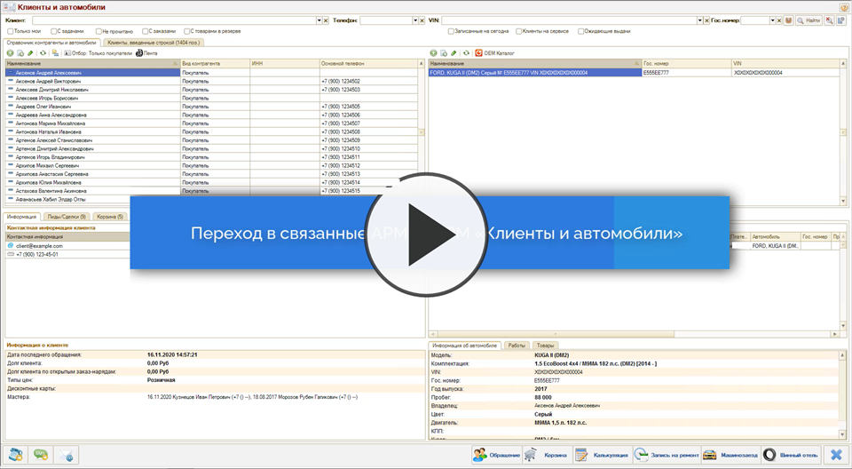](https://edu.5systems.ru/video/Klienty_i_Avtomobili/Klienty_i_Avtomobili_6-Perehod_v_drugie_ARM.mp4)

---

**Теги:** АРМ, клиенты и автомобили, поиск клиента, контактная информация, заказы покупателей, корзина, обращение, OEM каталог, документы покупателя

