

# Расшифровка контрагентов по ИНН

<table><tr><td><b>Время чтения:</b> 8 мин.</td><td><b>Обновлено:</b> 25.06.2025</td></tr></table>

Источник: https://www.5systems.ru/help/rasshifrovka-kontragentov-po-inn

**Обновленный механизм доступен начиная с релиза 2.8.3.**

## Содержание

- [Введение](#введение)
- [Создание контрагента по ИНН](#создание-контрагента-по-инн)
  - [1. Расшифровка в карточке контрагента](#1-расшифровка-в-карточке-контрагента)
  - [2. Расшифровка на форме быстрого ввода контрагента](#2-расшифровка-на-форме-быстрого-ввода-контрагента)
- [Настройка интеграции](#настройка-интеграции)
  - [1. Добавление интеграции](#1-добавление-интеграции)
  - [2. Параметры сервиса](#2-параметры-сервиса)
  - [3. Добавление настройки подключения](#3-добавление-настройки-подключения)
  - [4. Тест подключения](#4-тест-подключения)

## Введение

В 5S AUTO используется автозаполнение реквизитов контрагентов или организаций по ИНН на основе ЕГРЮЛ/ЕГРИП. Основные сведения и адрес контрагента подтягиваются автоматически, без необходимости ручного заполнения, — достаточно только ввести ИНН.

Работа функционала строится на основе интеграции с сервисом [1С:Контрагент](https://portal.1c.ru/applications/1C-Counteragent). Для пользователей облачной версии 5S AUTO и для пользователей коробочной версии на подписке доступен базовый пакет расшифровок по ИНН. При необходимости есть возможность приобрести подписку для увеличения количества доступных расшифровок — подробнее см. [ниже](#настройка-интеграции).

## Создание контрагента по ИНН

### 1. Расшифровка в карточке контрагента

Для расшифровки контрагента по ИНН требуется при создании [карточки контрагента](../Контрагенты%20и%20контакты/kontragenty-i-kontakty.md#карточка-контрагента) в поле **«ИНН»** ввести ИНН контрагента и нажать кнопку **«Автоматическое заполнение реквизитов по данным государственных реестров ЕГРЮЛ/ЕГРИП»**.

В открывшемся окне **«Заполнение реквизитов контрагента»** выводится найденная организация — требуется нажать кнопку **«Выбрать»**:

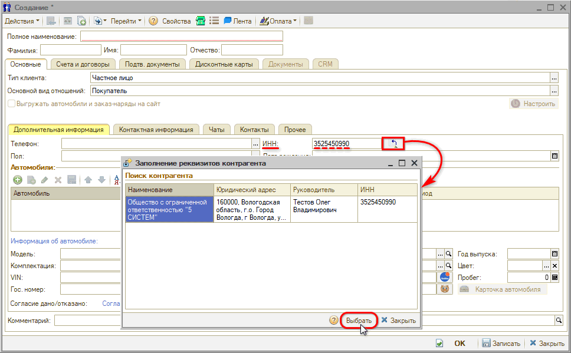

В создаваемую карточку контрагента подгружаются КПП и наименование, автоматически устанавливается тип клиента, например «Юридическое лицо»:

На вкладку **«Контактная информация»** подтягивается юридический адрес контрагента:

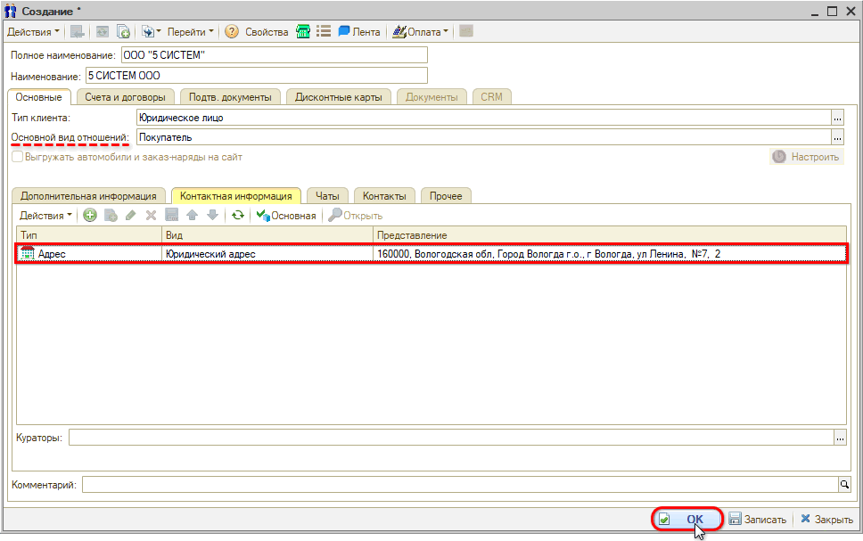

Далее нужно выбрать основной вид отношений, записать карточку и продолжить заполнение остальных параметров.

### 2. Расшифровка на форме быстрого ввода контрагента

Для создания нового контрагента путем быстрого ввода требуется в справочнике **«Контрагенты»** на верхней панели нажать кнопку **«Быстрый ввод»**. В открывшейся форме быстрого создания контрагента следует ввести ИНН в соответствующей строке и нажать кнопку **«Заполнить»**:

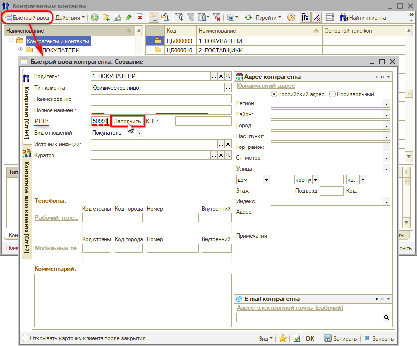

Затем подтвердить заполнение реквизитов:

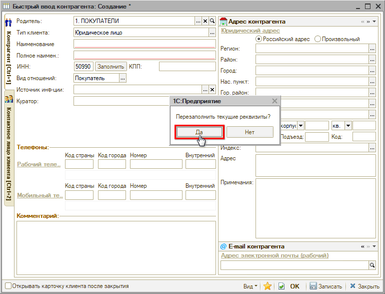

В открывшемся окне **«Заполнение реквизитов контрагента»** выводится найденная организация — требуется нажать кнопку **«Выбрать»**:

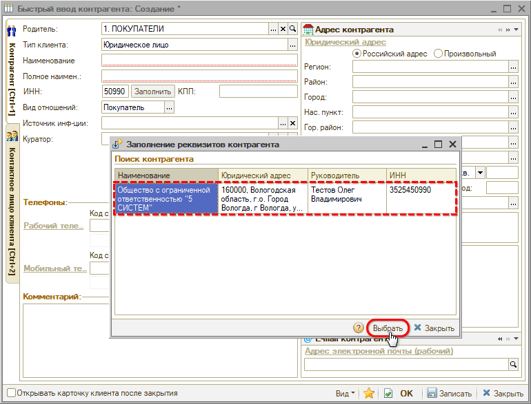

На форму быстрого ввода подгружаются КПП, наименование и контактная информация, автоматически устанавливается тип клиента, например «Юридическое лицо»:

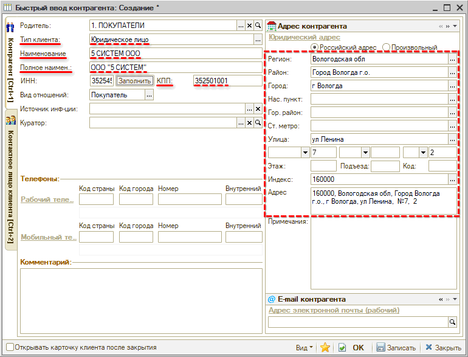

Далее нужно выбрать вид отношений и заполнить остальные параметры. После заполнения всех полей нажать кнопку **«ОК»**: при этом будет создана карточка в справочнике «Контрагенты».

## Настройка интеграции

Для работы с расшифровкой контрагентов по ИНН необходимо настроить интеграцию с [1С:Контрагент](https://portal.1c.ru/applications/1C-Counteragent).

Для всех пользователей облачной версии 5S AUTO и для пользователей коробочной версии на подписке доступен базовый пакет расшифровок по ИНН в месяц. При необходимости можно приобрести подписку для увеличения количества доступных расшифровок — актуальные расценки см. на [портале 1С](https://portal.1c.ru/applications/1C-Counteragent#prices).

Также предварительно должна быть настроена интеграция с [API 5S AUTO](https://www.5systems.ru/help/api-5s-auto) в программе.

### 1. Добавление интеграции

Для настройки интеграции следует перейти в справочник **«Интеграции»** — **Администрирование → Компания → CRM → Интеграции** — и создать новый элемент справочника. Необходимо заполнить основные реквизиты интеграции:

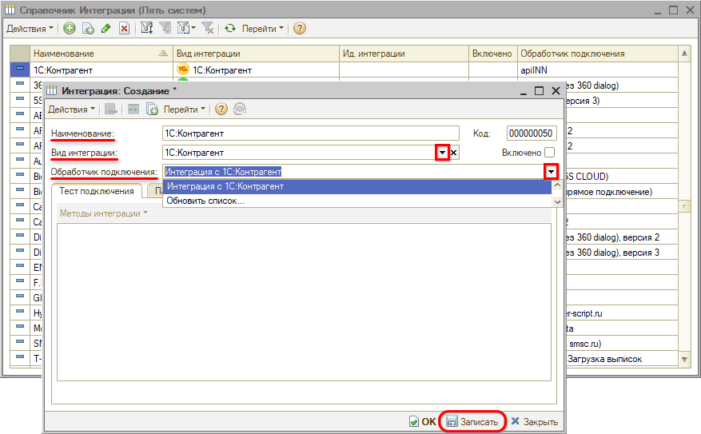

1. **Наименование** — заполняется автоматически при выборе обработчика подключения (см. п. 3).
2. **Вид интеграции** — следует выбрать «1С:Контрагент».
3. **Обработчик подключения** — следует выбрать обработчик «Интеграция с 1С:Контрагент».

После этого следует записать интеграцию и перезайти в карточку.

### 2. Параметры сервиса

На вкладке **«Параметры сервиса»** необходимо выбрать интеграцию с [API 5S AUTO](https://www.5systems.ru/help/api-5s-auto) и записать настройки:

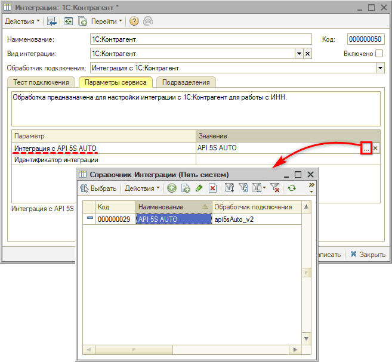

После заполнения параметров сервиса следует активировать интеграцию — установить галочку **«Включено»** и записать.

### 3. Добавление настройки подключения

Затем перейти к настройке подключения: на вкладке **«Тест подключения»** нажать кнопку **«Методы интеграции → Настройки»**. В открывшемся окне выбрать настройку подключения:

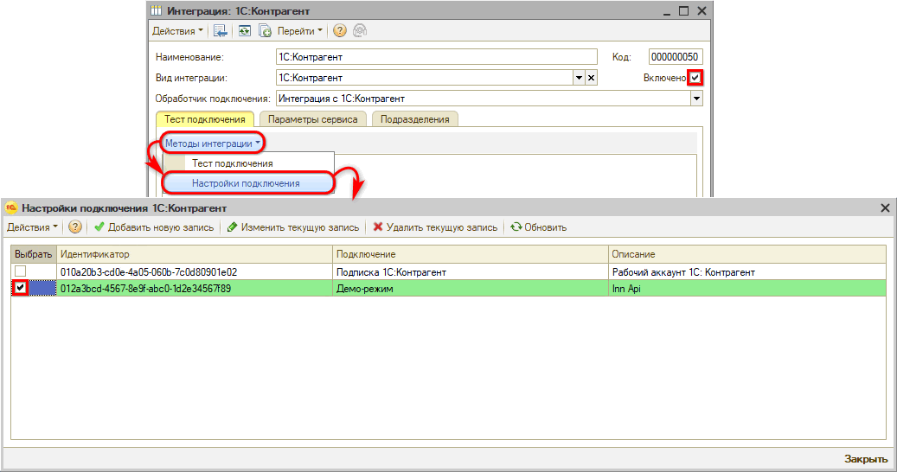

По умолчанию для всех пользователей облачной версии 5S AUTO и для пользователей коробочной версии с активной подпиской подключается демо-режим интеграции.

В случае если компании недостаточно стандартного пакета доступных расшифровок, есть возможность приобрести собственную подписку 1С:Контрагент для увеличения их количества. Доступ может быть приобретен через менеджера 5SYSTEMS либо самостоятельно на [сайте сервиса 1С:Контрагент](https://portal.1c.ru/applications/1C-Counteragent).

Если у компании уже есть своя учетная запись «1С:Контрагент», компания вводит свои учетные данные самостоятельно. Для этого следует нажать кнопку **«Добавить новую запись»**:

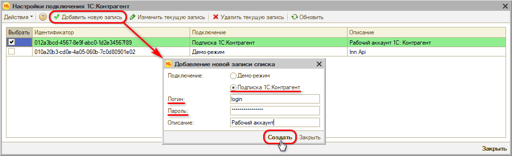

Требуется выбрать вариант подключения **«Подписка 1С:Контрагент»**, ввести свои регистрационные данные в 1С:Контрагент — логин и пароль, — а также описание настройки подключения. Затем нажать кнопку **«Создать»** и установить галочку в столбце **«Выбрать»** напротив созданной настройки.

### 4. Тест подключения

После произведенных настроек следует сделать тест подключения — на вкладке **«Тест подключения»** нажать кнопку **«Методы интеграции → Тест подключения»**:

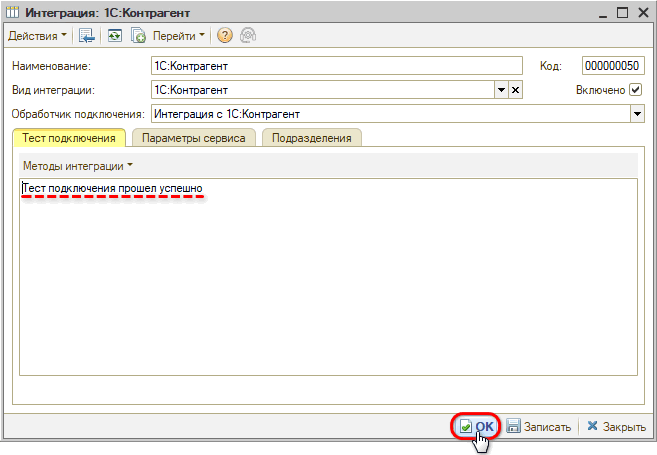

В случае успешного теста можно переходить к работе с расшифровкой контрагентов по ИНН.

---

**Теги:** Контрагенты, ИНН, расшифровка по ИНН, ЕГРЮЛ, ЕГРИП, 1С:Контрагент, интеграция, быстрый ввод, автозаполнение реквизитов

