# Сегментация клиентов

<table><tr><td><b>Время чтения:</b> 15 мин.</td><td><b>Создано:</b> 30.08.2026</td></tr></table>

> *Актуально начиная с версии релиза 5S AUTO **2.8.4**.*

> *Статья редактируется.*

## Содержание

- [Введение](#введение)
  - [Для чего нужно сегментировать клиентов](#для-чего-нужно-сегментировать-клиентов)
  - [Как сегментировать клиентов](#как-сегментировать-клиентов)
  - [Применение сегментации в 5S AUTO](#применение-сегментации-в-5s-auto)
- [Работа с сегментами в программе](#работа-с-сегментами-в-программе)
  - [1. Рассылка сообщений](#1-рассылка-сообщений)
  - [2. Использование в маркетинговых программах](#2-использование-в-маркетинговых-программах)
- [Настройка сегментов](#настройка-сегментов)
  - [Справочник «Сегменты клиентов»](#справочник-сегменты-клиентов)
  - [Загрузка предопределенных сегментов](#загрузка-предопределенных-сегментов)
  - [Настройка сегмента](#настройка-сегмента)
  - [Создание нового сегмента](#создание-нового-сегмента)
  - [Заполнение сегмента](#заполнение-сегмента)
  - [Регламентное задание](#регламентное-задание)
  - [Настройка для использования в маркетинговых программах](#настройка-для-использования-в-маркетинговых-программах)
  - [Настройка наборов данных](#настройка-наборов-данных)
- [Примеры сегментации в автосервисе](#примеры-сегментации-в-автосервисе)

## Введение

***Сегментация*** – это разделение клиентов на однородные группы по общим характеристикам. Сегменты формируются путем фильтрации базы клиентов по определенным признакам: маркам автомобилей, дате последнего визита, среднему чеку, частоте обращений, виду коммуникации и другим критериям.

### Для чего нужно сегментировать клиентов

Без сегментации клиенты получают одинаковые, неактуальные для большинства предложения, которые воспринимаются как спам. В результате падает эффективность маркетинговых кампаний, снижаются повторные продажи, уменьшается лояльность клиентов.

***Сегментация позволяет:***

1. ***Оптимизировать расходы на маркетинг*** – выделяется группа клиентов, которая приносит наибольшую прибыль, и рекламные кампании адаптируются под данные этой группы, чтобы привлекать похожих клиентов.
2. ***Персонализировать предложения*** – например, постоянным клиентам – каждая 5-я замена масла бесплатно, а тем, кто приезжает только на сезонную смену колес, – акция на диагностику систем автомобиля.
3. ***Реактивировать «спящих» клиентов*** – находить клиентов, которые перестали обращаться, и стимулировать их к возвращению: напомнить о сгорающих бонусах или предложить специальную скидку за возвращение.
4. ***Повышать продажи*** – за счет точечного предложения нужных услуг конкретным клиентам растет частота покупок и средний чек.

### Как сегментировать клиентов

**Шаг 1. Определить критерии сегментации** – выбрать признаки, по которым можно разделять клиентскую базу на сегменты.

**Шаг 2. Сгруппировать клиентов** – на основе выбранных критериев разделить клиентскую базу на группы (сформировать сегменты).

**Шаг 3. Оценить привлекательность и выбрать сегменты** – определить размер сегментов, их прибыльность и объем продаж. Выбрать несколько наиболее перспективных сегментов для первоочередной работы.

**Шаг 4. Разработать персонализированные стратегии** – создать план взаимодействия с каждой отдельной группой: какие предложения, каналы коммуникации и техники использовать.

**Шаг 5. Периодически пересматривать сегменты** – при расширении бизнеса могут появиться новые сегменты, а ранее неперспективные группы могут стать прибыльными.

### Применение сегментации в 5S AUTO

1. ***Формирование сегментов*** – выделяется группа клиентов по определенному признаку (или нескольким); сегменты автоматически обновляются при появлении новых клиентов с нужными характеристиками.
2. ***Рассылка сообщений*** – запускается точечная рассылка сообщений для конкретного сегмента клиентов, например, с информацией о персонализированной акции или для проведения анкетирования.
3. ***Персонализированные акции в приложении 5S LINK*** – информация об акции отображается только у тех пользователей, которым она подходит: например, скидка на запчасти конкретного производителя выводится только для владельцев автомобилей соответствующей марки.

Примеры сегментов и стратегий работы с ними см. в разделе «[Примеры сегментации в автосервисе](#примеры-сегментации-в-автосервисе)» в конце статьи.

## Работа с сегментами в программе

### 1. Рассылка сообщений

#### Переход к обработке «Работа с сегментом клиентов»

Для работы с сегментом используется обработка ***«Работа с сегментом клиентов»***. Перейти в нее можно через меню программы: *Маркетинг → вкладка «Маркетинговые программы» → Сегменты → Работа с сегментами:*

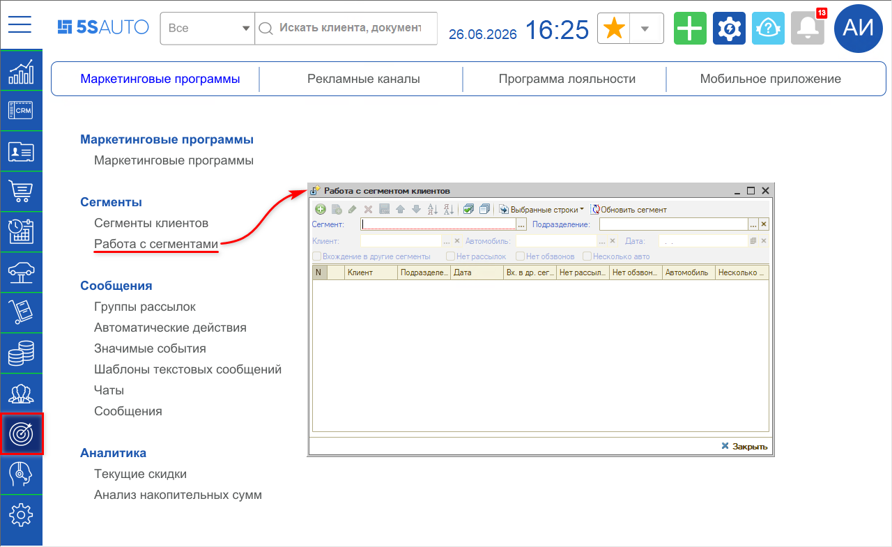

Либо нажатием кнопки ***«Клиенты сегмента»*** в справочнике «Сегменты клиентов»:

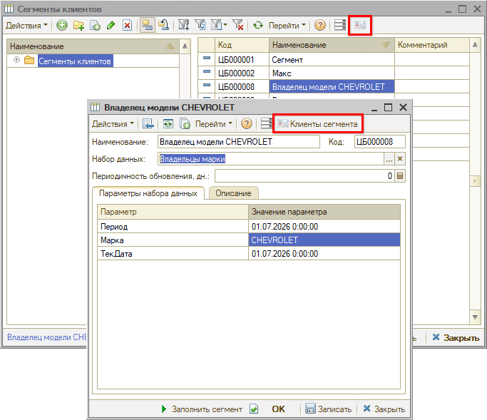

> [!NOTE]
> Описание справочника см. ниже в разделе «[Настройка сегментов → Справочник «Сегменты клиентов»](#справочник-сегменты-клиентов)».

Во втором случае обработка сразу открывается с отбором клиентов по текущему сегменту:

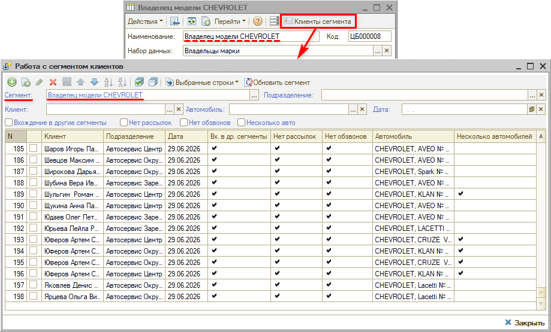

#### Отбор клиентов

Помимо отбора по сегменту можно установить фильтр по подразделению:

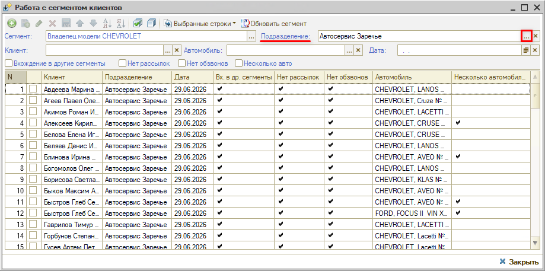

Дополнительно можно использовать следующие фильтры:

- по клиенту;
- по автомобилю;
- по дате добавления клиента в сегмент;
- по вхождению клиентов в другие сегменты;
- по участию клиентов в рассылках и обзвонах;
- по наличию у клиента нескольких автомобилей.

#### Отправка сообщений

Для создания рассылки сообщений выбранным клиентам сегмента отметьте нужные строки на форме обработки «Работа с сегментом клиентов» – можно использовать кнопку *«Выделить все строки»* или установить отметки вручную.

Затем нажмите кнопку ***«Выбранные строки»*** – откроется меню действий. Для выбранных клиентов сегмента возможны следующие операции:

- перенос в документ «Сообщение»;
- перенос в другой сегмент;
- удаление клиентов из сегмента.

Для рассылки сообщений клиентам сегмента выберите ***«Перенести в документ Сообщение»***. Будет создан документ «Сообщение» с заполненным списком клиентов, отобранных для рассылки:

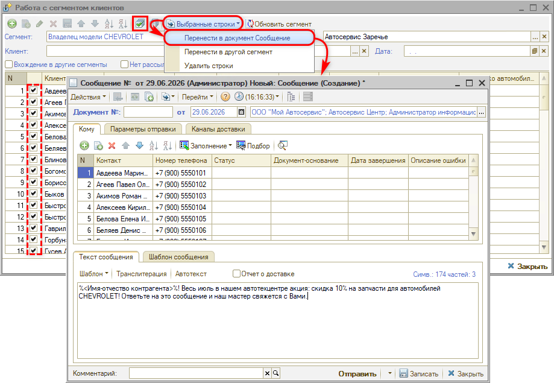

Далее настройте рассылку:

**1)** выберите каналы доставки; 
**2)** при необходимости задайте параметры отправки; 
**3)** напишите текст сообщения (или используйте шаблон); 
**4)** запишите настройки.

Затем запустите рассылку клиентам сегмента нажатием кнопки ***«Отправить»***.

Подробнее о настройке рассылки сообщений см. в статье «[Массовая рассылка сообщений по выборке клиентов](../../Сообщения/Массовая%20рассылка%20сообщений%20по%20выборке%20клиентов/massovaya-rassylka-soobscheniy-po-vyborke-klientov.md)».

#### Обновление сегмента

Кнопка ***«Обновить сегмент»*** на верхней панели обработки позволяет обновить сегмент вручную – она действует так же, как регламентное задание (см. [ниже](#регламентное-задание)):

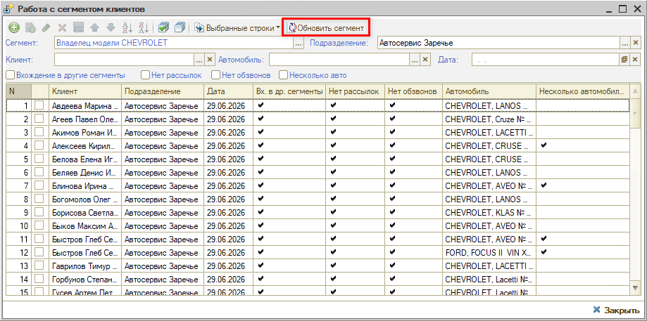

### 2. Использование в маркетинговых программах

Сегменты клиентов можно использовать для персонализированного отображения акций в приложении 5S LINK – информация об акции будет выводиться только для тех пользователей, которым она подходит, т. е. для клиентов с определенными характеристиками.

Например, скидка на запчасти конкретного производителя отображается только для владельцев автомобилей определенной марки:

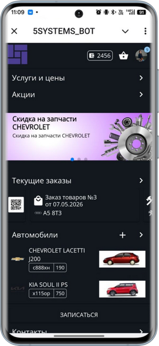 &nbsp;&nbsp;&nbsp;&nbsp;&nbsp;&nbsp; 

Настройка описана ниже в разделе «[Настройка для использования в маркетинговых программах](#настройка-для-использования-в-маркетинговых-программах)».

## Настройка сегментов

### Справочник «Сегменты клиентов»

Справочник ***«Сегменты клиентов»*** расположен в меню программы: *Маркетинг → вкладка «Маркетинговые программы» → Сегменты → Сегменты клиентов:*

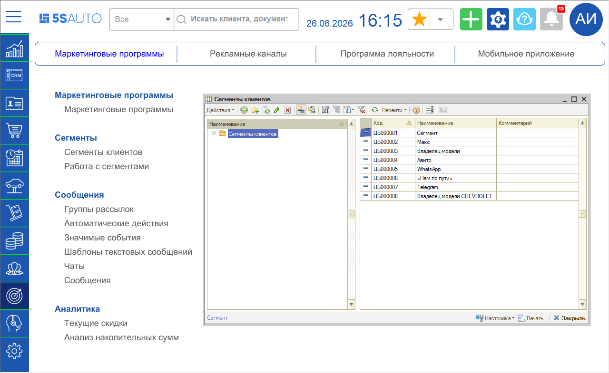

Карточка сегмента содержит критерии группировки клиентов:

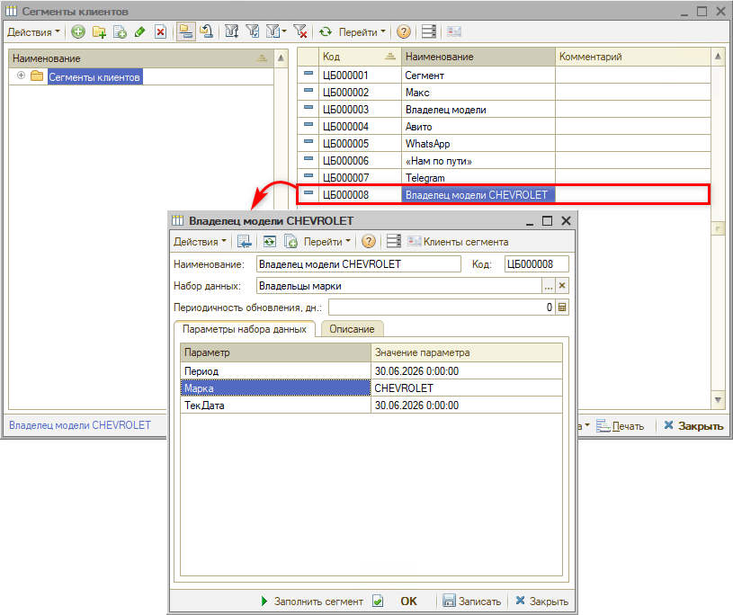

> \[🛠 Комментарий для черновика]: *в предопределенном сегменте в наименовании "модель", а в наборе данных "марка".*

***Основные параметры сегмента:***

**1.** *Наименование* – наименование сегмента.

**2.** *Набор данных* – выбирается нужный набор данных из заранее заполненного справочника:

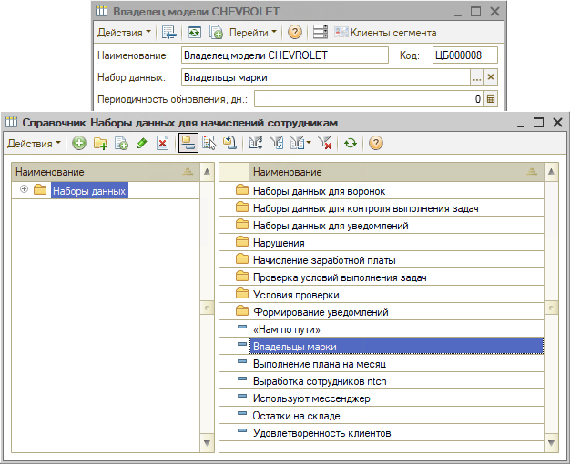

> \[🛠 Комментарий для черновика]: *справочник "Наборы данных ДЛЯ НАЧИСЛЕНИЙ СОТРУДНИКАМ".*

Например, владельцы автомобилей определенной марки. Конкретная марка задается в параметрах набора данных (см. [ниже](#настройка-сегмента)).

После выбора набора данных автоматически заполняется таблица на вкладке *«Параметры набора данных»* – в зависимости от выбранного набора данных:

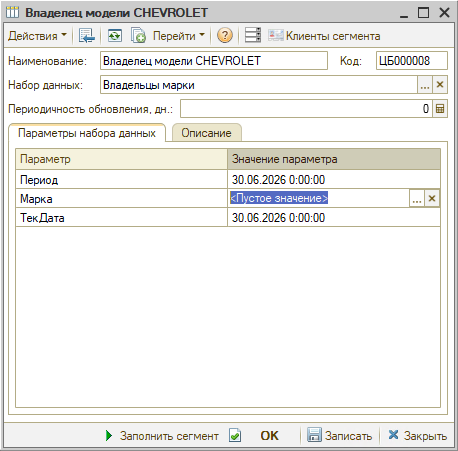

> [!NOTE]
> Возможна настройка и добавление новых наборов данных – выполняется техническими специалистами компании (см. [ниже](#настройка-наборов-данных)).

> \[🛠 Комментарий для черновика]: *??*

**3.** *Периодичность обновления, дн.* – периодичность обновления сегмента в днях. Например, если указать значение 1, то сегмент будет автоматически обновляться каждый день.

> \[🛠 Комментарий для черновика]: *??*

### Загрузка предопределенных сегментов

Предусмотрена загрузка ряда предопределенных настроек сегментов из эталонной базы: первичная загрузка и последующее обновление настроек в своей базе данных до актуальной версии.

Для перехода к обработке загрузки в справочнике «Сегменты клиентов» нажмите кнопку ***«Настройка → Обновление настроек сегментов»***:

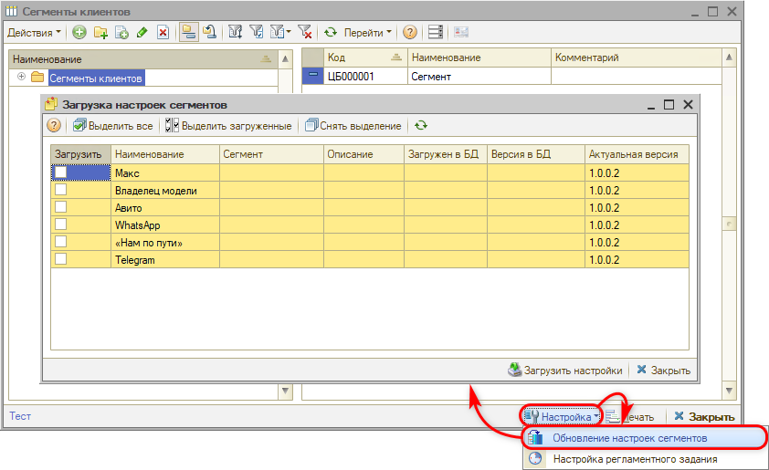

Чтобы загрузить или обновить до актуальной версии нужные настройки сегментов, выделите строки с ними – кнопками *«Выделить все»*, *«Выделить загруженные»* или вручную построчно.

Затем нажмите кнопку ***«Загрузить настройки»***:

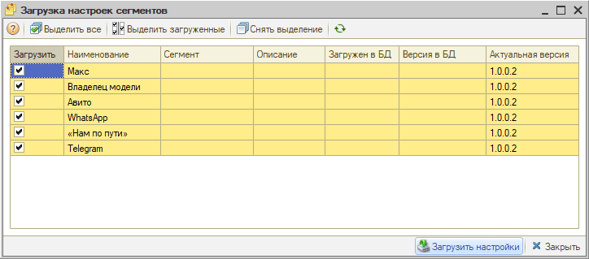

Предопределенные сегменты загружаются в базу. Если версия настройки в базе совпадает с актуальной версией в эталонной базе, строка выделяется зеленым цветом:

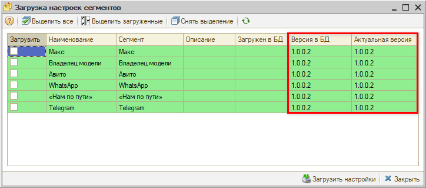

После этого обработку можно закрыть.

> [!NOTE]
> В будущем список сегментов планируется пополнять. Для загрузки новых настроек потребуется выполнить действия, аналогичные первичной загрузке.

### Настройка сегмента

Загруженные предопределенные сегменты можно использовать для группировки клиентов своей базы. Некоторые сегменты требуется донастроить – например, задать конкретную марку или модель автомобиля.

Для этого установите значения параметров на вкладке *«Параметры набора данных»*:

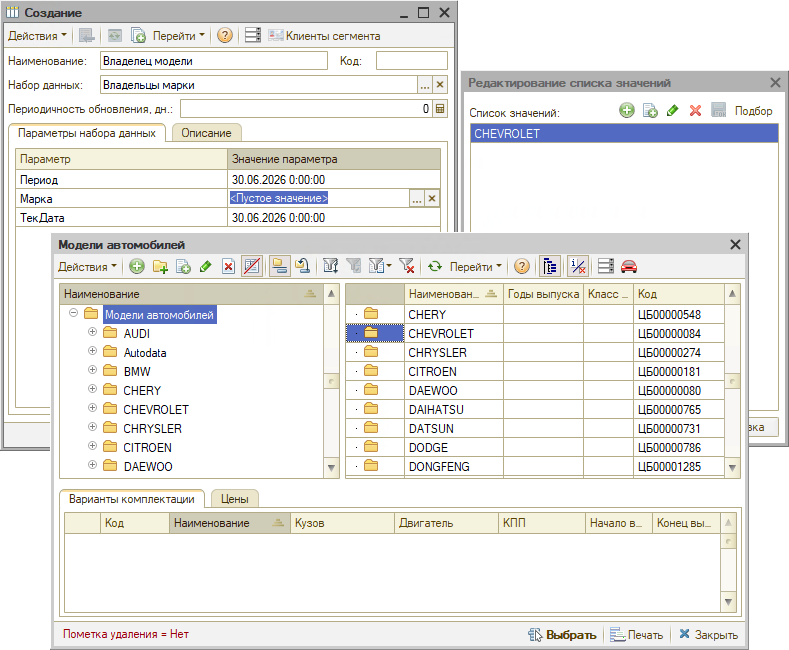

> [!NOTE]
> В приведенном примере параметры «Период» и «ТекДата» автоматически заполняются завтрашней датой. «Период» – дата, на которую проверяется принадлежность автомобиля владельцу; «ТекДата» – если указана дата окончания договора, то после этой даты клиент уже не попадет в сегмент по подразделению.

Запишите настройки, после чего можно переходить к заполнению сегмента клиентами – см. [ниже](#заполнение-сегмента).

### Создание нового сегмента

При необходимости можно создать и настроить новый сегмент вручную. Для этого в справочнике «Сегменты клиентов» добавьте новый элемент и заполните все нужные параметры:

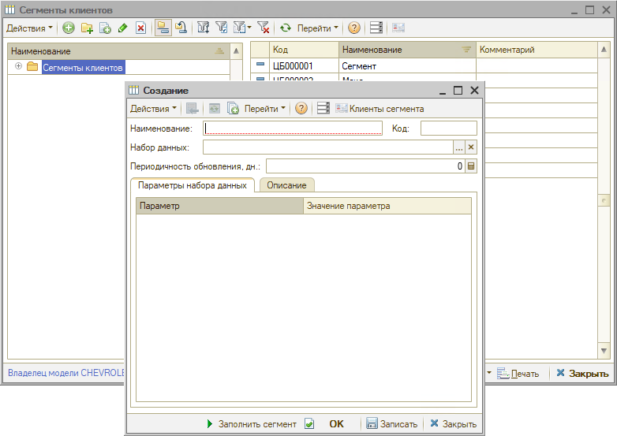

### Заполнение сегмента

Для заполнения сегмента клиентами, подходящими под заданные критерии, нажмите кнопку ***«Заполнить сегмент»***:

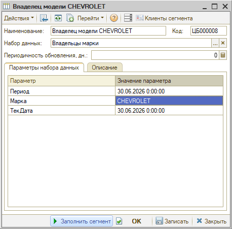

Информация записывается в регистр сведений *«Сегментация клиентов»*. Клиент может одновременно относиться к нескольким сегментам.

После заполнения можно переходить к работе с сегментом – см. [выше](#работа-с-сегментами-в-программе).

### Регламентное задание

По мере добавления в базу новых клиентов, а также при появлении у существующих клиентов новых признаков, подпадающих под критерии сегментов, сегменты нужно обновлять.

Для автоматического добавления клиентов в сегменты используется регламентное задание ***«Обновление сегментов клиентов»***. Для перехода к его настройке в справочнике «Сегменты клиентов» нажмите кнопку ***«Настройка → Настройка регламентного задания»***:

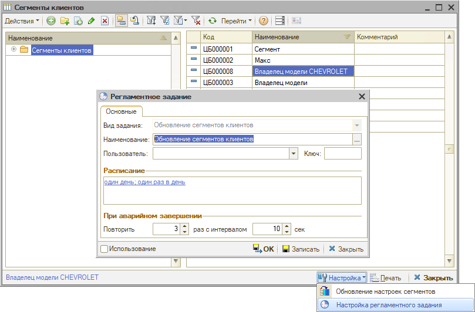

После включения регламентного задания клиент автоматически попадет в нужный сегмент, как только начнет удовлетворять его условиям; новые подходящие клиенты также добавляются автоматически.

> [!IMPORTANT]
> Регламентное задание «Обновление сегментов клиентов» должно запускаться ежедневно.

Также сегмент можно обновить вручную кнопкой *«Обновить сегмент»* на верхней панели обработки «Работа с сегментом клиентов» – см. [выше](#обновление-сегмента).

### Настройка для использования в маркетинговых программах

Для использования сегментов в маркетинговых программах, например, для отображения персонализированных акций в мобильном приложении (см. [выше](#2-использование-в-маркетинговых-программах)), требуется выполнить следующие настройки.

В карточке справочника *«Маркетинговые программы»* задайте все необходимые основные параметры, а на вкладке ***«Сегменты»*** выберите нужный сегмент:

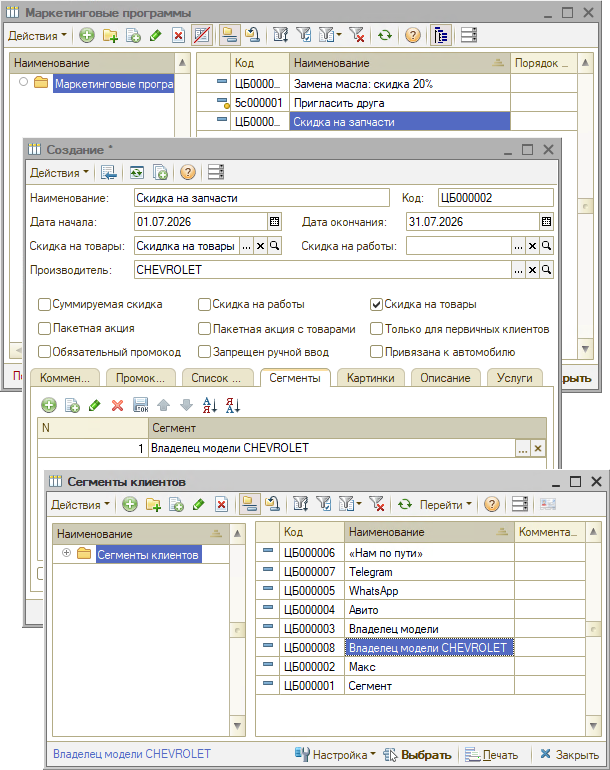

Также установите флажок ***«Используется сегментирование клиентов»***:

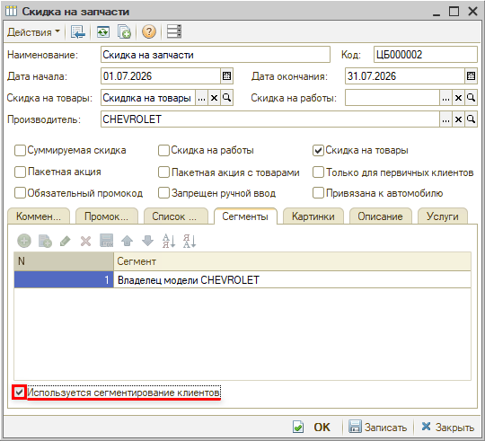

> [!NOTE]
> Если акцию нужно показывать всем клиентам, а не только отобранным по какому-либо признаку, снимите флажок «Используется сегментирование клиентов».

### Настройка наборов данных

При необходимости можно вносить изменения в преднастроенные наборы данных, а также добавлять новые:

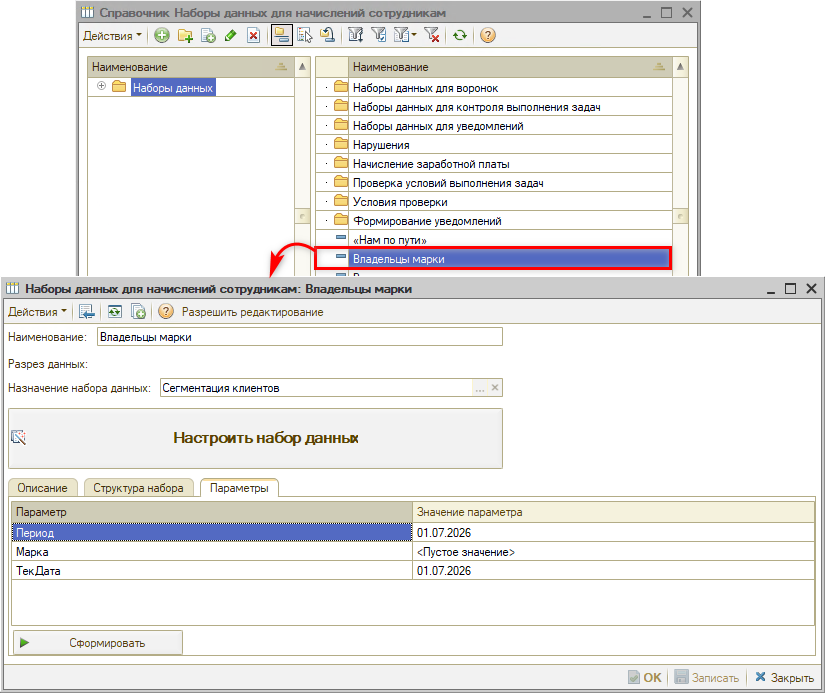

Для настройки наборов данных используется конструктор схемы компоновки данных, запрос формулируется на языке 1С:

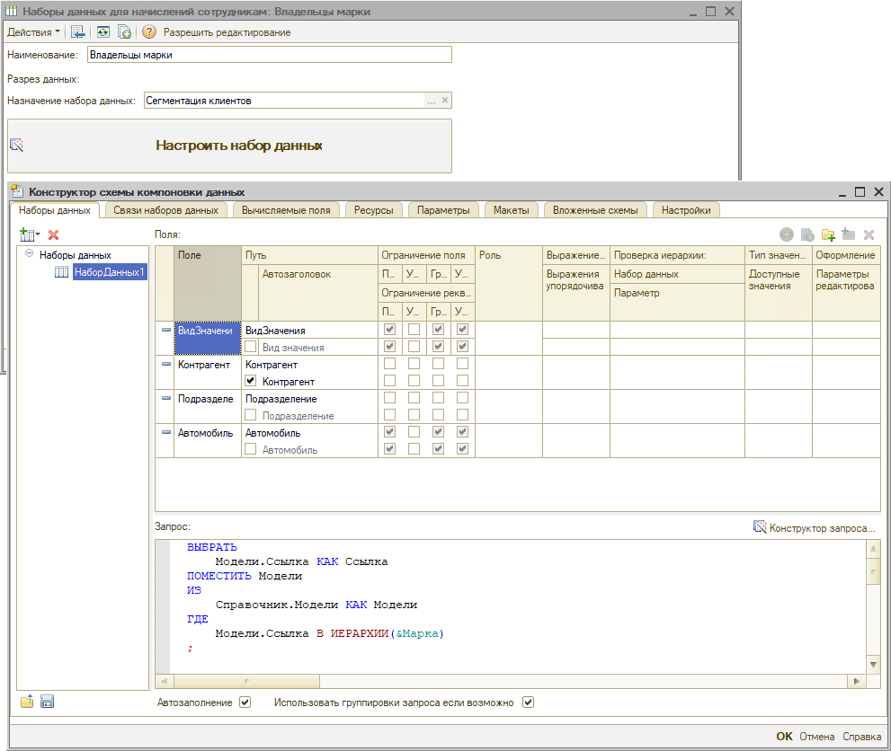

## Примеры сегментации в автосервисе

В автосервисе клиентов можно сегментировать по нескольким основным группам критериев. Каждый критерий помогает выявить особенности поведения и потребностей клиентов для персонализированной работы с ними:

<table><tr><td><b>Сегмент</b></td><td><b>Особенности</b></td><td><b>Стратегия работы</b></td></tr><tr><td colspan="3"><b>1. По типу автомобиля и классу</b></td></tr><tr><td><i>Владельцы бюджетных авто (масс-маркет)</i></td><td>Важны скорость обслуживания, доступные цены на запчасти и обслуживание, прозрачность стоимости</td><td>Акцент на быстроту, предложение аналогов оригинальных запчастей, понятное ценообразование</td></tr><tr><td><i>Владельцы премиум-сегмента</i></td><td>Требуют высокого качества сервиса, оригинальных деталей, комфортной зоны ожидания</td><td>Персональный подход, оригинальные запчасти, VIP-зона, расширенная гарантия</td></tr><tr><td><i>Владельцы коммерческого транспорта</i></td><td>Критичны скорость ремонта, безналичный расчет, наличие закрывающих документов для минимизации простоев</td><td>Приоритетная запись, работа с юрлицами, полный пакет документов, гарантия сроков</td></tr><tr><td colspan="3"><b>2. По поведению и истории обращений</b></td></tr><tr><td><i>Лояльные клиенты</i></td><td>Регулярно проходят плановое ТО, доверяют сервису</td><td>Программы лояльности, накопительные скидки, персональные предложения, приоритетная запись</td></tr><tr><td><i>«Ремонт по факту»</i></td><td>Обращаются только при серьезных поломках, не проходят плановое ТО</td><td>Акции на диагностику, напоминания о необходимости ТО, образовательный контент о важности профилактики</td></tr><tr><td><i>Сезонные клиенты</i></td><td>Посещают сервис только во время «переобувки» или подготовки к зиме/лету</td><td>Кросс-продажи: предложение комплексной проверки систем (тормоза, аккумулятор, кондиционер) во время сезонного визита</td></tr><tr><td colspan="3"><b>3. По степени прибыльности</b></td></tr><tr><td><i>VIP-клиенты</i></td><td>Приносят основную долю прибыли, высокий средний чек</td><td>Персональный менеджер, индивидуальные скидки, эксклюзивные предложения, приоритетное обслуживание</td></tr><tr><td><i>Средний чек</i></td><td>Основная масса клиентов, стабильный доход</td><td>Стандартное обслуживание, программы лояльности, кросс-продажи сопутствующих услуг</td></tr><tr><td><i>Нецелевые / убыточные</i></td><td>Часто отказываются от услуг после диагностики, требуют чрезмерных скидок, отнимают много времени</td><td>Оптимизация процесса работы, четкое ограничение времени на диагностику, пересмотр ценовой политики</td></tr><tr><td colspan="3"><b>4. По этапу жизненного цикла</b></td></tr><tr><td><i>Постоянные клиенты</i></td><td>Обслуживаются давно и регулярно, высокая лояльность</td><td>Программы лояльности, накопительные скидки, персональные предложения, реферальная программа</td></tr><tr><td><i>Новые клиенты</i></td><td>Приехали впервые, еще не сформировали лояльность</td><td>Бонусы за регистрацию в приложении, скидка на следующий визит, запрос обратной связи</td></tr><tr><td><i>«Спящие» клиенты</i></td><td>Обслуживались регулярно, но не появлялись 6–12 месяцев</td><td>Реактивационные кампании: специальные предложения, напоминания о сгорающих бонусах, персональные скидки за возвращение</td></tr></table>

> [!TIP]
> - Не пытайтесь охватить все сегменты сразу – лучше начать работу с 2–3 наиболее прибыльными и перспективными.
> - Комбинируйте критерии – например, «VIP-клиенты с премиум-авто» или «новые клиенты с бюджетными авто» дают более точное понимание аудитории.
> - Пересматривайте сегменты регулярно – клиенты переходят из одного сегмента в другой (новый → постоянный → спящий), и стратегии должны адаптироваться.
> - Измеряйте эффективность – отслеживайте, как меняются конверсия, средний чек и удержание после внедрения персонализированных стратегий для каждого сегмента.

---

**Теги:** сегментация клиентов, сегменты, маркетинг, маркетинговые программы, рассылка сообщений, акции, 5S LINK, регламентное задание, наборы данных
