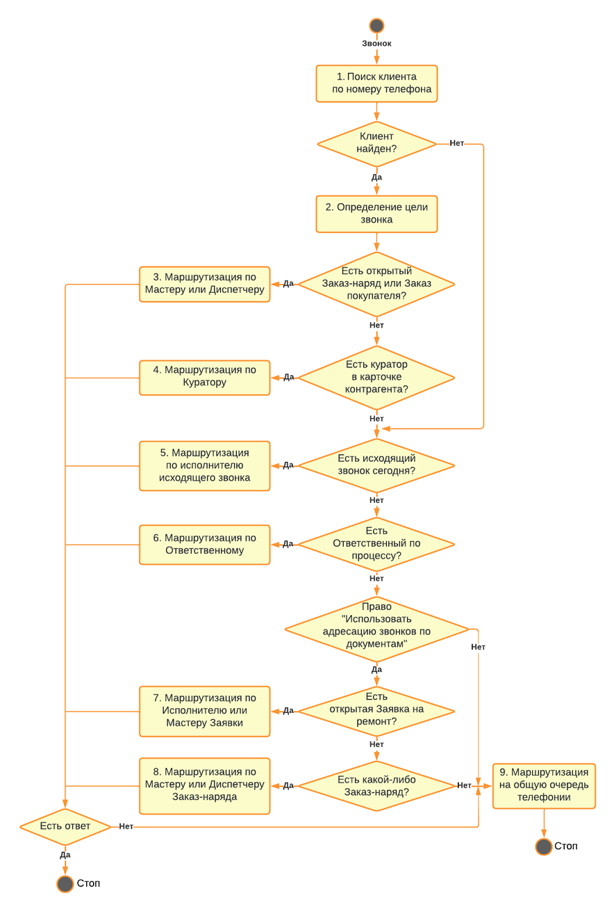

# Умная маршрутизация входящего звонка

<table><tr><td><b>Время чтения:</b> 5 мин.</td><td><b>Обновлено:</b> 27.03.2024</td></tr></table>

Источник: https://www.5systems.ru/help/umnaya-marshrutizaciya-vkhodyaschego-zvonka

При внедрении телефонии в программе есть возможность подключить и настроить Умную маршрутизацию звонков.

**Умная маршрутизация звонков** — функция системы, которая позволяет направить звонок от клиента ответственному менеджеру, определяемому согласно типовой логике маршрутизации.

Для проверки подключения функции Умной маршрутизации звонков см. п. 9 «Маршрутизация звонков» [Регламента проверки корректности работы интеграции с телефонией](https://www.5systems.ru/help/reglament-proverki-korrektnosti-raboty-integracii-s-telefoniey).

## Типовая логика маршрутизации звонка

Алгоритм маршрутизации представлен на схеме:

Описание шагов схемы:

| № п/п | Шаг | Описание |
| --- | --- | --- |
| 1 | **Поиск клиента по номеру телефона** | Поиск номера телефона, с которого звонят, среди обращений. Если ранее с номера телефона звонили, то клиент определяется и его имя высвечивается на телефоне |
| 2 | **Определение цели звонка** | Основные цели звонка указаны на схеме |
| 3 | **Маршрутизация звонка по мастеру или диспетчеру** | Если в Системе есть открытый или закрытый сегодня документ «Заказ-наряд» по клиенту или если найден документ «Заказ покупателя», по которому не оформлен документ «Реализация товаров», то звонок будет адресован сотруднику, указанному в поле «Мастер» документа (для заказа покупателя используется поле «Менеджер»), ИЛИ сотруднику, принимающему в этот день смену, по [журналу передачи смен](https://www.5systems.ru/help/peredacha-smen).  При необходимости можно адресовать звонок не мастеру, а диспетчеру (поле «Диспетчер» документа). Для этого предусмотрена настройка **«Направлять звонок на диспетчера заказ-наряда»** (**Права и настройки → ПЯТЬ СИСТЕМ → БАЗОВАЯ CRM**) |
| 4 | **Маршрутизация звонка по куратору** | Если по номеру телефона в Системе создан контрагент и в [карточке контрагента](../Контрагенты%20и%20контакты/kontragenty-i-kontakty.md#карточка-контрагента) задан куратор, то звонок будет адресован на номер телефона куратора |
| 5 | **Маршрутизация по исполнителю исходящего звонка** | Если сегодня сотрудник пытался дозвониться до клиента, то звонок будет адресован ему |
| 6 | **Маршрутизация по Ответственному** | Если назначен Ответственный по процессу, то звонок будет адресован ему |
| 7 | **Маршрутизация по мастеру в Заявке на ремонт** | Если в Системе есть открытая Заявка на ремонт, оформленная за последние 3 дня, то звонок будет адресован сотруднику, указанному в поле «Мастер» |
| 8 | **Маршрутизация по мастеру или диспетчеру Заказ-наряда** | Если в Системе есть какой-либо Заказ-наряд по клиенту, оформленный за последние 12 месяцев, то звонок будет адресован сотруднику, указанному в поле «Мастер» документа, или мастеру, принимающему в этот день смену по [журналу передачи смен](https://www.5systems.ru/help/peredacha-smen). Либо звонок может направляться на диспетчера документа посредством установки настройки «Направлять звонок на диспетчера заказ-наряда» |
| 9 | **Маршрутизация на общую очередь телефонии** | Если номер телефона не определен, или не определена цель звонка, или не ответил сотрудник, то звонок направляется в общую очередь (групповой внутренний номер) |

Маршрутизация на определенного сотрудника исходя из цели звонка будет происходить, если номер телефона сотрудника указан в телефонном справочнике (см. [Настройка внутренних телефонов сотрудников](https://www.5systems.ru/help/nastroyka-vnutrennikh-telefonov-sotrudnikov)) или в карточке пользователя сотрудника.

---

**Теги:** Телефония, умная маршрутизация, входящий звонок, заказ-наряд, куратор, ответственный, заявка на ремонт, общая очередь

