

# Автоматическая публикация объявлений на Авито

<table><tr><td><b>Время чтения:</b> 23 мин.</td><td><b>Обновлено:</b> 18.09.2025</td></tr></table>

Источник: https://www.5systems.ru/help/avtomaticheskaya-publikaciya-obyavleniy-na-avito

> *Функционал доступен с **релиза 2.8.3**, действует в рамках **<u>отдельной подписки</u>** (актуальные тарифы см. в [Каталоге услуг](https://www.5systems.ru/services?field_tags_target_id%5B21%5D=21&sort_by=created&sort_order=ASC)).*

## Содержание

1. [Введение](#введение)
2. [Принцип работы](#принцип-работы)
3. [Настройка](#настройка)
   - [Шаг 1. Настройка интеграции](#шаг-1-настройка-интеграции)
   - [Шаг 2. Создание прайс-листа](#шаг-2-создание-прайс-листа)
   - [Шаг 3. Заполнение свойств номенклатуры](#шаг-3-заполнение-свойств-номенклатуры)
   - [Шаг 4. Групповая обработка заполнения](#шаг-4-групповая-обработка-заполнения)
   - [Шаг 5. Запуск выгрузки](#шаг-5-запуск-выгрузки)
   - [Шаг 6. Просмотр отчета о загрузке](#шаг-6-просмотр-отчета-о-загрузке)
4. [Работа с несколькими кабинетами](#работа-с-несколькими-кабинетами)
5. [Дополнительно](#дополнительно)

## Введение

Сервис ***Авито*** позволяет делать массовую загрузку объявлений, а затем их показывать своим пользователям, списывая со счета плату за просмотры объявления.

Для размещения объявлений в подкатегории "Запчасти и аксессуары" подходит [тариф с оплатой за просмотры](https://support.avito.ru/sections/259?articleId=2548) ("Запчасти" относятся к [категории](https://support.avito.ru/articles/2095) "Товары", а не "Авто"). Компания пополняет аванс, сами объявления публикуются бесплатно в пределах допустимого тарифом количества размещений в течение 30 дней, платить нужно будет только за их [уникальные просмотры](https://support.avito.ru/sections/259?articleId=2840).

Стоимость услуг отображается в интерфейсах Авито в момент заказа услуги и зависит от ее вида, срока действия, категории и региона, в которых пользователь размещает объявления.

Если тариф приостановлен или отменена подписка, автозагрузка работать не будет. Объявления, уже опубликованные через автозагрузку, в этом случае не пропадут и будут отображаться в поиске, пока не закончится срок размещения.

*Интеграция с платформой объявлений Авито* позволяет работать с объявлениями непосредственно через программу 5S AUTO – выгружать прайс-листы в автоматическом режиме.

Также есть возможность вести переписку с клиентами по объявлениям не выходя из программы – см. статью "[Интеграция с мессенджером Авито](https://www.5systems.ru/help/integraciya-s-messendzherom-avito)".

Для подключения интеграции 5S AUTO с API Авито учетная запись компании должна быть бизнес-аккаунтом "Avito Pro". Для того, чтобы профиль изменился на "Avito Pro", требуется подключить один из [тарифов](https://support.avito.ru/articles/2095), а также пройти [проверку как ИП, юрлицо или самозанятый](https://support.avito.ru/sections/17).

См. инструкции на сайте Авито:

- [Что такое кабинет Авито Pro](https://support.avito.ru/sections/123)
- [Правила Авито](https://www.avito.ru/legal/), в т.ч. требования к объявлениям
- [Подключить автозагрузку](https://support.avito.ru/sections/104)
- [Автозагрузка: оплата объявлений](https://support.avito.ru/sections/112?articleId=2089)
- [Тарифы](https://support.avito.ru/articles/2095)

## Принцип работы

После настройки интеграции в программе отдельным регламентным заданием формируются файлы выгрузки, которые автоматически загружаются на Авито.

В выгружаемых данных присутствуют актуальная цена, текущий остаток на складе, описание товаров, картинки. Есть возможность выгружать только складское наличие.

Для успешной загрузки данных требуется заполнение перечня обязательных свойств товаров, который зависит от категории объявления.

В ЛК Авито можно посмотреть отчет: сколько объявлений загружено, сколько не загружено, сколько попало в закрытые, т.е. сняты с публикации.

## Настройка

### Шаг 1. Настройка интеграции

Предварительно в программе должна быть настроена интеграция с [API 5S AUTO](https://5systems.ru/help/api-5s-auto).

#### 1. Получение ключей доступа

*Подробное описание настройки см. в статье "[Интеграция с мессенджером Авито](https://www.5systems.ru/help/integraciya-s-messendzherom-avito#nastr_v_avito)".*

Для подключения интеграции 5S AUTO с API Авито требуются персональные *ключи доступа **Client_id** и **Client_secret**.*

Для получения ключей доступа у компании должен быть подключен тариф, профиль изменен на Avito Pro. После этого становятся доступны дополнительные разделы настройки, а также появляется возможность сгенерировать ключи доступа:

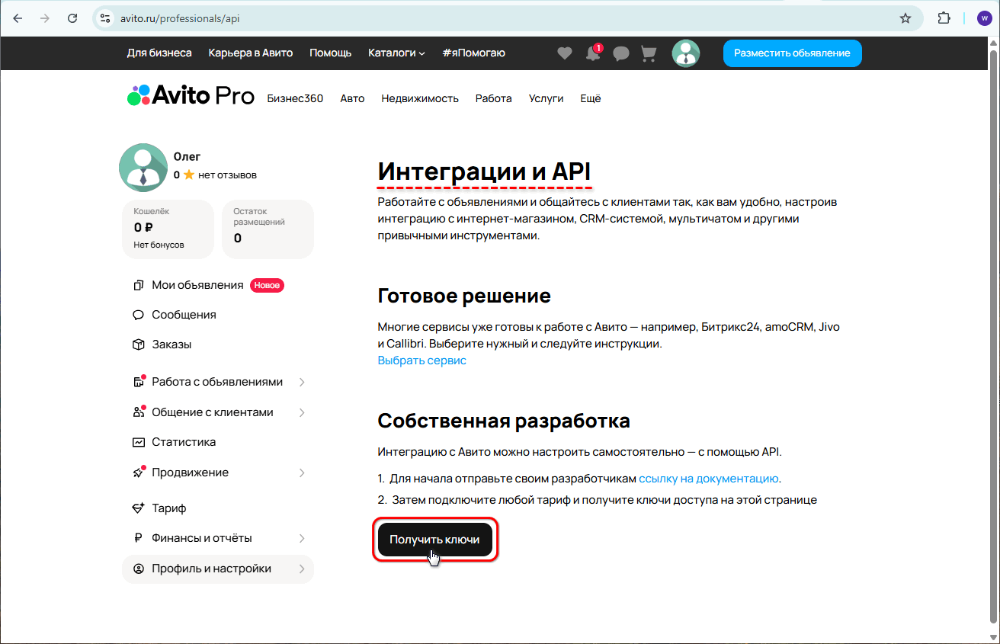

Ключи доступа необходимо *скопировать и сохранить в безопасном месте* – они потребуются для дальнейшей настройки подключения интеграции в программе (см. [ниже](#5-настройка-подключения)).

#### 2. Создание интеграции

Для настройки интеграции с API Авито необходимо перейти в справочник "Интеграции" в программе *Администрирование → Компания → CRM → Интеграции и создать в нем новый элемент:*

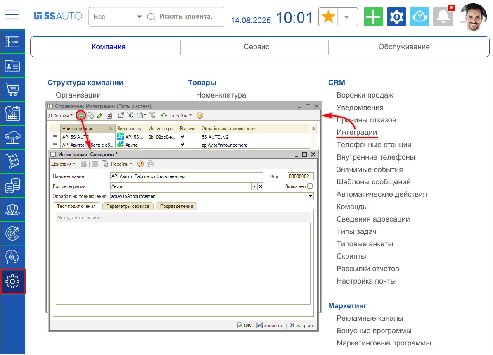

#### 3. Основные реквизиты

Необходимо заполнить следующие реквизиты:

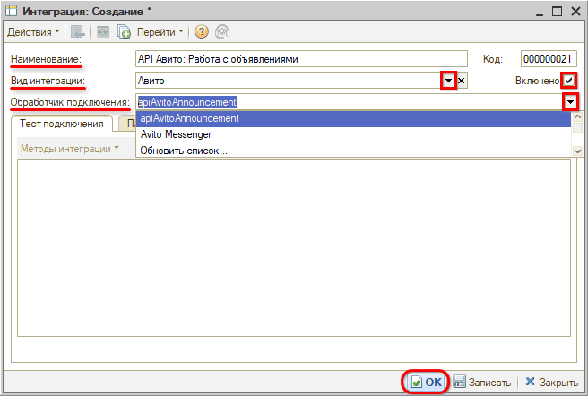

**1.** *Наименование интеграции* – будет заполнено автоматически после выбора обработчика подключения, можно задать свое при необходимости;

**2.** Выбрать *вид интеграции* – "Авито";

**3.** Выбрать *обработчик подключения* – *apiAvitoAnnouncement;*

После заполнения следует установить галочку *"Включено"* и *записать* изменения.

#### 4. Параметры сервиса

##### 1) Интеграция с API 5S AUTO

Далее следует перейти на вкладку *"Параметры сервиса",* выбрать интеграцию с API 5S AUTO и записать:

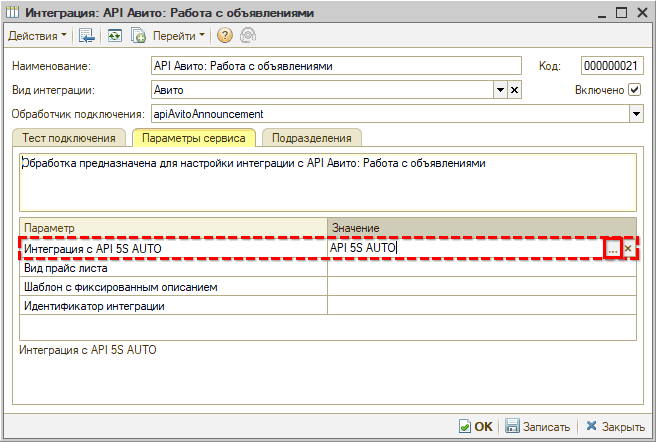

##### 2) Вид прайс листа

В данном параметре следует выбрать из справочника *вид прайс-листа,* предварительно созданный специально для работы с Авито (см. [ниже](#шаг-2-создание-прайс-листа)):

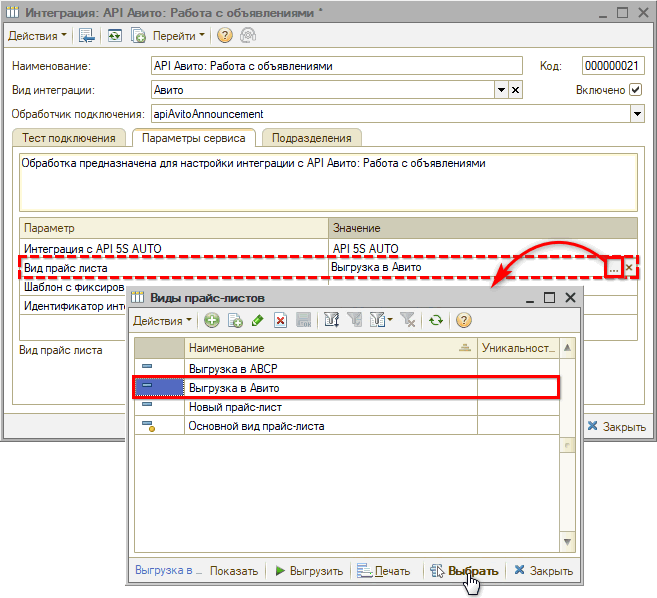

*Примечание:* На одну интеграцию должен быть создан один прайс-лист.

##### 3) Шаблон с фиксированным описанием

В параметре "Шаблон с фиксированным описанием" *при записи интеграции* подтянется автоматически созданный *преднастроенный шаблон:*

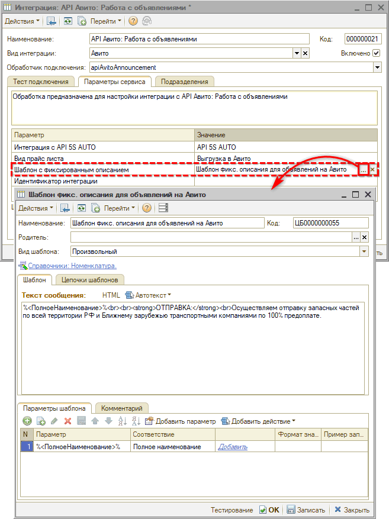

Либо есть возможность создать собственный [шаблон сообщения](https://www.5systems.ru/help/shablony-soobscheniy) и выбрать его в данном параметре вручную. Пример *индивидуальной настройки шаблона:*

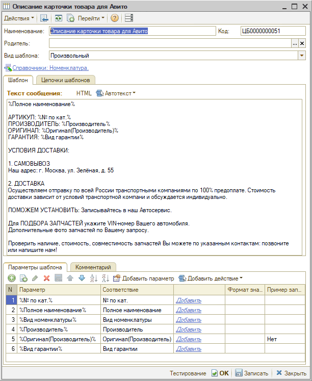

##### 4) Идентификатор интеграции

Данный параметр заполняется автоматически в случае использования нескольких интеграций с Авито.

#### 5. Настройка подключения

Переход к настройкам подключения осуществляется через кнопку *"Методы интеграции → Настройки подключения".* В открывшемся окне *"Настройки подключения к Авито"* следует выбрать в таблице существующую настройку либо добавить новую запись:

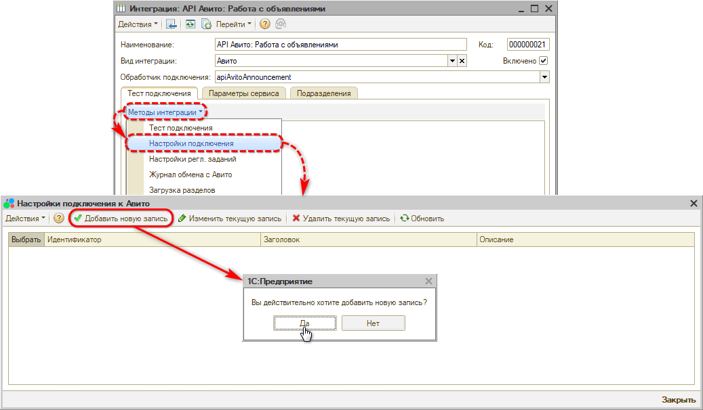

Необходимо задать следующие *параметры подключения:* наименование, описание, а также ввести *ключи **Client ID** и **Client secret**,* полученные в ЛК на сайте Авито (см. [выше](#1-получение-ключей-доступа)), и нажать кнопку *"Создать":*

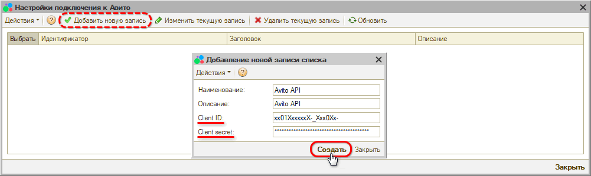

В строке с добавленной настройкой следует установить галочку в колонке *"Выбрать"* – при этом выбранная строка подсвечивается зеленым цветом:

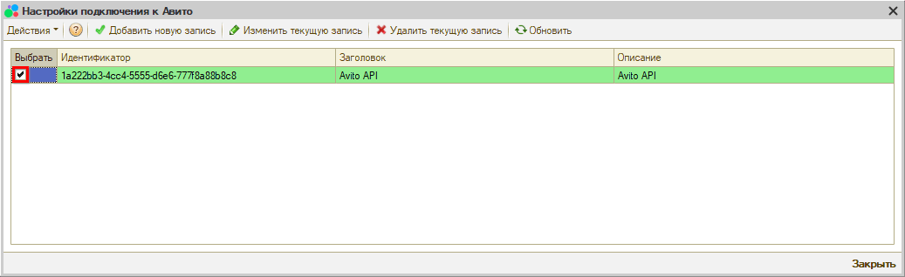

После закрытия окна выбора настройки подключения автоматически производится *тест подключения* – должно появиться сообщение "*Метод выполнен успешно":*

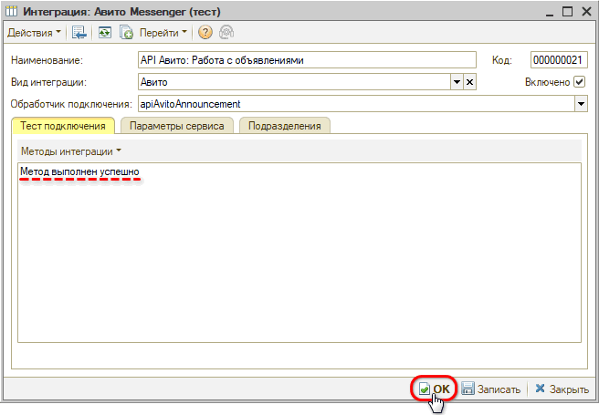

После того, как произведены все настройки, необходимо *записать* интеграцию нажатием кнопки *"Записать"* или *"ОК".*

Настройки подключения при необходимости можно *редактировать* или *удалить* – для этого следует выделить в таблице нужную строку и использовать кнопки "Изменить текущую запись" или "Удалить текущую запись".

В случае использования компанией нескольких профилей следует для каждого профиля создавать отдельный элемент справочника интеграции.

#### 6. Настройка регламентных заданий

Нажатием на кнопку *"Методы интеграции → Настройка регл. заданий"* открывается форма настройки регламентных заданий, обеспечивающих автоматическую выгрузку объявлений:

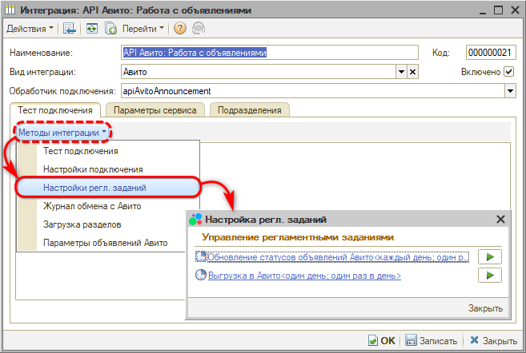

Подробнее см. ниже раздел "[Шаг 5. Запуск выгрузки](#шаг-5-запуск-выгрузки)".

#### 7. Журнал обмена с Авито

Есть возможность просмотреть регистр сведений "Журнал обмена с Авито" – для этого следует перейти через *"Методы интеграции → Журнал обмена с Авито":*

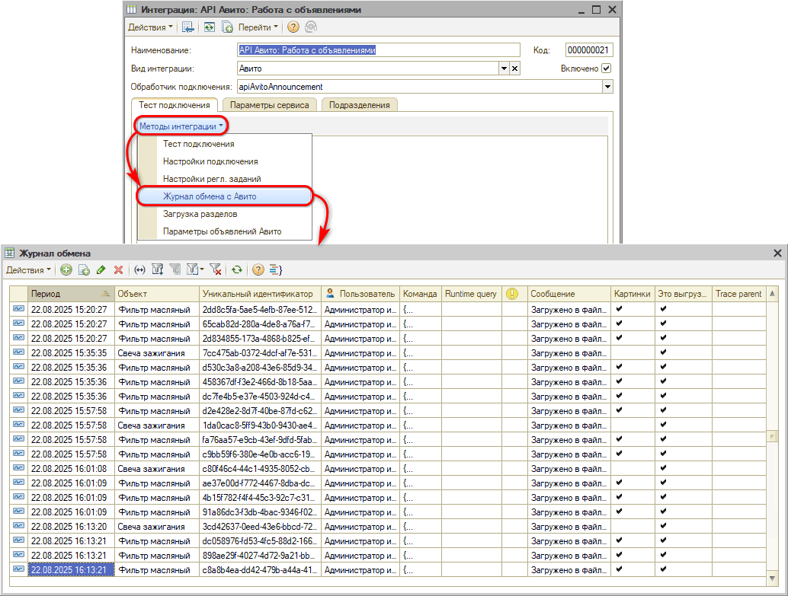

#### 8. Загрузка категорий объявлений Авито

Перед настройкой номенклатуры необходимо загрузить *разделы объявлений Авито* с соответствующими свойствами для каждой категории объявлений.

Для объявлений Авито есть определенные требования – ***обязательные параметры**,* без которых объявление не загрузится на сайт. К таким параметрам относятся: категория, раздел, производитель, новое или б/у и другие свойства – см. [документацию на сайте Авито](https://www.avito.ru/autoload/documentation/templates/103798). По маслам есть дополнительные обязательные реквизиты: объем, класс вязкости, допуски OEM и т.д. – подробнее см. на [сайте](https://www.avito.ru/autoload/documentation/templates/103775).

Для загрузки разделов следует нажать кнопку *"Методы интеграции → Загрузка разделов".* Нужно выделить всю группу "Запчасти и аксессуары" (либо всю группу "Транспорт" при необходимости), нажать кнопку "Загрузить" и дождаться загрузки информации:

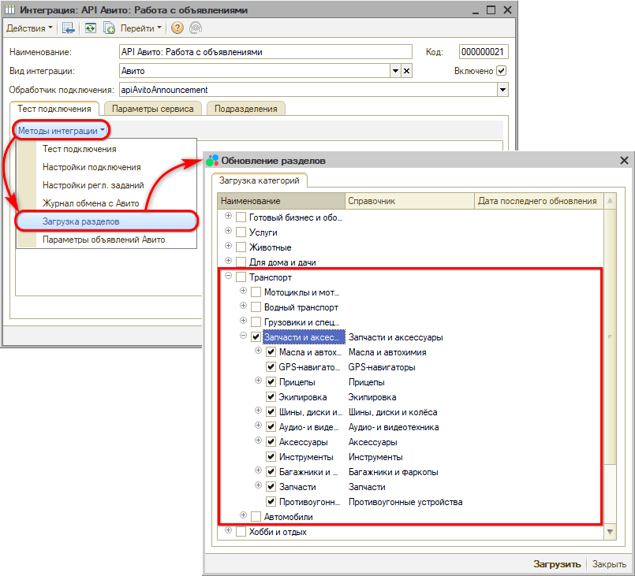

*Примечание:* Загрузка всех свойств категории может занять ~1,5-2 часа.

### Шаг 2. Создание прайс-листа

Справочник "Виды прайс-листов" находится в меню интерфейса *"Администрирование → Компания → Товары":*

В данном справочнике следует создать специальный прайс-лист для выгрузки объявлений на Авито. См. основную статью статья "[Выгрузка прайс-листов](../Выгрузка%20прайс-листов/vygruzka-prays-listov.md)".

Следует настроить выгрузку прайс-листа в соответствии с бизнес-процессам компании (например, выгружать только остатки на собственных складах либо включать предложения поставщиков и т.д.):

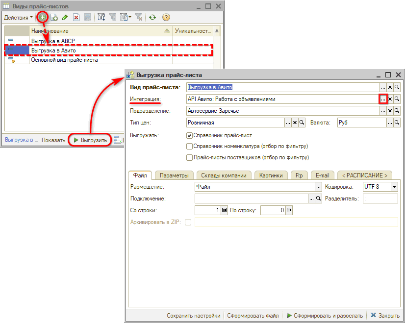

В создаваемом виде прайс-листа необходимо указать интеграцию для работы с объявлениями Авито (см. пункт [Шаг 1. Настройка интеграции](#шаг-1-настройка-интеграции)).

*Примечание:* Для каждой интеграции с Авито должен быть отдельный прайс-лист. Для нового прайс-листа необходимо создавать отдельную интеграцию. Это будет определять корректность подстановки фиксированного шаблона в описание объявлений.

Есть возможность *проверить правильность настройки прайс-листа* в специальном онлайн-сервисе – для этого следует сформировать файл прайс-листа. В параметре "Подключение" следует *указать адрес* и *прописать наименование и формат* создаваемого файла, затем нажать кнопку *"Сформировать файл":*

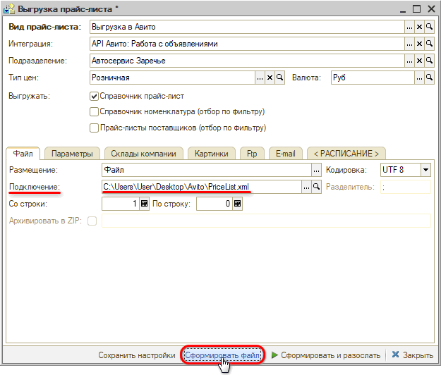

Затем следует перейти к папке с созданным файлом:

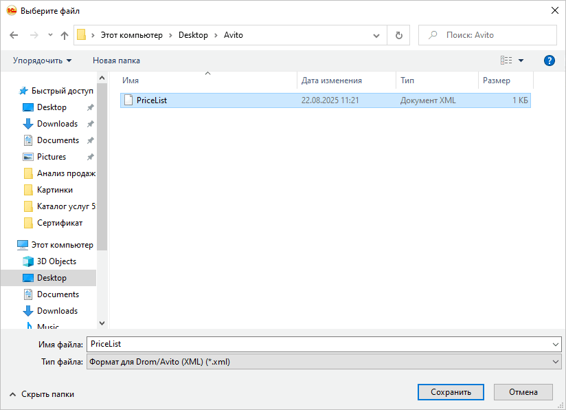

В ЛК на сайте Авито следует открыть раздел *"Автозагрузка → Проверка файла"* (либо перейти по ссылке [https://autoload.avito.ru/format/xmlcheck/](https://autoload.avito.ru/format/xmlcheck/)):

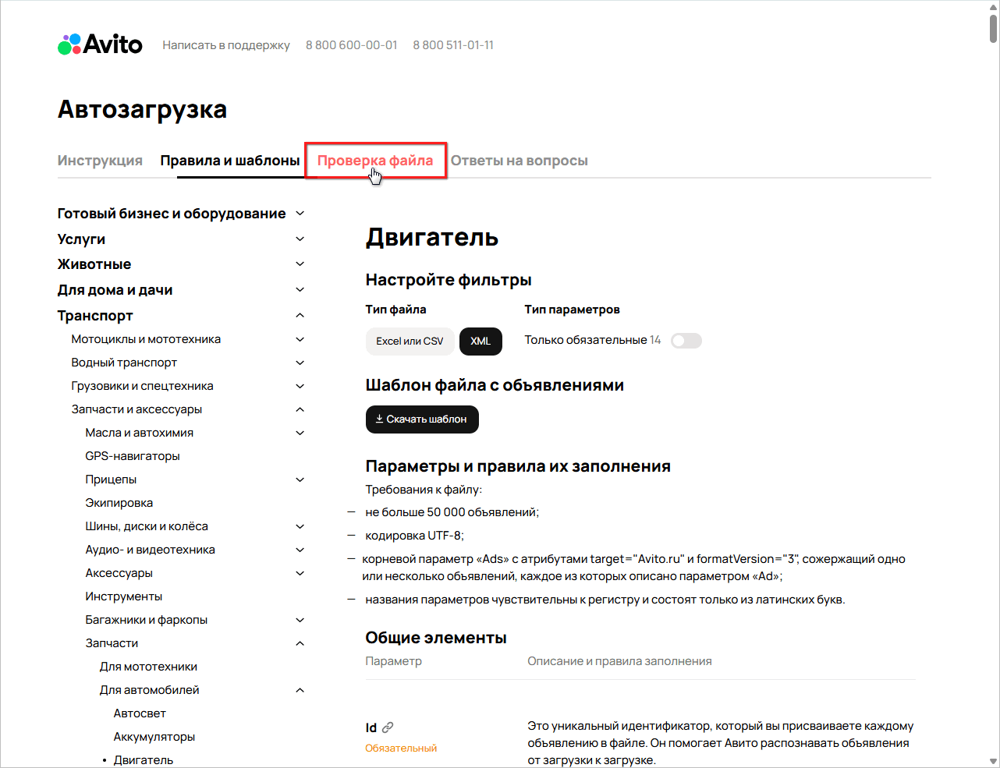

В открывшемся разделе в поле для проверки прайс-листа из файла следует *перетащить* созданный *xml-файл* или открыть его через ссылку *"выберите на компьютере":*

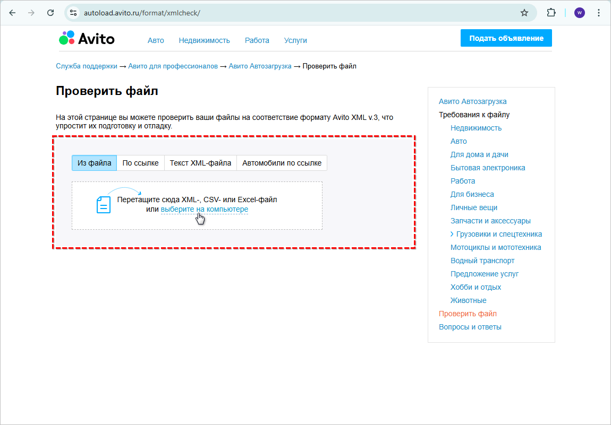

После загрузки файла выводится *отчет о проверке.* В случае правильной настройки объявлений отображается общий статус файла и статусы каждого объявления *"Соответствует формату":*

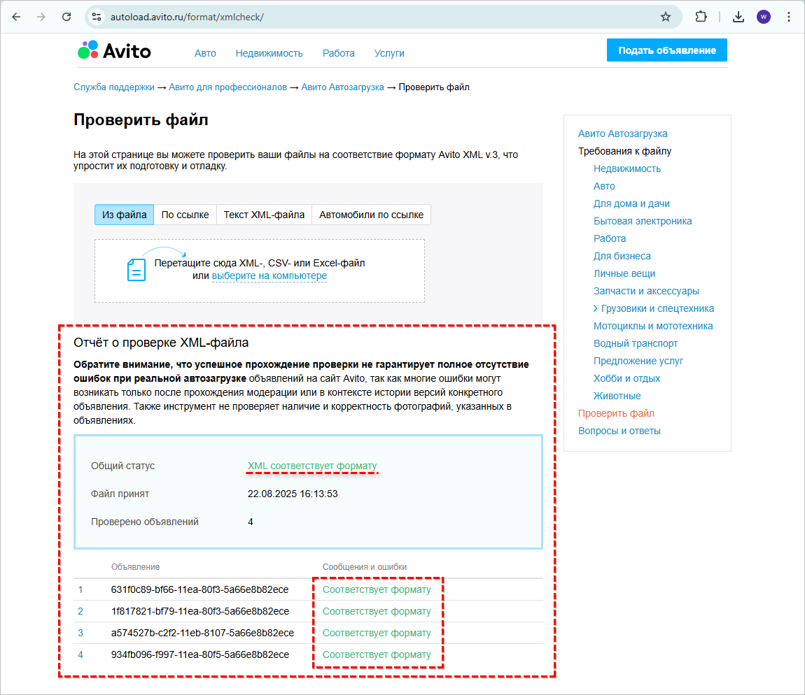

В случае если есть ошибки в объявлениях, общий статус файла будет "XML не соответствует формату" или "XML не полностью соответствует формату", и напротив каждого объявления будет указан тип ошибки с подробным указанием ее причины и пути устранения – см. информацию на сайте Авито "[Ошибки при автозагрузке](https://support.avito.ru/sections/111)".

### Шаг 3. Заполнение свойств номенклатуры

#### Переход к настройке

Номенклатура для выгрузки на Авито должна быть предварительно настроена и выбрана для загрузки в прайс-лист.

При подключении интеграции (см. [выше](#шаг-1-настройка-интеграции)) в карточке номенклатуры появляется дополнительная *вкладка "Авито",* на которой производятся необходимые для выгрузки настройки:

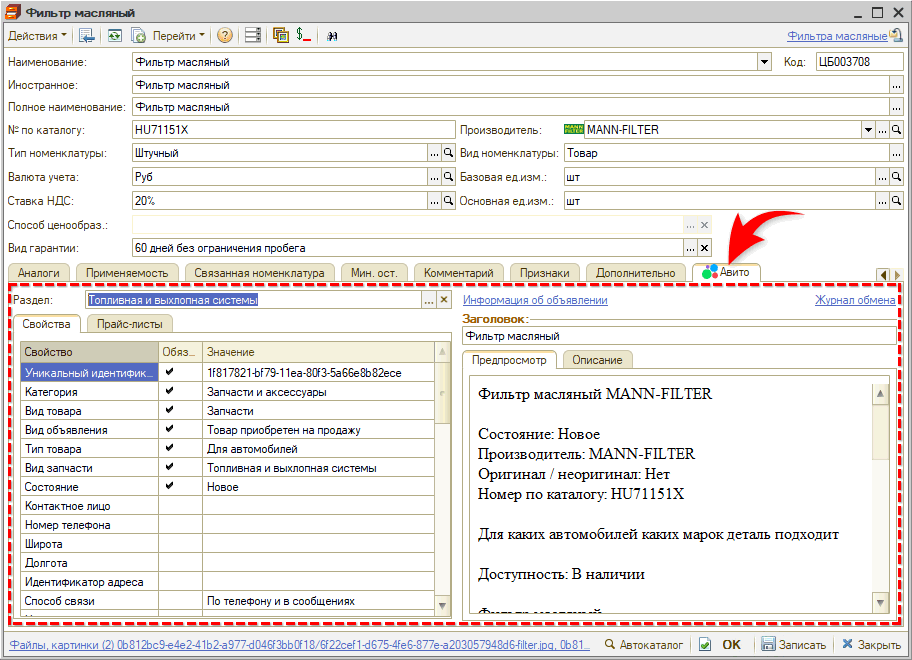

#### Категория и свойства

Для загрузки объявлений на Авито есть определенные требования – у товара должны быть заполнены ***обязательные параметры**,* без которых объявление при выгрузке прайс-листа на сайт попадет в закрытые.

К таким параметрам относятся: категория, раздел, производитель, новое или б/у и другие свойства. По маслам есть дополнительные обязательные реквизиты: объем, класс вязкости, допуски OEM и т.д. Подробнее о требованиях см. на [сайте](https://www.avito.ru/autoload/documentation/templates/103775) (документация приводится в разбивке по категориям).

Одним из обязательных параметров является ***раздел*** – его необходимо выбрать из предварительно загруженного справочника (см. [выше](#8-загрузка-категорий-объявлений-авито)):

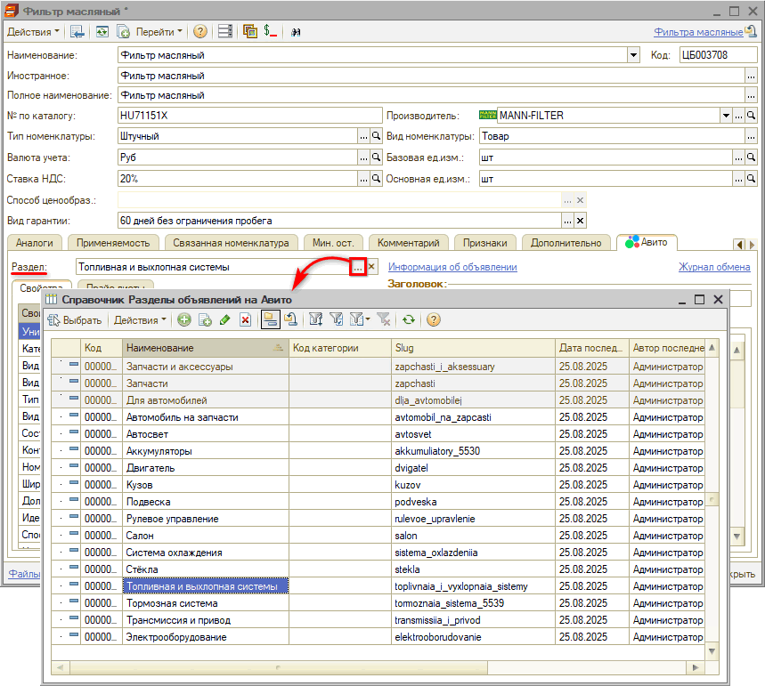

При выборе раздела автоматически заполняются ***свойства*** для номенклатуры на соответствующей вкладке – галочками отмечены обязательные свойства:

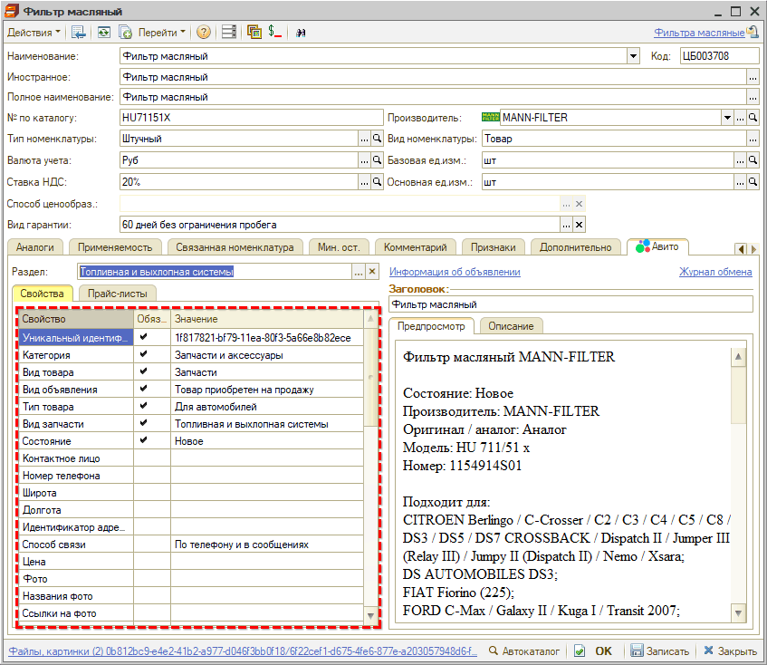

*Обязательные свойства* предзаполнены значениями по умолчанию из справочника *"Разделы объявлений на Авито"* (см. [ниже](#spr_razdely)). Данный справочник заполняется автоматически при загрузке свойств.

*Уникальный идентификатор* объявления заполняется автоматически при записи изменений в карточке.

Рекомендуется заполнить остальные свойства по необходимости. Значения выбираются из предварительно загруженных справочников значений либо вводятся строкой:

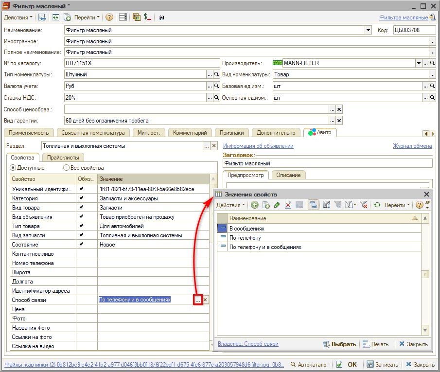

При необходимости есть возможность *скрыть* некоторые свойства, чтобы они не отображались в списке в карточке номенклатуры – это можно сделать через настройки справочника *"Разделы объявлений на Авито"* (см. [далее](#spr_razdely)).

**Справочник "Разделы объявлений на Авито"**

Справочник *"Разделы объявлений на Авито"* содержит значения свойств по умолчанию:

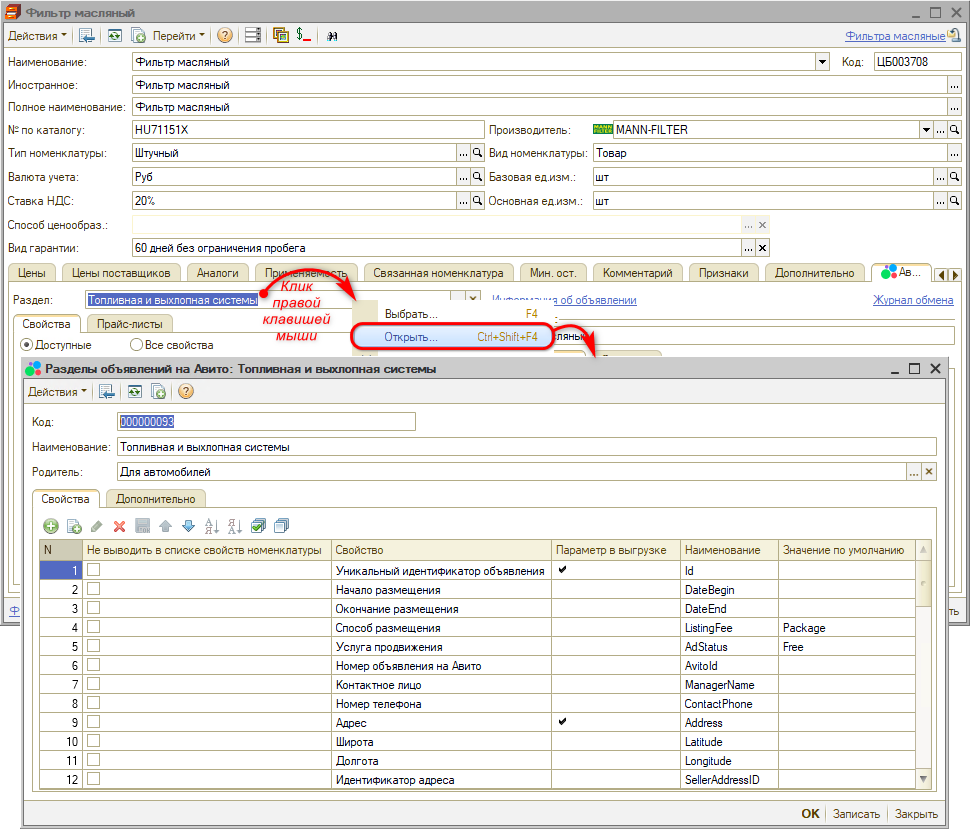

Отметка в столбце "Параметр в выгрузке" означает, что этот параметр обязательный.

В столбце "Значение по умолчанию" указано значение, которое будет установлено автоматически, если параметр "Значение" для свойств в номенклатуре не будет заполнен вручную.

Отметка в столбце *"Не выводить в списке свойств номенклатуры"* отключает отображение данного свойства в карточке номенклатуры.

На *вкладке "Дополнительно"* выводится следующая информация:

- Дата последнего обновления;
- Инициатор последнего обновления;
- Идентификатор

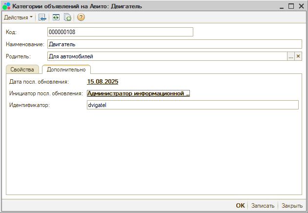

#### Заголовок и описание

***Заголовок*** для объявления заполняется автоматически по наименованию номенклатуры – при необходимости следует изменить его вручную.

Далее необходимо заполнить ***описание*** для объявления. В описании следует указать: производителя, новое или б/у, оригинал или аналог, каталожные номера, в т.ч. кроссовые, для каких автомобилей каких марок деталь подходит и т.д.

Для ввода описания следует перейти на вкладку *"Описание"* и написать текст:

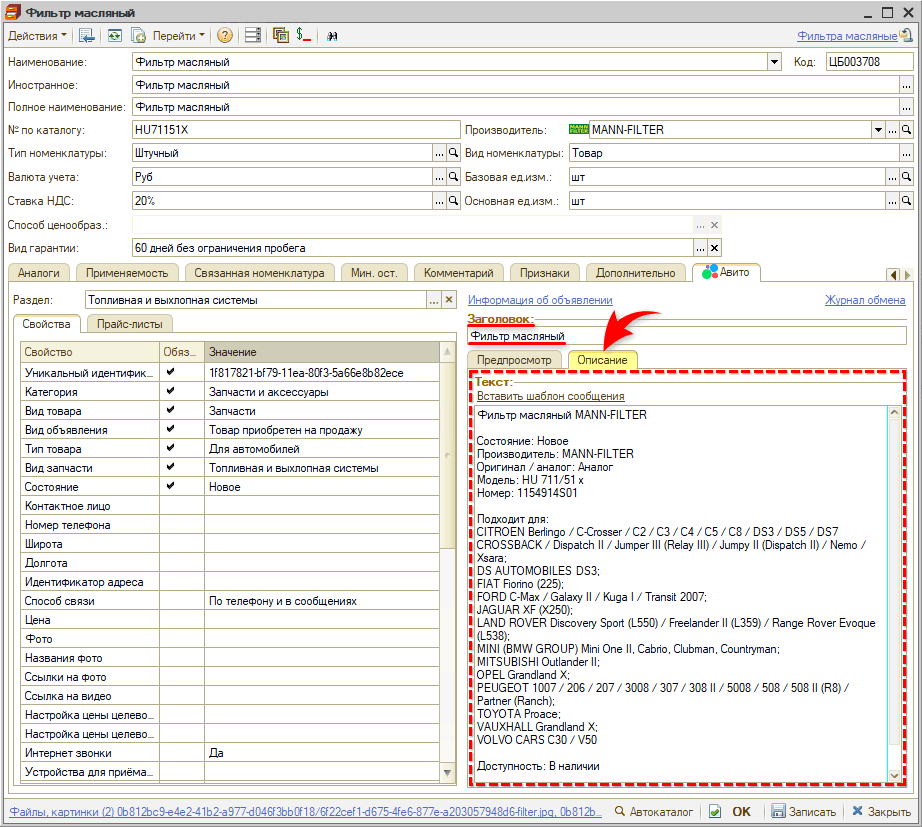

К введенному на данной вкладке описанию в конце добавляется текст из *шаблона сообщения,* выбранного в настройках интеграции в *Параметрах сервиса* (см. [выше](#3-шаблон-с-фиксированным-описанием)).

Например, в шаблон можно вывести общее для всех объявлений описание: условия доставки, правила заказа и т.д., а в описании указывать индивидуальные параметры каждой конкретной автозапчасти. Либо можно все описание вывести в шаблон с использованием автотекста.

На вкладке *"Предпросмотр"* отображается готовый текст объявления в том виде, в котором он будет выгружен на Авито:

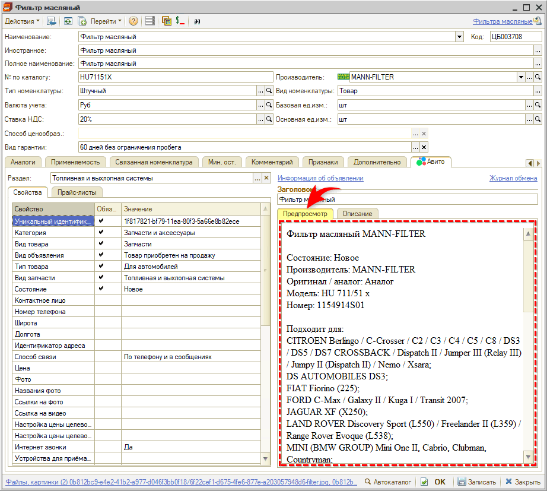

*Дополнительно* можно добавить другой шаблон по кнопке "Вставить шаблон сообщения":

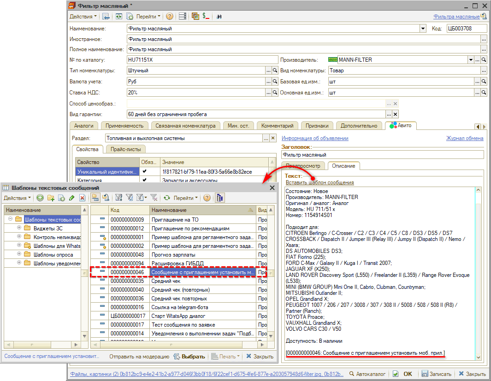

*Примечание:* Последним в любом случае будет описание из фиксированного шаблона. После дополнительного шаблона необходимо сделать перенос строки, чтобы отделить текст из дополнительного шаблона от первой строки текста из основного шаблона.

#### Фото товара

Фото для объявлений будут подгружаться из прикрепленных к номенклатуре картинок и файлов (см. статью *"[Номенклатура → Картинки и файлы](../Номенклатура/nomenklatura.md#картинки-и-файлы)"):*

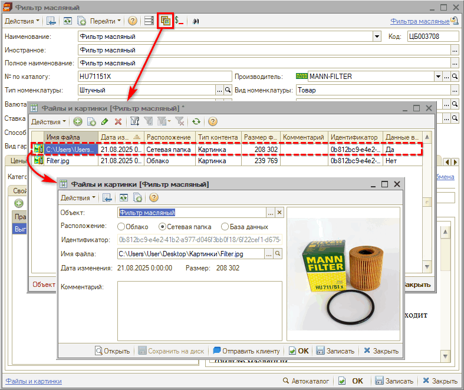

Расположение файла должно быть *Облако* или *Сетевая папка.*

Будут выгружаться все прикрепленные к номенклатуре фото.

Картинки должны соответствовать *требованиям Авито:*

- допустимые форматы: jpg, jpeg,png, gif (анимация не проигрывается);
- размеры: не более 25Мб;
- разрешение: не более 1280х960 (если вы загружаете больший размер, то фотография автоматически сжимается);
- соотношение сторон: рекомендуется 4х3 (например, 1024 x 768, 1152 x 864, 1600 x 1200, 1920 x 1440 px), чтобы фото в объявлении отображались без размытого фона;
- изображения должны быть четкими и соответствовать описанию и названию объявления;
- нельзя размещать на фото адреса, телефоны или другую контактную информацию;
- следует размещать только свои (самостоятельно сделанные) фотографии и видео, либо на использование которых имеется иное законное основание.

#### Прайс-листы

На вкладке *"Прайс-листы"* отображаются прайс-листы, в которых находится это объявление – они добавляются на данную вкладку автоматически при выборе номенклатуры в прайс лист (см. [выше](#шаг-2-создание-прайс-листа)):

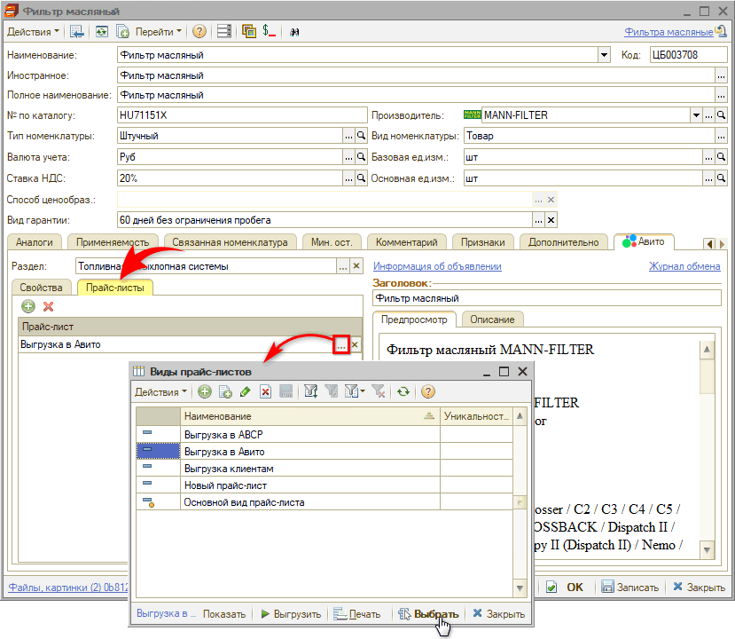

*Примечание:* Для корректной подстановки в текст объявления фиксированного шаблона на данной вкладке должен быть указан один прайс-лист. Тот же прайс-лист должен быть указан в настройках интеграции – см. [выше](#2-вид-прайс-листа). [Шаблон](#3-шаблон-с-фиксированным-описанием), указанный в данной интеграции, будет подтягиваться в описание объявления.

### Шаг 4. Групповая обработка заполнения

Переход к *групповой установке параметров объявлений на Авито* производится через меню *"Запчасти и склад → Продажи → Обработки":*

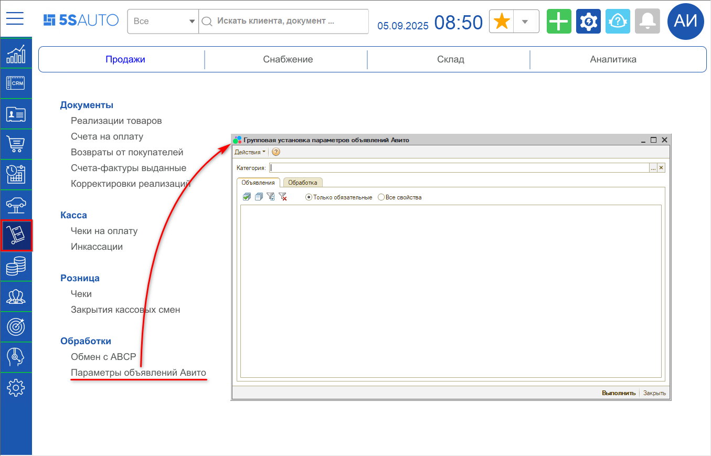

*Примечание:* Данная обработка появляется в меню после *записи интеграции* с Авито-объявлениями.

Также можно перейти через настройки интеграции *"Методы интеграции → Параметры объявлений Авито":*

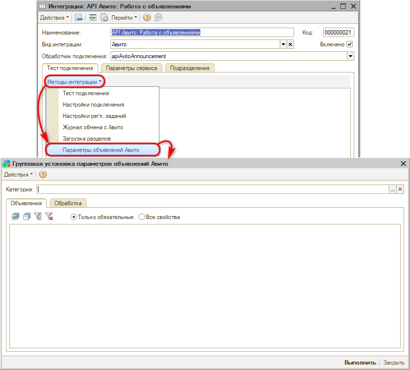

В открывшемся окне обработки следует *выбрать категорию* – при этом таблица будет заполнена объявлениями, в которых для номенклатуры выбрана указанная категория. Следует выделить нужные объявления и вариант загрузки – "Только обязательные" или "Все свойства":

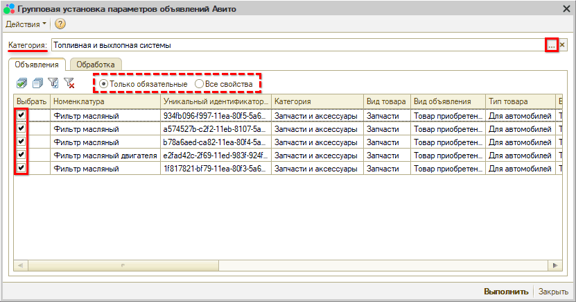

Затем перейти на вкладку *"Обработка",* выбрать нужные свойства, заполнить значения и нажать кнопку *"Выполнить":*

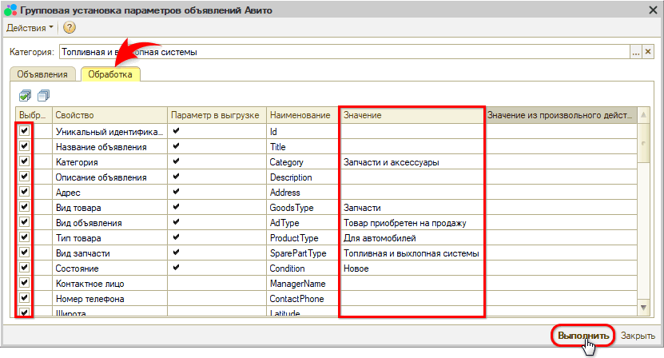

### Шаг 5. Запуск выгрузки

Для настройки регламентных заданий по обновлению статусов объявлений следует перейти в *"Методы интеграции → Настройка регл. заданий":*

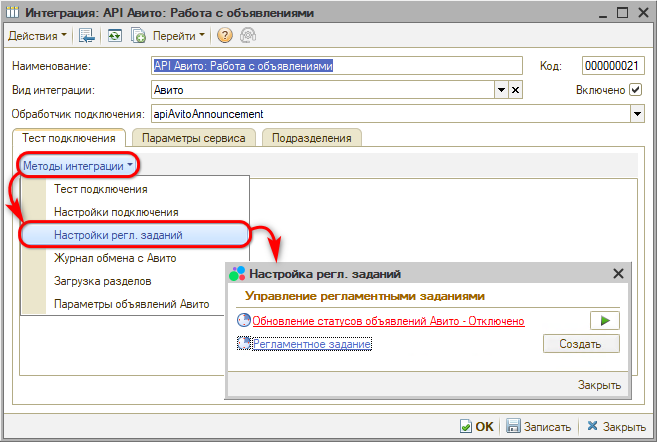

Работу механизма автоматической выгрузки объявлений на Авито регулируют два регламентных задания: "Обновление статусов объявлений Авито" и "Выгрузка в Авито". Первое является предопределенным, второе сначала потребуется создать.

*Примечание:* Первоначально отображается только первое регламентное задание.

**1) Обновление статусов объявлений**

Регламентное задание *"Обновление статусов объявлений Авито"* следует включить – установить галочку "Использование" и записать – а также задать расписание для него:

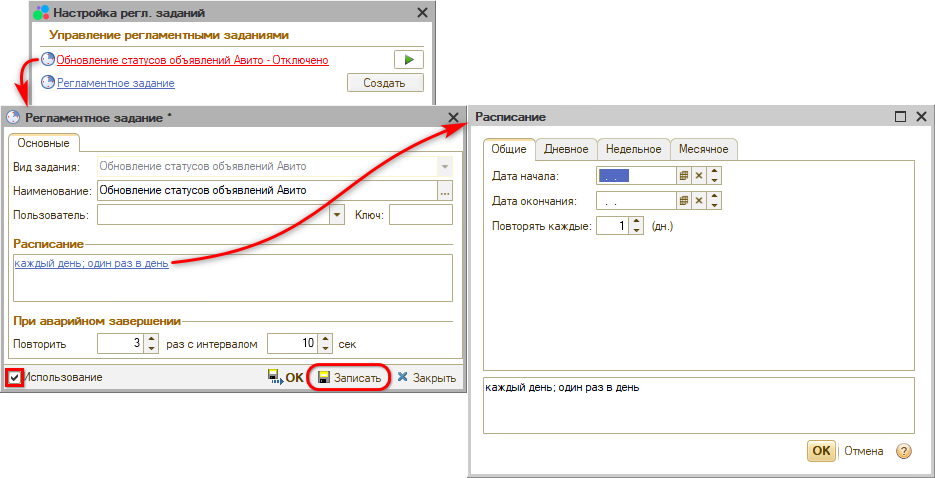

*Примечание:* Рекомендуемое расписание – не чаще чем один раз в час.

**2) Выгрузка в Авито**

Регламентное задание *"Выгрузка в Авито"* необходимо создать – для этого на форме "Настройка регл. заданий" следует нажать кнопку "Создать" напротив второго регламентного задания.

Данное регламентное задание также необходимо включить – установить галочку "Использование" – и задать расписание:

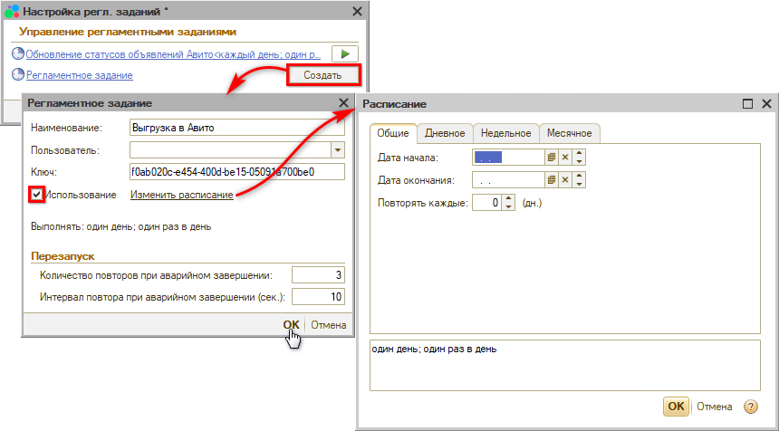

На сайте Авито в профиле следует перейти в раздел *"Работа с объявлениями → Автозагрузка":*

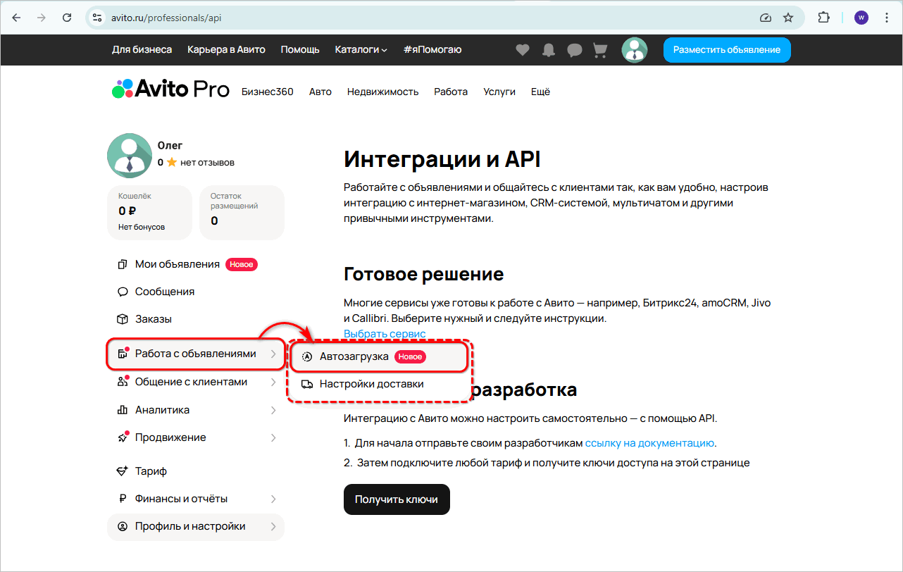

В данном разделе требуется указать параметры выгрузки файла с объявлениями:

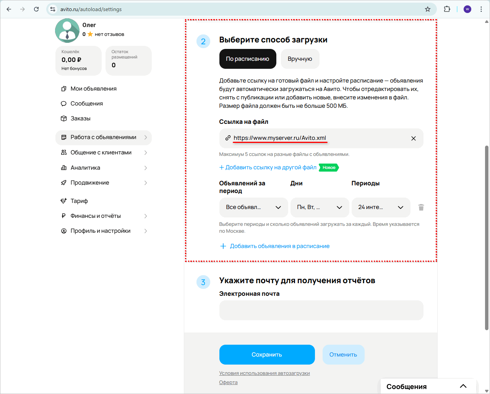

*Примечание:* Адрес ссылки на файл предоставляется техподдержкой 5SYSTEMS на этапе настройки.

### Шаг 6. Просмотр отчета о загрузке

После каждой выгрузки создается отчет. Для его просмотра следует в профиле на сайте перейти в раздел *"Работа с объявлениями → Автозагрузка"* (см. инструкцию на сайте Авито "[Как посмотреть отчет](https://www.avito.ru/autoload/documentation#HowToOpenReport)").

В отчете отображается следующая информация:

- статус выгрузки файла;
- подробная информация о каждом объявлении;
- количество потраченных размещений;
- подключенные услуги продвижения;
- ошибки при размещении объявлений, причины и способы их исправить – см. статью на сайте Авито "[Ошибки при автозагрузке](https://support.avito.ru/sections/111)".

## Работа с несколькими кабинетами

В случае работы с несколькими кабинетами Авито требуется создать отдельную интеграцию на каждый кабинет. Основная настройка производится стандартным способом.

Дополнительно требуется настроить префиксы идентификаторов объявлений – это требуется для того, чтобы объявления по разным кабинетам не блокировались платформой как дублирующиеся. Для этого следует в настройках каждой отдельной интеграции в "Параметрах сервиса" задать свой префикс:

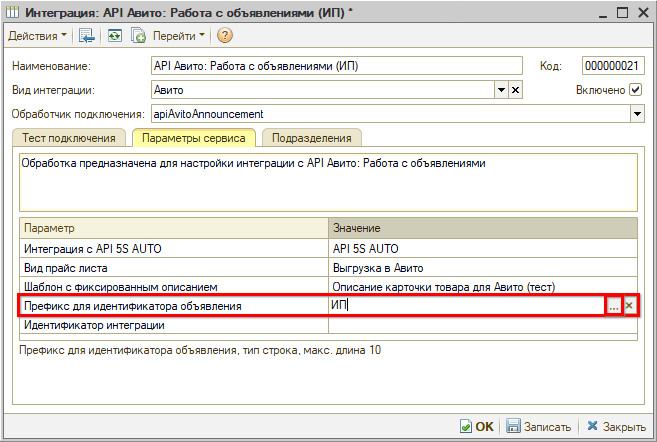

## Дополнительно

Портал **"Дром"** ([www.drom.ru](https://www.drom.ru/)) также принимает выгрузку данных в формате Авито.

В личном кабинете сервиса следует загрузить прайс-лист и отправить его на проверку:

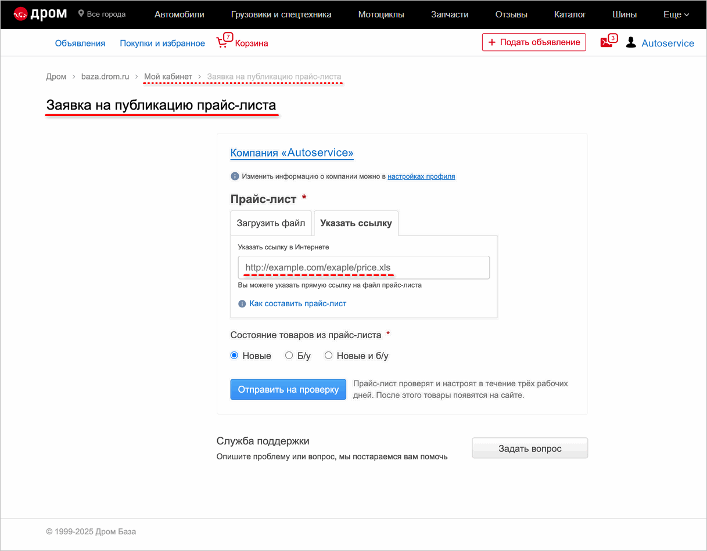

После публикации прайс-лист отображается в разделе "Мои прайс-листы", есть возможность отслеживать статус и замечания по объявлениям:

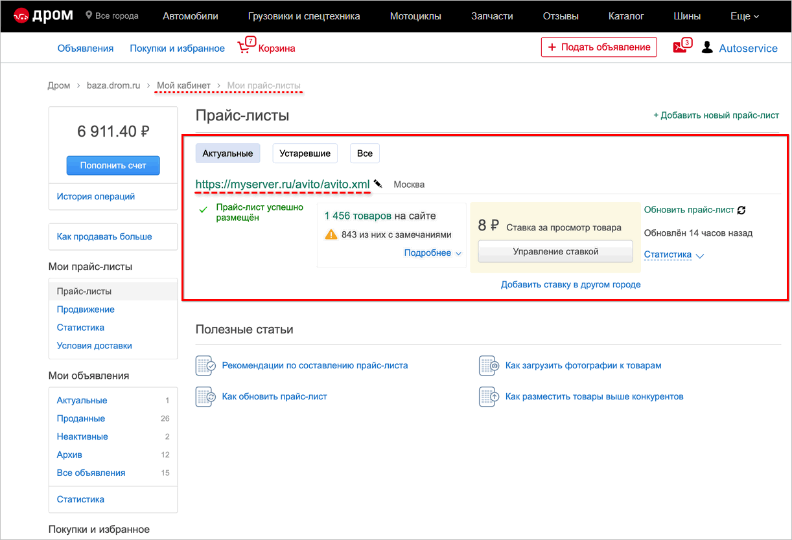

---

**Теги:** Авито, автозагрузка объявлений, интеграция, прайс-лист, разделы объявлений, свойства номенклатуры, регламентные задания, Дром

