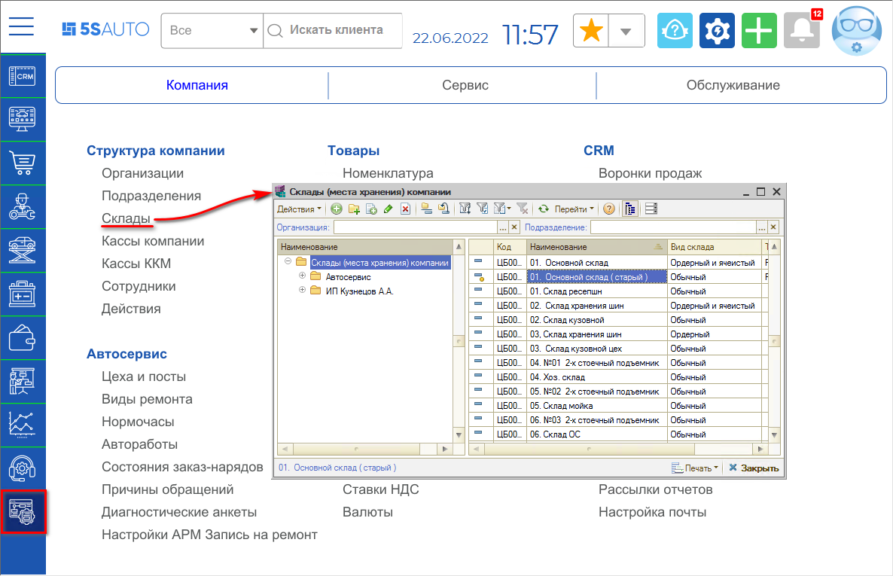
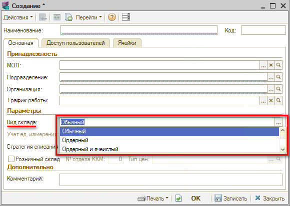
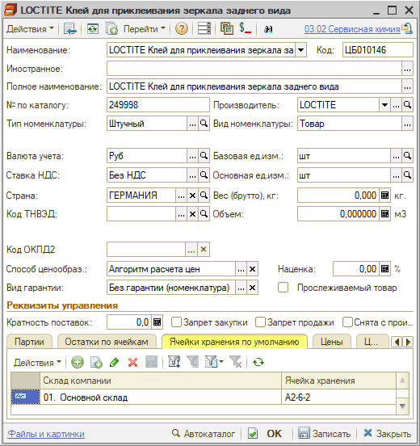
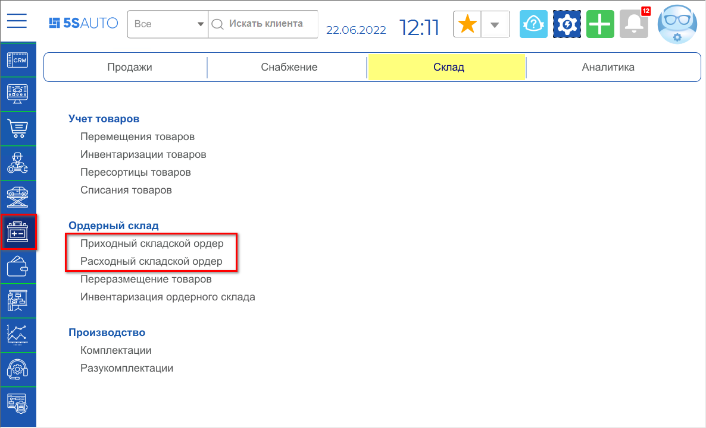
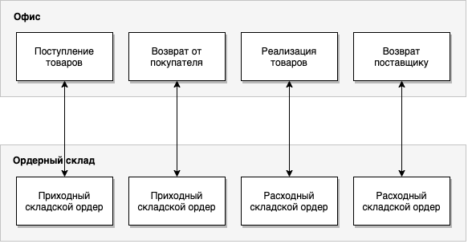
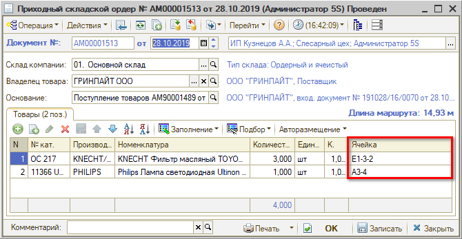
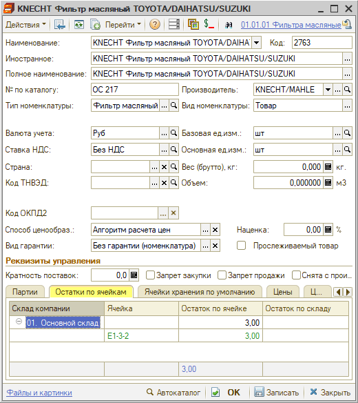
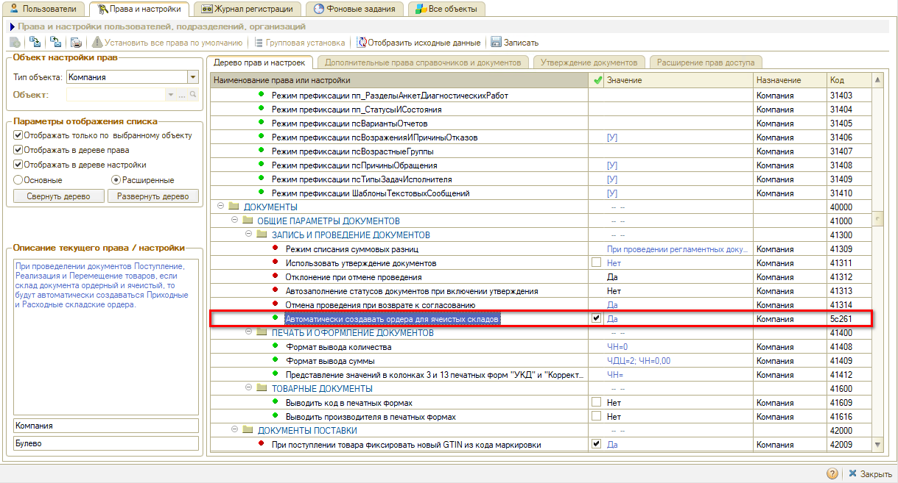
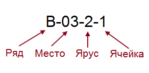
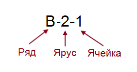

# Виды склада

<table><tr><td><b>Время чтения:</b> 8 мин.</td><td><b>Обновлено:</b> 22.06.2022</td></tr></table>

Источник: https://www.5systems.ru/help/vidy-sklada

## Содержание

- [Введение](#введение)
- [Обычный склад](#обычный-склад)
- [Ордерно-ячеистый склад](#ордерно-ячеистый-склад)
  - [Автоматическое создание ордеров](#автоматическое-создание-ордеров)
- [Ячеистое хранение](#ячеистое-хранение)

## Введение

Склад может быть обычным, ордерно-ячеистым или ордерным. В рамках статьи рассматривается обычный и ордерно-ячеистый склад.

Вид склада задается в справочнике "Склады (места хранения) компании" (*Администрирование → Компания → Структура компании → Склады* или из типового меню программы: *Справочники → Структура компании → Склады (места хранения) компании*):

## Обычный склад

Для обычного склада ведется только товарный учет - через документы, двигающие остатки на складе: Поступление товаров, Перемещение товаров в производство, Возврат поставщику и т.п.

Для организации порядка на обычном складе используется *ячеистое хранение*.

При ячеистом хранении на обычном складе всем товарам должны быть присвоены ячейки хранения по умолчанию в программе. Распределение товара по ячейкам происходит в карточке номенклатуры:

Отслеживать наличие присвоенных ячеек хранения по товарам на обычном складе поможет *[Отчеты по складскому учету → Отчет по заполнению ячеек хранения](https://5systems.ru/help/otchety-po-skladskomu-uchetu)*.

## Ордерно-ячеистый склад

Ордерно-ячеистый склад предполагает *ячеистое хранение товаров* и ведение двойного учета:

- *товарный учет* - учет через документы, двигающие остатки на складе: Поступление товаров, Перемещение товаров в производство, Возврат поставщику и т.п.
- *ордерный учет* - ведение складских ордеров для учета факта поступления/отгрузки товара со склада.

*Ордерный учет* вводится тогда, когда по одному или нескольким складам приемка и отгрузка товаров может происходить раньше или позже даты оформления первичных документов по товарному учету. Например, в офисе продаж оформили расходную накладную, а клиент только на следующий день пришел на склад и физически получил товар.

*Ордерный учет* ведется с помощью складских ордеров - приходным и расходным. При этом поступление товара на склад сопровождается вводом в программу ***приходного складского ордера***, а отгрузка товара - вводом ***расходного складского ордера***.

Реестры данных документов находятся в меню интерфейса *Запчасти и склад → Склад → Ордерный склад* (или в типовом меню: *Документы → Складские документы*)

***Схема работы ордерного (ордерно-ячеистого) склада:***

Ордерно-ячеистый склад предполагает отражение ячеек хранения в складских ордерах c целью фиксирования движения остатков по ним:

При этом товар в отличии от обычного склада может быть расположен в нескольких ячейках хранения.

Остатки по ячейкам конкретного товара можно увидеть в номенклатуре:

*Все остатки по ячейкам ордерного склада* можно увидеть в *отчете "Остатки и обороты товаров ордерного склада"* (см. *[Отчеты по складскому учету → Остатки и обороты товаров ордерного склада](https://5systems.ru/help/otchety-po-skladskomu-uchetu)*).

Поскольку для ордерно-ячеистого склада ведется двойной учет, то могут возникать расхождения между ними. Например, когда:

- товары оприходовали на складе, создав ордера, а документов о поступлении товара по товарному учету еще нет;
- документы на отгрузку по товарному учету проведены, а отгрузка со склада еще не произведена.

*Найти расхождения помогает* *отчет "Сверка остатков и оборотов товаров ордерного склада"* (см. *[Отчеты по складскому учету → Сверка остатков и оборотов товаров ордерного склада](https://5systems.ru/help/otchety-po-skladskomu-uchetu)*).

### Автоматическое создание ордеров

В типовом решении для ордерного склада складские ордера необходимо создавать только вручную. В программе 5S AUTO реализовано автоматическое создание складских ордеров при проведении документов товарного учета.

За включение функции автоматического создания ордеров отвечает право "Автоматически создавать ордера для ячеистых складов":

## Ячеистое хранение

Ячеистое хранение систематизирует склад по местам хранения (ячейкам) с целью равномерного распределения и быстрого поиска товаров.

Для организации ячеек хранения склад делят на отдельные помещения, если такие есть, секции, ряды, ярусы и сами ячейки.

Выглядеть это может так:

Или так (простая организация хранения):

После того, как склад разбили по ячейкам, все поступающие товары распределяются по ним. Для распределения товаров по ячейкам склада:

- предварительно всем товарам присваиваются штрихкоды (см. *[Назначение штрихкодов товарам → Присвоение штрихкода номенклатуре](https://www.5systems.ru/help/naznachenie-shtrikhkodov-tovaram#prisv_shk)*),
- печатается и клеится этикетка на товар с его штрихкодом и номером ячейки (см. *[Печать этикеток](https://5systems.ru/help/pechat-etiketok)*).

Для последующего считывания штрихкодов с целью отгрузки товара используется сканер штрихкодов (см. *[Назначение штрихкодов товаров → Процесс сканирования](https://www.5systems.ru/help/naznachenie-shtrikhkodov-tovaram#skanir)*).

---

**Теги:** Складской учет, виды склада, обычный склад, ордерно-ячеистый склад, ячеистое хранение, складские ордера

