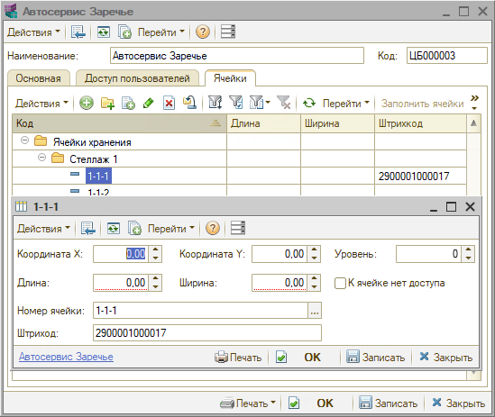
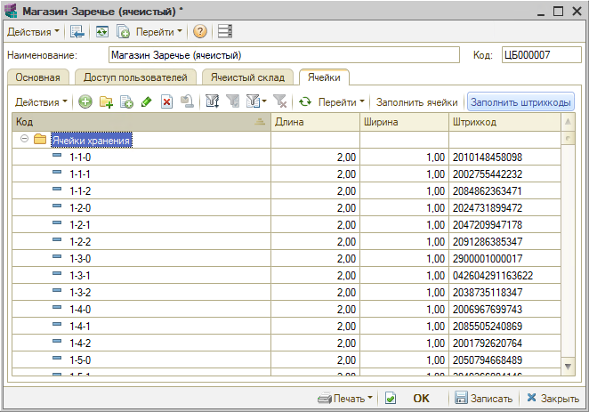
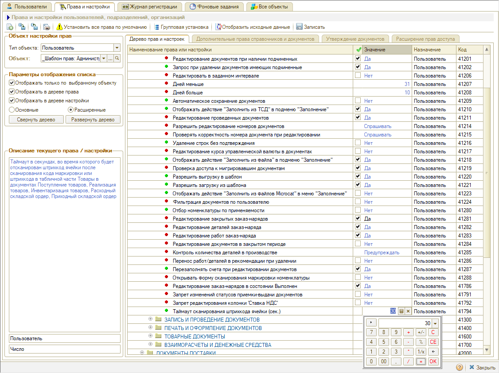
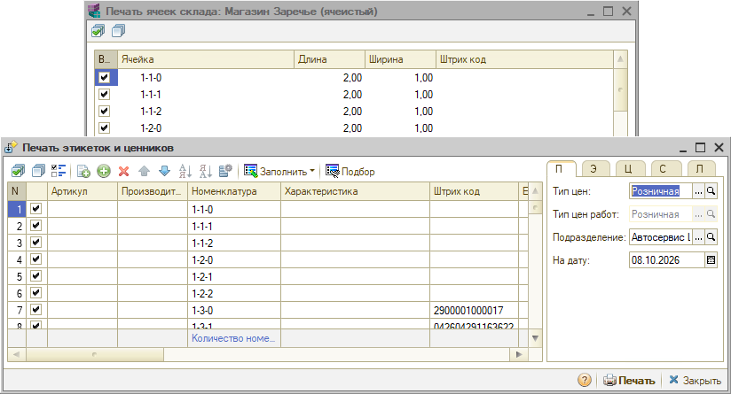
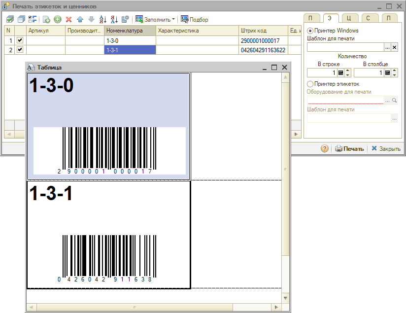

# Виды склада

<table><tr><td><b>Время чтения:</b> 8 мин.</td><td><b>Обновлено:</b> 01.04.2025</td></tr></table>

Источник: https://www.5systems.ru/help/vidy-sklada

## Содержание

- [Введение](#введение)
- [Обычный склад](#обычный-склад)
- [Ордерно-ячеистый склад](#ордерно-ячеистый-склад)
  - [Автоматическое создание ордеров](#автоматическое-создание-ордеров)
- [Ячеистое хранение](#ячеистое-хранение)
  - [Штрихкоды ячеек хранения](#штрихкоды-ячеек-хранения)

## Введение

Склад может быть обычным, ордерно-ячеистым или ордерным. В рамках статьи рассматривается обычный и ордерно-ячеистый склад.

Вид склада задается в справочнике "Склады (места хранения) компании" (*Администрирование → Компания → Структура компании → Склады* или из типового меню программы: *Справочники → Структура компании → Склады (места хранения) компании*):

## Обычный склад

Для обычного склада ведется только товарный учет - через документы, двигающие остатки на складе: Поступление товаров, Перемещение товаров в производство, Возврат поставщику и т.п.

Для организации порядка на обычном складе используется *ячеистое хранение*.

При ячеистом хранении на обычном складе всем товарам должны быть присвоены ячейки хранения по умолчанию в программе. Распределение товара по ячейкам происходит в карточке номенклатуры:

Отслеживать наличие присвоенных ячеек хранения по товарам на обычном складе поможет *[Отчеты по складскому учету → Отчет по заполнению ячеек хранения](../../Отчеты/Отчеты%20по%20складскому%20учету/otchety-po-skladskomu-uchetu.md)*.

## Ордерно-ячеистый склад

Ордерно-ячеистый склад предполагает *ячеистое хранение товаров* и ведение двойного учета:

- *товарный учет* - учет через документы, двигающие остатки на складе: Поступление товаров, Перемещение товаров в производство, Возврат поставщику и т.п.
- *ордерный учет* - ведение складских ордеров для учета факта поступления/отгрузки товара со склада.

*Ордерный учет* вводится тогда, когда по одному или нескольким складам приемка и отгрузка товаров может происходить раньше или позже даты оформления первичных документов по товарному учету. Например, в офисе продаж оформили расходную накладную, а клиент только на следующий день пришел на склад и физически получил товар.

*Ордерный учет* ведется с помощью складских ордеров - приходным и расходным. При этом поступление товара на склад сопровождается вводом в программу ***приходного складского ордера***, а отгрузка товара - вводом ***расходного складского ордера***.

Реестры данных документов находятся в меню интерфейса *Запчасти и склад → Склад → Ордерный склад* (или в типовом меню: *Документы → Складские документы*)

***Схема работы ордерного (ордерно-ячеистого) склада:***

Ордерно-ячеистый склад предполагает отражение ячеек хранения в складских ордерах c целью фиксирования движения остатков по ним:

При этом товар в отличии от обычного склада может быть расположен в нескольких ячейках хранения.

Остатки по ячейкам конкретного товара можно увидеть в номенклатуре:

*Все остатки по ячейкам ордерного склада* можно увидеть в *отчете "Остатки и обороты товаров ордерного склада"* (см. *[Отчеты по складскому учету → Остатки и обороты товаров ордерного склада](../../Отчеты/Отчеты%20по%20складскому%20учету/otchety-po-skladskomu-uchetu.md)*).

Поскольку для ордерно-ячеистого склада ведется двойной учет, то могут возникать расхождения между ними. Например, когда:

- товары оприходовали на складе, создав ордера, а документов о поступлении товара по товарному учету еще нет;
- документы на отгрузку по товарному учету проведены, а отгрузка со склада еще не произведена.

*Найти расхождения помогает* *отчет "Сверка остатков и оборотов товаров ордерного склада"* (см. *[Отчеты по складскому учету → Сверка остатков и оборотов товаров ордерного склада](../../Отчеты/Отчеты%20по%20складскому%20учету/otchety-po-skladskomu-uchetu.md)*).

### Автоматическое создание ордеров

В типовом решении для ордерного склада складские ордера необходимо создавать только вручную. В программе 5S AUTO реализовано автоматическое создание складских ордеров при проведении документов товарного учета.

За включение функции автоматического создания ордеров отвечает право "Автоматически создавать ордера для ячеистых складов":

## Ячеистое хранение

Ячеистое хранение систематизирует склад по местам хранения (ячейкам) с целью равномерного распределения и быстрого поиска товаров.

Для организации ячеек хранения склад делят на отдельные помещения, если такие есть, секции, ряды, ярусы и сами ячейки.

Выглядеть это может так:

Или так (простая организация хранения):

После того, как склад разбили по ячейкам, все поступающие товары распределяются по ним. Для распределения товаров по ячейкам склада:

- предварительно всем товарам присваиваются штрихкоды (см. *[Назначение штрихкодов товарам → Присвоение штрихкода номенклатуре](../Штрихкодирование%20номенклатуры/Назначение%20штрихкодов%20товарам/naznachenie-shtrikhkodov-tovaram.md#присвоение-штрихкода-номенклатуре)*),
- печатается и клеится этикетка на товар с его штрихкодом и номером ячейки (см. *[Печать этикеток](../Печать%20этикеток/pechat-etiketok.md)*).

Для последующего считывания штрихкодов с целью отгрузки товара используется сканер штрихкодов (см. *[Назначение штрихкодов товаров → Процесс сканирования](../Штрихкодирование%20номенклатуры/Назначение%20штрихкодов%20товарам/naznachenie-shtrikhkodov-tovaram.md#процесс-сканирования)*).

### Штрихкоды ячеек хранения

> *Функционал доступен начиная с релиза **2.8.5**.*

Штрихкоды можно присваивать не только товарам, но и *ячейкам хранения*. Штрихкод ячейки указывается в карточке ячейки хранения в поле ***«Штрихкод»*** и сохраняется при записи карточки. Карточка ячейки открывается из карточки склада на вкладке ***«Ячейки»*** – там же в колонке ***«Штрихкод»*** видны штрихкоды всех ячеек склада.

> 🛠 Комментарий для черновика: *Ошибки – подтверждены по коду, еще не переданы разработчику на исправление:*
> - *колонка «Штрихкод» на вкладке «Ячейки» в карточке склада после записи ячейки не обновляется – новое значение видно только после повторного открытия карточки склада;*
> - *при очистке поля «Штрихкод» и записи ячейки – ошибка «Запись не верна! Значение поля "Штрих-Код" не может быть пустым! (Регистр сведений: Штрих-коды)», но штрихкод при этом удаляется. Удаление штрихкода в статье не описано.*

> 🛠 Комментарий для черновика: *Что делает приложение 5S TSD со штрихкодом ячейки после ответа сервиса (выбирает ячейку, показывает ее)? Вопрос к разработчикам приложения 5S TSD. Сейчас в статье не описано. (у разработчика (Катя) нет ответа на этот вопрос)*

- Штрихкод можно ввести *вручную* или *сгенерировать:* кнопка ***«Заполнить штрихкоды»*** на вкладке ***«Ячейки»*** карточки склада присваивает штрихкоды формата EAN-13 всем ячейкам и группам ячеек склада, у которых штрихкода еще нет. Уже присвоенные штрихкоды не меняются. Сгенерированные штрихкоды записываются сразу, без нажатия ***«Записать»***.
- У ячейки может быть только *один* штрихкод: при записи нового значения прежнее заменяется.
- Формат штрихкода при вводе не проверяется, но на этикетке штрихкод печатается в формате EAN-13 (или EAN-8, если в штрихкоде ровно 8 символов). Поэтому штрихкод ячейки должен быть корректным *EAN-13* – 13 цифр с верной контрольной цифрой – или *EAN-8*. Иначе на этикетке напечатается другой код, и по нему ячейка не найдется.
- При копировании ячейки штрихкод не копируется.

> [!WARNING]
> Уникальность штрихкода, введенного вручную, не проверяется: ячейке можно записать штрихкод, который уже присвоен товару или другой ячейке. Проверка есть только в обратную сторону – присвоить товару штрихкод, который уже есть у ячейки, программа не даст: появится сообщение *«Штрихкод не уникален!»*. Штрихкод ячейки, помеченной на удаление, тоже считается занятым. Следите за уникальностью штрихкодов ячеек самостоятельно – при совпадении сканер может найти не тот товар или не ту ячейку.

***Указание ячейки при сканировании***

В документах *«Поступление товаров»*, *«Реализация товаров»*, *«Инвентаризация товаров»*, *«Приходный складской ордер»* и *«Расходный складской ордер»* ячейку товара можно указать сканером: отсканируйте штрихкод или код маркировки товара, а затем – штрихкод ячейки. Ячейка подставится в колонку ***«Ячейка»*** строки товара.

Штрихкод ячейки нужно отсканировать в течение времени, заданного настройкой ***«Таймаут сканирования штрихкода ячейки (сек.)»*** (по умолчанию – 30 секунд). Настройка находится в группе *«Документы → Общие параметры документов → Редактирование документов»* и задается для пользователя (см. статью «[Установка прав и настроек пользователя](https://kb.5systems.ru/articles/5s-auto/polzovateli-i-prava/ustanovka-prav-i-nastroek-polzovatelya)»). Штрихкод ячейки, отсканированный без товара или после истечения этого времени, не обрабатывается.

> 🛠 Комментарий для черновика: *Описано по коду и описанию настройки в программе; без сканера не проверено. Есть в конфигурации версии 2.8.4.58 (тестовая база Кати).*

***Печать этикеток ячеек***

Печать этикеток ячеек доступна только для ордерно-ячеистого склада. Чтобы напечатать этикетки со штрихкодами ячеек:

**1.** Откройте форму ***«Печать ячеек склада»*** одним из способов:

- в списке складов выделите склад и нажмите ***«Печать» → «Печать ячеек склада»***;
- в карточке склада нажмите ***«Печать» → «Все ячейки склада»***.

В форме – список ячеек склада с размерами и штрихкодами. По умолчанию отмечены все ячейки. 
**2.** Снимите отметки с ячеек, этикетки для которых не нужны. Отметить все ячейки или снять все отметки можно кнопками на панели формы. 
**3.** Нажмите ***«Печать»*** – отмеченные ячейки передадутся в обработку *«Печать этикеток и ценников»*: номер ячейки – в колонку *«Номенклатура»*, штрихкод – в колонку *«Штрих код»*. 
**4.** Напечатайте этикетки (см. статью «[Печать этикеток](../Печать%20этикеток/pechat-etiketok.md)»).

Если не отметить ни одной ячейки, при нажатии ***«Печать»*** появится сообщение *«Не отмечено ни одной ячейки для печати»*.

Ячейку можно добавить и прямо в обработке *«Печать этикеток и ценников»*: в колонке *«Номенклатура»* выберите тип *«Ячейки хранения»* и нужную ячейку.

Для каждой ячейки печатается отдельная этикетка с номером ячейки и штрихкодом.

> [!NOTE]
> Этикетки ячеек печатаются по встроенному макету. Перед печатью очистите поле ***«Шаблон для печати»*** на вкладке ***«Этикетки»*** обработки *«Печать этикеток и ценников»*: если в нем выбран файл шаблона, печать завершится ошибкой.

> [!WARNING]
> Если у ячейки нет штрихкода, на ее этикетке печатается штрихкод-образец *1234567890128* – одинаковый для всех таких ячеек. Снимите отметки с ячеек без штрихкода или сначала присвойте им штрихкоды.

> 🛠 Комментарий для черновика: *Вопросы (вопрос еще не задан):*
> - *Если на вкладке «Этикетки» «Печати этикеток и ценников» выбран файл шаблона, печать ячеек завершается ошибкой «Область не найдена: Строка» (Обработка.ПечатьЭтикетокИЦенников.МодульОбъекта(876), Макет.ПолучитьОбласть("Строка|Колонка")): программа берет для ячеек товарный шаблон из файла. С пустым полем печать по встроенному макету «Ячейки» работает. Это ошибка – после исправления убрать примечание.*
> - *Печать ячеек в коде разрешена только для склада вида «Ячеистый» (у обычного склада с ячейками пункты печати недоступны), хотя присвоить штрихкод можно ячейке склада любого вида. Так задумано?*
> - *У ячейки без штрихкода на этикетке печатается штрихкод-образец 1234567890128 – одинаковый для всех таких ячеек. Это ошибка?*
> - *Штрихкод, не являющийся корректным EAN-13, на этикетке искажается: программа берет первые 12 цифр (короткий код дополняет нулями справа) и заново рассчитывает контрольную – у 042604291163622 напечатано 0 426042 911638. При вводе формат не проверяется и программа не предупреждает – для пользователя это ошибка.*
> - *После «Заполнить штрихкоды» на ордерно-ячеистом складе в карточке обычного склада у ячеек с теми же номерами (1-1-1, 1-1-2) появились те же штрихкоды: похоже, штрихкод привязывается к номеру ячейки, а не к самой ячейке – ячейки с одинаковыми номерами на разных складах получают один штрихкод. Это ошибка? (вопрос еще не задан)*

> 🛠 Комментарий для черновика: *Техническая информация из описания разработчика (для справки, на сайт не выводится):*
> - *Хранение: штрихкод хранится в общем регистре сведений «Штрих-коды» (там же, где штрихкоды номенклатуры).*
> - *Ограничений по виду склада нет (по описанию; для печати не подтвердилось – см. вопросы выше).*
> - *Печать: макет «Ячейки»; сообщение «У склада "…" нет ячеек хранения» при проверке не появлялось – у склада без доступной печати пункты меню неактивны.*
> - *Пункт «Печать → Текущая ячейка» в карточке склада неактивен; старый путь печати не описываем.*
> - *Сканирование: обрабатывается в документах (см. «Указание ячейки при сканировании») и в API для 5S TSD (GET /warehouse/cell по штрихкоду, без отбора по складу); в «Интерфейсе ТСД» и в карточке номенклатуры сканирование ячеек не обрабатывается.*

> 🛠 Комментарий для черновика: *ОТВЕТ НЕ ПОЛУЧЕН (01.10.2026), задать повторно: вопрос о 5S TSD – в комментарии выше по тексту.*

---

**Теги:** Складской учет, виды склада, обычный склад, ордерно-ячеистый склад, ячеистое хранение, складские ордера
