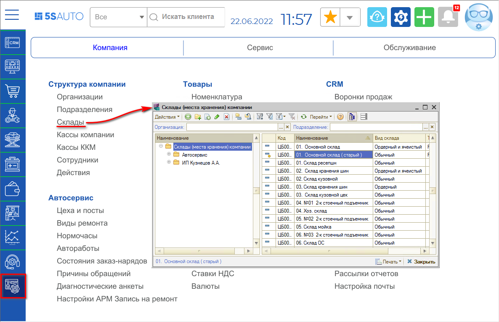
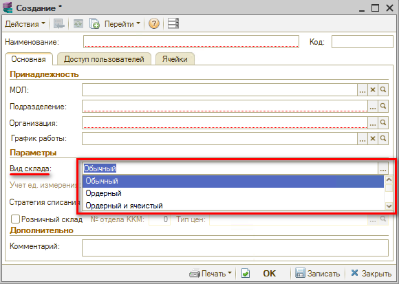
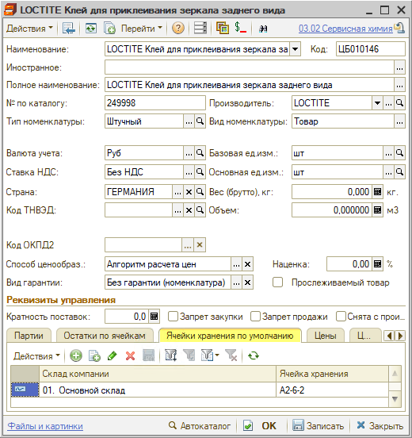
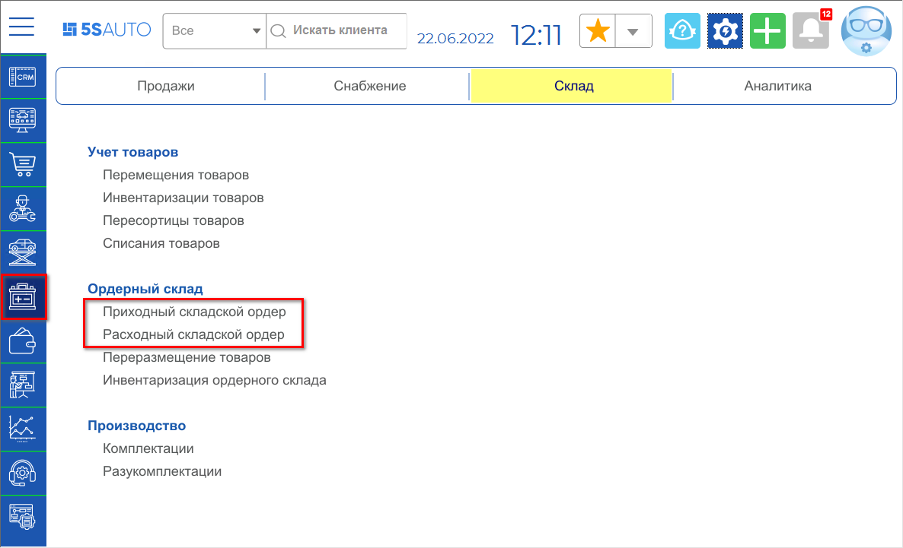
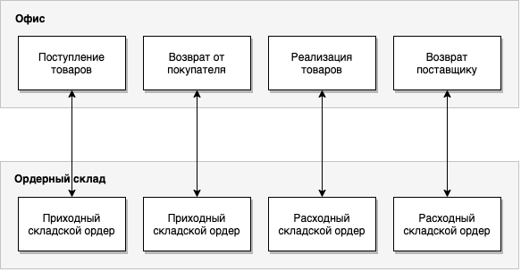
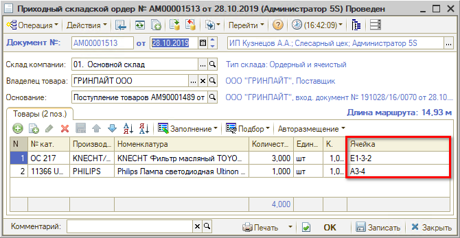
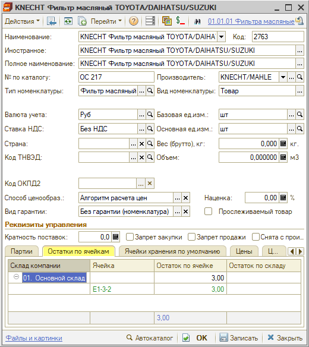
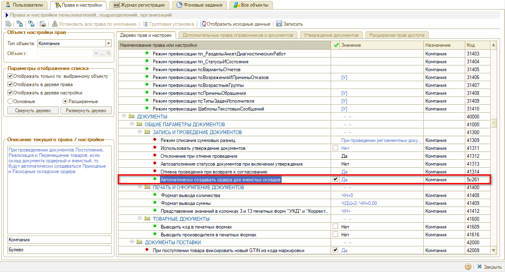
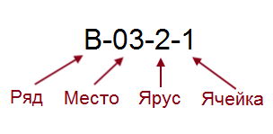
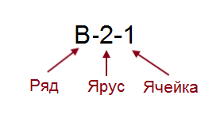

# Виды склада

<table><tr><td><b>Время чтения:</b> 8 мин.</td><td><b>Обновлено:</b> 01.04.2025</td></tr></table>

Источник: https://www.5systems.ru/help/vidy-sklada

## Содержание

- [Введение](#введение)
- [Обычный склад](#обычный-склад)
- [Ордерно-ячеистый склад](#ордерно-ячеистый-склад)
  - [Автоматическое создание ордеров](#автоматическое-создание-ордеров)
- [Ячеистое хранение](#ячеистое-хранение)
  - [Штрихкоды ячеек хранения](#штрихкоды-ячеек-хранения)

## Введение

Склад может быть обычным, ордерно-ячеистым или ордерным. В рамках статьи рассматривается обычный и ордерно-ячеистый склад.

Вид склада задается в справочнике "Склады (места хранения) компании" (*Администрирование → Компания → Структура компании → Склады* или из типового меню программы: *Справочники → Структура компании → Склады (места хранения) компании*):

## Обычный склад

Для обычного склада ведется только товарный учет - через документы, двигающие остатки на складе: Поступление товаров, Перемещение товаров в производство, Возврат поставщику и т.п.

Для организации порядка на обычном складе используется *ячеистое хранение*.

При ячеистом хранении на обычном складе всем товарам должны быть присвоены ячейки хранения по умолчанию в программе. Распределение товара по ячейкам происходит в карточке номенклатуры:

Отслеживать наличие присвоенных ячеек хранения по товарам на обычном складе поможет *[Отчеты по складскому учету → Отчет по заполнению ячеек хранения](../../Отчеты/Отчеты%20по%20складскому%20учету/otchety-po-skladskomu-uchetu.md)*.

## Ордерно-ячеистый склад

Ордерно-ячеистый склад предполагает *ячеистое хранение товаров* и ведение двойного учета:

- *товарный учет* - учет через документы, двигающие остатки на складе: Поступление товаров, Перемещение товаров в производство, Возврат поставщику и т.п.
- *ордерный учет* - ведение складских ордеров для учета факта поступления/отгрузки товара со склада.

*Ордерный учет* вводится тогда, когда по одному или нескольким складам приемка и отгрузка товаров может происходить раньше или позже даты оформления первичных документов по товарному учету. Например, в офисе продаж оформили расходную накладную, а клиент только на следующий день пришел на склад и физически получил товар.

*Ордерный учет* ведется с помощью складских ордеров - приходным и расходным. При этом поступление товара на склад сопровождается вводом в программу ***приходного складского ордера***, а отгрузка товара - вводом ***расходного складского ордера***.

Реестры данных документов находятся в меню интерфейса *Запчасти и склад → Склад → Ордерный склад* (или в типовом меню: *Документы → Складские документы*)

***Схема работы ордерного (ордерно-ячеистого) склада:***

Ордерно-ячеистый склад предполагает отражение ячеек хранения в складских ордерах c целью фиксирования движения остатков по ним:

При этом товар в отличии от обычного склада может быть расположен в нескольких ячейках хранения.

Остатки по ячейкам конкретного товара можно увидеть в номенклатуре:

*Все остатки по ячейкам ордерного склада* можно увидеть в *отчете "Остатки и обороты товаров ордерного склада"* (см. *[Отчеты по складскому учету → Остатки и обороты товаров ордерного склада](../../Отчеты/Отчеты%20по%20складскому%20учету/otchety-po-skladskomu-uchetu.md)*).

Поскольку для ордерно-ячеистого склада ведется двойной учет, то могут возникать расхождения между ними. Например, когда:

- товары оприходовали на складе, создав ордера, а документов о поступлении товара по товарному учету еще нет;
- документы на отгрузку по товарному учету проведены, а отгрузка со склада еще не произведена.

*Найти расхождения помогает* *отчет "Сверка остатков и оборотов товаров ордерного склада"* (см. *[Отчеты по складскому учету → Сверка остатков и оборотов товаров ордерного склада](../../Отчеты/Отчеты%20по%20складскому%20учету/otchety-po-skladskomu-uchetu.md)*).

### Автоматическое создание ордеров

В типовом решении для ордерного склада складские ордера необходимо создавать только вручную. В программе 5S AUTO реализовано автоматическое создание складских ордеров при проведении документов товарного учета.

За включение функции автоматического создания ордеров отвечает право "Автоматически создавать ордера для ячеистых складов":

## Ячеистое хранение

Ячеистое хранение систематизирует склад по местам хранения (ячейкам) с целью равномерного распределения и быстрого поиска товаров.

Для организации ячеек хранения склад делят на отдельные помещения, если такие есть, секции, ряды, ярусы и сами ячейки.

Выглядеть это может так:

Или так (простая организация хранения):

После того, как склад разбили по ячейкам, все поступающие товары распределяются по ним. Для распределения товаров по ячейкам склада:

- предварительно всем товарам присваиваются штрихкоды (см. *[Назначение штрихкодов товарам → Присвоение штрихкода номенклатуре](../Штрихкодирование%20номенклатуры/Назначение%20штрихкодов%20товарам/naznachenie-shtrikhkodov-tovaram.md#присвоение-штрихкода-номенклатуре)*),
- печатается и клеится этикетка на товар с его штрихкодом и номером ячейки (см. *[Печать этикеток](../Печать%20этикеток/pechat-etiketok.md)*).

Для последующего считывания штрихкодов с целью отгрузки товара используется сканер штрихкодов (см. *[Назначение штрихкодов товаров → Процесс сканирования](../Штрихкодирование%20номенклатуры/Назначение%20штрихкодов%20товарам/naznachenie-shtrikhkodov-tovaram.md#процесс-сканирования)*).

### Штрихкоды ячеек хранения

> *Функционал доступен начиная с релиза **2.8.5**.*

Штрихкоды можно присваивать не только товарам, но и *ячейкам хранения*. Штрихкод ячейки указывается в карточке ячейки хранения в поле ***«Штрихкод»*** и сохраняется при записи карточки.

> 🛠 Комментарий для черновика: *Подключена ли в релизе подстановка ячейки по сканированию ее штрихкода в документах («Поступление товаров», «Реализация товаров», «Инвентаризация», приходный и расходный складской ордер)? В выгрузке механизм ниоткуда не вызывается, разработчик просит не описывать до подтверждения. Сейчас в статье сканирование ячеек не описано. (у разработчика (Катя) нет ответа на этот вопрос)*

> 🛠 Комментарий для черновика: *Что делает приложение 5S TSD со штрихкодом ячейки после ответа сервиса (выбирает ячейку, показывает ее)? Вопрос к разработчикам приложения 5S TSD. Сейчас в статье не описано. (у разработчика (Катя) нет ответа на этот вопрос)*

- Штрихкод вводится *вручную* – автоматической генерации, как у номенклатуры, для ячеек нет.
- У ячейки может быть только *один* штрихкод: при записи нового значения прежнее заменяется.
- Формат штрихкода при вводе не проверяется, но на этикетке он печатается как EAN-13 (или EAN-8, если в коде 8 символов). Поэтому рекомендуем использовать штрихкоды формата *EAN-13*.

> [!WARNING]
> Уникальность штрихкода ячейки не проверяется: можно записать штрихкод, который уже присвоен товару или другой ячейке. Следите за уникальностью штрихкодов ячеек самостоятельно – при совпадении сканер может найти не тот товар или не ту ячейку.

***Печать этикеток ячеек***

Чтобы напечатать этикетки со штрихкодами ячеек:

**1.** В списке складов или в карточке склада выберите ***«Печать ячеек склада»*** – откроется форма *«Выбор ячеек для печати»* с деревом ячеек склада. 
**2.** Отметьте нужные ячейки (можно отметить все сразу) и нажмите ***«Печать»*** – отмеченные ячейки передадутся в обработку *«Печать этикеток и ценников»* (см. статью «[Печать этикеток](../Печать%20этикеток/pechat-etiketok.md)»).

Для каждой ячейки печатается отдельная этикетка с номером ячейки и штрихкодом.

> 🛠 Комментарий для черновика: *Техническая информация из описания разработчика (для справки, на сайт не выводится):*
> - *Хранение: штрихкод хранится в общем регистре сведений «Штрих-коды» (там же, где штрихкоды номенклатуры); в списке ячеек не задается и не показывается.*
> - *Обратная проверка: при записи штрихкода номенклатуры, совпадающего со штрихкодом ячейки, — «<штрихкод> - штрихкод не уникален! Штрихкод не записан!».*
> - *Ограничений по виду склада нет.*
> - *Печать: макет «Ячейки»; сообщения «Не отмечено ни одной ячейки для печати», «У склада "…" нет ячеек хранения»; напрямую из «Печати этикеток и ценников» ячейки не добавить.*
> - *Старый путь печати — «Печать / Текущая ячейка» в списке ячеек и печать из карточки склада (обработка «Печать ячеек»): штрихкод выводится только в режиме «Все ячейки склада» и только для ячеек с заданным штрихкодом.*
> - *Сканирование: обрабатывается только в API для 5S TSD (GET /warehouse/cell по штрихкоду, без отбора по складу); в «Интерфейсе ТСД» и в карточке номенклатуры сканирование ячеек не обрабатывается.*
> - *Для подстановки ячейки в документах есть настройка «Таймаут сканирования штрихкода ячейки (сек.)», 30 с.*

> 🛠 Комментарий для черновика: *ОТВЕТ НЕ ПОЛУЧЕН (01.10.2026), задать повторно: вопросы — в комментариях выше по тексту (подстановка ячейки в документах, 5S TSD). Нужны скриншоты: карточка ячейки с полем «Штрихкод», форма «Выбор ячеек для печати», этикетка ячейки.*

---

**Теги:** Складской учет, виды склада, обычный склад, ордерно-ячеистый склад, ячеистое хранение, складские ордера
