

# Выгрузка прайс-листов

<table><tr><td><b>Время чтения:</b> 17 мин.</td><td><b>Обновлено:</b> 20.08.2025</td></tr></table>

Источник: https://www.5systems.ru/help/vygruzka-prays-listov

*Актуально начиная с версии релиза 2.001.003*

## Содержание

- [Введение](#введение)
- [Создание Прайс-листа](#создание-прайс-листа)
- [Настройка выгрузки Прайс-листа](#настройка-выгрузки-прайс-листа)
  - [1. Переход к настройке](#1-переход-к-настройке)
  - [2. Параметры выгрузки](#2-параметры-выгрузки)
  - [3. Варианты выгрузки](#3-варианты-выгрузки)
  - [4. Описание вкладок](#4-описание-вкладок)
    - ["Файл"](#вкладка-файл)
    - ["Параметры"](#вкладка-параметры)
    - ["Склады компании"](#вкладка-склады-компании)
    - ["Номенклатура"](#вкладка-номенклатура)
    - ["Прайс-листы поставщиков"](#вкладка-прайс-листы-поставщиков)
    - ["Картинки"](#вкладка-картинки)
    - ["Ftp"](#вкладка-ftp)
    - ["e-mail"](#вкладка-e-mail)
    - ["Расписание"](#вкладка-расписание)
  - [5. Сохранение настроек выгрузки](#5-сохранение-настроек-выгрузки)

## Введение

*Виды прайс-листов* – это встроенный механизм формирования собственных прайс-листов компании. Принцип работы данного механизма заключается в следующем: можно создать произвольное количество прайс-листов, для каждого прайс-листа можно заполнить, из чего он состоит, настроить параметры и затем сформировать файл для выгрузки прайс-листа на сайт или для отправки клиенту.

## Создание Прайс-листа

**1. Путь перехода в справочник "Виды прайс-листов"**

Справочник "Виды прайс-листов" находится в меню интерфейса *"Администрирование → Компания → Товары"*:

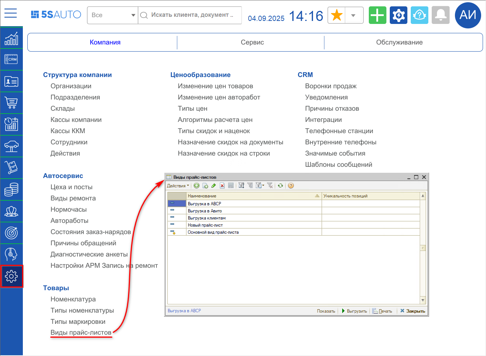

*Примечание:* Начиная с релиза 2.8.3. В случае если в меню вашего рабочего стола отсутствует данный справочник, его можно добавить вручную через *Настройку рабочего стола* – см. в *[статье](https://www.5systems.ru/help/nastroyka-rabochego-stola#nastrrabstola)*.

**2. Добавление Прайс-листа**

Новый прайс-лист можно создать нажатием на кнопку "Добавить" или копированием. Чтобы открыть карточку прайс-листа для просмотра или изменения, нужно нажать на кнопку *"Прайс-лист → Показать"*:

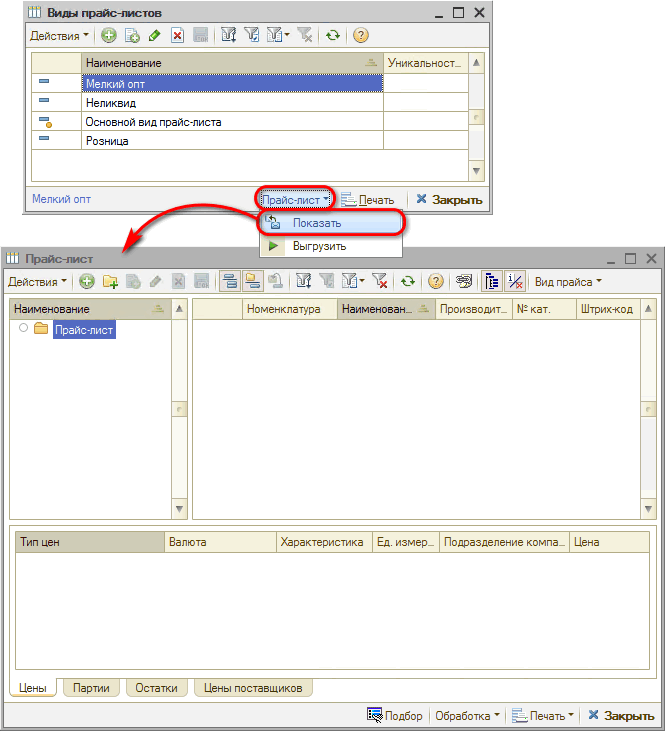

Далее требуется заполнить состав прайс-листа [номенклатурой](../Номенклатура/nomenklatura.md). Можно сделать собственную группировку товаров путем создания папок и заполнить позиции через Подбор номенклатуры:

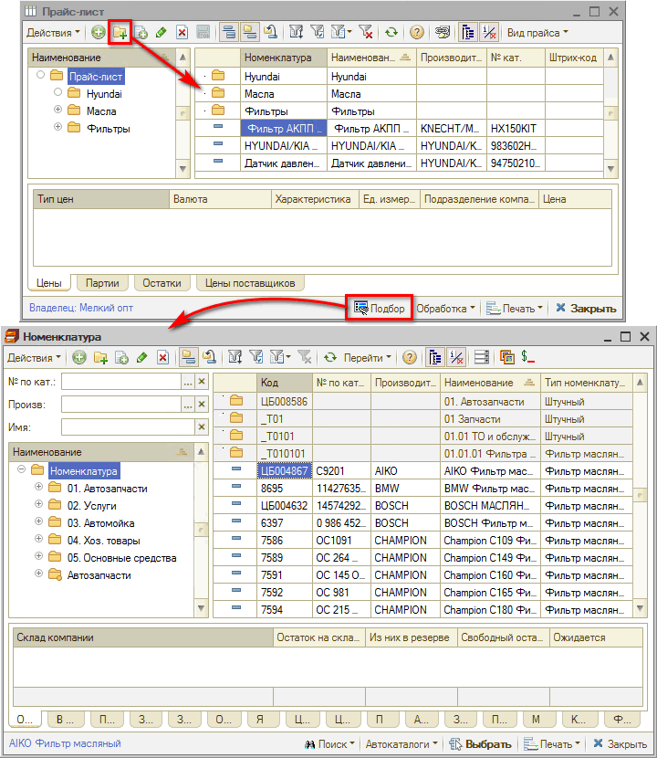

## Настройка выгрузки Прайс-листа

### 1. Переход к настройке

Предусмотрена выгрузка прайс-листа в соответствии с заданными позициями.

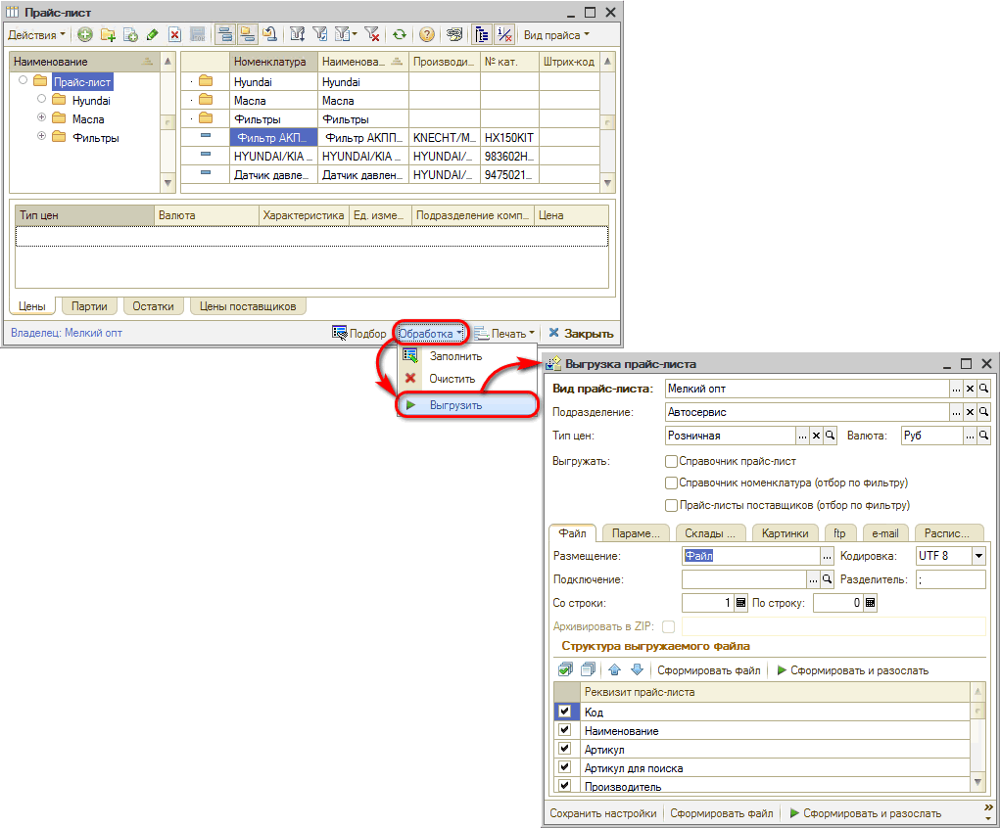

Сам прайс-лист определяет *набор данных*, которые будут выгружаться. В дополнительных настройках определяются *[параметры выгрузки](#2-параметры-выгрузки)*.

### 2. Параметры выгрузки

**Параметры выгрузки:**

- *Вид прайс-листа* – наименование;
- *Подразделение* – выбор подразделения компании;
- *Тип цен* – выбор типа цен: розничная, оптовая и т.д.

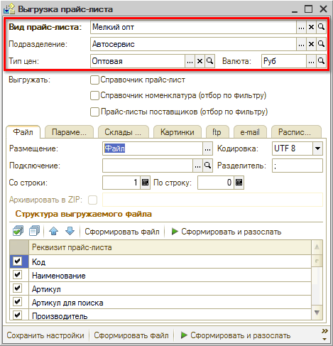

Таким образом, приведенный в примере прайс лист *"Мелкий опт"* будет выгружаться от лица заданного подразделения, и будут использоваться тип цен "Оптовая".

### 3. Варианты выгрузки

Параметр *"Выгружать"* – необходимо выбрать, откуда будет осуществляться выгрузка. Может использоваться типовой или расширенные варианты выгрузки.

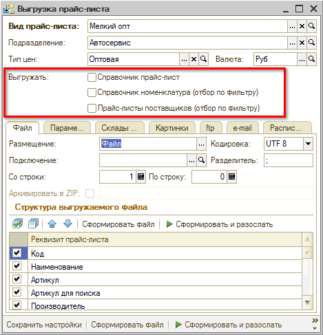

#### Справочник Прайс-лист

Типовой функционал, предусмотренный для того, чтобы в выгрузку попадали именно те позиции, которые были добавлены в типовой справочник:

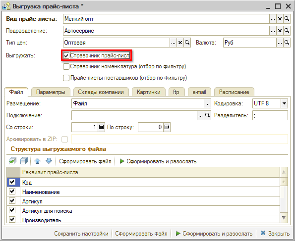

#### Справочник Номенклатура (отбор по фильтру)

Расширенная выгрузка: помимо позиций, указанных в справочнике "Прайс-листы" будет происходить выгрузка позиций из справочника "Номенклатура".

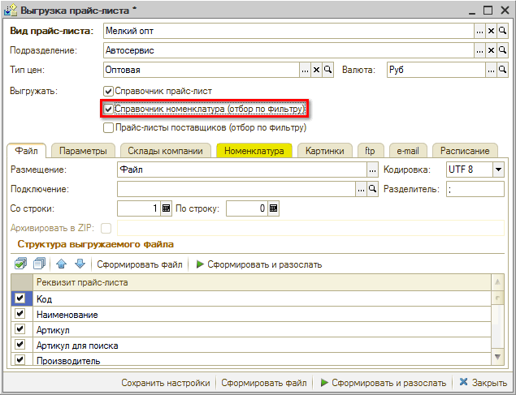

При установке галочки появляется *[вкладка "Номенклатура"](#вкладка-номенклатура)*: здесь можно сделать дополнительный отбор, например, номенклатура в определенной группе, производитель, номер по каталогу.

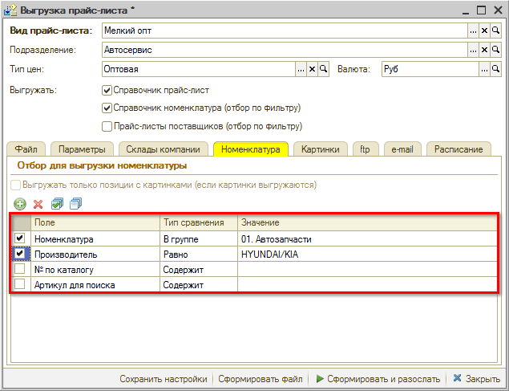

При нажатии кнопки "Сформировать файл" в выгрузку попадут и те позиции, которые в справочнике "Прайс-листы", и те, которые в Номенклатуре (плюсуются).

#### Прайс-листы поставщиков (отбор по фильтру)

Помимо выгрузки из справочников "Прайс-листы" и "Номенклатура" можно добавить в выгрузку Прайс-листы поставщиков*, которые загружены в программу как файлы.
*Не веб прайс-листы: из них попадут только позиции из кэша.*

При установке галочки появляется *[вкладка "Прайс-листы поставщиков"](#вкладка-прайс-листы-поставщиков)*, где можно установить необходимые отборы: Прайс-лист, Производитель, Номер по каталогу, Артикул и др.

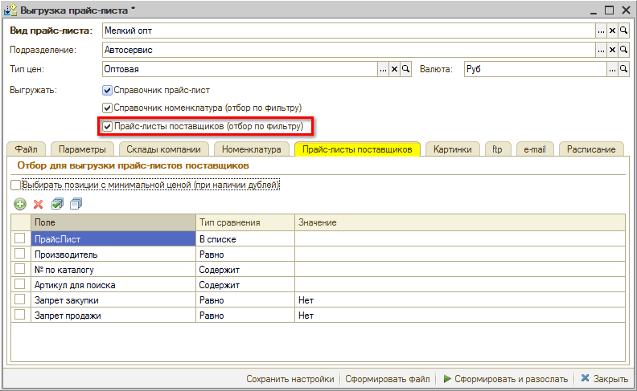

Данные позиции также будут добавлены плюсом к выгруженным из справочников "Прайс-листы" и "Номенклатура", но если они будут повторять уже имеющиеся в выгрузке из справочников, то будут исключены: добавятся только дополнительные позиции, которых нет в предыдущих выборках.

*Отличие от выгрузки из справочников:* В выгружаемом файле в поле "Поставщик" при выгрузке из справочников будет отображаться название склада, а при выгрузке прайс-листов поставщиков – код прайс-листа.

### 4. Описание вкладок

#### Вкладка "Файл"

***Структура выгружаемого файла***

Задаются реквизиты: какие поля требуется выгружать по настроенным данным.

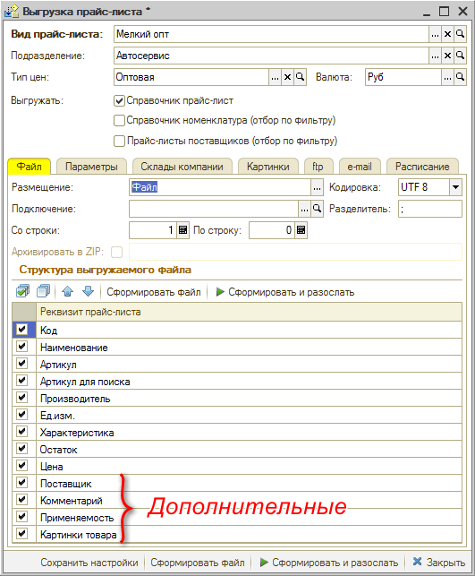

Типовой перечень реквизитов расширен следующими позициями:

- Поставщик – это может быть склад компании, на котором товар есть в наличии;
- Комментарий;
- Применяемость;
- Картинки товара.

***Формат выгружаемого файла***

Можно сформировать документ xls, xlsx или txt – формат выгрузки определяется названием файла. Автоматически появляется *разделитель*.

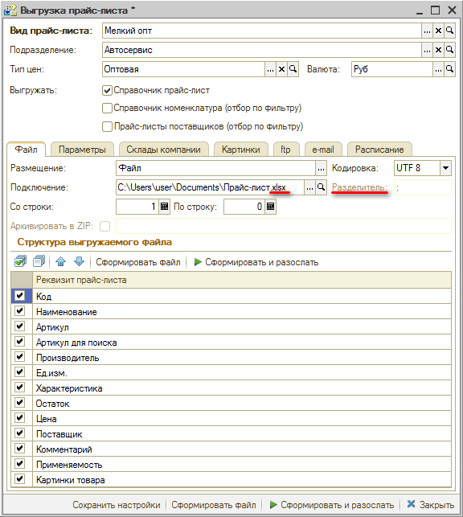

#### Вкладка "Параметры"

***Дополнительные фильтры***

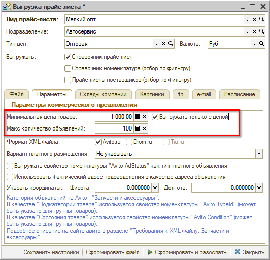

- *Минимальная цена товара* – возможность задать ограничение по цене: минимальная цена товара, которую требуется выгружать (например, 1000 руб.). Данная функция актуальна, например, при выгрузке на avito, drom, и т.д., т.к. производится оплата за каждую размещаемую позицию, и поэтому требуется исключить размещение дешевых позиций.
- *Выгружать только с ценой* – выгружать только позиции с установленной ценой.
- *Макс. количество объявлений* – можно задать максимальное количество выгружаемых объявлений, т.е. ограничить выгрузку по количеству объявлений, которое куплено.

***Галочка "Avito.ru"***

После установки галочки открываются *дополнительные поля настроек*:

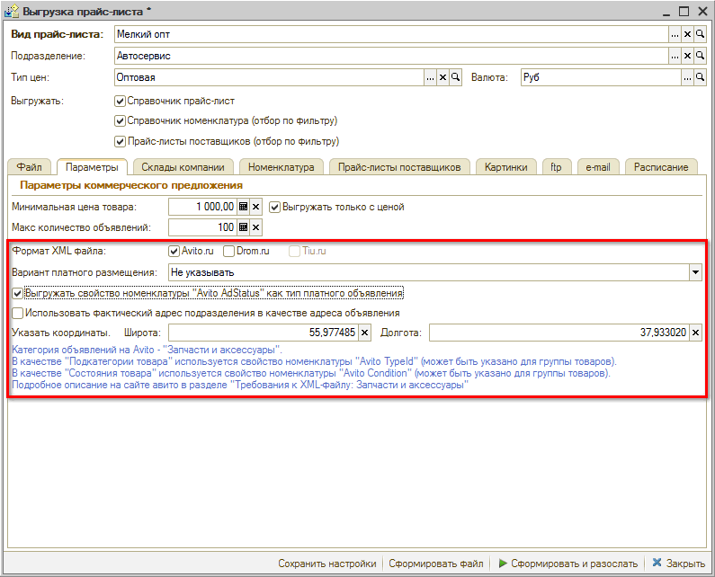

- *Выгружать свойство номенклатуры "Avito AdStatus" как тип платного объявления*
  Признак платного объявления хранится в свойстве номенклатуры "Avito AdStatus", если свойство не задано или не заполнено, то будет выгружено значение "Free" – обычное объявление.
- *Использовать фактический адрес подразделения в качестве адреса объявления*
  Полный адрес объекта используется для определения геопозиции объявления. Примечание: улица и номер дома не будут показаны в объявлении.
- *Указать координаты:* можно указать координаты – широту и долготу – для географического таргетирования на Avito.

См. подсказку, какие свойства нужно заполнить:

> *Категория объявлений на Avito – "Запчасти и аксессуары".* 
> *В качестве "Подкатегории товара" используется свойство номенклатуры "Avito TypeId" (может быть указано для группы товаров).* 
> *В качестве "Состояния товара" используется свойство номенклатуры "Avito Condition" (может быть указано для группы товаров).* 
> *Подробное описание на сайте Авито в разделе "Требования к XML-файлу: Запчасти и аксессуары".*

Для Avito выгрузка должна формироваться исключительно в *xml:* на вкладке Файл требуется прописать формат файла.

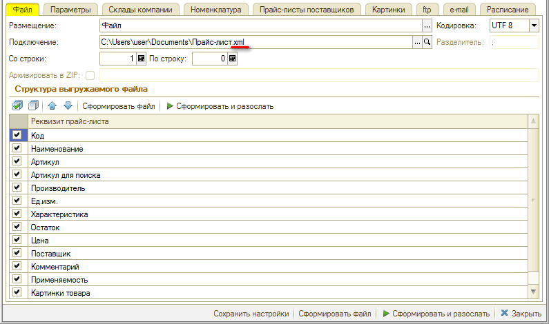

***Галочка "Drom.ru"***

Для выгрузки на Drom.ru тоже можно установить ограничения по цене и количеству объявлений. Автоматически формируется свой формат файла.

Можно использовать выгрузку в Drom как универсальный каталог предложений для большинства сайтов. При необходимости можно переназвать наименования полей.

Для Drom.ru – так же, как и для Avito – выгрузка должна формироваться исключительно в *xml*: требуется *прописать формат файла* на вкладке Файл.

При указании формата xml появляется возможность задать имя поля xml: например, поле "Производитель" в xml будет называться "Brand".

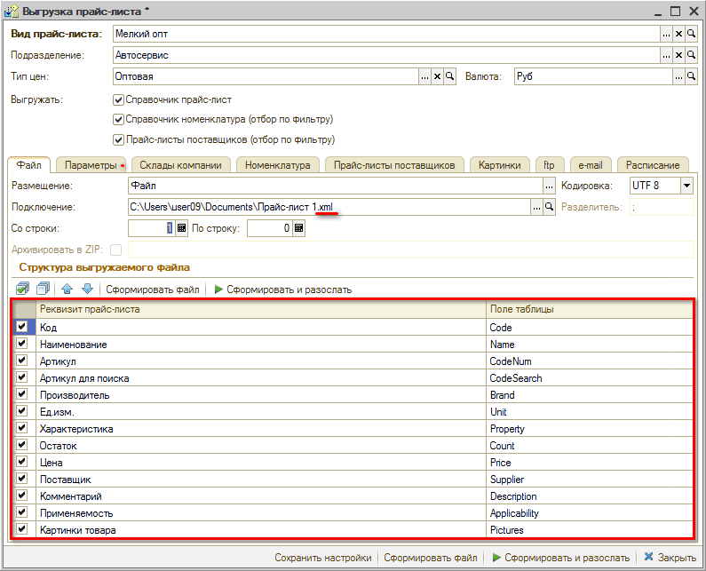

#### Вкладка "Склады компании"

Галочка *"Выгружать только позиции в наличии на складах (в свободном остатке)"* – если хотим выгружать только товары, которые есть в наличии на складе.
Также можно выбрать конкретный склад.

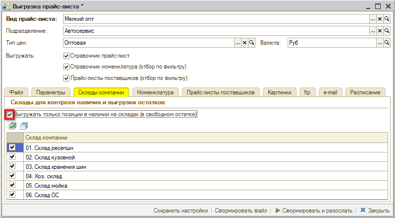

#### Вкладка "Номенклатура"

Появляется при установке галочки "Справочник Номенклатура (отбор по фильтру)". Описание см. выше, в разделе *"[Варианты выгрузки → Справочник Номенклатура](#справочник-номенклатура-отбор-по-фильтру)"*.

#### Вкладка "Прайс-листы поставщиков"

Появляется при установке галочки "Прайс-листы поставщиков (отбор по фильтру)". Описание см. выше, в разделе *"[Варианты выгрузки → Справочник Прайс-листы поставщиков](#прайс-листы-поставщиков-отбор-по-фильтру)"*.

#### Вкладка "Картинки"

Параметры хостинга картинок.

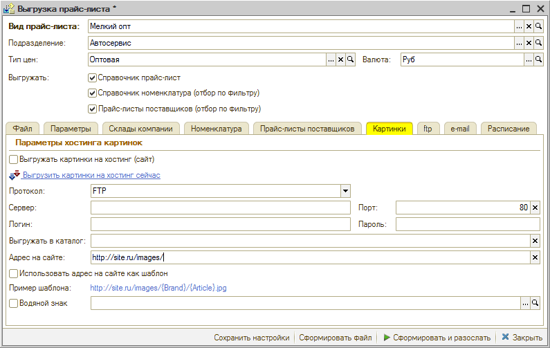

Галочка *"Выгружать картинки на хостинг (сайт)"*.

Если в Номенклатуре сохранены картинки и присоединены как "Файлы и картинки" или хранятся в базе, их можно будет тоже выгрузить. В качестве выгрузки указывается, по какому протоколу будут выгружаться картинки: *FTP*, *FTPS*, *SFTP* или *В каталог на диске*. Программа проверит, есть ли данные по выгруженным файлам и сформирует выгрузку по заданному протоколу, на заданный сервер, порт с таким логином и паролем, в нужный каталог.

Если есть сайт, ссылка на картинку будет выглядеть: *http://* и т.д. – адрес картинок на сайте (для формирования внешней ссылки) или Шаблон для формирования ссылки.

Пример шаблона: `http://site.ru/images/`

То есть, FTP-ссылка, сервер и папка с каталогом как правило могут быть связаны с какой-то частью на сайте.

После указания, куда хотим выгрузить, программа автоматически сформирует имя файла исходя из того, как он задан в номенклатуре.

Если требуется, чтобы имя файла формировалось как Brand и Article, вводим: `http://site.ru/images/{Brand}/{Article}.jpg`. Тогда ссылка будет формироваться по такому виду.

Также при выгрузке картинок при необходимости можно наложить *водяной знак* в динамическом режиме – это прозрачная картинка с произвольной надписью, которая будет накладываться на рисунки на сайте.

Выгрузка картинок делается один раз. Формируется идентификатор. В карточке в комментарии будет присвоен адрес, куда выгрузилась картинка.

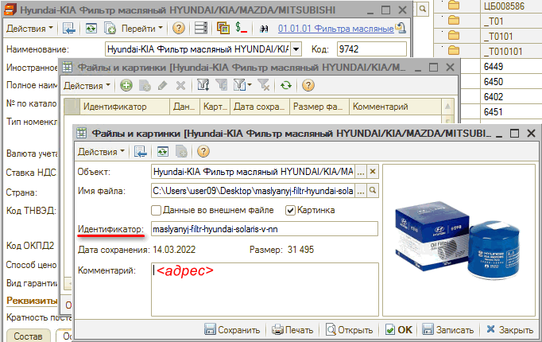

Если потребуется сделать повторную выгрузку картинок, нужно будет сделать групповую обработку "Удаление комментария", иначе программа будет ссылаться на адрес, имеющийся в комментарии.

#### Вкладка "Ftp"

Если требуется выгружать файл на ftp-сервер, на данной вкладке требуется поставить галочку "Копировать прайс-лист на ftp-сервер" и настроить необходимые параметры: сервер, порт, папку – каталог на сервере, в который будет выгружаться, и т.д.

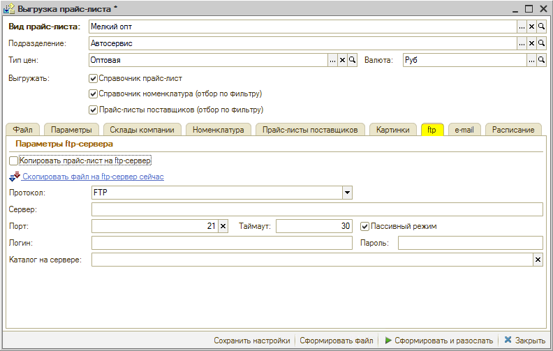

#### Вкладка "e-mail"

Можно отправлять файл на электронную почту: для этого требуется поставить галочку *"Отправлять прайс-лист на электронную почту"* и настроить параметры рассылки.

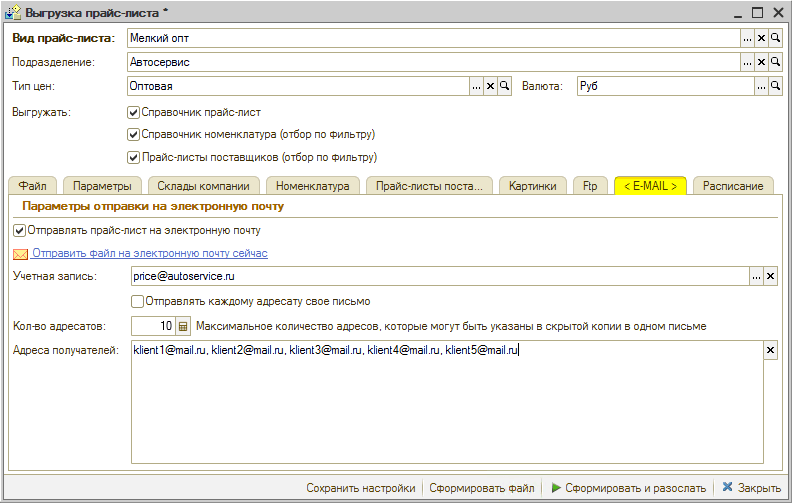

Учетная запись: выбрать, с какого адреса электронной почты отправлять.

Максимальное количество адресатов: например, 10 (не больше 25 или сколько наш сервер позволяет рассылать, не блокируя нас) адресатов, которые могут быть указаны в скрытой копии в одном письме.

Адреса получателей вводятся через запятую. Получатели друг друга не увидят. Программа отправляет письмо по тому же адресу, который указан как отправитель, а адресатам – скрытые копии.

*или:*

Галочка *"Отправлять каждому адресату свое письмо"*. Тогда каждому адресату будет отправлено личное письмо. Но это не совсем удобно.

#### Вкладка "Расписание"

На данной вкладке производится управление *регламентным заданием*, с помощью которого можно в автоматическом режиме формировать и выгружать итоговый файл прайс листа по заданным ранее настройкам.

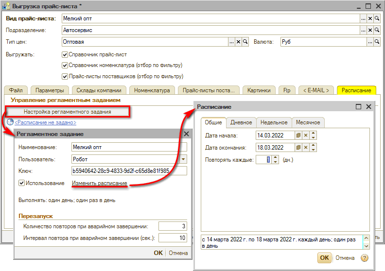

По кнопке "Настройка регламентного задания" открывается окно настроек: Наименование прайс-листа, отправлять от лица пользователя Робот, галочка "Использование", ссылка Изменить расписание – открывается стандартная настройка расписания.

Данное регламентное задание занимается формированием самого файла и рассылкой данных на ftp и e-mail. Будет брать текущие данные.

Расписание работает в Фоновых заданиях как Произвольная обработка. Непредопределенное регламентное задание. Отсюда тоже можно настраивать параметры.

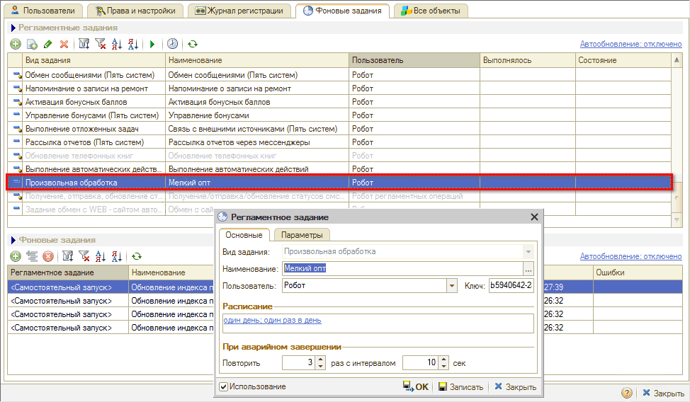

### 5. Сохранение настроек выгрузки

После заполнения всех параметров требуется их *сохранить*, затем можно сформировать файл выгрузки и отправить, либо просто закрыть форму настроек.

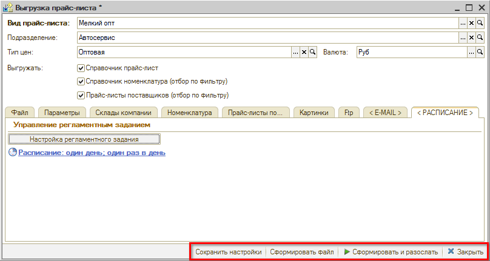

Если настройка параметров выгрузки прайс-листа закончена, требуется нажать кнопку *"Сохранить настройки"* и можно *"Закрыть"* окно настройки.

Если нажать *"Сформировать файл",* программа сохранит настройки и сформирует файл, который можно будет каким-нибудь образом передать клиенту.

Опция *"Сформировать файл и разослать"* используется, когда требуется вручную провести полную рассылку. Т.е. можно не настраивать рассылку по расписанию, а отправлять прайс-лист вручную сразу после формирования.

---

**Теги:** выгрузка прайс-листов, виды прайс-листов, avito, drom, ftp, e-mail, расписание

