

# Загрузка накладных поставщиков

<table><tr><td><b>Время чтения:</b> 22 мин.</td><td><b>Обновлено:</b> 29.02.2024</td></tr></table>

Источник: https://www.5systems.ru/help/zagruzka-nakladnykh-postavschikov

> *Функционал доступен начиная с версии релиза 2.7.1.*

## Содержание

1. [Введение](#введение)
2. [Настройка](#настройка)
   - [Настройки почтового ящика](#1-настройки-почтового-ящика)
   - [Справочник "Настройка загрузки накладных"](#2-справочник-настройка-загрузки-накладных)
     - [Добавление поставщика](#1-добавление-поставщика)
     - [Основные реквизиты](#2-основные-реквизиты)
     - [Параметры подключения](#3-параметры-подключения)
     - [Параметры заполнения документа](#4-параметры-заполнения-документа)
     - [Проверка настройки](#5-проверка-настройки)
3. [Обработчики загрузки](#обработчики-загрузки)
   - [Загрузка из общего хранилища](#загрузка-из-общего-хранилища)
   - [Добавление обработчика](#добавление-обработчика)
   - [Обновление обработчика](#обновление-обработчика)
4. [Настройка уведомления](#настройка-уведомления)
5. [Регламентное задание](#регламентное-задание)

## Введение

В программе реализована возможность *автоматически загружать накладные поставщиков* из электронной почты с последующим созданием документов "Поступление товаров" в системе.

Файлы накладных от разных поставщиков имеют различный формат и структуру. Примеры файлов:

1. [Авто-Евро](attachments/primer-avtoevro.xls) (.xls)
2. [АВТОРУСЬ](attachments/primer-avtorus.xls) (.xls)
3. [БЕРГ](attachments/primer-berg.xls) (.xls)
4. [Росско](attachments/primer-rossko.zip) (.csv)

В функционал загрузки накладных добавляется специализированный обработчик для каждого поставщика. В обработчиках реализована логика извлечения данных из файлов накладных и создания соответствующих документов в системе. Обновлять и добавлять новые обработчики в свою базу можно из общего хранилища без обновления релиза конфигурации.

После *[настройки](#настройка)* система автоматически выполняет следующие действия:

- периодически проверяет электронную почту на наличие новых сообщений;
- идентифицирует сообщения, содержащие вложения с накладными;
- извлекает данные из вложений и создает на их основе документы "Поступление товаров";
- уведомляет пользователей о загрузке новых документов;
- создает отсутствующие карточки номенклатуры.

## Настройка

### 1. Настройки почтового ящика

Для почтового ящика, на который поставщики будут присылать накладные, обязательно должен быть разрешен *доступ с помощью почтовых клиентов:*

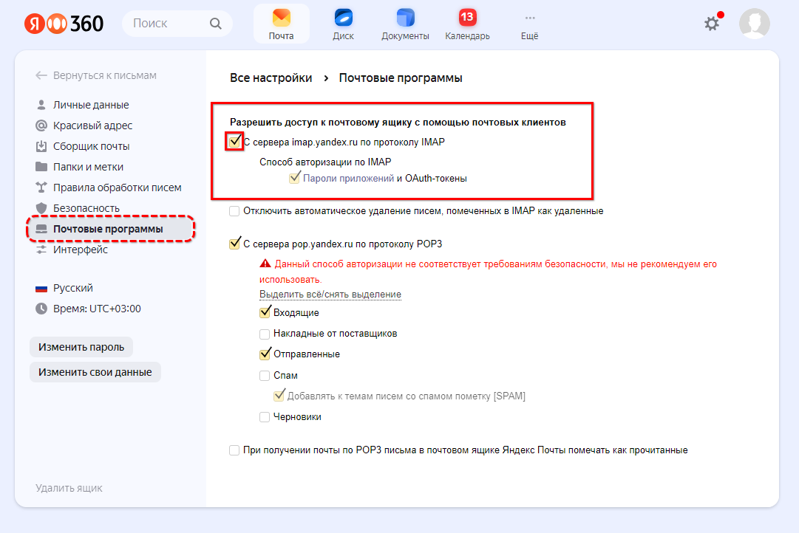

Также рекомендуется создать отдельную папку для входящих писем с накладными и настроить в почте *правила,* по которым письма от поставщиков будут поступать в нее, чтобы затем настроить в программе поиск писем именно в этой папке – см. [*ниже*](#zagruzh_iz_papki)*:*

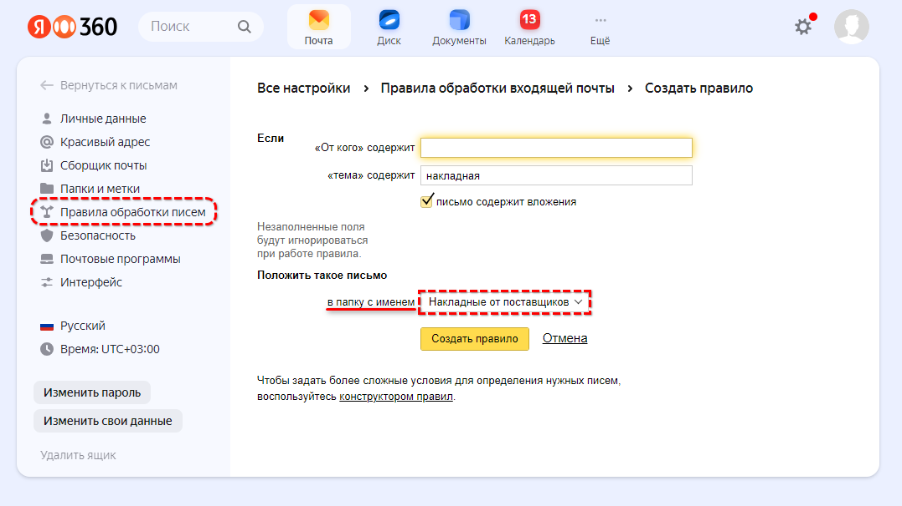

### 2. Справочник "Настройка загрузки накладных"

Настройка загрузки производится в справочнике "Настройки загрузки накладных":

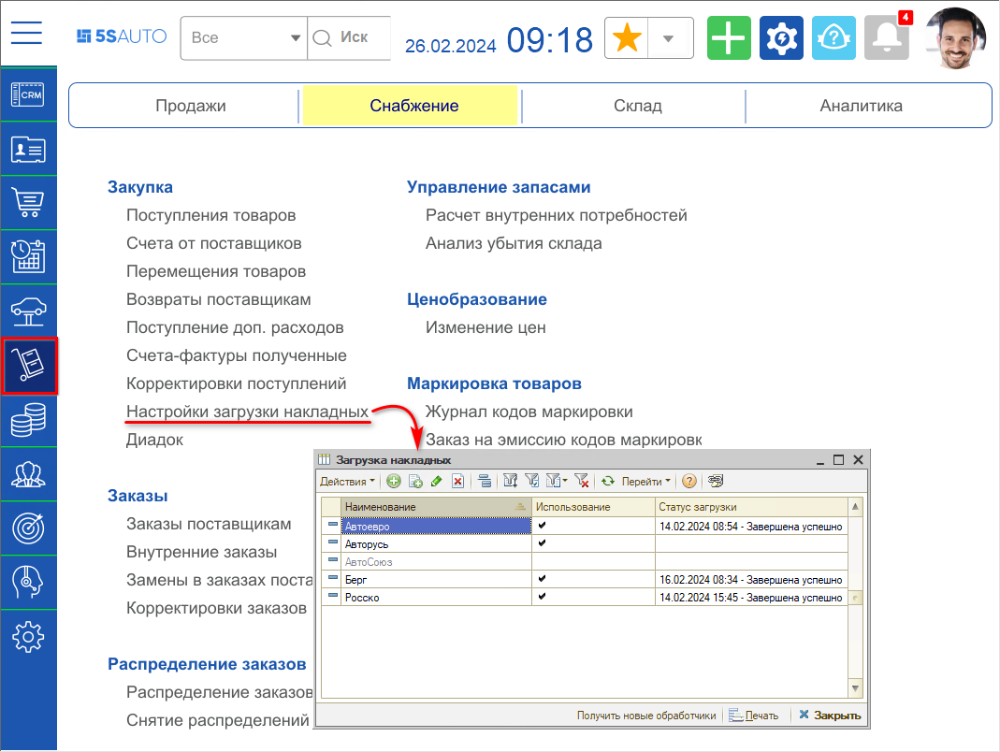

*\*Примечание:* Если в меню вашего рабочего стола отсутствует данный справочник, его можно добавить вручную через *Настройку рабочего стола* – см. в *[статье](https://5systems.ru/help/nastroyka-rabochego-stola).*

В таблице отображаются загруженные в базу обработчики загрузки накладных в разбивке на следующие колонки:

- *Наименование* – наименование обработчика.
- *Использование* – отметка об активности данного обработчика. Если обработчик не используется, строка выделяется серым цветом. Установить отметку об использовании обработчика можно двойным кликом по ячейке в данной колонке.
- *Статус загрузки* – статус послезней загрузки файла по данному поставщику, подгружаются из регистров. Возможные статусы:
    - *"Загрузка успешно завершена"* – статус означает, что файл успешно получен и загружен;
    - *"Завершена с ошибками":* статус может появиться в случае, если неправильно заполнены организация, подразделение и склад в настройках [параметров заполнения документа](#4-параметры-заполнения-документа), либо некорректно заполнен договор с контрагентом, либо если не включена [настройка](#param_sozd_nomenkl) создавать автоматически новую номенклатуру – в данном случае создается *Поступление товаров* с пустой строкой;
    - *"Есть новый файл"* – статус появляется при [загрузке файла вручную](#prover_poluch), когда файл получен, но еще не загружен. При автоматической загрузке данный статус, как правило, не появляется;
    - статус *не заполнен,* если загрузок не было.

Кнопка *"Получить новые обработчики"* открывает форму загрузки обработчиков из общего хранилища – см. [*ниже*](#загрузка-из-общего-хранилища).

#### 1) Добавление поставщика

Для каждого поставщика необходимо создать новый элемент в справочнике "Настройки загрузки накладных" и настроить параметры загрузки:

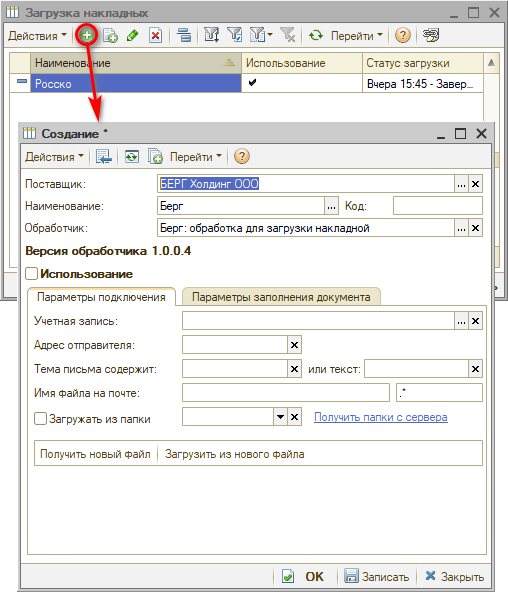

#### 2) Основные реквизиты

Сначала следует заполнить основные реквизиты:

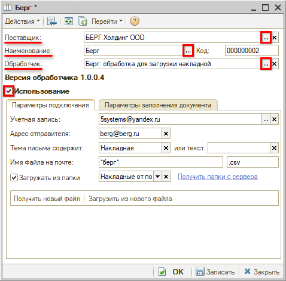

**1.** *Поставщик –* необходимо выбрать поставщика из справочника контрагентов, от имени которого будут создаваться накладные.
**2.** *Наименование –* заполняется автоматически после выбора обработчика.
**3.** *Обработчик* – обработчик поставщика необходимо выбрать из справочника внешних обработок, под строкой с обработчиком отображается его *версия в текущей базе:*

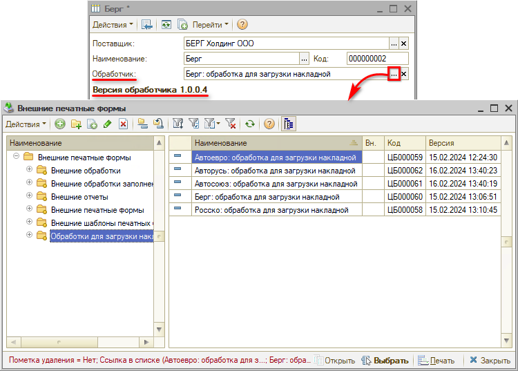

**4.** *Использование* – следует установить признак активности у объекта, иначе файлы по заданным критериям настройки будут игнорироваться регламентным заданием.

#### 3) Параметры подключения

На вкладке "Параметры подключения" требуется заполнить следующие параметры получения накладных из почты:

**1.** *Учетная запись* – необходимо выбрать заранее настроенную электронную почту компании (см. [статью](https://5systems.ru/help/elektronnaya-pochta#nastr)), на которую поставщики будут присылать документы;
**2.** *Адрес отправителя* – адрес электронной почты, с которого будут приходить накладные от поставщика:

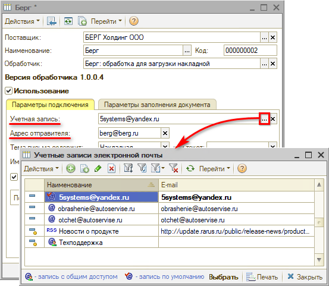

Письмо для загрузки определяется программой *по следующим параметрам:*

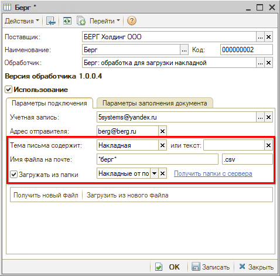

**1.** *Тема письма содержит* – следует прописать текст из темы письма, по которому можно определять письма, предназначенные для загрузки.

**2.** *или Текст* – часть текста в теле письма, по которому можно идентифицировать письма, предназначенные для загрузки.

**3.** *Имя файла на почте* – необходимо заполнить для того, чтобы программа могла находить нужные файлы во вложениях к письму.
Если предполагается, что название файла может содержать не только само искомое слово, следует перед и после имени файла поставить "звездочки" – в данном случае будет работать поиск файла по частичному совпадению имени (например, если введено &lt;\*берг\*&gt;, файл с названием "берг1" также будет загружаться).

**4.** *Формат файла* – файл должен быть табличным документом формата xls, csv или другим табличным файлом, перед значением формата должна стоять точка. Обязательно указать именно тот формат файла, в котором поставщик будет присылать накладные.

**5.** *Загружать из папки* – есть возможность настроить загрузку писем из определенной папки в почте.
Предварительно нужно в почтовом ящике создать папку и настроить получение писем от поставщиков в данную папку – см. [выше](#otd_papka). Также обязательно должен быть разрешен доступ к почтовому ящику с помощью почтовых клиентов – см. [выше](#dostup_k_yasch).
Затем следует на форме настройки обработчика в программе установить флажок "Загружать из папки", нажать на появившуюся ссылку "Получить папки с сервера" и выбрать созданную в почте папку, в которой требуется производить поиск накладных:

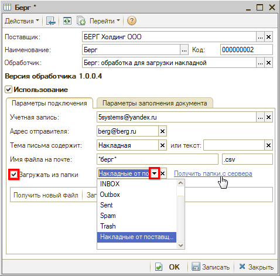

Если в параметре "Загружать из папки" не заполнить папку, то будет производится поиск по всей папке "Входящие".

#### 4) Параметры заполнения документа

Далее следует перейти на вкладку "Параметры заполнения документа" для настройки параметров создаваемых в программе документов при загрузке накладных с почты:

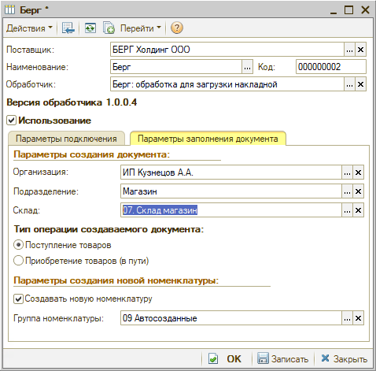

**1. Параметры создания документа:**

- *Организация –* если в загружаемом файле не указана организация, то будет загружаться наименование, указанное в данном параметре.
- *Подразделение –* если в файле не указано подразделение, то будет загружаться наименование, указанное в данном параметре.
- *Склад –* всегда будет подтягиваться из данного параметра.
- *Тип операции создаваемого документа* – по умолчанию будет создаваться непроведенный документ "Поступление товаров", либо можно выбрать создание документа "Приобретение товаров (в пути)". Документ "Поступление товаров" будет создаваться непроведенным, "Приобретение товаров (в пути)" будет автоматически проводиться.

**2. Параметры создания новой номенклатуры:**

- *Создавать новую номенклатуру* – если флаг установлен, будет сохраняться новая номенклатура в специальной группе справочника, указанной в следующем параметре. Если флаг не установлен, то загружаться будет только номенклатура с наименованиями, которые уже имеются в справочнике. При загрузке накладной с новой номенклатурой документ "Поступление товаров" будет создаваться с пустой строкой в таблице "Товары" – чтобы записать поступление, номенклатуру нужно будет заполнить вручную.
- *Группа номенклатуры* – требуется выбрать группу (папку) в справочнике, в которую будет сохраняться новая номенклатура.

После заполнения всех параметров настройки необходимо их сохранить нажатием на кнопку *"Записать"*.

#### 5) Проверка настройки

Кнопки *"Получить новый файл"* и *"Загрузить из нового файла"* используются для проверки загрузки вручную. По умолчанию загрузка производится регламентным заданием.

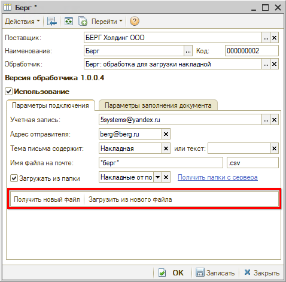

**1. Проверка получения файла**

Для проверки получения файла следует нажать кнопку *"Получить новый файл"*.

Затем нажатием кнопки "Перейти" открыть регистр сведений "Информация о загрузке накладных":

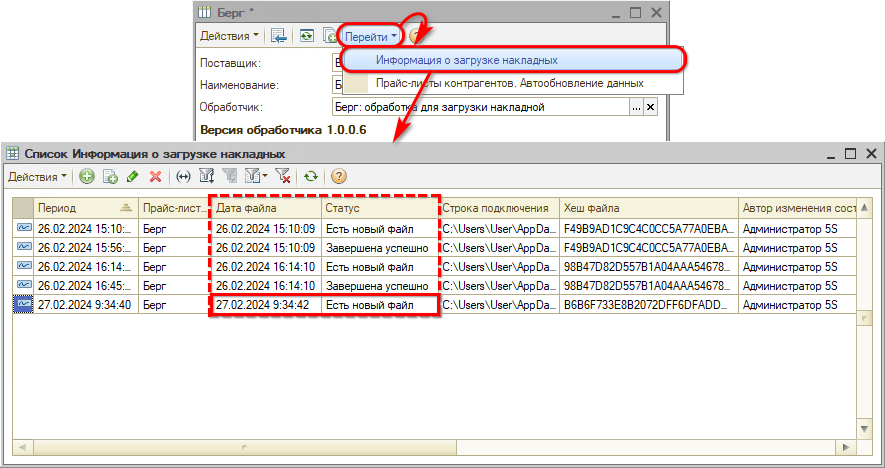

В регистр сведений записывается информация о загрузках, создается новая строка – проверить можно по дате и времени создания, наименованию прайс-листа и автору – при ручной загрузке должно быть указано имя текущего пользователя, после включения регламентного задания будет указываться Робот. В случае успешного получения файла отображается статус *"Есть новый файл".*

**2. Проверка загрузки файла**

Для проверки загрузки полученного файла следует нажать кнопку *"Загрузить из нового файла"*.

Результат успешной загрузки:

**1)** открывается форма созданного документа "Поступление товаров";
**2)** в окне служебных сообщений отображается результат загрузки: *"Накладная № __ была загружена в базу";*
**3)** в списке "Информация о загрузке накладных" появляется новая строка, в столбец *"Накладная"* подтягивается созданное *Поступление товаров*, отображается статус *"Завершена успешно":*

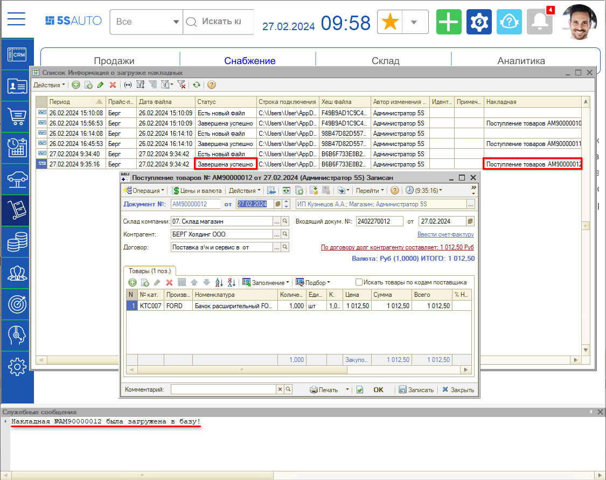

Также можно перейти в справочник "Поступления товаров" и проверить создание нового документа:

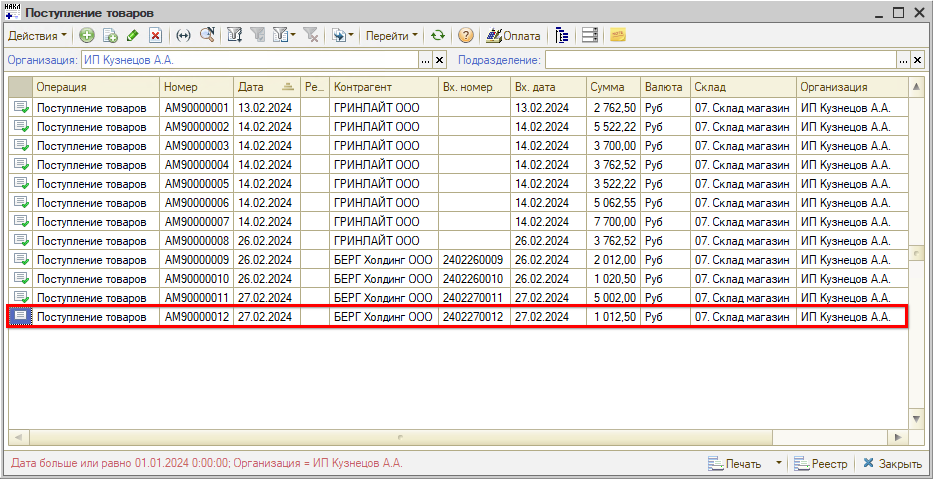

Для проверки обновления статуса в справочнике "Настройка загрузки накладных" необходимо нажать кнопку "Обновить":

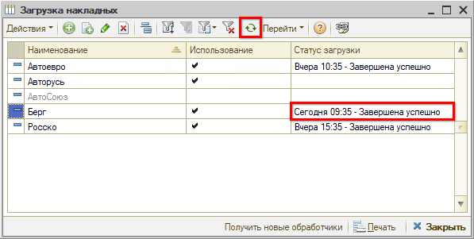

Результат *некорректной* загрузки:

**1)** открывается форма созданного документа "Поступление товаров";
**2)** в окне служебных сообщений появляются сообщения о загрузке с ошибками;
**3)** выходит уведомление о загрузке накладной с ошибками;
**4)** в регистре и в справочнике отображается статус загрузки "Завершена с ошибками".

Результат загрузки в случае *[настройки](#param_sozd_nomenkl)* *создания поступлений товаров без создания новой номенклатуры:*

**1)** открывается форма созданного документа "Поступление товаров" с пустой строкой в таблице "Товары" и причиной ошибки в комментарии;
**2)** появляются служебные сообщения об ошибках загрузки;
**3)** выходит уведомление о загрузке накладной с ошибками;
**4)** в регистре и в справочнике отображается статус загрузки "Завершена с ошибками":

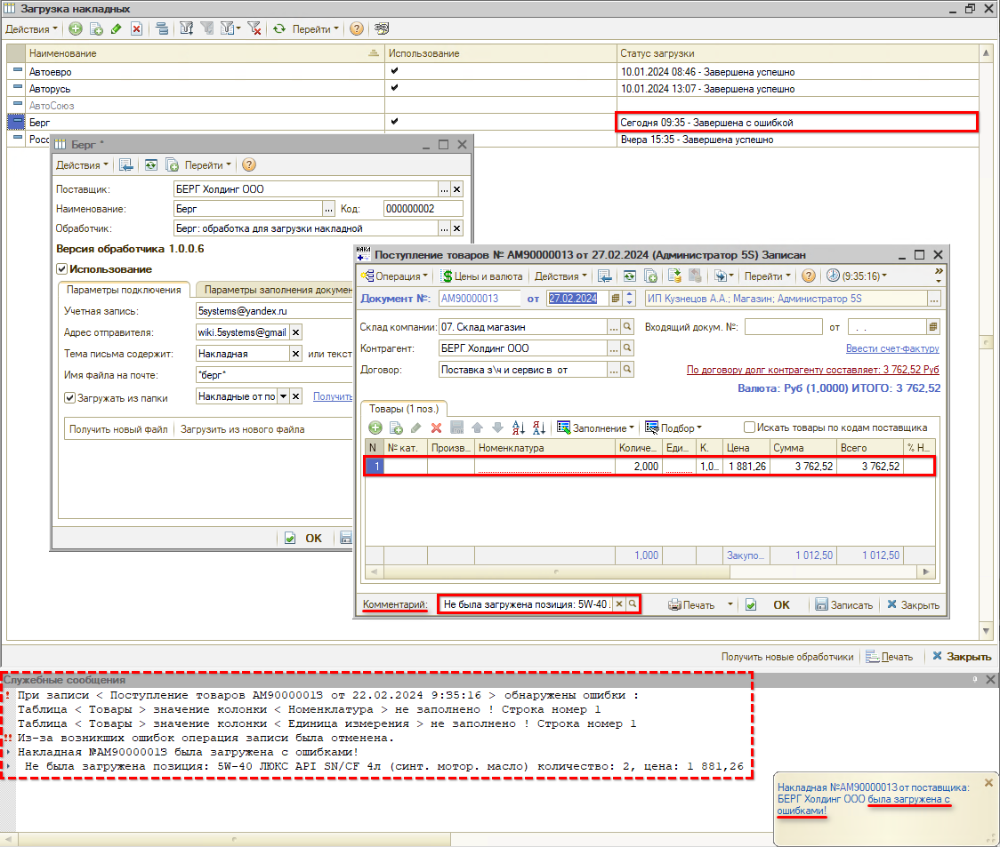

## Обработчики загрузки

### Загрузка из общего хранилища

Сначала необходимо загрузить в базу обработчики из общего хранилища. Для загрузки обработчиков из хранилища необходимо предварительно настроить *[интеграцию с API 5S AUTO](https://5systems.ru/help/api-5s-auto).*

При нажатии на кнопку "Получить новые обработчики" в справочнике "Загрузка накладных" открывается форма загрузки обработчиков из общего хранилища:

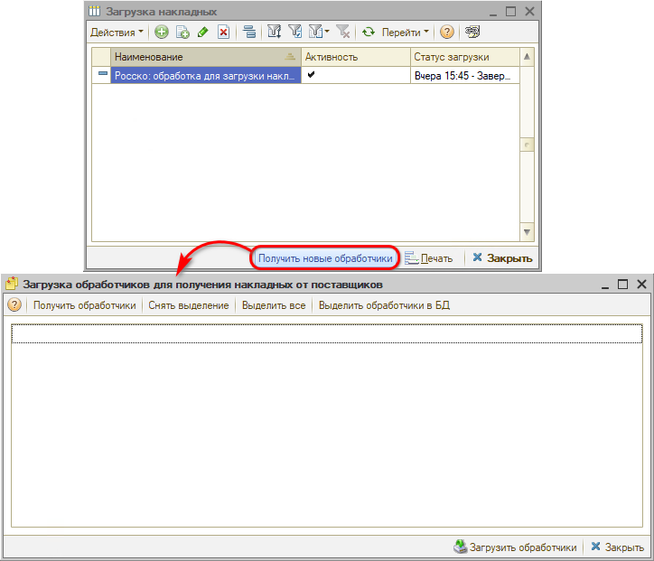

Для загрузки списка обработчиков следует нажать кнопку на верхней панели "Получить обработчики":

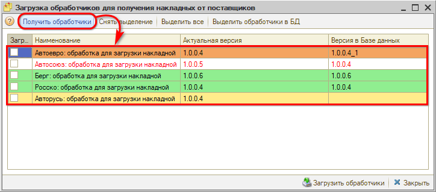

**Колонки таблицы:**

- *Загрузить* – флажок, предназначенный для выделения обработок, выбранных для загрузки в базу.
- *Наименование* – название обработчика из эталонной базы.
- *Актуальная версия* – версия обработчика из эталонной базы, по ней можно определить, нужно ли обновлять уже имеющиеся обработчики в текущей базе.
- *Версия в Базе данных* – версия обработчика, загруженная в текущую базу ранее.

Дополнительно можно вывести в список колонки:

- *Идентификатор* – уникальных идентификатор элемента из эталонной базы.
- *Загружен в БД* – отметка о загрузке данного обработчика в текущую базу.

**Значения цветового выделения строк:**

- *Желтый* – данный обработчик отсутствует в текущей базе.
- *Зеленый* – версия обработчика в текущей базе совпадает с версией обработчика в эталонной базе.
- *Красный* – обработчик в текущей базе устарел, его нужно обновить на актуальную версию из эталонной базы.
- *Оранжевый* – в базе есть обработчик с таким же наименованием, но он был загружен не из эталонной базы, а вручную (идентификатор в обработчике не совпадает).

Требуется отметить галочками обработчики, которые нужно загрузить или обновить. Для группового выделения можно использовать кнопки на верхней панели *"Выделить все"* и *"Снять выделение".* Кнопка *"Выделить обработчики в БД"* позволяет выделить только те обработчики, которые загружены в текущую базу.

Для загрузки выбранных обработчиков в свою текущую базу нужно нажать кнопку "Загрузить обработчики" и подтвердить действие:

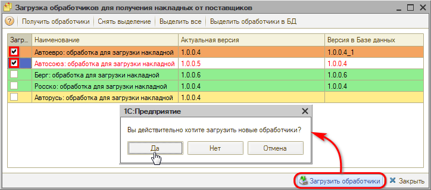

Если обработчик уже есть в базе, и его наименование не было изменено, то он обновится до версии из эталонной базы. Если обработчика в базе не было, то он будет создан. Для проверки обновления обработчиков в базе данных следует повторно нажать кнопку "Получить обработчики" – цвет выделения у обновленных обработчиков изменится на зеленый:

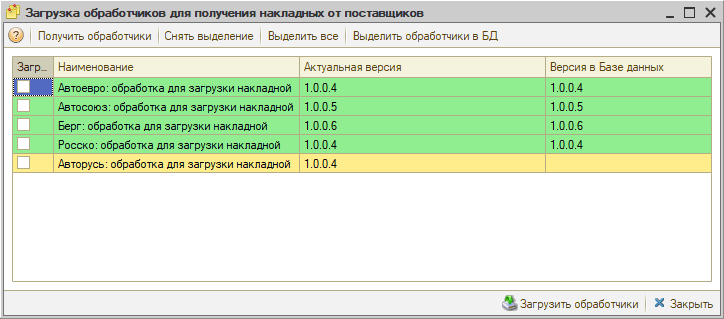

Обработчики загружаются в папку "Обработки для загрузки накладных" в справочнике "Внешние печатные формы":

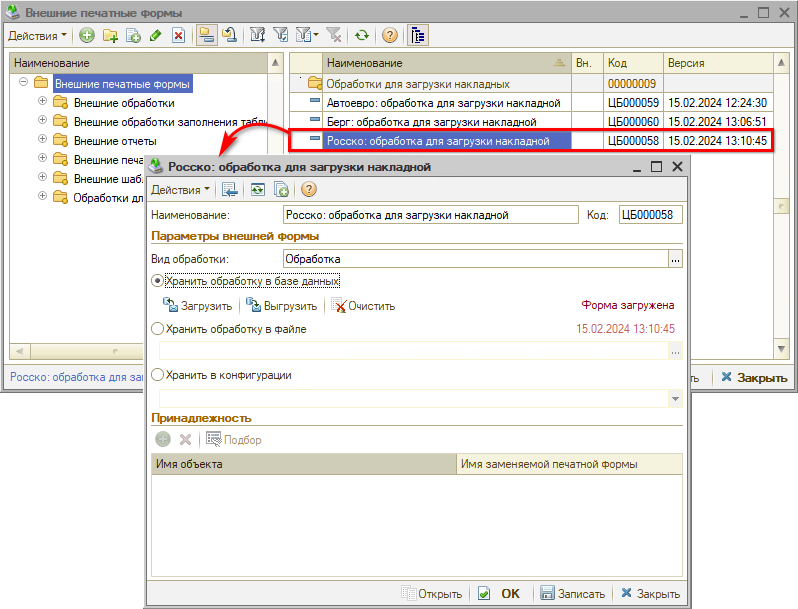

### Добавление обработчика

При необходимости есть возможность изменить существующие обработчики либо создать свои обработчики по примеру имеющихся.

Для этого нужно нажать кнопку "Выгрузить", сохранить файл и открыть его в конфигураторе. Затем требуется создать вручную новый обработчик в справочнике.

### Обновление обработчика

Если обработчик перестал обновляться, следует открыть его форму и на верхней панели нажать кнопку "Разрешить редактирование", затем "Восстановить значение из макета" – обработчик будет заменен на эталонную версию:

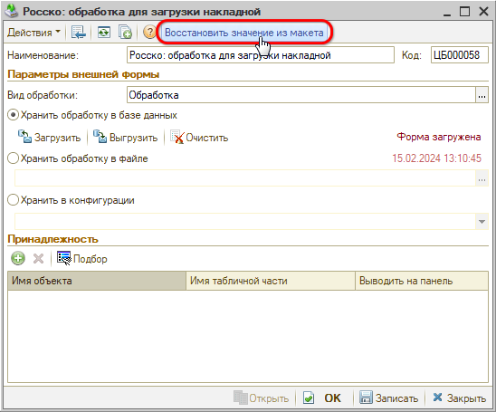

## Настройка уведомления

При получении новой накладной программа создает уведомление:

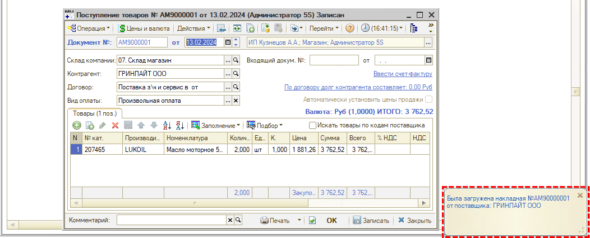

Для включения уведомления следует открыть справочник "Уведомления" и перейти в группу "Загрузка накладных → Загрузка накладных от поставщиков". Необходимо установить галочку "Используется" и выбрать способ отправки:

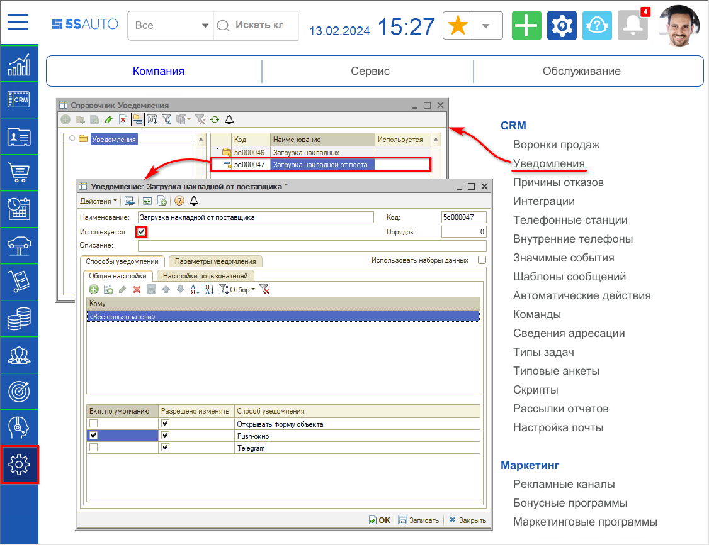

По умолчанию будет работать стандартный шаблон, при необходимости есть возможность настроить свой.

Уведомление по умолчанию отправляется всем пользователям. После [настройки получения уведомления](../../CRM/Работа%20с%20уведомлениями/rabota-s-uvedomleniyami.md#настройка-получения-уведомлений-для-пользователя) каждым пользователем для себя уведомления будут приходить только тем, кто настроил для себя их получение:

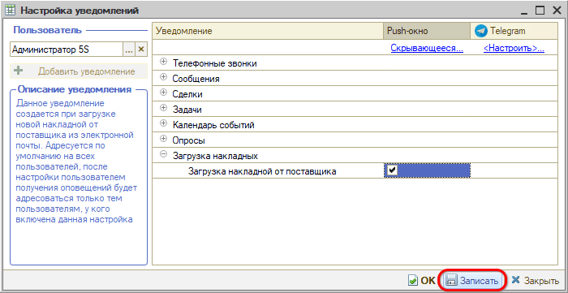

## Регламентное задание

После того как произведены и записаны все настройки, необходимо включить преднастроенное регламентное задание "Автоматическая загрузка накладных от поставщиков":

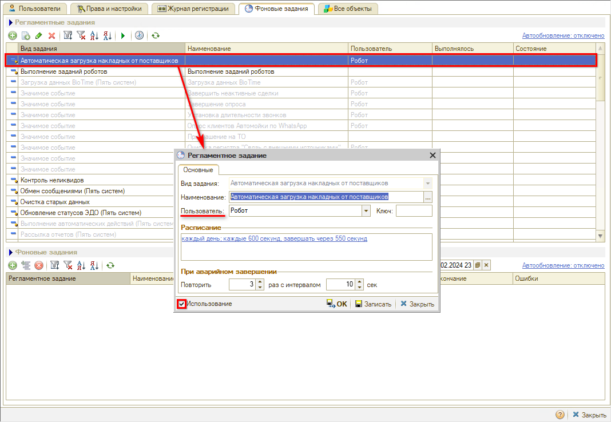

---

**Теги:** загрузка накладных, поставщики, поступление товаров, обработчики загрузки, электронная почта, регламентное задание, уведомления

