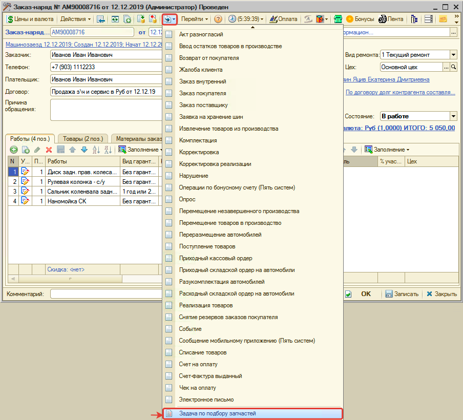
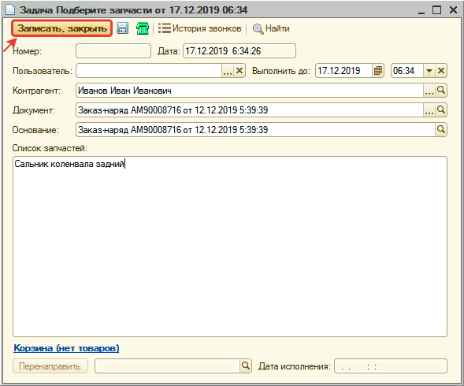
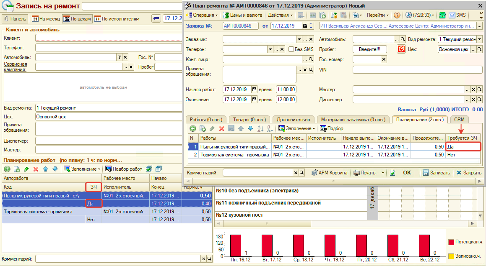
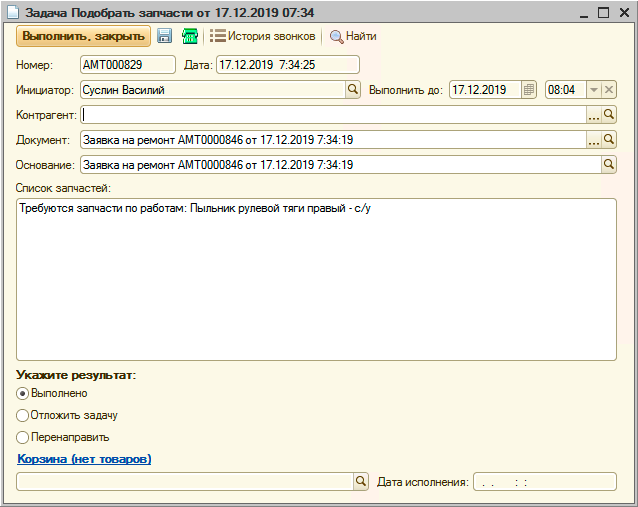
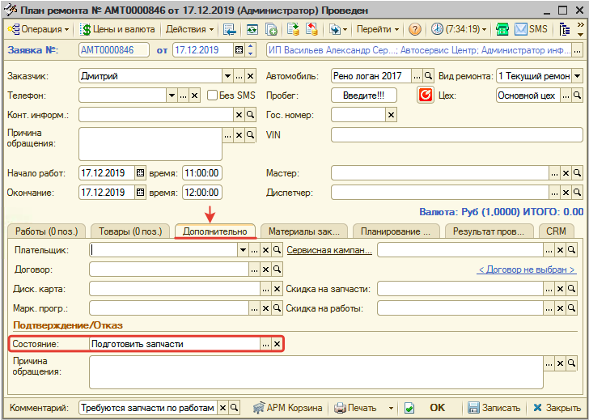
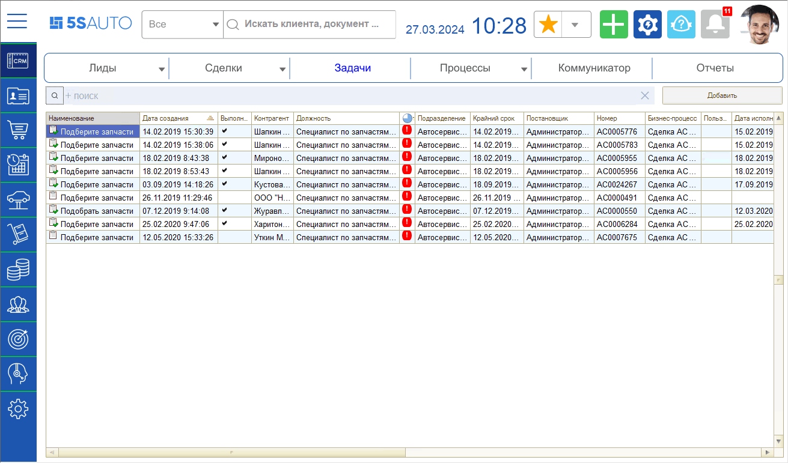
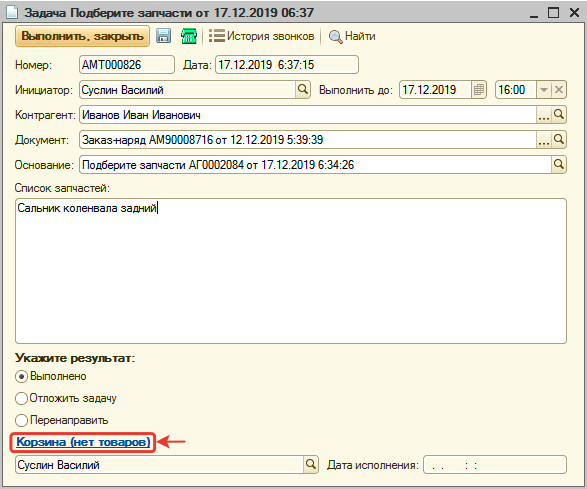
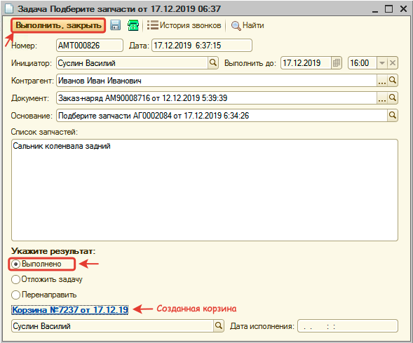

# Задача на подбор запчастей

<table><tr><td><b>Время чтения:</b> 9 мин.</td><td><b>Обновлено:</b> 26.12.2025</td></tr></table>

Источник: https://www.5systems.ru/help/zadacha-na-podbor-zapchastey

## Содержание

- [Введение](#введение)
- [Предварительная настройка](#предварительная-настройка)
- [Формирование и обработка задачи на подбор запчастей](#формирование-и-обработка-задачи-на-подбор-запчастей)
  - [Шаг 1. Формирование задачи по подбору запчастей](#шаг-1-формирование-задачи-по-подбору-запчастей)
  - [Шаг 2. Исполнение задачи на подбор запчастей специалистом по запчастям](#шаг-2-исполнение-задачи-на-подбор-запчастей-специалистом-по-запчастям)

## Введение

В программе предусмотрена возможность формирования ***задачи на подбор запчастей*** из документа "Заказ-наряд" или "Заявка на ремонт". Данная функция нужна, когда в процессе ремонта есть необходимость установить новые запчасти на автомобиль, а подбором запчастей занимаются отдельные специалисты, или подбор запчастей осуществляется перед заездом автомобиля.

## Предварительная настройка

Прежде чем создавать задачи по подбору запчастей, необходимо определить пользователей, которые будут эти задачи обрабатывать. Для этого назначьте должность "Специалист по запчастям (CRM)" в регистре сведений "Сведения адресации" (см. *[Адресация задач в CRM по исполнителям](https://5systems.ru/help/adresaciya-zadach-v-crm-po-ispolnitelyam)*).

Для автоматического создания задачи на подбор запчастей из Заявки на ремонт, необходимо установить [право](https://5systems.ru/help/ustanovka-prav-i-nastroek-polzovatelya) для компании *"Контролировать необходимость запчастей по автоработам"* (группа прав и настроек: ПЯТЬ СИСТЕМ → АВТОСЕРВИС) = "Да".

## Формирование и обработка задачи на подбор запчастей

### Шаг 1. Формирование задачи по подбору запчастей

#### Из Заказ-наряда

После записи документа "Заказ-наряд" можно сформировать задачу на подбор запчастей. Для этого:

1. Перейдите к формированию задачи на подбор:

   
2. В окне задачи укажите список запчастей, которые необходимы и нажмите кнопку "Записать и закрыть":

   

В результате сформируется задача "Подберите запчасти", которая будет видна в АРМ "Рабочий стол" пользователям с должностью "Специалист по запчастям (CRM)" (см. *Предварительная настройка*).

#### Из Заявки на ремонт

При планировании работ для автоработы установите параметр "Требуется запчасть" (ЗЧ) = "Да":

Сохраните Заявку на ремонт.

В результате:

- на пользователей с должностью "Специалист по запчастям (CRM)" автоматически создастся задача "Подобрать запчасти" с комментарием, что требуется запчасти для выполнения работ:

  

- заявка на ремонт автоматически перейдет в состояние "Подготовить запчасти":

  

### Шаг 2. Исполнение задачи на подбор запчастей специалистом по запчастям

Пользователи с должностью "Специалист по запчастям (CRM)" в списке задач в CRM видят назначенные на них задачи на подбор запчастей:

Для исполнения задачи специалист по запчастям должен:

1. Открыть задачу.
2. Перейти в Корзину, нажав на кнопку-ссылку "Нет товаров":

   
3. Подобрать товары в Корзине и сохранить изменения.
4. Добавить товары, подобранные в Корзине, в документ-основание задачи (Заказ-наряд или Заявка на ремонт).
5. Закрыть Корзину.
6. Вернуться к задаче и выполнить ее:

   

***Обратите внимание!*** Если выполнена задача на подбор запчастей на основании Заявки на ремонт, то состояние Заявки на ремонт автоматически установится в "Ожидание заезда".

---

**Теги:** задача на подбор запчастей, заказ-наряд, заявка на ремонт, специалист по запчастям, CRM

