

# Инвентаризация

<table><tr><td><b>Время чтения:</b> 16 мин.</td><td><b>Обновлено:</b> 22.06.2022</td></tr></table>

Источник: https://www.5systems.ru/help/inventarizaciya

## Содержание

- [Введение](#введение)
- [Инвентаризация товаров](#инвентаризация-товаров)
  - [Описание столбцов таблицы вкладки "Товары"](#описание-столбцов-таблицы-вкладки-товары)
- [Инвентаризация ордерного склада](#инвентаризация-ордерного-склада)
- [Инвентаризация по ячейкам хранения](#инвентаризация-по-ячейкам-хранения)
  - [Заполнение документа ячейками](#заполнение-документа-ячейками)
  - [Заполнение состава товаров](#заполнение-состава-товаров)
- [Создание ячеек хранения для склада](#создание-ячеек-хранения-для-склада)
  - [Создание ячеек хранения](#создание-ячеек-хранения)
  - [Справочник "Ячейки хранения"](#справочник-ячейки-хранения)
  - [Распределение товаров по складам](#распределение-товаров-по-складам)

## Введение

В программе есть возможность отражать операции списания недостачи и оприходования излишков товара по результатам инвентаризации.

## Инвентаризация товаров

Чтобы отразить в учете факт проведения инвентаризации товаров на складе необходимо создать документ *"Инвентаризация товаров"*. Для этого требуется открыть реестр документов *Инвентаризация товаров —* *Запчасти и склад → Склад → Учет товаров → Инвентаризация товаров\*:*

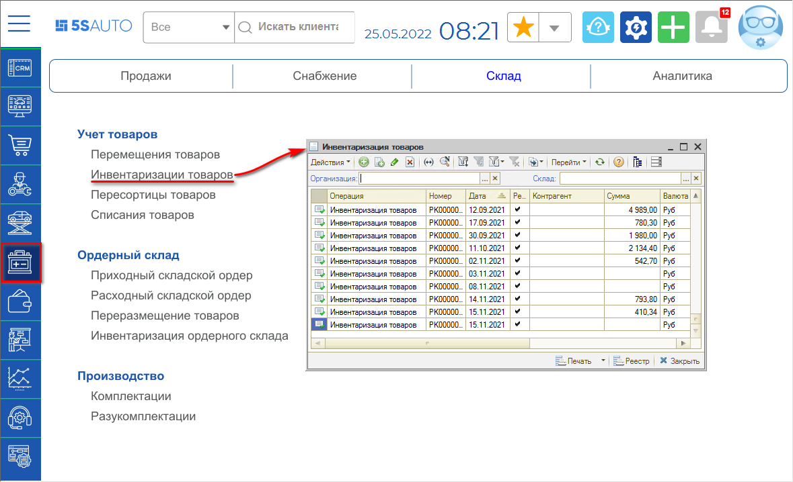

*\*Примечание: В случае если данного пункта меню нет на рабочем столе, можно добавить его вручную – см. статью "[Настройка рабочего стола](https://www.5systems.ru/help/nastroyka-rabochego-stola#nastrrazdelov)".*

В списке инвентаризаций нужно создать новый документ добавлением:

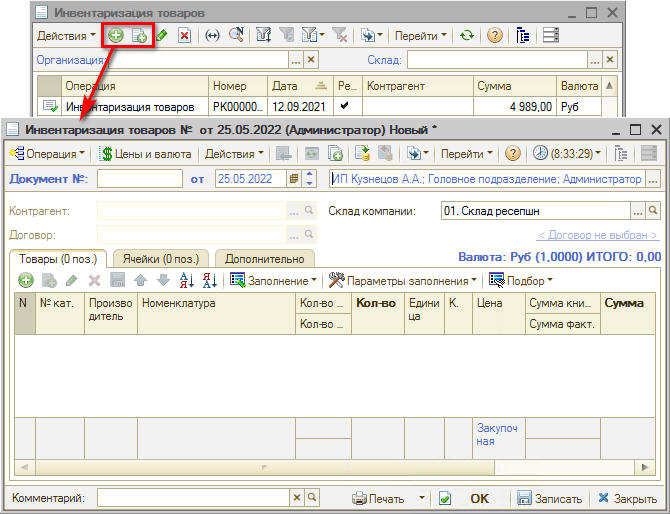

В документе необходимо указать склад, по которому проводится инвентаризация, и заполнить товарные позиции вручную или с помощью кнопки автозаполнения:

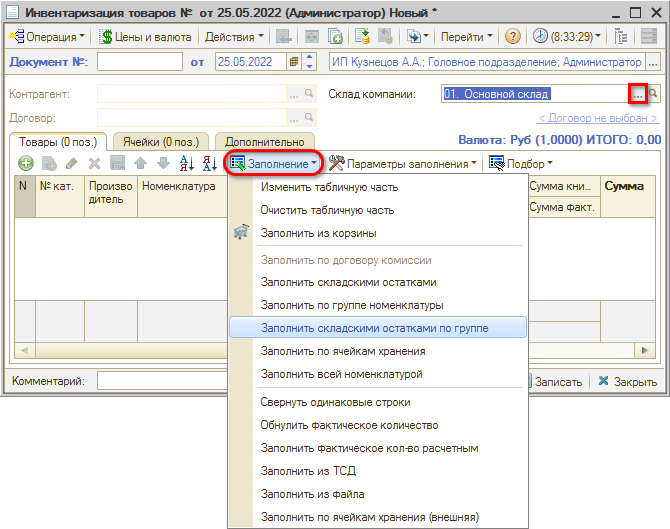

Меню кнопки *Заполнение* содержит следующие пункты:

- *Заполнить по договору комиссии* – формирует таблицу при помощи всех товаров, переданных на комиссию, за которые комиссионер еще не отчитался.
- *Заполнить складскими остатками* – заполняет таблицу товарными остатками указанного склада.
- *Заполнить по группе номенклатуры* – в номенклатурном справочнике выбирается группа элементов. Таблица заполняется всеми элементами выбранной группы.
- *Заполнить складскими остатками по группе* – будет открыто окно, в котором можно будет выбрать группу элементов справочника Номенклатура. В табличную часть будут выведены все имеющиеся в наличии номенклатурные позиции, относящиеся к выбранной группе.
- *Заполнить по ячейкам хранения* – используется при инвентаризации по ячейкам хранения: таблица заполняется товарами по выбранным ячейкам.
- *Заполнить всей номенклатурой* – таблица заполняется всем содержимым справочника Номенклатура.
- *Свернуть одинаковые строки* – несколько табличных строк, соответствующих одному и тому же номенклатурному элементу, сворачиваются в одну строку.
- *Обнулить фактическое количество* – обнуляет графу Кол-во факт.
- *Заполнить фактическое кол-во расчетным* – числа в графе Кол-во факт. становятся равными числам в графе Кол-во книжн.
- *Заполнить из ТСД* – таблица заполняется товарами, информация о которых находится в подключенном терминале сбора данных.
- *Заполнить из файла* – таблица заполняется данными из загружаемого файла.

Пример документа, заполненного складскими остатками по группе "Автозапчасти":

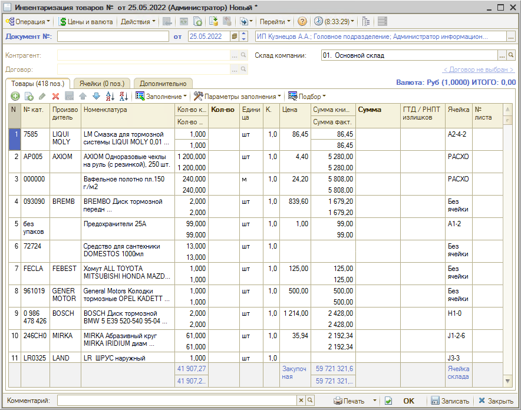

После заполнения *Инвентаризации* удобно распечатать "Пустографку", чтобы отмечать в ней количество пересчитываемого товара (у пользователя должно быть право печатать непроведенные документы):

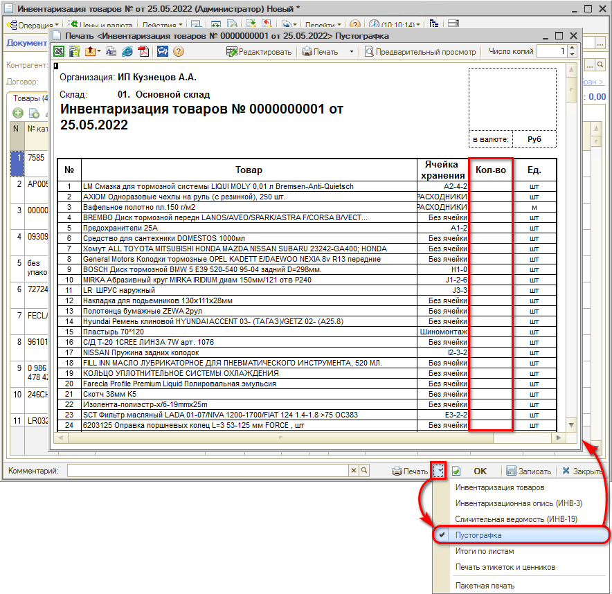

Затем нужно пересчитать товары на складе и внести в форму документа их фактическое количество (при этом автоматически проставляются значения в графах "Кол-во" и "Сумма") и провести документ.

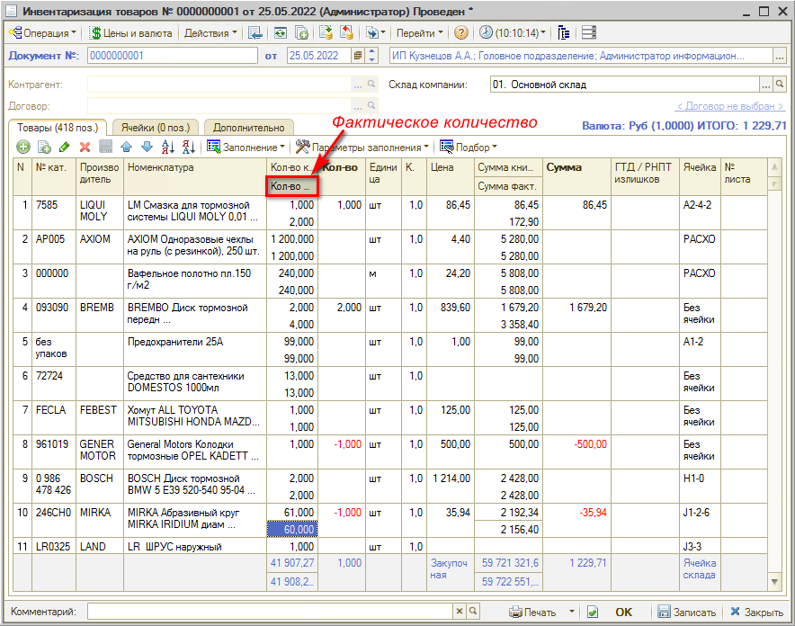

При проведении документа автоматически производится *списание недостачи* и *оприходование излишков* товара (разницы между фактическим и учетным количеством) на склад по выбранной статье (указываются на вкладке "Дополнительно"):

Если в результате инвентаризации не зафиксировано отклонений фактического количества товара от учетного в какую-либо сторону, то при проведении документа никаких движений по учетным блокам сформировано не будет.

### Описание столбцов таблицы вкладки "Товары"

На вкладке *Товары* содержится таблица инвентаризуемых товаров. Столбцы таблицы:

- ***Номенклатура*** – номенклатура (товар).
- ***Кол-во книжн., Кол-во факт.*** – расчетное (по базе данных) количество товара и фактическое количество.
- ***Кол-во*** – количество расчетное минус количество фактическое. Отрицательные разницы (недостачи) отображаются красным шрифтом.
- ***Единица*** – единица измерения товара.
- ***Цена*** – цена закупки на момент инвентаризации.
- ***Сумма книжн., Сумма факт.*** – оценочная (расчетная) сумма товара по данным из базы данных и фактическая сумма товара. Рассчитываются от цены закупки.
- ***Сумма*** – сумма фактическая минус сумма расчетная. Отрицательные суммы отображаются красным шрифтом.
- ***ГТД / РНПТ*** – номер грузовой таможенной декларации (для автомобилей поступивших по импорту) или регистрационный номер (РНПТ) для прослеживаемых товаров.
- ***Ячейка*** – ячейка хранения для номенклатуры. Значение хранится в номенклатуре в разрезе складов.
- ***№ листа*** – номер листа инвентаризационной ведомости.

Установка флажка ***"Не изменять факт при заполнении"*** означает запрет на внесение изменений в колонку *Кол-во факт.* при автоматизированном заполнении табличной части:

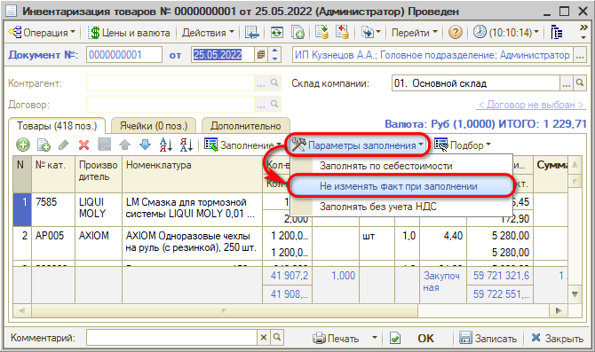

Параметр позволяет обновлять таблицу товаров при заполнении. Это необходимо при проведении инвентаризации на работающем складе, когда по нему идут операции прихода и расхода.

Документ "Инвентаризация товаров" не применяется для инвентаризации ордерных складов. Для инвентаризации ордерных складов используется документ "Инвентаризация ордерного склада" (см. далее).

## Инвентаризация ордерного склада

Для проведения инвентаризации ордерного склада в программе предусмотрен документ "Инвентаризация ордерного склада" – *Запчасти и склад → Склад → Ордерный склад → Инвентаризация ордерного склада\*:*

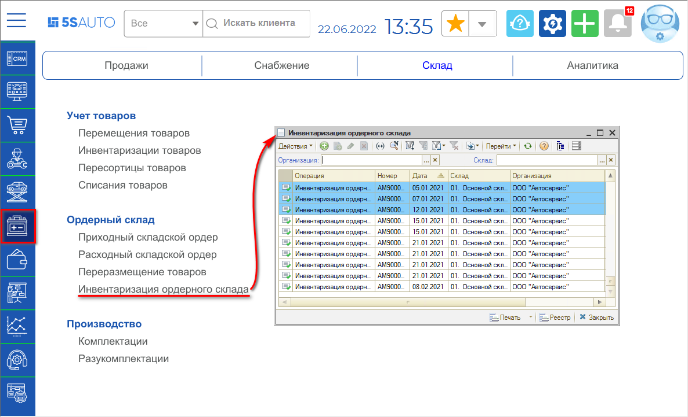

*\*Примечание: В случае если данного пункта меню нет на рабочем столе, можно добавить его вручную – см. статью "[Настройка рабочего стола](https://www.5systems.ru/help/nastroyka-rabochego-stola#nastrrazdelov)".*

При проведении документа производится списание недостачи и оприходование излишков по ячейкам склада.

***Обратите внимание!*** Документ «Инвентаризация ордерного склада» не изменяет количество запчастей на складе по остаткам. Для этого сформируйте документ «Инвентаризация товаров» вводом на основании.

## Инвентаризация по ячейкам хранения

Если склад запчастей достаточно большой, то провести ревизию за один раз и зафиксировать остатки бывает проблематично. В данном случае используется методика выборочной инвентаризации, согласно которой кладовщик регулярно делает перерасчет товаров *по ячейкам*. Для отражения выборочного пересчета товаров в программе создан механизм *инвентаризации по ячейкам хранения*.

### Заполнение документа ячейками

В документе *Инвентаризация* должен быть выбран склад, в котором есть ячейки: при этом активируется вкладка "Ячейки". Можно заполнить ячейки вручную, либо с помощью кнопки автозаполнения – *всеми ячейками* склада либо *по группам ячеек*:

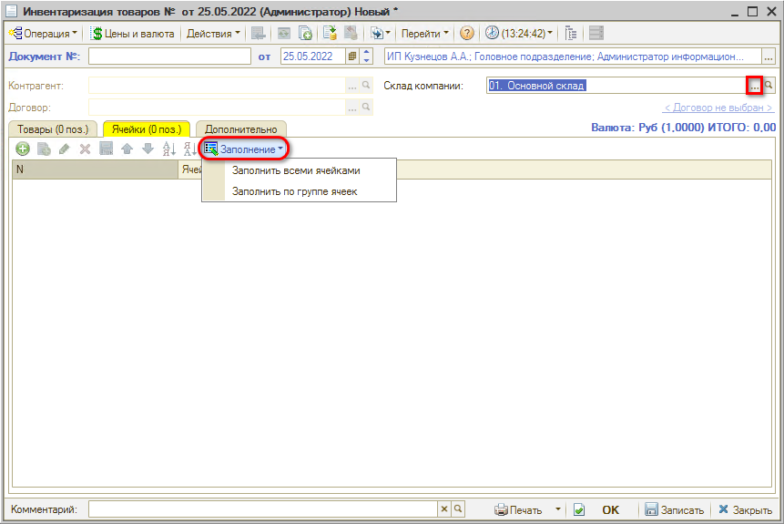

При заполнении по группе ячеек можно выбрать группы, которые были заданы в карточке данного склада (как создать ячейки хранения для склада см. раздел *ниже*):

При этом таблица на вкладке заполнится ячейками по выбранной группе:

### Заполнение состава товаров

После заполнения ячеек необходимо перейти на вкладку *Инвентаризации* "Товары" для заполнения состава товаров.

Используется кнопка автозаполнения *Заполнение → Заполнить по ячейкам хранения*:

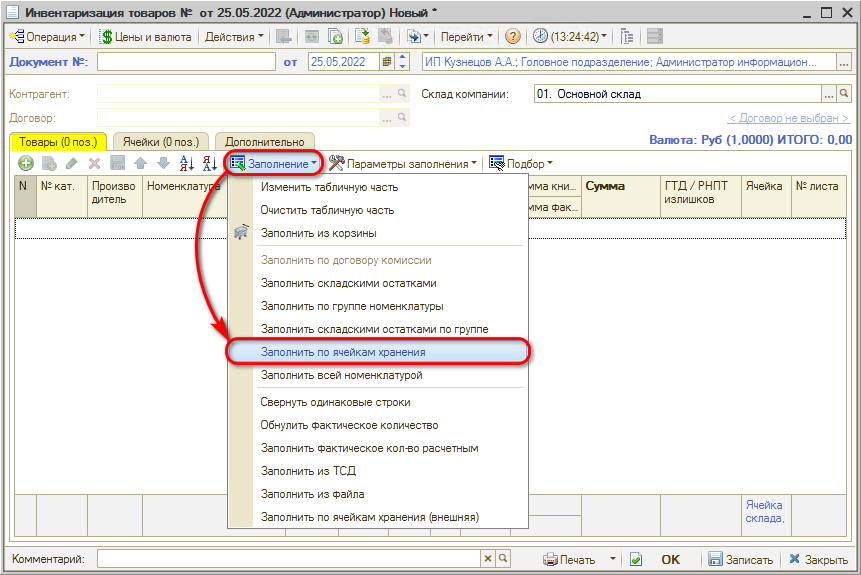

Таблица заполняется товарами по выбранным ячейкам:

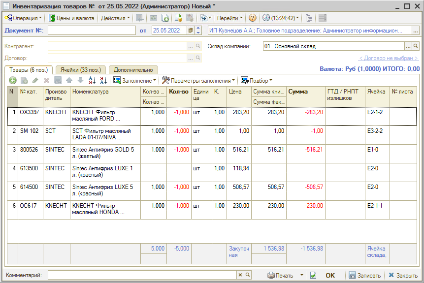

Далее требуется пересчитать товары в ячейках на складе, ввести фактическое количество и провести документ.

## Создание ячеек хранения для склада

Систематизация склада по местам хранения – ячейкам – производится с целью равномерного распределения и быстрого поиска товаров.

### Создание ячеек хранения

Для организации ячеек хранения склад может быть разделен на отдельные помещения, секции, ряды, ярусы и сами ячейки.

В программе структура склада, отражающая это деление, задается в карточке склада на вкладке "Ячейки":

Для создания новой группы ячеек требуется нажать кнопку "Добавить группу" и задать наименование:

*\*Примечание: Для ручного ввода наименования группы требуется нажать кнопку "Действия → Редактировать код".*

Созданные ячейки и группы сохраняются в справочнике "Ячейки хранения" и затем используются при оформлении инвентаризации по ячейкам хранения.

### Справочник "Ячейки хранения"

Каждый элемент справочника описывает некоторое физическое место хранения (ячейку). Ячейка характеризуется местоположением и размерами.

При создании ячеек из формы карточки склада задается код, отражающий ряд (координата Y), место (координата X) и уровень, в котором находится ячейка (например "1-2-3" - 1 место во 2 ряду на 3 уровне), а также указываются длина и ширина ячейки в единицах размерности склада:

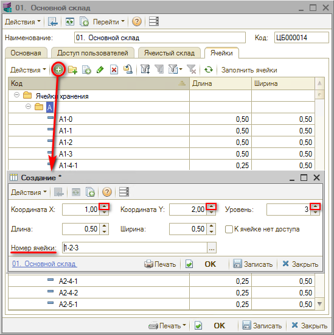

Код ячейки также может выглядеть так:

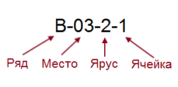

Или так:

### Распределение товаров по складам

После того, как склад разбили по ячейкам, все поступающие товары распределяются по ним. Для распределения товаров по ячейкам склада:

- предварительно всем товарам присваиваются штрихкоды,
- печатается и клеится этикетка на товар с его штрихкодом и номером ячейки.

Для последующего считывания штрихкодов с целью отгрузки товара используется сканер штрихкодов.

---

**Теги:** инвентаризация, инвентаризация товаров, ордерный склад, ячейки хранения, недостача, излишки

