

# Интерфейс для ТСД

<table><tr><td><b>Время чтения:</b> 25 мин.</td><td><b>Обновлено:</b> 14.03.2023</td></tr></table>

Источник: https://www.5systems.ru/help/interfeys-dlya-tsd

## Содержание

1. [Введение](#введение)
2. [Работа с терминалом](#работа-с-терминалом):
   - [Главное меню](#главное-меню)
   - [Принцип работы](#принцип-работы)
   - [1. Поступление](#1-поступление)
     - [Работа с документами "Поступление товаров"](#работа-с-документами-поступление-товаров)
     - [Работа с документами "Приобретение товаров / в пути"](#работа-с-документами-приобретение-товаров--в-пути)
   - [2. Инвентаризация](#2-инвентаризация)
   - [3. Перемещение](#3-перемещение)
   - [4. Остатки](#4-остатки)
     - [Просмотр остатков товара](#просмотр-остатков-товара)
     - [Присвоение штрихкодов](#присвоение-штрихкодов)
   - [5. Настройки](#5-настройки)
3. [Настройки подключения](#настройки-подключения):
   - [Настройка пользователя в 1С для ТСД](#настройка-пользователя-в-1с-для-тсд)
   - [Настройки подключения оборудования](#настройки-подключения-оборудования)
4. [Как открыть программу на терминале](#как-открыть-программу-на-терминале)

## Введение

*Терминал сбора данных* – это мобильное устройство, предназначенное для автоматизации работы склада и проведения хозяйственных операций. Прибор оснащен *сканером штрих-кодов* для считывания и передачи в учетную систему данных с целью идентификации, количественного и ассортиментного учета товара.

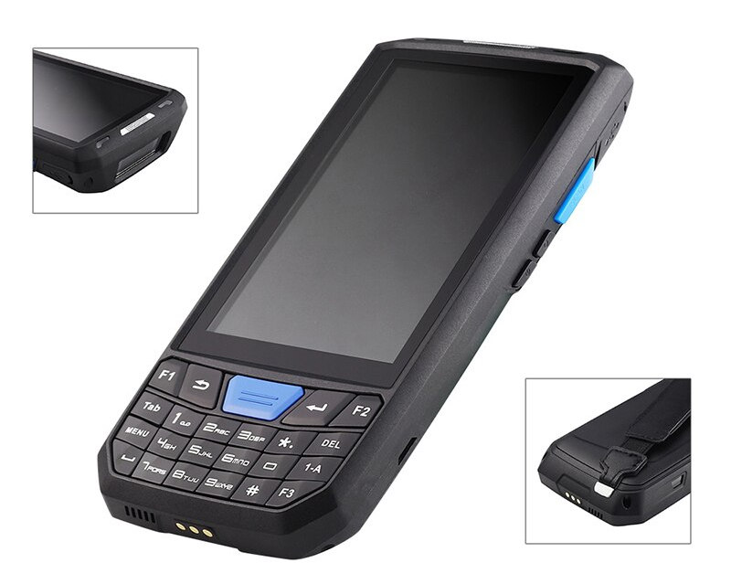

Применение ТСД ускоряет работу сотрудников и позволяет избежать ошибок при выполнении рутинных действий.

Основные функции ТСД:

- Проверка наличия товара и остатка на складе;
- Проведение инвентаризаций;
- Оформление поступлений от поставщиков;
- Отслеживание недовоза товаров.

Интеграция 5S AUTO с *Терминалом сбора данных* позволяет автоматизировать учет товара, мгновенно занося данные через ТСД в программу.

В текущей статье рассмотрен стандартный функционал работы с ТСД в 5S AUTO. Также в программе реализован механизм *распознавания товаров при сканировании ш/к* методом обращения к данным сервиса 5S Cloud. Если ш/к не найден в программе, происходит получение артикула/производителя/наименования из данных сервиса, и номенклатура добавляется в базу. Подробнее см. в статье "[Сканирование штрихкодов товаров](../Штрихкодирование%20номенклатуры/Сканирование%20штрихкодов/skanirovanie-shtrikhkodov-tovarov.md#сканирование-в-интерфейсе-тсд)".

## Работа с терминалом

### Главное меню

Основное меню ТСД, интегрированного с 5S AUTO:

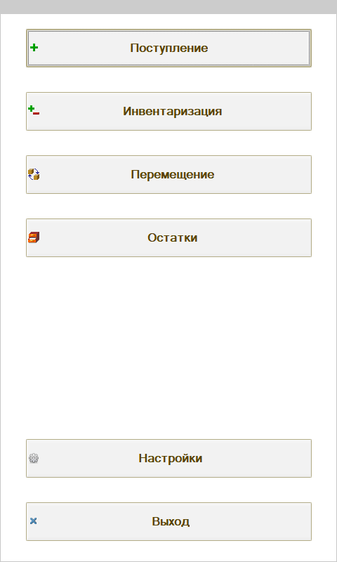

В основное меню ТСД входят следующие кнопки:

1. "Поступление"
2. "Инвентаризация"
3. "Перемещение"
4. "Остатки"
5. "Настройки"
6. "Выход"

### Принцип работы

Главная задача *Терминала сбора данных* – это подсчет товаров по штрихкоду. То есть, пользователь сканирует терминалом штрихкоды на номенклатуре, и эта информация передается в программу.

Предполагается, что база уже наполнена номенклатурой со штрихкодами, но посредством ТСД можно присваивать штрихкод товару – для этого в программу должны быть заведены товары с артикулами. Как правило, производится считывание штрихкода с каждой единицы товара либо можно сканировать один штрихкод по каждой номенклатурной единице и вводить количество товара вручную.

### 1. Поступление

При нажатии кнопки "Поступление" на экране ТСД выводятся все непроведенные документы "Поступление товаров" и "[Приобретение товаров / Товар в пути](../Приобретение%20товаров%20%28в%20пути%29/priobretenie-tovarov-v-puti.md)" – товары "В пути" выделяются красным цветом:

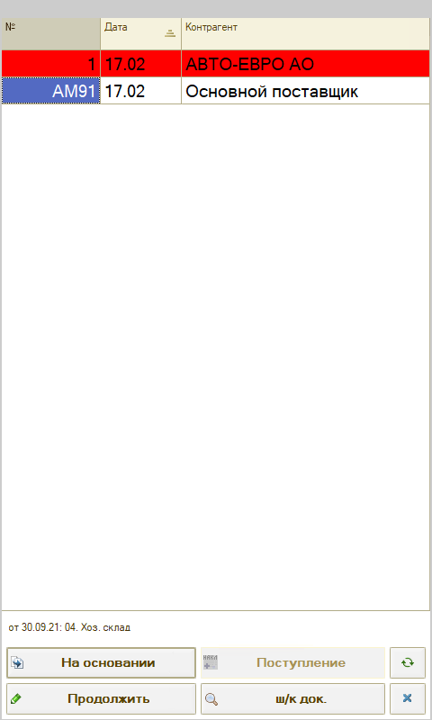

Есть возможность найти нужный документ по штрихкоду – для этого следует просто отсканировать штрихкод документа. Для ручного поиска документа по штрихкоду следует нажать кнопку "Ш/к док." и ввести значение ШК:

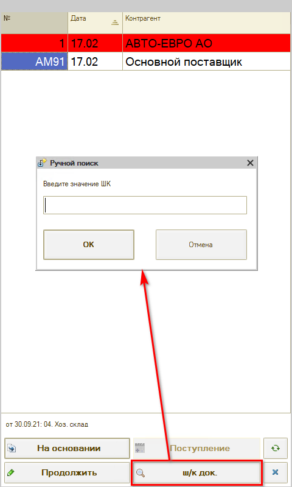

#### Работа с документами "Поступление товаров"

В документ "Поступление товаров" можно только добавлять товар. Для этого следует выделить документ и нажать кнопку "Продолжить" – открывается следующая форма:

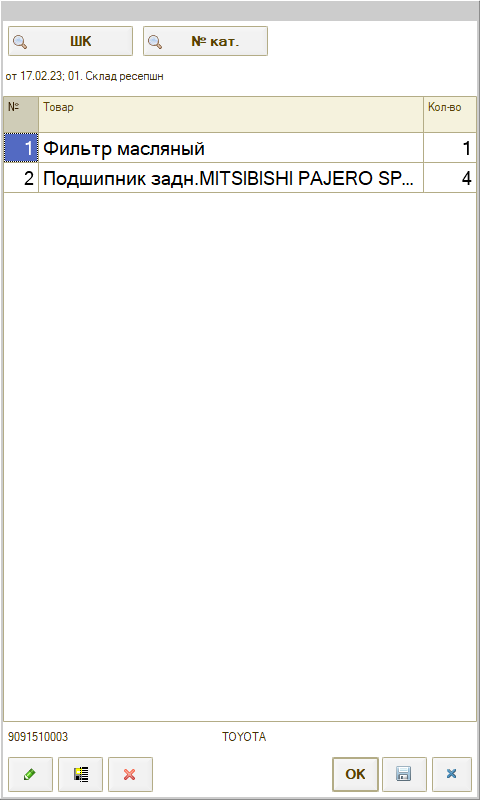

В таблице отражено наименование товара и количество.

Далее следует отсканировать терминалом штрихкод товара – открывается окно "Ввод количества":

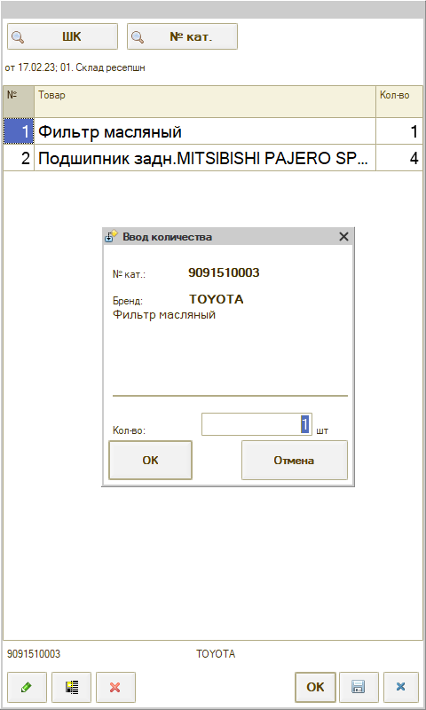

Если количество товара больше 1 – следует ввести нужное значение и сохранить введенные данные нажатием на кнопку с дискетой. В таблице изменяется значение количества:

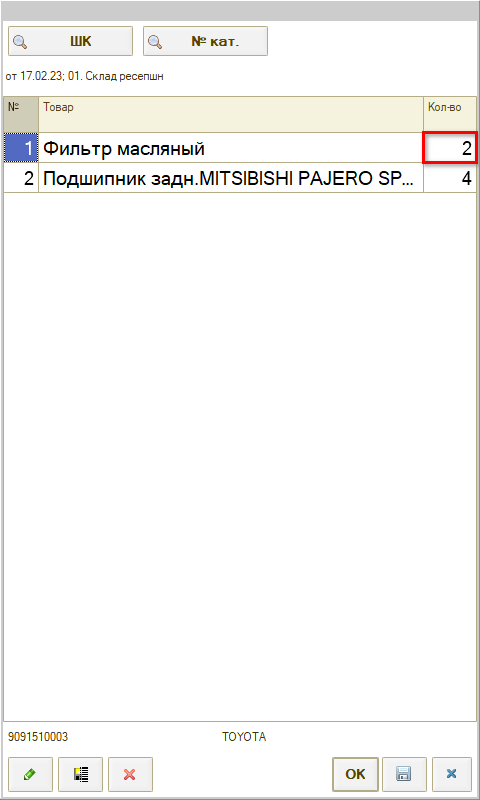

##### Поиск товаров

**1. Поиск по штрихкоду**

Если штрихкод товара не распознается при сканировании, можно использовать ручной поиск номенклатуры по штрихкоду. Для этого следует нажать кнопку "ШК" и в открывшейся форме ввести значение штрихкода:

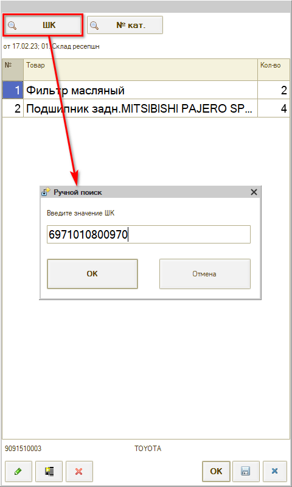

Дальнейшие действия такие же, как при сканировании товара: следует ввести количество товара и сохранить.

**2. Поиск по артикулу**

Для поиска товара по артикулу следует нажать кнопку *"№ кат."*, ввести артикул и нажать "ОК". На экран будут выведены товары, содержащие в артикуле введенное значение:

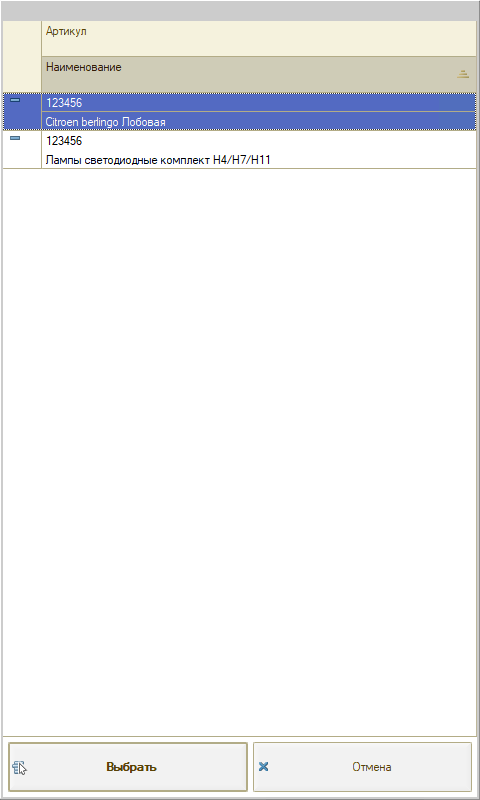

Следует выбрать нужный вариант из найденных, ввести количество товара и сохранить.

##### Функциональные кнопки формы

**1.**  *Изменить количество выделенной строки* – нажатием на кнопку открывается форма ввода количества выделенного в таблице товара:

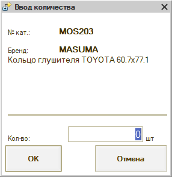

**2.** 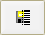 *Создать штрихкод* – нажатием на кнопку открывается форма ввода штрихкода для выбранной в таблице номенклатуры:

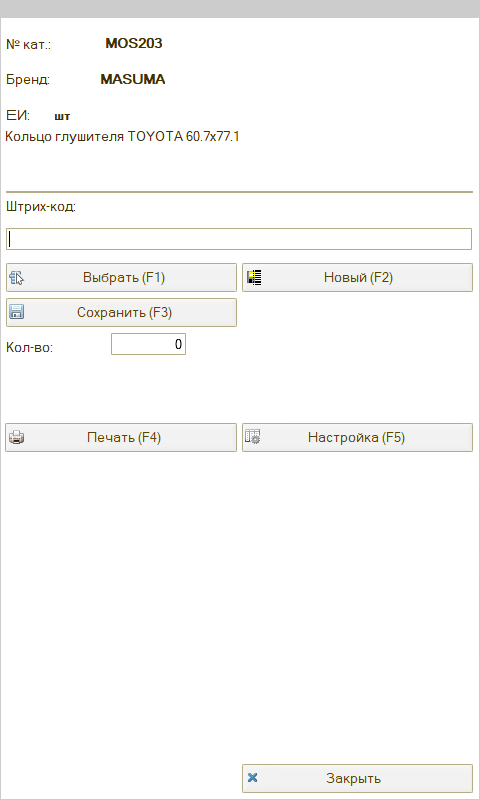

Если штрихкод уже был присвоен товару, то он будет выведен с отметкой: "Найден штрих-код":

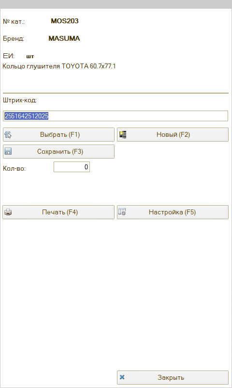

Далее можно ввести нужное количество поступившего товара и сохранить.

**3.**  *Удалить текущую строку* – нажатием на кнопку можно удалить лишнюю строку документа.

#### Работа с документами "Приобретение товаров / в пути"

По документу "Приобретения товаров / Товар в пути" можно ввести на основании документ "Поступление товаров". Для этого нужно выделить нужный документ и нажать кнопку "На основании":

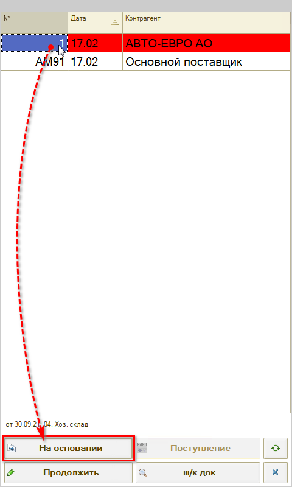

В созданном документе в таблице отображается количество ожидаемого товара в столбце "Недовоз":

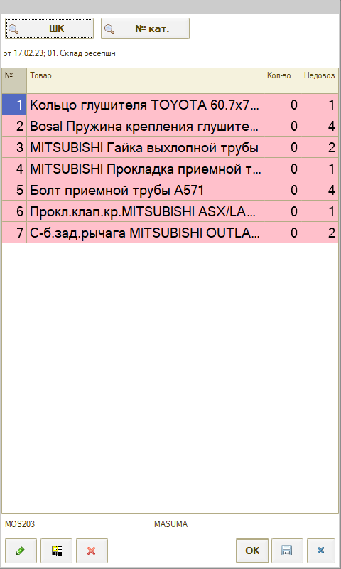

Чтобы подтвердить поступление, нужно просканировать товар и ввести количество:

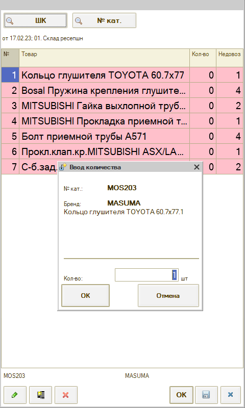

Товар добавится в столбце "Кол-во", значение в столбце "Недовоз", соответственно, уменьшится на данное количество.

После сканирования поступившей номенклатуры в полном объеме строка с данным товаром становится белой, значение "Недовоз" – равным "0":

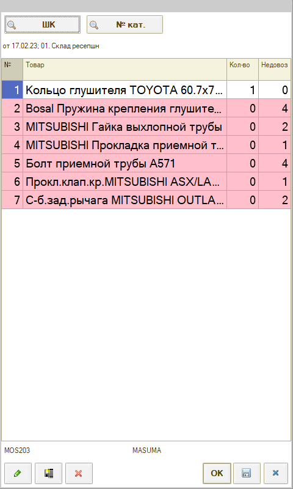

Если количество отсканированного товара отличается от ожидаемого, т.е. если доставлен еще не весь товар, но нужно зафиксировать его поступление, то при нажатии кнопки "ОК" выйдет следующее сообщение программы:

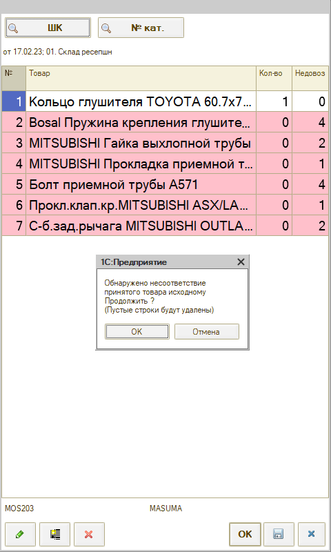

При нажатии кнопки "ОК" будет создан документ "Поступление товаров", заполненный поступившим товаром, отсканированным ТСД. В исходном документе "Приобретение товаров / в пути" будут удалены пустые (белые) строки и скорректировано количество ожидаемого товара.

Также возможен поиск товаров вручную по штрихкоду или по артикулу (см. описание [выше](#поиск-товаров)).

### 2. Инвентаризация

Инвентаризация — это процедура учета товара, находящегося на складе. При инвентаризации подсчитывается количество остатков товара. Полученные числа сверяются с цифрами в документах. Подробнее см. статью: [Инвентаризация](../Инвентаризация/inventarizaciya.md).

Терминал сбора данных ускорят проведение инвентаризации. Устройство мгновенно сканирует штрихкоды товаров, подсчитывает их количество и передает информацию в программу. Оператор сравнивает количество товара по документам и фактические остатки.

При нажатии кнопки меню "Инвентаризация" выводится список складов – необходимо найти нужный, выделить его и нажать кнопку "Выбрать":

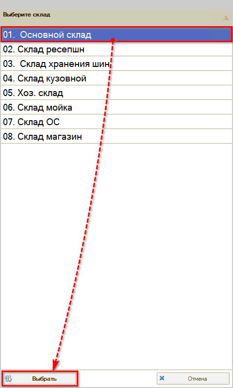

Выводятся непроведенные документы инвентаризации по выбранному складу:

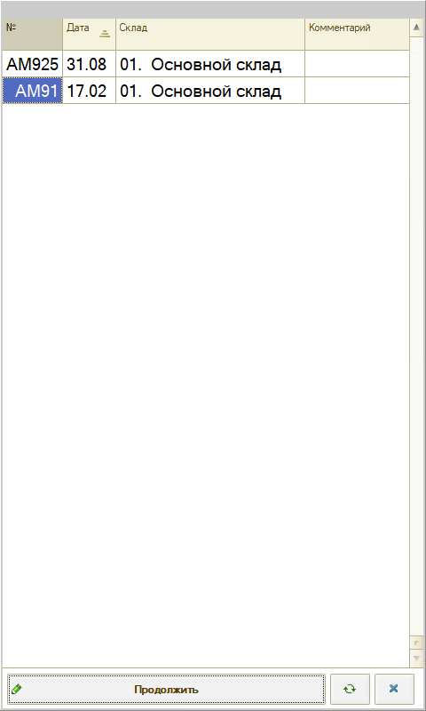

Следует выбрать документ, выделить его и нажать кнопку "Продолжить".

Открывается форма документа "Инвентаризация товаров" с указанием количества:

- *"Книж."* – расчетное количество единиц измерения номенклатуры;
- *"Факт"* – фактическое количество товаров на складе:

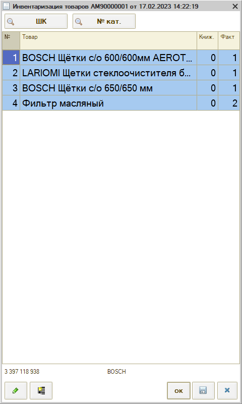

Далее необходимо отсканировать штрихкоды товаров, подлежащих инвентаризации и ввести количество – оно добавляется в поле "Факт".

Если требуется скорректировать введенные данные, используется кнопка *"Изменить"* .

Кнопка *"Создать штрихкод"*  используется для присвоения товару штрихкода.

### 3. Перемещение

Функционал используется при поступлении на склад товаров, отправленных из другого филиала компании с использованием механизма "[Перемещение товаров между филиалами](../Перемещение%20товаров%20между%20филиалами/peremeschenie-tovarov-mezhdu-filialami.md)".

При нажатии кнопки меню "Перемещение" выводится список складов: необходимо найти нужный склад – в документе это склад-получатель, на который должны прийти товары. Склад следует выделить и нажать кнопку "Выбрать":

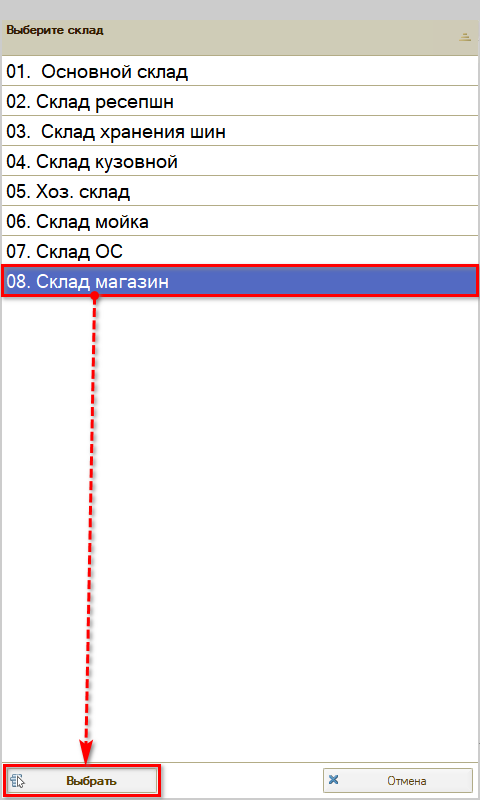

По выбранному складу открывается список документов:

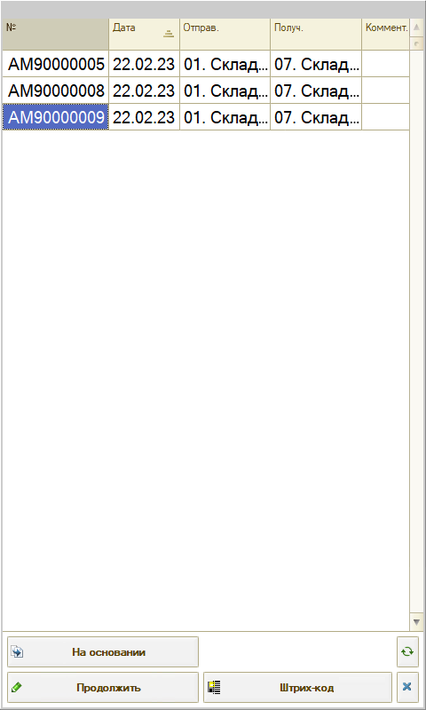

**1. Проведенные документы "Перемещение в филиал" с товарами в пути**

По данным документам можно создать на основании документ "Перемещение товаров" и путем сканирования добавлять в него поступившие товары:

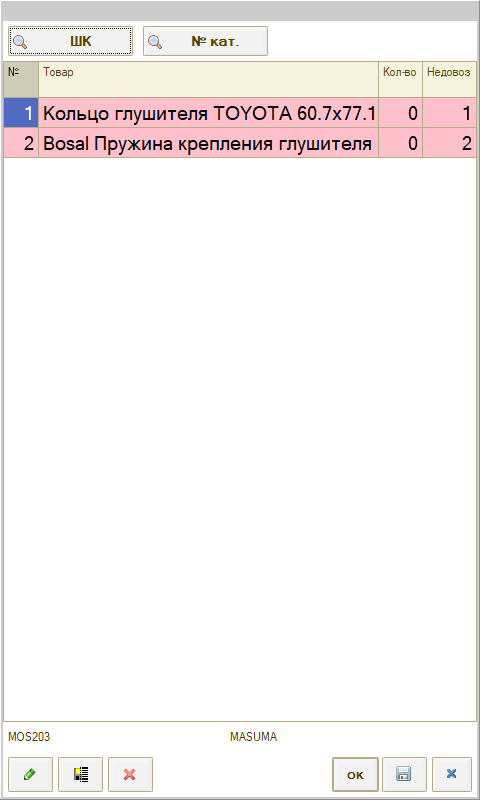

В графе "Недовоз" отображается количество ожидаемого товара. При сканировании изменяется количество товара в таблице в столбцах "Кол-во" и "Недовоз", строка с частично поступившим товаром выделяется оранжевым цветом:

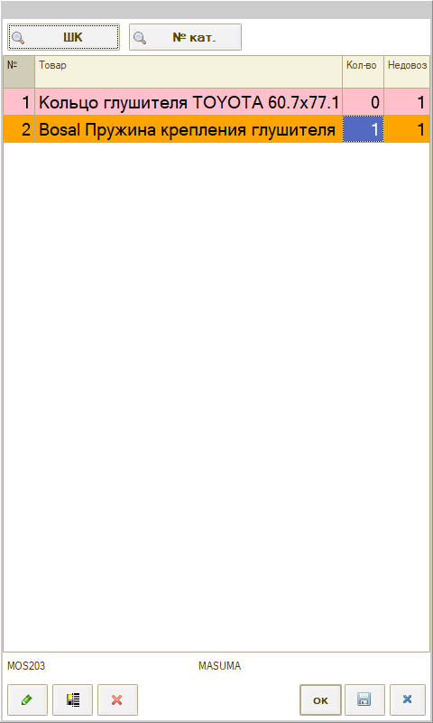

При поступлении ожидаемого товара в полном объеме значение в столбце "Недовоз" становится нулевым, строки с поступившим товаром выделяются белым цветом:

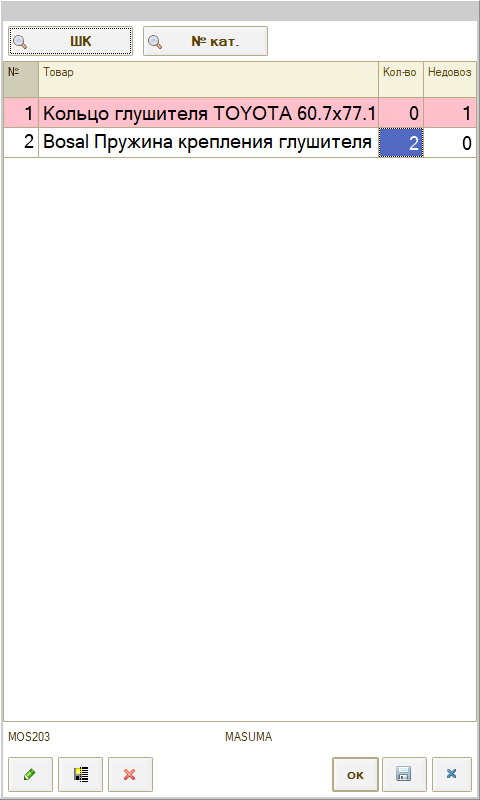

По окончании сканирования поступившего товара документ следует сохранить нажатием на кнопку с дискетой. Можно провести данный документ либо продолжить с ним работу позже.

**2. Непроведенные документы "Перемещение товаров", созданные на основании перемещений в филиал с товарами в пути**

Работа с данными документами осуществляется нажатием кнопки "Продолжить" с последующим введением недостающих позиций путем их сканирования:

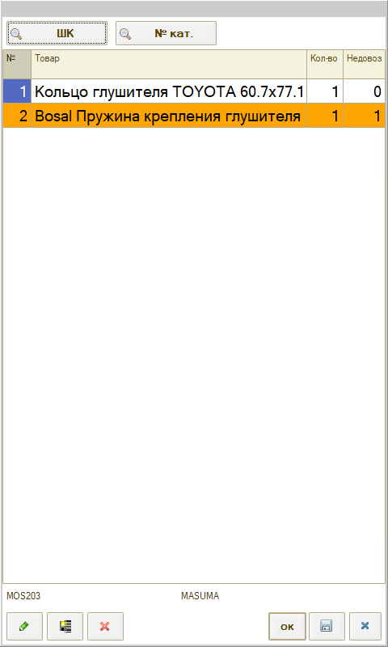

Строки с полностью поступившим товаром становятся белыми, недовоз = 0:

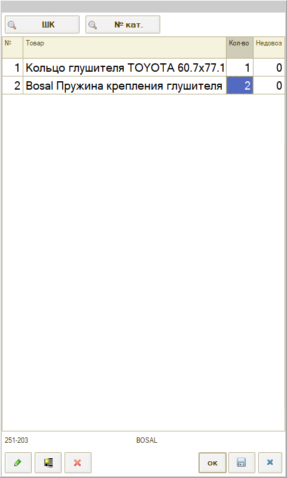

После заполнения и сохранения документа, при условии поступления товара в полном объеме, документ удалится из данного списка.

### 4. Остатки

При нажатии на кнопку "Остатки" открывается интерфейс следующего вида:

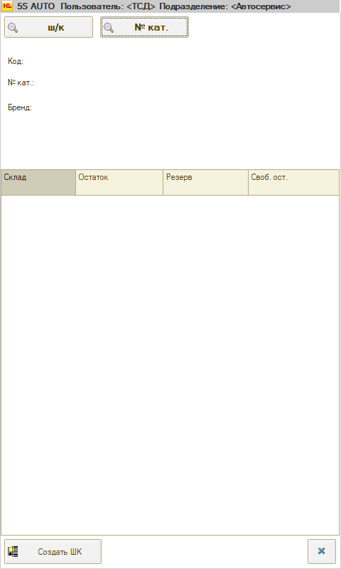

Для работы с функционалом предварительно в базе должен быть заполнен справочник "Номенклатура" с артикулами и штрихкодами товаров.

#### Просмотр остатков товара

Для просмотра остатков товаров на складах требуется отсканировать штрихкод – в таблицу будет выведен найденный по коду товар в разбивке по складам:

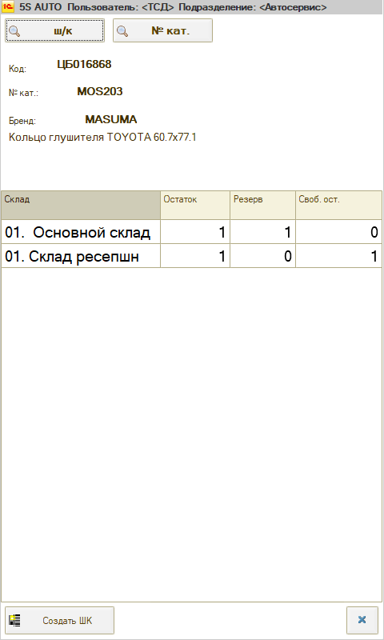

Показатели таблицы:

- *Остаток* – количество товаров в наличии на складе;
- *Резерв* – количество зарезервированного товара;
- *Своб. ост.* – количество товара в свободном остатке.

Также можно воспользоваться ручным поиском товара по штрихкоду либо по артикулу.

#### Присвоение штрихкодов

Для добавления товару штрихкода следует найти нужную номенклатуру по артикулу, используя кнопку "№ кат.":

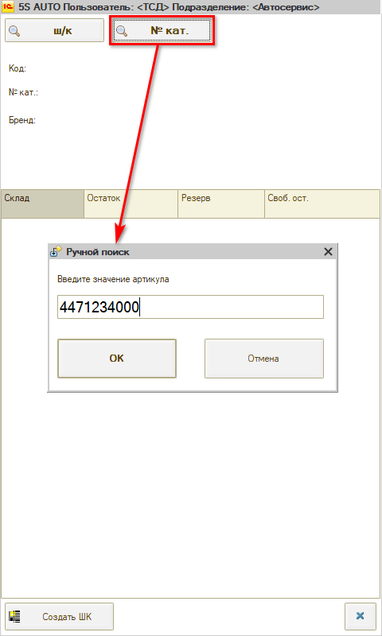

В случае, если по артикулу будет найдено несколько позиций номенклатуры, товары будут выведены в таблицу: следует выделить нужный и нажать кнопку "Выбрать".

Если найдено единственное наименование – значение сразу подтянется в форму:

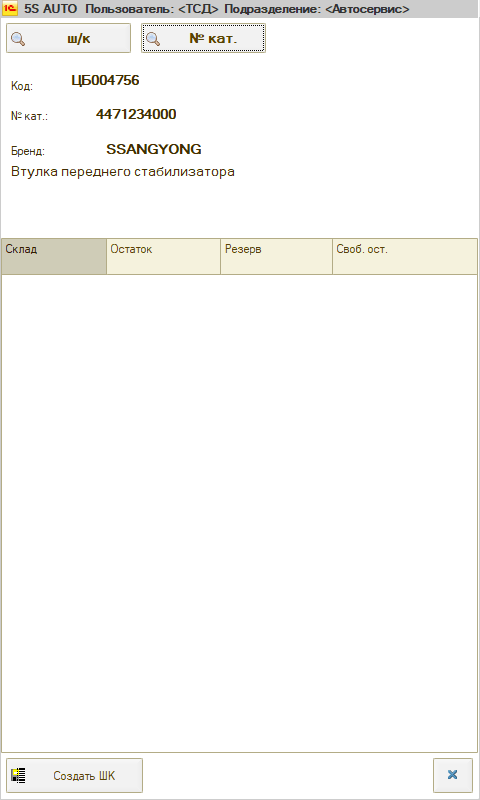

Далее следует нажать кнопку "Создать ШК" – откроется форма создания штрихкода для выбранного товара:

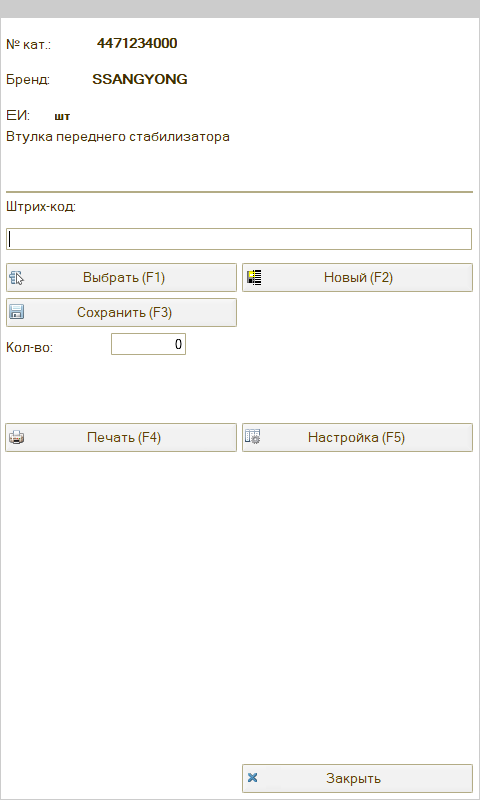

Нажатием на кнопку "Новый" можно сгенерировать штрихкод и затем распечатать его для маркировки товара, введя необходимое количество:

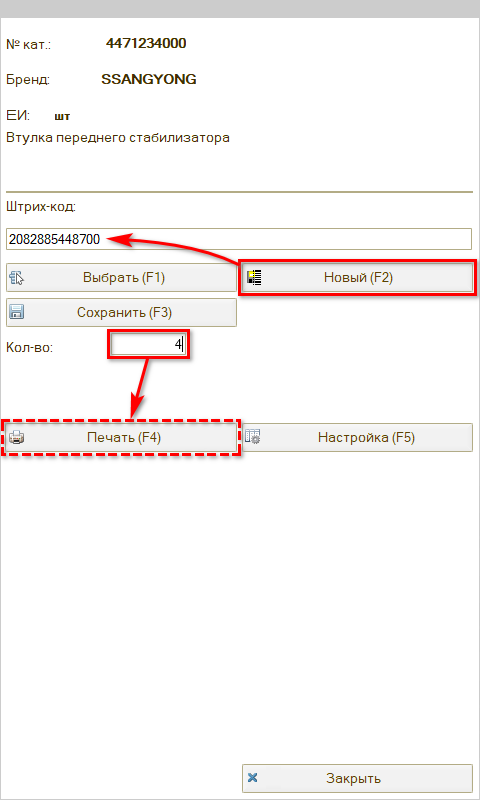

### 5. Настройки

В случае необходимости можно настроить по своему усмотрению высоту и ширину кнопок на экране ТСД и размер шрифта:

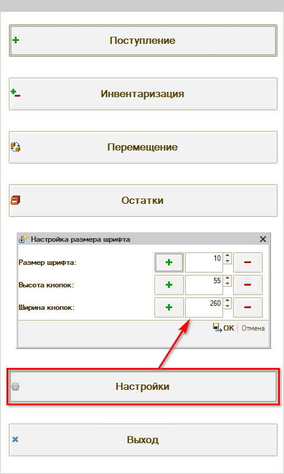

## Настройки подключения

### Настройка пользователя в 1С для ТСД

Для работы в программе с терминала ТСД должен быть создан отдельный пользователь *"ТСД"* с ролью "Пользователь". На вкладке "Планировщик задач" должны быть сделаны следующие настройки для работы с формой "ТСД":

- *Вид задачи:* "Открытие формы";
- *Форма:* выбрать форму *"Обработки → Интерфейс для ТСД";*
- *Действие при ошибке:* "Завершить работу системы".

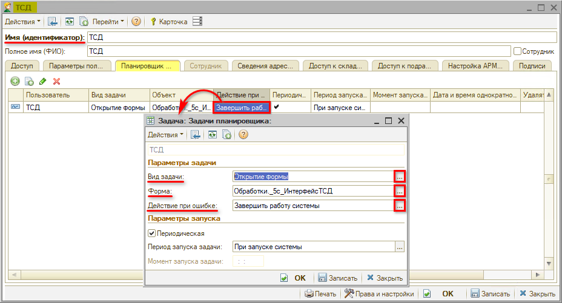

Вход в программу для работы в программе с терминала сбора данных будет осуществляться под данным пользователем (см. [ниже](#vhod)).

### Настройки подключения оборудования

#### 1. Настройки в программе

При настройке оборудования в программе следует:

1. В справочнике "Оборудование" создать новый элемент;
2. Выбрать класс оборудования "Сканер штрихкодов, считыватель карт";
3. Выбрать модель "Сканер штрихкодов клавиатурный";
4. Выбрать или создать новое оборудование;
5. Задать параметры и сохранить:

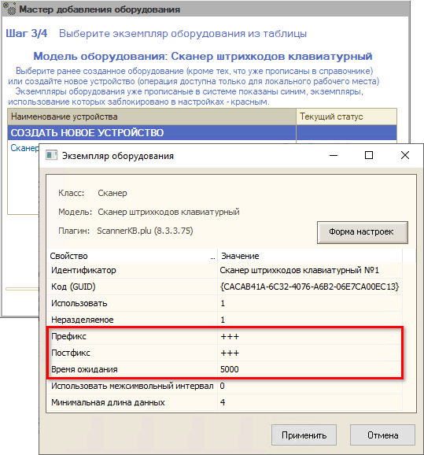

Необходимо обратить внимание на следующие *параметры:*

- *Префикс* и *Постфикс*: должно быть задано значение *"+++"* для того, чтобы 1С воспринимала сканируемые данные как штрихкод;
- *Время ожидания ввода следующего символа (в мс.):* рекомендуется установить значение больше 1 сек., например, "5000" – это 5 секунд.

#### 2. Настройки в ТСД

Ниже рассмотрен вариант настройки подключения ТСД к программе на примере терминала сбора данных *со сканером 2D Honeywell N6603.*

Нужно перейти в настройки сканера на устройстве:

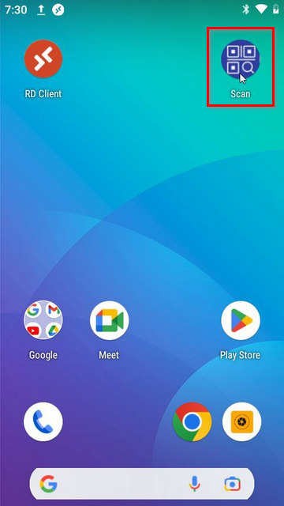

Необходимо задать следующие параметры:

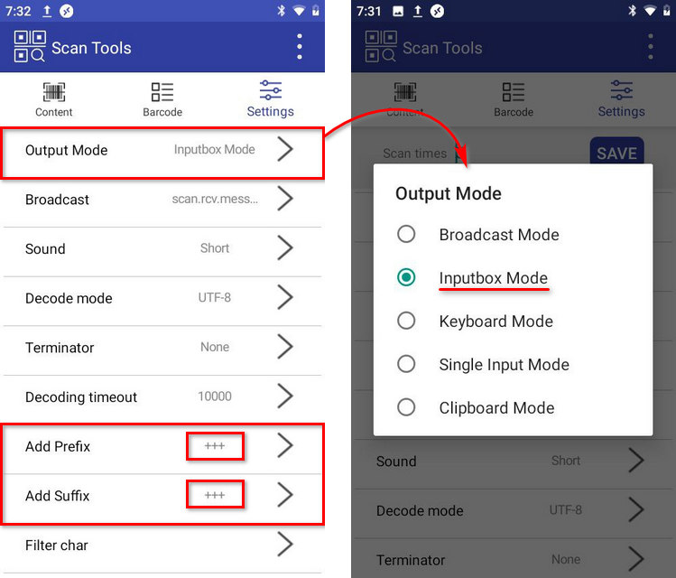

- *Output Mode* – это режим вывода декодируемых данных отсканированного штрихкода: следует установить значение *Inputbox Mode;*
- *Add Prefix* и *Add Suffix* – следует добавить значения *"+++"* для того, чтобы программа определяла считываемую информацию как штрихкод.

## Как открыть программу на терминале

**1.** Соединение через удаленный доступ:

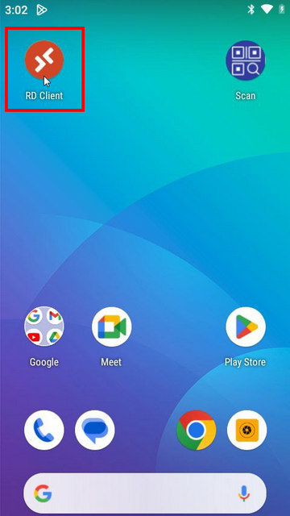

**2.** Выбор сеанса:

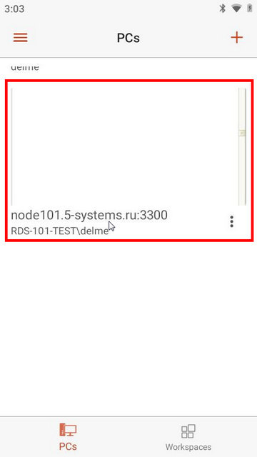

**3.** Войти в программу аналогично входу с компьютера:

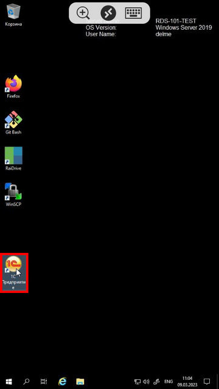

Вход осуществляется под пользователем "ТСД" (см. настройку [выше](#настройка-пользователя-в-1с-для-тсд)), при необходимости следует ввести пароль данного пользователя и нажать "ОК":

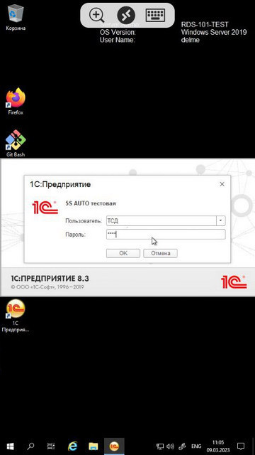

---

**Теги:** Складской учет, Торговое оборудование, ТСД, терминал сбора данных, сканирование штрихкодов, поступление товаров, инвентаризация, перемещение товаров, остатки

