

# Межфирменные продажи

<table><tr><td><b>Время чтения:</b> 12 мин.</td><td><b>Обновлено:</b> 22.06.2022</td></tr></table>

Источник: https://www.5systems.ru/help/mezhfirmennye-prodazhi

## Введение

Для компаний, состоящих из нескольких юридических лиц (организаций), в программе предусмотрен функционал ***Межфирменные продажи***, который позволяет продавать товары через одну организацию, а поставлять товар через другую.

В описании под *Закупщиком* будем подразумевать организацию-участника межфирменных продаж, закупающую запчасти, а под *Магазином* - организацию-участника межфирменных продаж, продающую запчасти.

## Настройка межфирменных продаж

Для организации межфирменных продаж необходимо для начала определить участников межфирменных продаж: *Закупщик*, *Магазин* - и договорные взаимоотношения между ними. Для этого:

1. Для *Закупщика* и *Магазина* указываем свойство "Контрагент" с целью сопоставления в документах:

   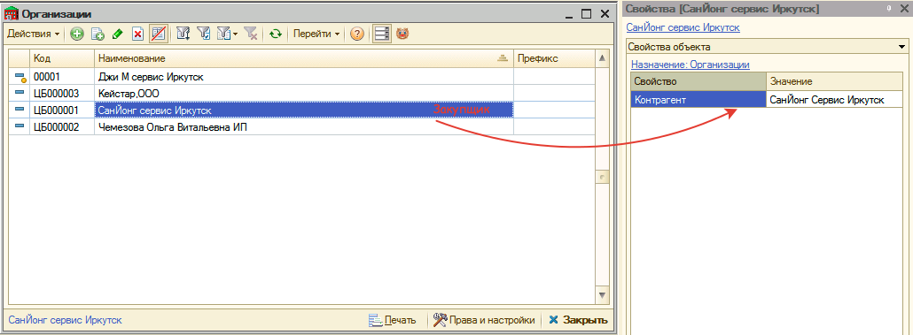

   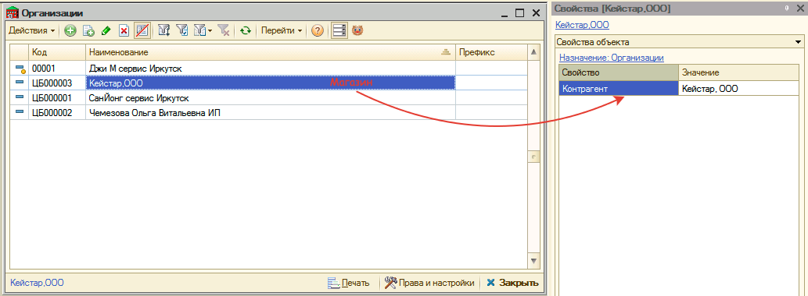
2. Для *Закупщика* добавляем виртуальный склад "Межфирменные продажи" и указываем его в свойстве подразделения *Закупщика*:

   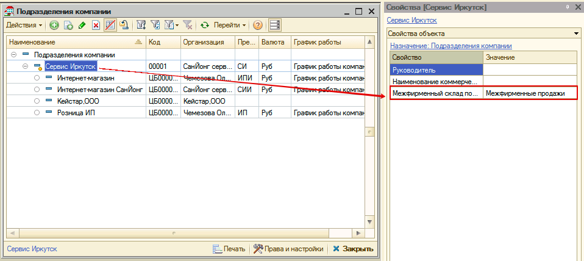
3. Для контрагента *Магазина* создаем договор "Продажа" с *Закупщиком*. В договоре указываем проект "Межфирменные продажи" и определяем цену продажи:

   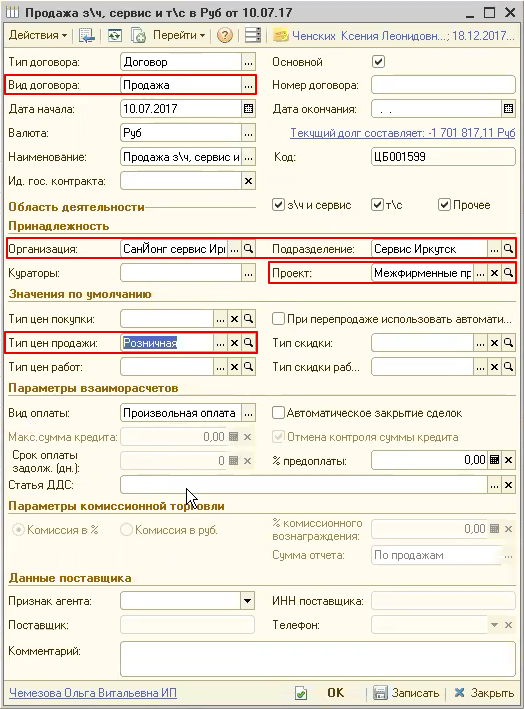
4. Для контрагента *Закупщика* создаем договор "Поставка" с *Магазином*. В договоре указываем проект "Межфирменные продажи" и определяем цену закупки:

   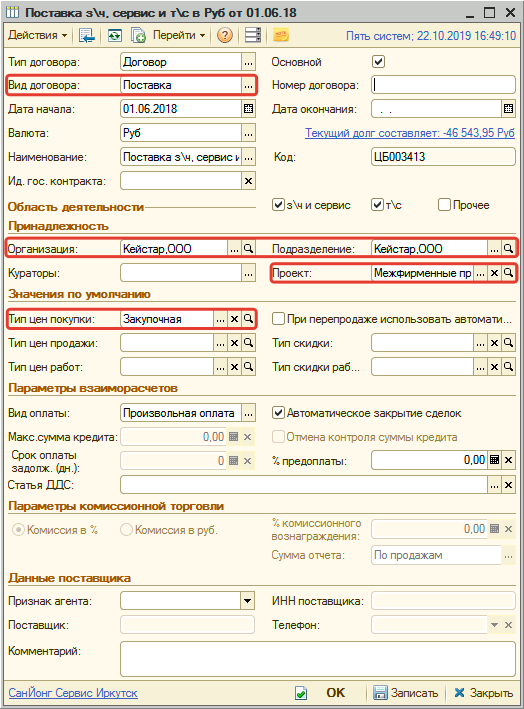

## Обработка межфирменных продаж

После реализации запчастей *Магазином* необходимо создать и провести документы по межфирменным продажам запчастей *Закупщиком* *Магазину*.

Перед обработкой межфирменных продаж не должно быть нарушений в последовательности документов. Поэтому для начала рекомендуется произвести *[Восстановление последовательностей](https://5systems.ru/help/vosstanovlenie-posledovatelnostey-dokumentov)*.

***Внимание!*** При записи документов по межфирменным продажам автоматически устанавливаются локальные значения следующих [прав](https://5systems.ru/help/ustanovka-prav-i-nastroek-polzovatelya):

- *Проведение документа раньше документа основания* (41301) = "Да", так как документ "Поступление товаров", созданный на основании реализации товаров проводится раньше.
- *Запретить продажу ниже себестоимости* (43002) = "Нет", так как межфирменные продажи, как правило, совершаются с минимальной наценкой, а наценка рассчитывается от суммарной стоимости всех партий одной номенклатуры в этом документе, это не гарантирует, что каждая партия товаров будет продана выше себестоимости.
- *Закрывать нераспределенные заказы покупателей*(42007) = "Нет", соответствующий реквизит документа "Поступление товаров" также устанавливается в "Нет".
- *Автоматически создавать ордера для ячеистых складов* (группа ПЯТЬ СИСТЕМ → АВТОСЕРВИС) = "Нет".

Для реализации межфирменных продаж:

1. Переходим в обработку *"Межфирменные продажи"* через типовое меню *CRM → Обработки → Межфирменные продажи*.
2. Задаем период обработки продаж, организацию *Магазин*, процент наценки при необходимости (описание параметров см. *Параметры обработки "Межфирменные продажи"*) и нажимаем кнопку "Создать продажи":

   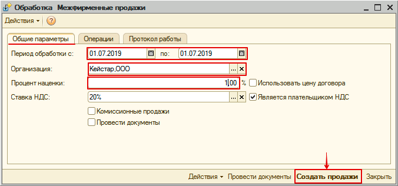

   Обрабатываются товары, отпущенные со склада в производство с партией другой организации, т.е. отличной от партии *Магазина*. Из подобранных товаров исключаются позиции, которые были возвращены из производства.
3. На вкладке "Операции" проверяем созданные и скорректированные документы:

   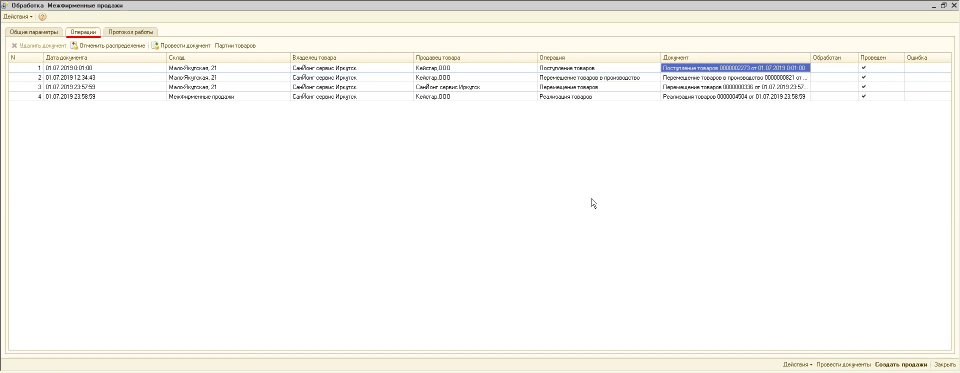

   1. В начале периода обработки создается документ "Поступление товаров". Документ содержит весь товар, полученный организаций *Магазин* на склад *Закупщика* в течение периода обработки. Для каждого склада *Закупщика* создается отдельный документ.
   2. Для документов "Перемещение товаров в производство" и "Реализация товаров" происходит корректировка - распределение по партиям межфирменных продаж.
   3. В конце периода обработки создается:
      1. Документ "Перемещение товаров" с каждого склада *Закупщика* на виртуальный склад межфирменных продаж.
      2. Документ "Реализация товаров" по *Закупщику* контрагенту *Магазина*.
   4. Проводим документы, нажав кнопку "Провести документы":

      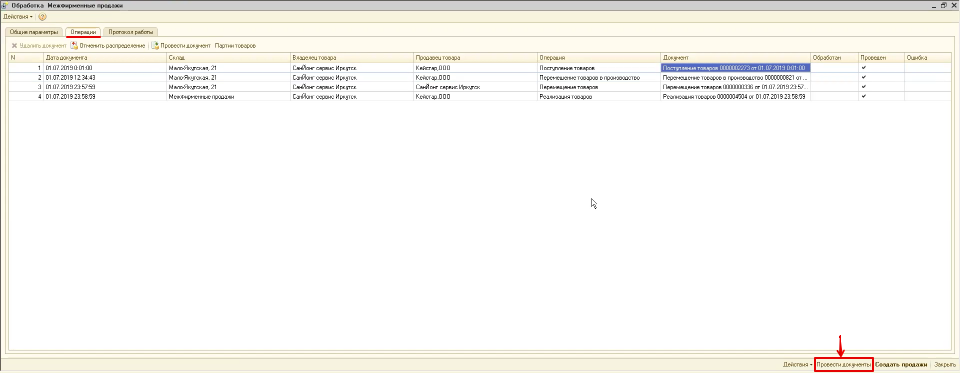

Если процесс реализации межфирменных продаж отлажен, то на шаге 2 можно установить флажок "Провести документы". В этом случае создадутся и сразу проведутся и перепроведутся необходимые документы.

Убедиться, что все полученные товары реализованы, можно в отчете "Остатки и обороты партий товаров":

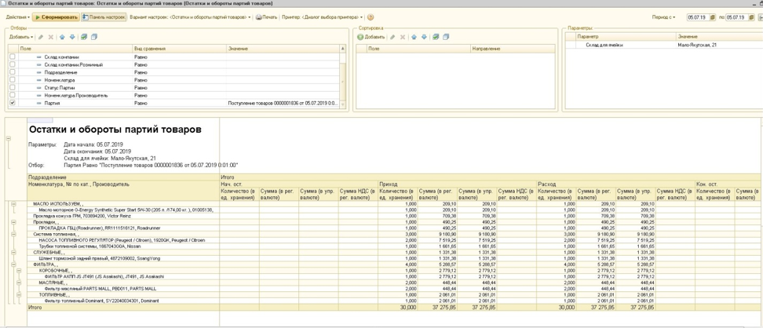

### Параметры обработки "Межфирменные продажи"

| Параметр | Описание |
| --- | --- |
| **Период обработки** | Период обработки межфирменных продаж |
| **Организация** | Выбор *Магазина*, для которого необходимо обработать межфирменные продажи |
| **Процент наценки** | Процент наценки на товары *Закупщика* |
| Флажок **"Использовать цену договора"** | При установке цена реализации берется из типа цен договора продажи |
| **Ставка НДС** | Процент НДС, который будет выделен в документах поступления и реализации товаров при установке флажка "Является плательщиком НДС" |
| Флажок **"Является плательщиком НДС"** | При установке в документах поступления и реализации товаров будет выделен НДС |
| Флажок **"Комиссионные продажи"** | При установке создаются документы по реализации товаров принятых на комиссию |
| Флажок **"Провести документы"** | При установке обрабатываются документы за весь указанный период и сразу проводятся. Если не установлен, то создаются непроведенные документы, которые можно посмотреть на вкладке "Операции" и потом провести по кнопке "Провести документы". |

### Дополнительные возможности обработки "Межфирменные продажи"

Меню "Действия":

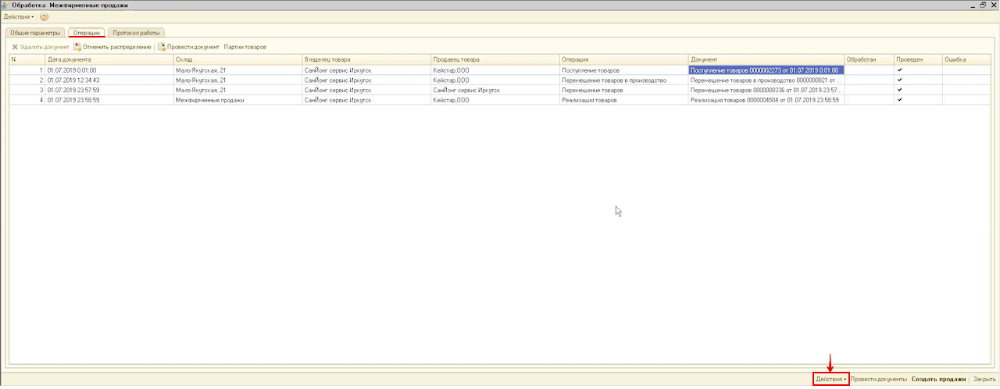

- *Заполнить операции* - заполняет таблицу с операциями уже созданными документами за указанный период, связанными с межфирменными продажами, для их дальнейшего просмотра и обработки.
- *Отменить продажи* - отменяет распределение по партиям межфирменных продаж для документов "Перемещение товаров в производство" и "Реализация товаров"; отменяет проведение созданных обработкой документов "Поступление товаров", "Перемещение товаров", "Реализация товаров"; перепроводит документы, по которым была отмена распределения по партиям.

Командная панель табличной части с операциями:

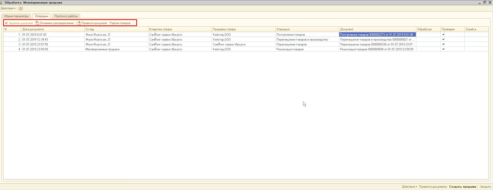

- *Удалить документ* - удаление текущего документа.
- *Отменить распределение* - отмена распределения по партиям текущего документа.
- *Провести документ* - проведение текущего документа.
- *Партии товаров* - просмотр движения по партиям текущего документа.

---

**Теги:** межфирменные продажи, организация, закупщик, магазин, договор, партии товаров, поступление товаров, реализация товаров

