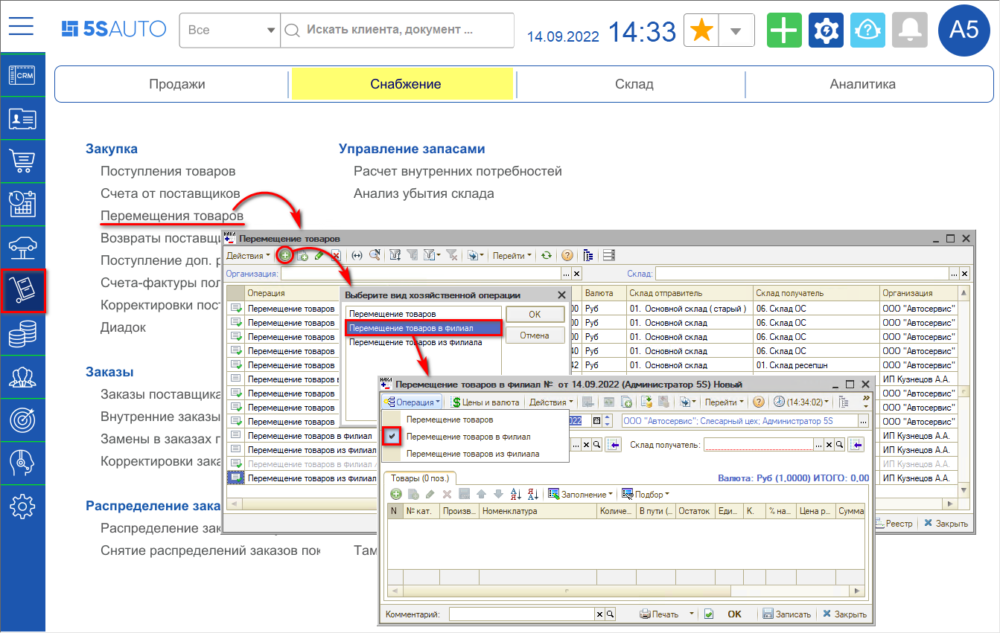
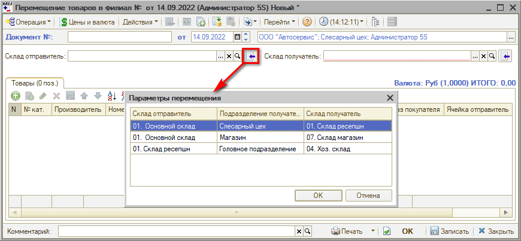
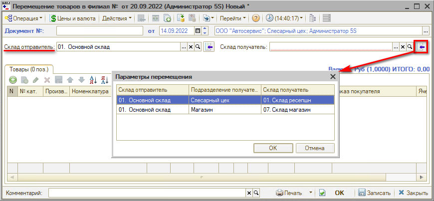
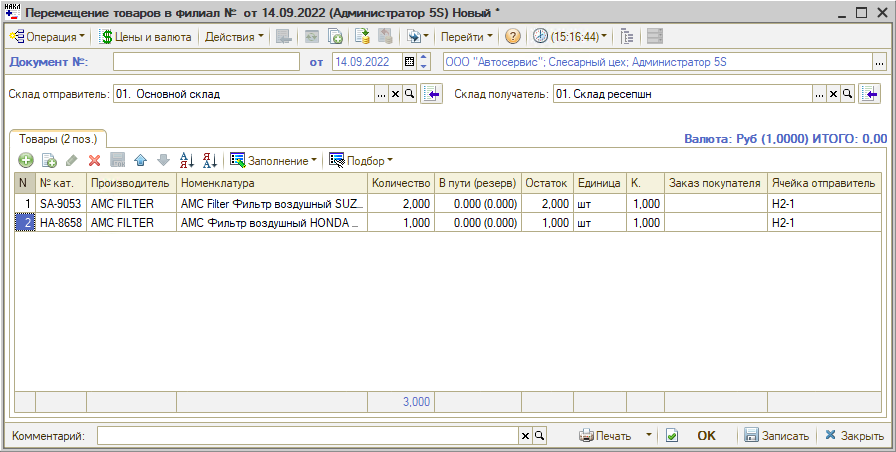
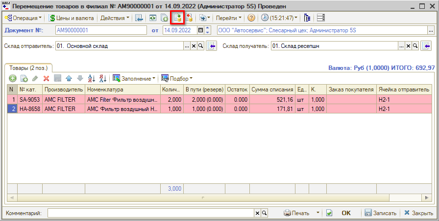
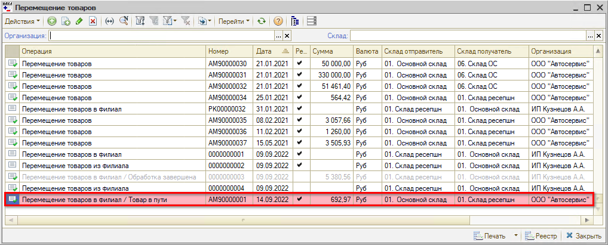
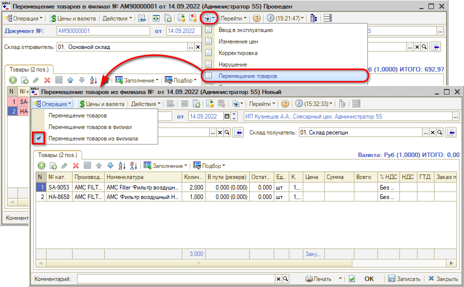
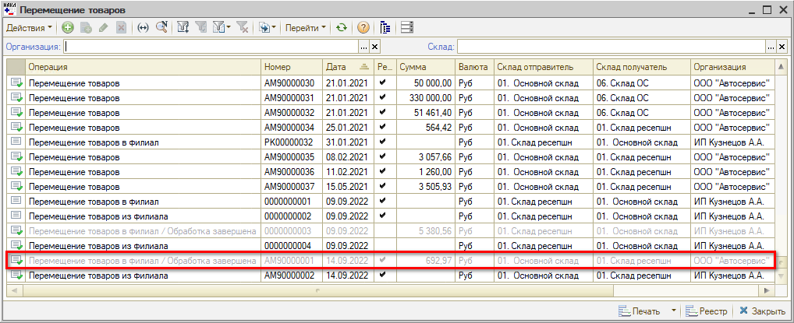
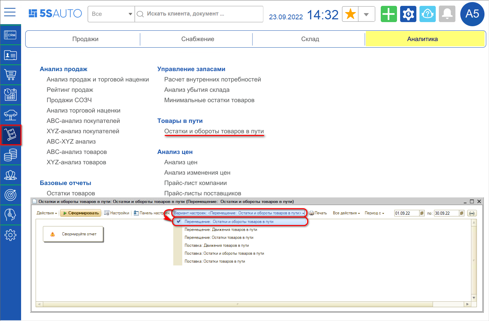
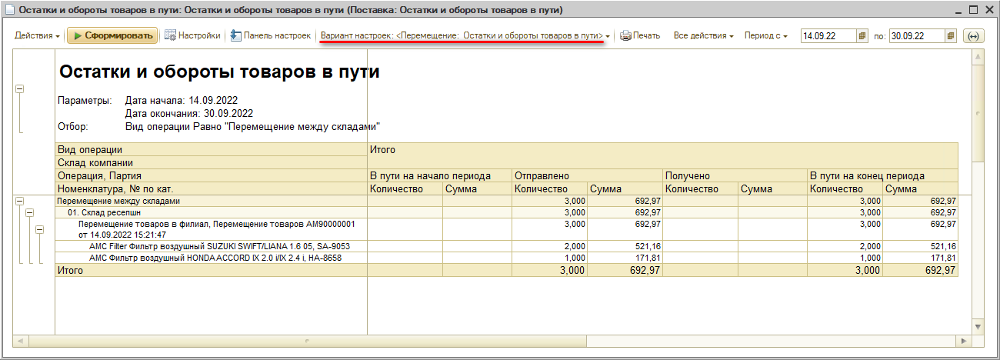

# Перемещение товаров между филиалами

<table><tr><td><b>Время чтения:</b> 9 мин.</td><td><b>Обновлено:</b> 14.09.2022</td></tr></table>

Источник: https://www.5systems.ru/help/peremeschenie-tovarov-mezhdu-filialami

> *Функционал доступен начиная с релиза 2.2.7.2.*

## Содержание

- [Введение](#введение)
- [Перемещение товаров из филиала в филиал](#перемещение-товаров-из-филиала-в-филиал)
- [Анализ перемещений товаров между филиалами](#анализ-перемещений-товаров-между-филиалами)

## Введение

В случае, если у компании несколько филиалов или несколько складов, находящихся далеко друг от друга, и на одном из складов есть в наличии товар, который требуется на другом складе, используется документ ***"Перемещение товаров в филиал"***. То есть, данный механизм необходим для *учета товара в пути* с одного склада на другой до момента фактического поступления товара на нужный склад.

## Перемещение товаров из филиала в филиал

Для учета перемещения товаров между филиалами необходимо создать документ "Перемещение товаров" с хозяйственной операцией *"Перемещение товаров в филиал"*:

*Примечание: В случае если данного пункта меню нет на рабочем столе, можно добавить его вручную – см. статью "[Настройка рабочего стола](https://www.5systems.ru/help/nastroyka-rabochego-stola#nastrrazdelov)".*

В создаваемом документе необходимо выбрать склад-отправитель и склад-получатель. Склад-отправитель, как правило, подтягивается автоматически, также можно заполнить склады вручную либо воспользоваться кнопками "Выбрать склад".

Нажатием на кнопку *"Выбрать склад (на котором есть товар, зарезервированных для других складов)"* (рядом с полем "Склад отправитель") открывается окно, показывающее *все* ожидаемые перемещения товаров:

После заполнения склада-отправителя следует выбрать склад-получатель. Для этого можно нажать кнопку *"Выбрать склад (для которого есть товар, зарезервированный на складе-отправителе)"* (рядом с полем "Склад получатель") – откроется список ожидаемых перемещений с выбранного склада-отправителя:

После заполнения склада-получателя таблица заполняется товарами, которые необходимо переместить:

В столбце "Остаток" отображается количество номенклатурных позиций на складе-отправителе.

Затем документ нужно провести:

Значение в столбце "Остаток" уменьшается в зависимости от заданного количества перемещаемого товара. В столбце "В пути (резерв)" проставляется количество товара в пути.

После проведения "Перемещения товаров в филиал" данный документ будет отображаться в реестре с припиской: *"Перемещение товаров в филиал / Товар в пути"*:

При фактическом поступлении товаров на склад-получатель на основании созданного документа "Перемещение товаров в филиал" следует ввести документ "Перемещение товаров", – хоз. операция у него автоматически будет выбрана "Перемещение товаров *из филиала*", – и провести документ:

Товар перемещается с одного склада на другой в указанном количестве.

После проведения "Перемещения товаров из филиала" в реестре меняется статус документа "Перемещение товаров в филиал" – шрифт становится серого цвета, приписка изменяется на *"Обработка завершена"*:

## Анализ перемещений товаров между филиалами

Для отслеживания товара, находящегося в пути с одного склада на другой, используется отчет *"Остатки и обороты товаров в пути"*, вариант настройки *"Перемещение: Остатки и обороты товаров в пути"*. Отчет находится в меню интерфейса *Запчасти и склад → Аналитика → Товары в пути → Остатки и обороты товаров в пути*\*:

*\*Примечание: В случае если данного пункта меню нет на рабочем столе, можно добавить его вручную – см. статью "[Настройка рабочего стола](https://www.5systems.ru/help/nastroyka-rabochego-stola#nastrrazdelov)".*

Пример сформированного отчета:

После проведения документа "Перемещение товаров из филиала" значения из столбца "В пути на конец периода" перейдут в столбец "Получено". Расхождения в количестве ожидаемого и поступившего товара сразу отобразятся в отчете.

---

**Теги:** Складской учет, перемещение товаров, филиал, товар в пути, склад-отправитель, склад-получатель, остатки и обороты товаров в пути

