

# Печать этикеток

<table><tr><td><b>Время чтения:</b> 8 мин.</td><td><b>Обновлено:</b> 22.06.2022</td></tr></table>

Источник: https://www.5systems.ru/help/pechat-etiketok

## Содержание

- [Введение](#введение)
- [Подключение принтера этикеток](#подключение-принтера-этикеток)
  - [Подключение Windows-принтера](#подключение-windows-принтера)
  - [Подключение специализированного принтера этикеток](#подключение-специализированного-принтера-этикеток)
- [Печать этикеток](#печать-этикеток-1)
  - [Печать через Windows-принтер](#печать-через-windows-принтер)
  - [Печать через принтер этикеток](#печать-через-принтер-этикеток)

## Введение

Для идентификации товара через сканер штрихкодов и распределения товаров по ячейкам хранения на складе в программе есть возможность *напечатать этикетки*. Для печати этикеток предварительно должен быть *подключен принтер этикеток*.

## Подключение принтера этикеток

В качестве принтера этикеток может быть подключен специализированный принтер этикеток или Windows-принтер, который будет на листе формата A4 печатать этикетки нужного размера.

### Подключение Windows-принтера

Для подключения Windows-принтера:

1. Перейдите в справочник ***"Оборудование"*** *(Администрирование → Сервис → Оборудование* или через стандартное меню: *Справочники → Розница и оборудование → Оборудование).*
2. Перейдите в мастер добавления оборудования:

   
3. В мастере добавления оборудования:
   1. На первом шаге выберите класс оборудования "Принтер этикеток" и нажмите "Далее":

      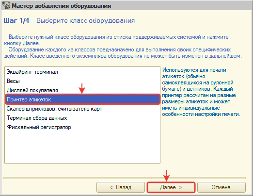
   2. На втором шаге выберите модель оборудования "Windows-принтер" и нажмите "Далее":

      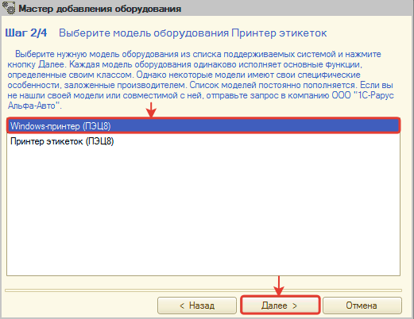
   3. На третьем шаге выберите устройство "СОЗДАТЬ НОВОЕ УСТРОЙСТВО" и нажмите кнопку далее:

      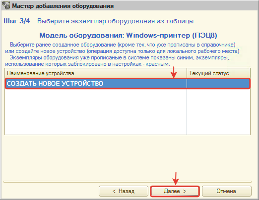
   4. В настройках оборудования обязательно укажите принтер, через который будет происходить печать:

      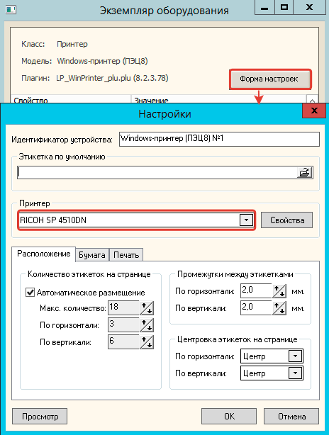
   5. На четвертом шаге нажмите кнопку "ГОТОВО!" для завершения добавления:

      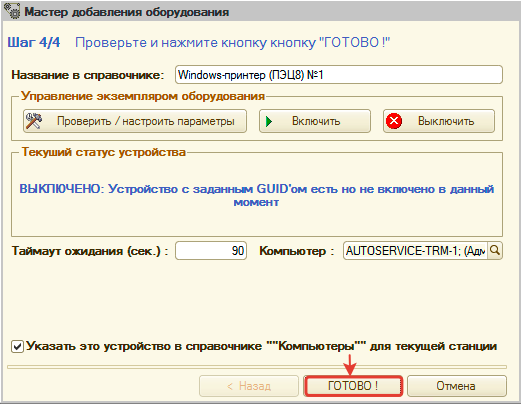

ГОТОВО! Windows-принтер подключен. Теперь можно пробовать печатать этикетки.

### Подключение специализированного принтера этикеток

Для подключения специализированного принтера этикеток:

1. Перейдите в справочник ***Оборудование"*** *(Администрирование → Сервис → Оборудование* или через стандартное меню: *Справочники → Розница и оборудование → Оборудование).*
2. Перейдите в мастер добавления оборудования:

   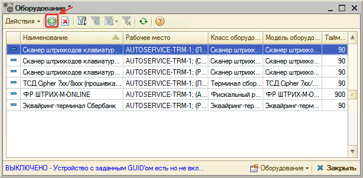
3. В мастере добавления оборудования:
   1. На первом шаге выберите класс оборудования "Принтер этикеток" и нажмите "Далее":

      
   2. На втором шаге выберите модель оборудования "Принтер этикеток" и нажмите "Далее":

      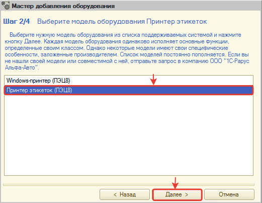
   3. На третьем шаге выберите устройство "СОЗДАТЬ НОВОЕ УСТРОЙСТВО" и нажмите кнопку далее:

      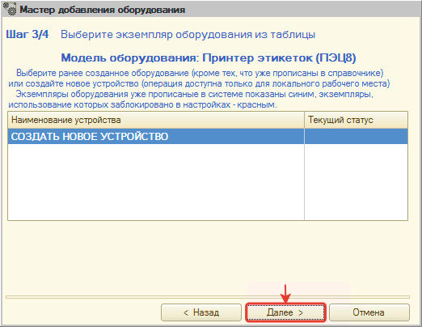
   4. В настройках оборудования обязательно укажите порт, через который подключен принтер этикеток, и при желании установите этикетку по умолчанию:

      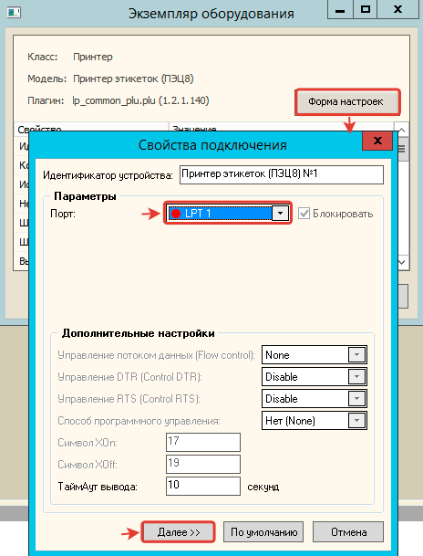

      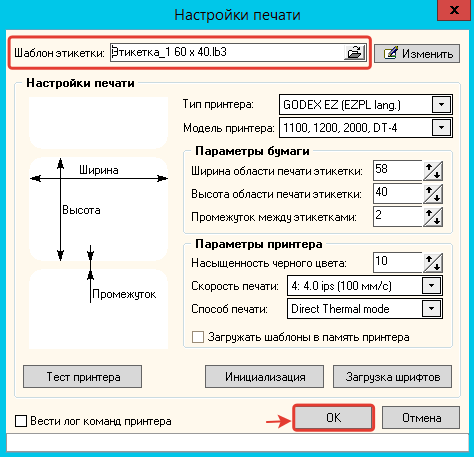
   5. На четвертом шаге нажмите кнопку "ГОТОВО!" для завершения добавления:

      

ГОТОВО! Принтер этикеток подключен. Теперь можно пробовать печатать этикетки.

## Печать этикеток

Распечатать этикетку можно из справочника "Номенклатура" или из документа (например, *Поступление товаров*) с помощью обработки "Печать этикеток и ценников".

Для перехода к обработке "Печать этикеток и ценников" из справочника "Номенклатура":

**1)** установите курсор на товар, по которому нужно распечатать этикетку,
**2)** выберите меню "Печать → Печать этикеток и ценников":

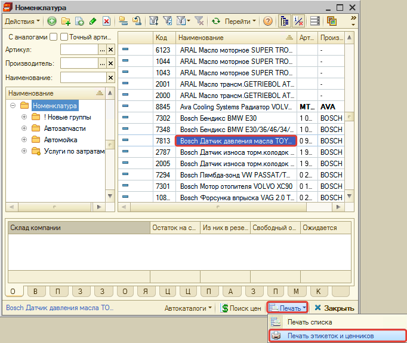

Для перехода к обработке "Печать этикеток и ценников" из документа:

**1)** установите курсор на документ, на товары из которого нужно распечатать этикетку,
**2)** выберите печатную форму "Печать этикеток и ценников":

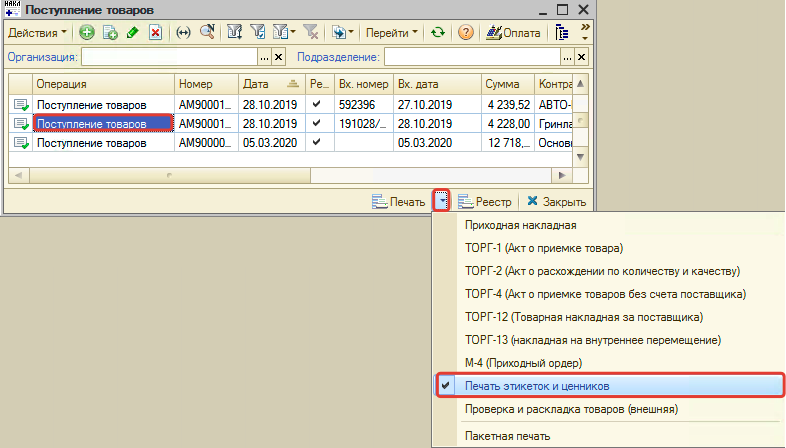

### Печать через Windows-принтер

*В обработке "Печать этикеток и ценников" для печати этикеток*:

**1)** перейдите на вкладку "Этикетки",
**2)** выберите Windows-принтер,
**3)** установите шаблон для печати (*[скачать шаблон](attachments/shablon-etiketki.mxl.zip)*, редактирование шаблона в программе через меню: Файл → Открыть),
**4)** нажмите кнопку "Печать" для перехода в предпросмотр:

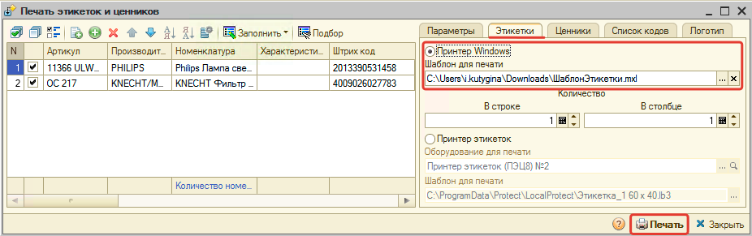

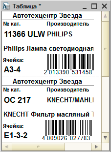

**5)** если все устраивает, то перейдите к печати.

### Печать через принтер этикеток

*В обработке "Печать этикеток и ценников" для печати этикеток*:

**1)** перейдите на вкладку "Этикетки",
**2)** выберите принтер этикеток,
**3)** выберите *установленный ранее принтер этикеток* в поле "Оборудование",
**4)** выберите шаблон для печати,
**5)** нажмите кнопку "Печать" для перехода в предпросмотр:

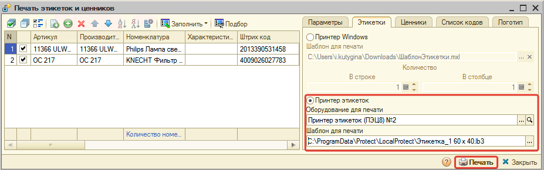

**6)** если все устраивает, то перейдите к печати.

---

**Теги:** печать этикеток, принтер этикеток, Windows-принтер, шаблон этикетки

